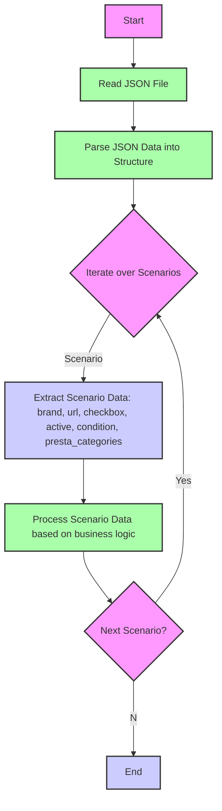

## АНАЛИЗ КОДА

### 1. <алгоритм>

Представленный код описывает структуру JSON, представляющую сценарии для различных категорий товаров HP (клавиатуры и мыши). Алгоритм обработки этих данных можно представить в виде следующей блок-схемы:

```mermaid
graph LR
    A[Начало] --> B{Чтение JSON};
    B --> C{Перебор сценариев};
    C --> D{Извлечение данных сценария: бренд, URL, флаг checkbox, флаг active, состояние condition, категории presta_categories};
    D --> E{Обработка данных (например, сохранение в базу данных или использование в других процессах)};
    E --> F{Проверка наличия следующего сценария};
    F -- Да --> C;
    F -- Нет --> G[Конец];

  style A fill:#f9f,stroke:#333,stroke-width:2px
  style G fill:#ccf,stroke:#333,stroke-width:2px
  style B fill:#afa,stroke:#333,stroke-width:2px
  style C fill:#afa,stroke:#333,stroke-width:2px
  style D fill:#ccf,stroke:#333,stroke-width:2px
  style E fill:#afa,stroke:#333,stroke-width:2px
  style F fill:#f9f,stroke:#333,stroke-width:2px

```

**Примеры:**

*   **Начало:** Загрузка JSON файла.
*   **Чтение JSON:** Парсинг JSON в структуру данных, доступную для программы.
*   **Перебор сценариев:** Итерация по ключам (например, "HP WIRELESS KEYBOARD", "HP USB KEYBOARD" и т.д.) в объекте `scenarios`.
*   **Извлечение данных сценария:**  Из каждого сценария извлекаются атрибуты:
    *   `brand`: "HP"
    *   `url`: Строка, специфичная для каждого товара (либо URL, либо текстовое описание)
    *   `checkbox`: `false` (логическое значение)
    *   `active`: `true` (логическое значение)
    *   `condition`: "new" (строка, представляющая состояние товара)
    *   `presta_categories`: Строка с номерами категорий, разделёнными запятыми, например, "203,204,316"
*   **Обработка данных:** Полученные данные могут использоваться для различных целей, например:
    *   Генерация данных для каталога товаров.
    *   Создание конфигурации для скрапера.
    *   Импорт данных в базу данных.
*   **Проверка наличия следующего сценария:** Проверяется, есть ли ещё сценарии для обработки.
*   **Конец:** Завершение обработки данных.

### 2. <mermaid>



**Описание диаграммы:**

1.  **Start**: Начало процесса обработки JSON.
2.  **ReadJsonFile**: Чтение JSON файла.
3.  **ParseJson**: Разбор JSON данных в структуру, доступную для программы.
4.  **IterateScenarios**:  Начало цикла перебора сценариев.
5. **ExtractScenarioData**: Извлечение данных из текущего сценария, такие как `brand`, `url`, `checkbox`, `active`, `condition` и `presta_categories`.
6. **ProcessScenarioData**: Обработка извлеченных данных в соответствии с бизнес-логикой (например, сохранение в БД, формирование запросов и т.д.).
7.  **NextScenario**: Проверка наличия следующего сценария.
8.  **End**: Завершение обработки данных.

**Зависимости:**
В коде, представленном в `input_code`, не происходит импорта модулей, потому и нет зависимостей которые надо описывать в `mermaid`. Этот JSON файл - просто данные.

### 3. <объяснение>

**Импорты:**
В данном коде нет импортов, так как это JSON-файл, представляющий данные, а не исполняемый код.

**Классы:**
В данном коде нет классов. Это JSON-файл, представляющий структуру данных.

**Функции:**
В данном коде нет функций.

**Переменные:**
В данном коде используются следующие переменные, представленные в формате JSON:

*   `scenarios`: Объект, содержащий описания различных сценариев.
    *   Ключи в `scenarios` (например, `"HP WIRELESS KEYBOARD"`) – это названия сценариев (типы товаров).
    *   Значения – объекты, содержащие атрибуты каждого сценария:
        *   `brand` (string): Бренд товара.
        *   `url` (string): URL товара или его описание.
        *   `checkbox` (boolean): Флаг, указывающий, установлен ли флажок.
        *   `active` (boolean): Флаг, указывающий, активен ли сценарий.
        *    `condition` (string): Состояние товара.
        *   `presta_categories` (string): Строка, содержащая идентификаторы категорий, разделённые запятыми.

**Потенциальные ошибки и области для улучшения:**

*   **Отсутствие валидации данных:** Нет проверки на корректность значений, например, `presta_categories` должно быть строкой, содержащей числа, разделённые запятыми.
*   **Неоднородность URL:** Некоторые значения `url` являются строками описания, а не ссылками, что может вызвать проблемы при их использовании. Рекомендуется стандартизировать формат `url` для всех сценариев.
*   **Жесткая привязка к строковым представлениям категорий:** Использование строк для `presta_categories` может привести к ошибкам, если формат строки изменится. Лучше использовать массив идентификаторов.
*   **Отсутствие поясняющих комментариев:** В JSON нет комментариев, что затрудняет понимание назначения отдельных полей.
*   **Магические значения:** Идентификаторы категорий (`203,204,...`) не имеют пояснений, что затрудняет понимание их назначения.

**Взаимосвязи с другими частями проекта:**

Этот JSON-файл, вероятно, является конфигурационным файлом для модуля, который занимается парсингом и каталогизацией данных о товарах. Эти данные могут быть использованы для:

*   **Скрапинга:** `url` может быть использован для скрапинга информации о товарах с веб-сайтов.
*   **Импорта данных:** `brand`, `presta_categories` и другие поля могут использоваться для импорта данных в базу данных или в другие системы.
*   **Каталогизации:** Данные могут использоваться для генерации каталога товаров.
*   **Настройки:** `active` и `checkbox` могут контролировать, какие сценарии активны и должны быть обработаны.

**Цепочка взаимосвязей:**

1.  **JSON-файл (`morlevi_categories_keyboards_hp.json`)**  определяет структуру и данные для категорий товаров HP.
2.  **Модуль обработки (Python):** Этот модуль считывает данные из JSON-файла, разбирает их и использует для выполнения определенных операций (скрапинг, импорт, каталогизация).
3.  **База данных/система каталогизации:** Обработанные данные сохраняются в БД или в системе каталогизации, где они могут быть использованы для отображения товаров на веб-сайте или для других целей.