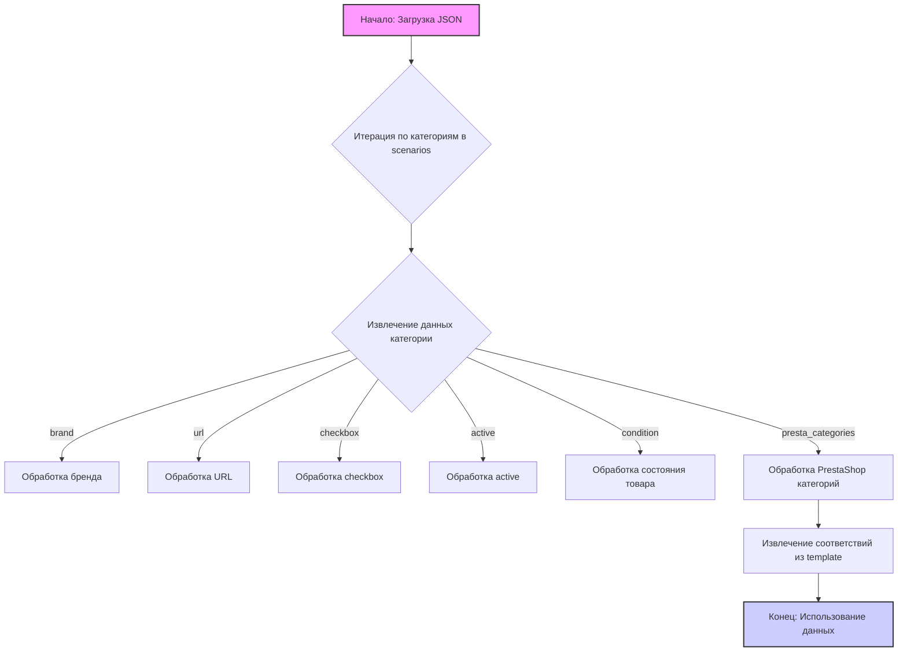

# Анализ файла `morlevi_categories_memory.json`

## <алгоритм>

Этот файл представляет собой JSON-объект, содержащий конфигурацию категорий памяти для веб-сайта поставщика Morlevi. Основная структура данных — словарь, где ключи представляют собой человекочитаемые названия продуктов (например, "CORSAIR DIMM DDR 4 16GB"), а значения — это словари с подробной информацией о каждом продукте. 

Вот пошаговое описание структуры и обработки данных:

1.  **Начало**: Загрузка JSON-файла в память.
    *   **Пример**: Файл `morlevi_categories_memory.json` загружается в программу.
2.  **Итерация по категориям**: Программа начинает итерироваться по ключам словаря `scenarios`, каждый ключ является именем категории.
    *   **Пример**: Первый ключ `"CORSAIR DIMM DDR 4 16GB"`, второй `"CORSAIR DIMM DDR 4 16GB 2x8"` и т.д.
3.  **Обработка данных категории**: Для каждой категории извлекаются следующие данные:
    *   `brand`: Строка, представляющая бренд производителя (например, "CORSAIR", "CRUCIAL", "G.SKILL").
    *   `url`: Строка, URL-адрес страницы продукта на сайте Morlevi.
        *   **Пример**: "https://www.morlevi.co.il/Cat/149?p_315=20&p_45=100&p_44=93&sort=datafloat2%2Cprice&keyword="
    *   `checkbox`: Логическое значение, указывающее, должна ли быть активна опция чекбокса (всегда `false` в данном случае).
    *   `active`: Логическое значение, указывающее, активна ли данная категория (всегда `true` в данном случае).
    *   `condition`: Строка, указывающая состояние товара (всегда "new" в данном случае).
    *   `presta_categories`: Словарь, содержащий информацию для интеграции с PrestaShop.
        *  `template`: Словарь, который содержит соответствие бренда и категории PrestaShop.
            * **Пример:** `{"corsair": "DIMM DDR 4 16GB"}`.

4.  **Использование данных**: Извлеченные данные могут использоваться для:
    *   Парсинга веб-сайта Morlevi для получения информации о продукте.
    *   Сопоставления категорий товаров с категориями в PrestaShop.
    *   Настройки автоматизации процесса сбора данных.

## <mermaid>

### Объяснение диаграммы Mermaid

Диаграмма `mermaid` описывает поток данных и обработку информации, содержащейся в `morlevi_categories_memory.json`.

1.  `A[Начало: Загрузка JSON]`: Этот узел представляет начальную точку процесса, где JSON-файл загружается в программу.

2.  `B{Итерация по категориям в scenarios}`: Программа проходит итерацию по каждой категории, содержащейся в ключе `scenarios` JSON-объекта.

3.  `C{Извлечение данных категории}`: Внутри цикла для каждой категории извлекаются различные поля, такие как `brand`, `url`, `checkbox`, `active`, `condition` и `presta_categories`.

4.  `D[Обработка бренда]`, `E[Обработка URL]`, `F[Обработка checkbox]`, `G[Обработка active]`, `H[Обработка состояния товара]`: Эти узлы обозначают обработку отдельных атрибутов категории.

5. `I[Обработка PrestaShop категорий]`: Этот узел обрабатывает данные, связанные с категориями PrestaShop, находящимися в ключе `presta_categories`.

6. `J[Извлечение соответствий из template]`: Извлекает соответствия из словаря `template` внутри `presta_categories`.

7. `K[Конец: Использование данных]`: Этот узел представляет конечную точку процесса, где извлеченные и обработанные данные используются для дальнейших операций.

**Импорты:**  В данной диаграмме mermaid нет импортов, поскольку она описывает поток данных в структуре `json` файла, а не код `Python`.

## <объяснение>

### Общая структура

Файл `morlevi_categories_memory.json` представляет собой JSON-объект, который содержит данные о различных категориях памяти, используемых на веб-сайте поставщика Morlevi.
Основная структура — это словарь, где ключами являются названия продуктов (например, `"CORSAIR DIMM DDR 4 16GB"`), а значениями — словари с информацией об этих продуктах.

### Детали полей

1.  **`scenarios`**: Основной словарь, содержащий все категории.

2.  **Ключ категории (название продукта)**: Ключи, такие как `"CORSAIR DIMM DDR 4 16GB"`, представляют собой названия категорий продуктов.

3.  **`brand`**: Строка, указывающая на бренд производителя.
    *   **Пример**: `"CORSAIR"`, `"CRUCIAL"`, `"G.SKILL"`, `"KINGSTON"`.

4.  **`url`**: Строка, представляющая URL-адрес страницы продукта на веб-сайте Morlevi.
    *   **Пример**: `"https://www.morlevi.co.il/Cat/149?p_315=20&p_45=100&p_44=93&sort=datafloat2%2Cprice&keyword="`

    *   Параметры URL:
        *   `Cat/149` - ID категории
        *   `p_315` - ID параметра Бренд
        *   `p_45` - ID параметра Тип
        *   `p_44` - ID параметра модель
        *    `sort=datafloat2,price` - Сортировка по 2-му пользовательскому полю и цене
        *    `keyword` - Поисковое слово

5.  **`checkbox`**: Логическое значение, указывающее на активность чекбокса (всегда `false`).

6.  **`active`**: Логическое значение, указывающее на активность категории (всегда `true`).

7. **`condition`**: Строка, указывающая состояние товара (всегда `new`).

8.  **`presta_categories`**: Словарь, содержащий информацию для интеграции с PrestaShop.
    *   **`template`**: Словарь, где ключи — это бренды в нижнем регистре, а значения — соответствующие категории PrestaShop.
        *   **Пример**: `{"corsair": "DIMM DDR 4 16GB"}`.

### Использование

Данные в этом файле используются для:

1.  **Парсинга**: URL-адреса используются для извлечения информации о продуктах с сайта Morlevi.

2.  **Сопоставления категорий**: `presta_categories` используется для сопоставления категорий товаров Morlevi с категориями PrestaShop.

3. **Автоматизация**: Этот файл служит для автоматизации процесса сбора и обновления информации о товарах.

### Потенциальные улучшения

1.  **Унификация URL**: Параметры URL можно стандартизировать, сделав их более читаемыми.
2.  **Динамическое обновление**: Данные могут быть привязаны к динамическому источнику данных, а не статическому JSON-файлу, чтобы обеспечить актуальность информации.
3. **Проверка данных**: Можно добавить валидацию данных, чтобы предотвратить несоответствия.
4. **Обработка ошибок**: Необходимо предусмотреть обработку ошибок при парсинге и интеграции.
5. **Поддержка разных языков**: В текущей структуре поддерживается только один язык. Возможно потребуется поддержка разных языков в дальнейшем.

### Взаимосвязь с другими частями проекта

Этот файл, вероятно, используется в скриптах парсинга и интеграции, работающих в связке с другими модулями проекта, например:

*   `src/suppliers/morlevi/parser.py` — для извлечения данных с сайта Morlevi по URL.
*   `src/presta/api.py` — для взаимодействия с PrestaShop API и обновления категорий.
*   `src/utils.py` — для общих функций, таких как загрузка и обработка JSON-файлов.

Данный файл играет роль конфигурационного файла, задающего основные параметры для обработки категорий памяти.