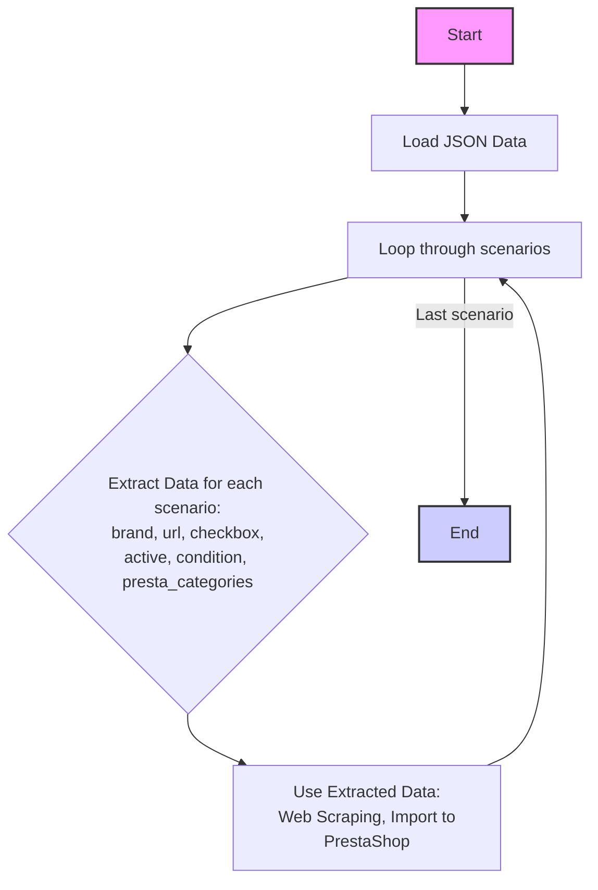

## <алгоритм>

1. **Начало**: Загрузка JSON-структуры, представляющей сценарии для MiniPC Gigabyte от поставщика Morlevi.
2. **Обход сценариев**: Проход по ключам словаря `scenarios`, где каждый ключ является названием сценария (например, "GIGABYTE MINIPC I3 8-9th GEN").
3. **Извлечение данных**: Для каждого сценария извлекаются следующие данные:
   - `brand`: Бренд продукта, всегда "GIGABYTE" в данном случае.
   - `url`: URL-адрес страницы продукта на сайте Morlevi.
   - `checkbox`: Логическое значение, всегда `false` в данном случае, вероятно, указывающее на то, что флажок выбора не используется.
   - `active`: Логическое значение, всегда `true` в данном случае, вероятно, указывающее, что сценарий активен.
   - `condition`: Строка "new", указывающая состояние товара.
   - `presta_categories`: строка, представляющая категории PrestaShop, к которым относится товар, разделенные запятыми.
   - **Пример**: Для сценария "GIGABYTE MINIPC I3 8-9th GEN":
     - `brand` = "GIGABYTE"
     - `url` = "https://www.morlevi.co.il/Cat/127?p_315=2&p_189=1895&sort=datafloat2%2Cprice&keyword="
     - `checkbox` = `false`
     - `active` = `true`
     - `condition` = "new"
     - `presta_categories` = "159,160"
4. **Использование данных**: Эти данные, вероятно, будут использоваться для веб-скрейпинга (извлечения информации) со страниц Morlevi, а затем для импорта данных о товарах в PrestaShop. Например, `url` используется для получения списка товаров, `brand` для их маркировки, а `presta_categories` для их правильной категоризации.
5. **Конец**: Завершение обхода всех сценариев.

## <mermaid>

## <объяснение>

**Импорты:**
В данном коде нет импортов, так как это JSON-файл, а не Python код.  Он представляет собой конфигурационный файл, а не выполняемый скрипт.

**Классы:**
В данном коде нет классов, так как это JSON-файл.  Он является структурой данных.

**Функции:**
В данном коде нет функций, так как это JSON-файл.  Он является структурой данных.

**Переменные:**

-   `scenarios`: Главный словарь, содержащий вложенные словари, где каждый ключ – это название сценария, а значение –  словарь, содержащий информацию о данном сценарии.
-   `brand` (строка): Бренд продукта, всегда "GIGABYTE" в данном файле.
-   `url` (строка): URL-адрес страницы продукта на сайте поставщика Morlevi. Может быть и строкой с разделителями, для отметки отсутствия url
-   `checkbox` (логическое значение): Указывает на использование чекбокса, всегда `false` в данном случае. Вероятно, этот атрибут не используется для этих сценариев.
-   `active` (логическое значение): Указывает, активен ли сценарий, всегда `true` в данном случае.
-   `condition` (строка):  Состояние товара, всегда "new" в данном случае.
-    `presta_categories` (строка): Строка с id категориями  prestaShop для данного товара.

**Объяснение:**

Этот JSON-файл является конфигурационным файлом для системы, которая занимается парсингом данных с веб-сайта morlevi.co.il и импортом этих данных в PrestaShop.

Файл содержит словарь `scenarios`, где каждый ключ – это название сценария для определенной конфигурации MiniPC GIGABYTE. Каждый сценарий имеет следующие характеристики:

-   **`brand`**:  Указывает, что все сценарии относятся к бренду "GIGABYTE".
-   **`url`**: Содержит URL-адрес страницы с товарами на сайте поставщика. Этот URL используется для сбора данных о товарах. Некоторые сценарии имеют строку разделителя в поле `url`, что может означать, что данные для этого сценария не могут быть получены по URL и, возможно, требуют ручной обработки.
-   **`checkbox`**:  Имеет значение `false`, что может означать, что данная настройка не используется в контексте этих сценариев.
-   **`active`**:  Имеет значение `true`, что означает, что все сценарии активны и должны обрабатываться.
-   **`condition`**:  Всегда имеет значение "new", что указывает на то, что все товары в этих сценариях являются новыми.
-   **`presta_categories`**:  Содержит список категорий PrestaShop, к которым относятся товары из данного сценария. Категории разделены запятыми.

**Потенциальные ошибки или области для улучшения:**

1.  **Отсутствие URL**: Некоторые сценарии, такие как "GIGABYTE MINIPC I5 8-9th", "GIGABYTE  MINIPC I9" и "GIGABYTE MINIPC AMD", имеют в качестве URL строку разделителей, что означает, что  невозможно автоматически получить данные с веб-сайта по этому сценарию. Это может привести к ошибкам при автоматизированном сборе данных. Необходимо или предоставить корректные URL-адреса, или предусмотреть другой способ обработки этих сценариев.
2.  **Неоднородность в URL**:  Некоторые URL содержат параметр `keyword=`, но он не используется, что может быть избыточным и может быть убрано для ясности.

**Взаимосвязи с другими частями проекта:**
Этот файл является частью системы веб-скрейпинга и импорта данных в PrestaShop. Он предоставляет конфигурационные данные для парсера, указывая, какие страницы нужно сканировать и как категоризировать товары. Данные из этого файла используются в Python скриптах (или в других скриптах), которые отвечают за взаимодействие с веб-сайтом Morlevi и API PrestaShop.  Этот файл является  входными данными.