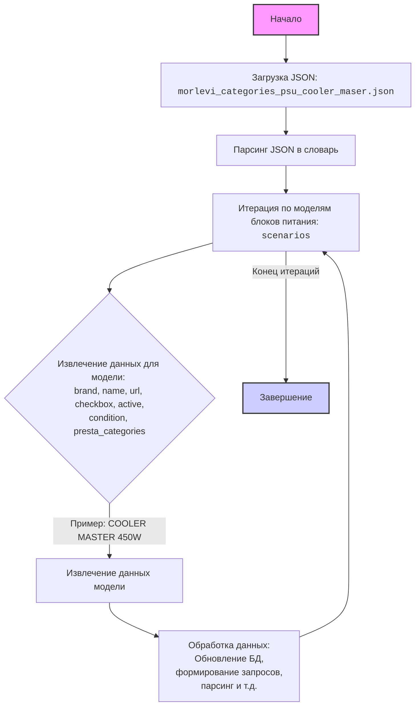

## АНАЛИЗ КОДА: `morlevi_categories_psu_cooler_maser.json`

### <алгоритм>
1.  **Начало**: Загрузка JSON-файла `morlevi_categories_psu_cooler_maser.json`.
2.  **Чтение данных**: JSON-файл парсится в Python-словарь. Ключом верхнего уровня является "scenarios", который содержит словарь, где каждый ключ - это название модели блока питания "COOLER MASTER", а значение - словарь с детальной информацией об этой модели.
3.  **Итерация по моделям**: Проходим по всем ключам внутри словаря "scenarios" (например, "COOLER MASTER 450W", "COOLER MASTER 500W" и т.д.)
4.  **Извлечение данных для каждой модели**: Для каждой модели извлекаем значения для ключей: "brand", "name", "url", "checkbox", "active", "condition" и "presta_categories".
    *   **Пример для "COOLER MASTER 450W"**:
        *   `brand` = "COOLER MASTER"
        *   `name` = "450W"
        *   `url` = "https://www.morlevi.co.il/Cat/286?p_145=634&sort=datafloat2%2Cprice&keyword="
        *   `checkbox` = false
        *   `active` = true
        *   `condition` = "new"
        *   `presta_categories` = "158,511,188,578"
5.  **Использование данных**: Извлеченные данные могут использоваться для дальнейшей обработки, например, для формирования запросов к веб-сайту, обновления базы данных или настройки параметров парсинга.
6.  **Завершение**: После обработки всех моделей, завершаем работу с данными.

### <mermaid>

**Описание диаграммы `mermaid`:**

1.  `Start`: Начальная точка процесса.
2.  `LoadJson`: Загрузка JSON-файла `morlevi_categories_psu_cooler_maser.json`.
3.  `ParseJson`: Парсинг загруженного JSON-файла в Python-словарь.
4.  `IterateModels`: Итерация (цикл) по моделям блоков питания, используя ключ `scenarios`.
5.  `ExtractData`: Извлечение данных для каждой модели, включая `brand`, `name`, `url`, `checkbox`, `active`, `condition`, `presta_categories`.
6. `ModelDataExtraction`: Извлечение конкретных данных для текущей модели в цикле.
7. `ProcessData`: Обработка данных модели (например, запись в БД или использование в другом процессе).
8.  `End`: Конечная точка процесса.

### <объяснение>
**Структура данных**:
-   Файл представляет собой JSON-объект, содержащий словарь под ключом `"scenarios"`.
-   Значение `"scenarios"` - это словарь, где ключами являются наименования моделей блоков питания (например, `"COOLER MASTER 450W"`), а значениями - словари с атрибутами этой модели.

**Атрибуты каждой модели**:

*   `brand` (строка): Бренд производителя, всегда `"COOLER MASTER"`.
*   `name` (строка): Мощность блока питания (например, `"450W"`).
*   `url` (строка): URL-адрес для страницы товара на сайте. Для некоторых моделей указана строка с дефисами `-----` вместо URL.
*   `checkbox` (логическое значение): Всегда `false`. Вероятно, предназначено для пользовательского выбора, но не используется в данном контексте.
*   `active` (логическое значение): Всегда `true`. Может указывать, активен ли сценарий парсинга для данной модели.
*    `condition` (строка): Всегда `new`, указывает на состояние товара.
*   `presta_categories` (строка): Строка, содержащая идентификаторы категорий PrestaShop, разделенные запятыми. Эти идентификаторы, вероятно, используются для классификации продукта в интернет-магазине.

**Использование данных**:
Данный JSON-файл, вероятно, используется как конфигурационный файл для парсера или другого программного модуля. Каждая запись в файле определяет параметры для парсинга страниц с блоками питания конкретной мощности от бренда Cooler Master на сайте `morlevi.co.il`.

**Потенциальные проблемы и улучшения**:

1.  **Неконсистентность URL**: Некоторые записи имеют URL, заполненные `-----` вместо реальных ссылок. Это может привести к ошибкам парсинга. Необходимо либо предоставить реальные URL, либо игнорировать эти записи.
2.  **Жестко заданный бренд**: Все записи имеют один и тот же бренд - `"COOLER MASTER"`. Возможно, следует сделать структуру более гибкой, чтобы поддерживать другие бренды.
3. **Отсутствие обработки ошибок:** Код, который использует этот файл, должен включать обработку ошибок для ситуаций, когда URL недействителен, или отсутствует необходимая информация.
4.  **Неиспользуемый атрибут `checkbox`**: Атрибут `checkbox` всегда равен `false` и никак не используется, что указывает на возможность его удаления из структуры.
5. **Зависимость от `morlevi.co.il`:** Файл имеет жёсткую зависимость от конкретного магазина. Если магазин изменится, то потребуется изменить все ссылки.

**Взаимосвязь с другими частями проекта**:
Данный файл, скорее всего, является частью системы парсинга или обновления данных для интернет-магазина. Этот файл предоставляет параметры для парсинга или извлечения данных о товарах с определенного сайта. Этот файл может использоваться в `scenarios/` как конфигурационный файл для какого-то скрипта, который извлекает информацию из интернета и обновляет информацию в базе данных или системе.

**Резюме:**
Файл представляет собой набор сценариев для парсинга страниц блоков питания Cooler Master. Структура файла достаточно проста, но имеет потенциальные места для улучшения, например, предоставление валидных URL для всех продуктов и пересмотр неиспользуемых параметров.