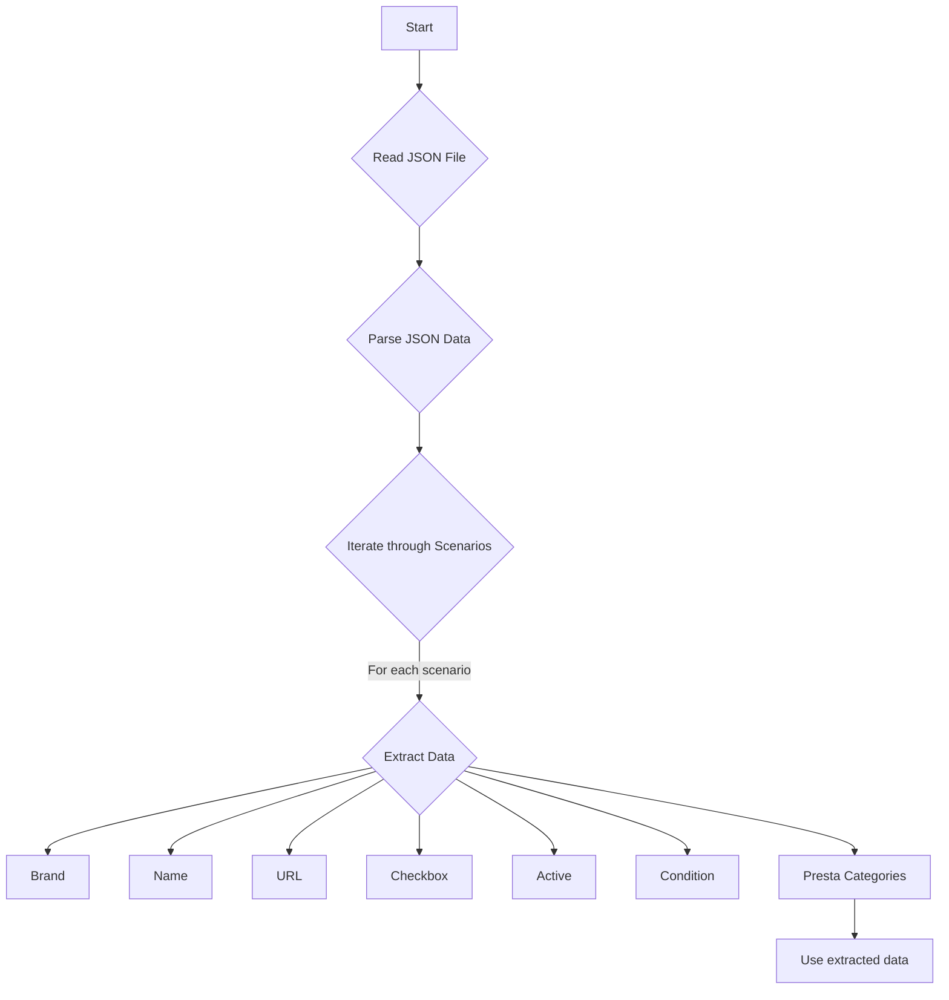

## Анализ кода `morlevi_categories_psu_gigabyte.json`

### 1. <алгоритм>

Файл `morlevi_categories_psu_gigabyte.json` представляет собой JSON-объект, содержащий конфигурационные данные для категорий блоков питания (PSU) бренда AORUS BY GIGABYTE. 

**Блок-схема:**

1.  **Начало**: Чтение JSON-файла.
2.  **Парсинг JSON**: JSON-объект преобразуется в структуру данных (словарь). 
3.  **Итерация по сценариям**: Проход по каждому ключу внутри объекта "scenarios". Каждый ключ представляет собой конкретную модель блока питания (например, "AOURUS BY GIGABYTE 450W").
4.  **Извлечение данных для каждого сценария**: Для каждого блока питания (например, "AOURUS BY GIGABYTE 450W"):
    *   Извлекается `brand` (например, "AOURUS BY GIGABYTE").
    *   Извлекается `name` (например, "450W").
    *   Извлекается `url` (например, "--------------------------------------AOURUS BY GIGABYTE 450W-------------------------------------------").
    *   Извлекается `checkbox` (например, `false`).
    *   Извлекается `active` (например, `true`).
    *   Извлекается `condition` (например, "new").
    *    Извлекается `presta_categories` (например, "158,511,188").
5.  **Использование данных**: Полученные данные могут быть использованы для различных целей, например, для настройки параметров парсинга или для создания соответствующих элементов в интернет-магазине.

**Примеры:**

*   Для сценария `"AOURUS BY GIGABYTE 450W"`: `brand` равно `"AOURUS BY GIGABYTE"`, `name` равно `"450W"`, `url` равно `"--------------------------------------AOURUS BY GIGABYTE 450W-------------------------------------------"`, `checkbox` равно `false`, `active` равно `true`, `condition` равно `"new"` и `presta_categories` равно `"158,511,188"`.
*   Для сценария `"AOURUS BY GIGABYTE 850W"`: `brand` равно `"AOURUS BY GIGABYTE"`, `name` равно `"850W"`, `url` равно `"https://www.morlevi.co.il/Cat/339?p_145=672&sort=datafloat2%2Cprice&keyword="`, `checkbox` равно `false`, `active` равно `true`, `condition` равно `"new"` и `presta_categories` равно `"151,158,511,571"`.

### 2. <mermaid>

**Объяснение диаграммы:**

*   `Start`: Начало процесса.
*   `Read JSON File`: Чтение содержимого JSON-файла.
*   `Parse JSON Data`: Парсинг JSON-содержимого в структуру данных.
*    `Iterate through Scenarios`: Итерация по каждой модели блока питания в объекте "scenarios".
*   `Extract Data`: Извлечение значений для `brand`, `name`, `url`, `checkbox`, `active`, `condition` и `presta_categories` из каждого сценария.
*   `Brand`, `Name`, `URL`, `Checkbox`, `Active`, `Condition`, `Presta Categories`: Переменные для хранения извлеченных данных.
*  `Use extracted data`: Использование извлеченных данных для дальнейших операций.

В данном коде нет импортов, поэтому нет необходимости создавать диаграмму для `header.py`.

### 3. <объяснение>

**Общая структура:**

Файл `morlevi_categories_psu_gigabyte.json` представляет собой JSON-файл, содержащий конфигурационные данные для парсинга и обработки категорий блоков питания (PSU) бренда AORUS BY GIGABYTE из интернет-магазина Morlevi. JSON-структура организована в виде объекта, содержащего поле `scenarios`, которое является объектом, где ключи - это названия конкретных моделей блоков питания, а значения - это объекты с их характеристиками.

**Разбор полей:**

*   `scenarios`: Объект, содержащий сценарии для каждого конкретного блока питания.
    *   Ключи внутри `scenarios`: Названия моделей блоков питания, например, `"AOURUS BY GIGABYTE 450W"`.
    *   Значения внутри `scenarios`: Объекты с параметрами каждого блока питания:
        *   `brand` (строка): Бренд производителя (в данном случае всегда `"AOURUS BY GIGABYTE"`).
        *   `name` (строка): Мощность блока питания (например, `"450W"`).
        *   `url` (строка): URL для поиска, используется для парсинга (может быть пустым или содержать ссылку на конкретную страницу на сайте).
        *    `checkbox` (логическое значение): Флаг, указывающий, нужно ли использовать этот сценарий. Всегда `false`.
        *   `active` (логическое значение): Флаг, указывающий, активен ли этот сценарий. Всегда `true`.
        *    `condition` (строка): Состояние товара, всегда "new"
        *    `presta_categories` (строка): Категории, в которых должен быть добавлен товар в PrestaShop. Представлен в виде строки с ID категорий, разделенных запятыми.

**Использование в проекте:**

Этот файл, вероятно, используется в системе парсинга или синхронизации данных между интернет-магазином Morlevi и другим магазином (возможно, на платформе PrestaShop). Данные из этого файла используются для:

1.  **Парсинга страниц:** `url` используется для перехода на страницы товаров на сайте Morlevi, откуда можно извлечь цены, описания и другие данные.
2.  **Категоризации товаров:**  `presta_categories` используются для определения, в какие категории PrestaShop следует добавить соответствующий товар.
3.  **Фильтрации и активации**: Флаги `checkbox` и `active` могут быть использованы для включения или выключения конкретных моделей в процессе парсинга.

**Потенциальные области для улучшения:**

*   **Использование переменных:** Вместо жестко закодированных строк в `url`, можно использовать переменные, чтобы сделать код более гибким.
*   **Обработка исключений:** В коде, использующем этот файл, должна быть предусмотрена обработка ошибок (например, если JSON-файл не может быть прочитан или не соответствует ожидаемой структуре).
*   **Форматирование данных:** Можно добавить проверку корректности данных, например, формата `presta_categories`.
*   **Централизация настроек:** Настройки, такие как `condition` всегда "new", могут быть перенесены в общий файл конфигурации.
*   **Описательные URL**: Некоторые `url` выглядят как заглушки. Нужно убедиться, что URL-ы актуальны.

**Цепочка взаимосвязей с другими частями проекта:**

1.  **Модуль парсинга:** Этот файл является конфигурационным файлом для модуля парсинга, который будет читать данные и осуществлять парсинг страниц, указанных в поле `url`.
2.  **Модуль интеграции с PrestaShop:** `presta_categories` используются модулем интеграции для добавления товаров в соответствующие категории в PrestaShop.
3.  **Файлы конфигурации:** Может быть связан с другими файлами конфигурации, которые определяют общие настройки проекта (например, настройки базы данных, API-ключи и т.д.).

В целом, файл `morlevi_categories_psu_gigabyte.json` является важным компонентом системы парсинга и синхронизации данных, определяющим, как и какие товары должны быть обработаны.