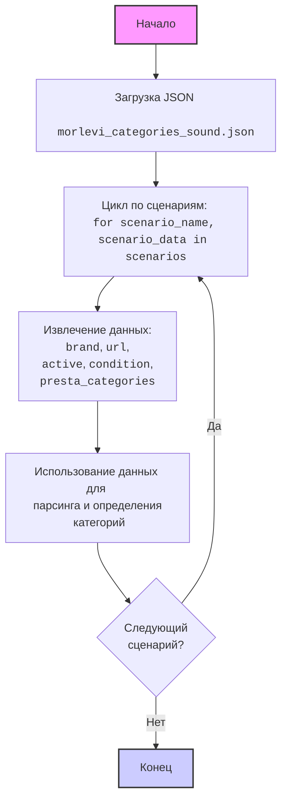

## ИНСТРУКЦИЯ:

Анализируй предоставленный код подробно и объясни его функциональность. Ответ должен включать три раздела:

1.  **<алгоритм>**: Опиши рабочий процесс в виде пошаговой блок-схемы, включая примеры для каждого логического блока, и проиллюстрируй поток данных между функциями, классами или методами.
2.  **<mermaid>**: Напиши код для диаграммы в формате `mermaid`, проанализируй и объясни все зависимости,
    которые импортируются при создании диаграммы.
    **ВАЖНО!** Убедитесь, что все имена переменных, используемые в диаграмме `mermaid`,
    имеют осмысленные и описательные имена. Имена переменных вроде `A`, `B`, `C`, и т.д., не допускаются!

    **Дополнительно**: Если в коде есть импорт `import header`, добавьте блок `mermaid` flowchart, объясняющий `header.py`:
    ```mermaid
    flowchart TD
        Start --> Header[<code>header.py</code><br> Determine Project Root]

        Header --> import[Import Global Settings: <br><code>from src import gs</code>]
    ```

3.  **<объяснение>**: Предоставьте подробные объяснения:
    -   **Импорты**: Их назначение и взаимосвязь с другими пакетами `src.`.
    -   **Классы**: Их роль, атрибуты, методы и взаимодействие с другими компонентами проекта.
    -   **Функции**: Их аргументы, возвращаемые значения, назначение и примеры.
    -   **Переменные**: Их типы и использование.
    -   Выделите потенциальные ошибки или области для улучшения.

Дополнительно, постройте цепочку взаимосвязей с другими частями проекта (если применимо).

Это обеспечивает всесторонний и структурированный анализ кода.
## Формат ответа: `.md` (markdown)
**КОНЕЦ ИНСТРУКЦИИ**

## <алгоритм>

1.  **Начало**: Загрузка JSON-файла с настройками сценариев.
    *   **Пример**: Загружается файл `morlevi_categories_sound.json`, содержащий словарь `scenarios`.

2.  **Обход сценариев**: Перебор каждого элемента словаря `scenarios`. Каждый элемент представляет собой отдельный сценарий.
    *   **Пример**: Перебираются ключи `"Logitech speakers"`, `"GENIUS speakers"`, и т.д.

3.  **Извлечение данных**: Для каждого сценария извлекаются значения параметров:
    *   `brand` - Марка товара (например, `"LOGITECH"`, `"GENIUS"`).
    *   `url` - URL-адрес для парсинга (например, `"https://www.morlevi.co.il/Cat/161?p_315=29&sort=datafloat2%2Cprice&keyword="`).
    *   `checkbox` - Флаг (логическое значение) - не используется.
    *   `active` - Флаг (логическое значение), указывающий, активен ли сценарий (всегда `true` в данном случае).
    *   `condition` - Условие товара (всегда `"new"`).
    *   `presta_categories` - Категории PrestaShop, к которым относится товар (например, `"520,521"`).
    *   **Пример**: Для сценария `"Logitech speakers"` извлекаются данные: `"LOGITECH"`, `"https://www.morlevi.co.il/Cat/161?p_315=29&sort=datafloat2%2Cprice&keyword="`, `false`, `true`, `"new"`, `"520,521"`

4.  **Обработка данных**: Эти данные будут использоваться для настройки парсинга и для определения соответствия товаров категориям.
    *   **Пример**: URL используется для загрузки HTML-страницы, `brand` для фильтрации товаров по марке, `presta_categories` для отнесения товаров к определенным категориям.

5.  **Завершение**:  Все сценарии обработаны.

## <mermaid>



**Описание диаграммы:**

Диаграмма представляет собой блок-схему, описывающую процесс обработки JSON-файла с конфигурациями сценариев.

*   **Start**: Начало процесса.
*   **LoadJSON**: Загрузка JSON-файла `morlevi_categories_sound.json`, который содержит данные для сценариев.
*   **LoopThroughScenarios**: Цикл перебора всех сценариев, содержащихся в словаре `scenarios` из загруженного JSON.  Для каждого сценария цикл проходит один раз.
*   **ExtractData**: Извлечение значений ключей: `brand`, `url`, `active`, `condition`, и `presta_categories` из текущего обрабатываемого сценария.
*   **UseData**: Данные используются для настройки парсинга (например, `url`) и для определения категорий товаров (`presta_categories`).
*   **NextScenario**: Проверка, есть ли еще сценарии для обработки. Если есть, цикл возвращается к `LoopThroughScenarios`. В противном случае процесс завершается.
*   **End**: Конец процесса.

## <объяснение>

**Импорты**:

В данном коде импорты отсутствуют. Это означает, что код не зависит от внешних модулей Python и оперирует непосредственно с данными в формате JSON.

**Классы**:

В данном коде нет классов. Код представляет собой структуру данных в формате JSON.

**Функции**:

В коде нет функций. Это конфигурационный файл, который используется для хранения настроек.

**Переменные**:

*   `scenarios`:  Словарь (dict), содержащий настройки сценариев для парсинга.
    *   Ключи словаря - названия сценариев (например, `"Logitech speakers"`).
    *   Значения словаря - это словари с настройками для каждого сценария.
        *   `brand` (str): Марка производителя товаров.
        *   `url` (str): URL-адрес, который будет использоваться для парсинга.
        *   `checkbox` (bool): Не используется.
        *   `active` (bool): Флаг, указывающий, активен ли сценарий. Всегда `true`.
        *   `condition` (str): Условие товара (всегда `"new"`).
        *   `presta_categories` (str): Строка, содержащая идентификаторы категорий PrestaShop через запятую.

**Объяснение**:

Данный JSON файл представляет собой конфигурацию для парсера, который будет собирать данные о товарах с сайта morlevi.co.il. Каждый ключ верхнего уровня в словаре `scenarios` - это название категории или подкатегории товаров (например, `"Logitech speakers"`). Каждое значение этого словаря представляет собой настройки парсинга для этой категории, а именно:
 *   `brand`: Определяет производителя товаров, которые нужно парсить для данной категории.
 *  `url`: URL-адрес страницы, с которой будут собираться данные.
 *  `active`: Позволяет включать или выключать парсинг для данной категории (хотя всегда установлен в `true`).
 *  `condition`: Указывает на состояние товара, (всегда `"new"`).
 * `presta_categories`: Указывает на категории в PrestaShop, к которым будут отнесены спарсенные товары.

Этот файл является частью системы парсинга, которая, вероятно, использует эти данные для автоматического сбора информации о товарах с сайта morlevi.co.il и их дальнейшей загрузки в интернет-магазин PrestaShop.

**Потенциальные ошибки и улучшения**:

1.  **Отсутствие валидации данных**:  В коде нет валидации значений, что может привести к ошибкам при парсинге. Например, `url` должен быть валидным URL, `brand` должен соответствовать производителям на сайте и т.д.
2.  **Неиспользуемый параметр `checkbox`**:  Параметр `checkbox` в каждом сценарии всегда имеет значение `false` и не используется в данном контексте, что может быть избыточным.
3.  **Зависимость от структуры сайта**: Парсер, использующий этот файл, будет сильно зависеть от структуры HTML-страницы по указанному URL. Изменения на сайте могут привести к поломке парсера.
4.  **Жесткая привязка к значениям**: `condition` всегда `new`. Это может быть негибким и ограничивает область применения парсера.

**Взаимосвязи с другими частями проекта**:

Этот JSON файл связан с парсером, который использует эти данные для сбора информации о товарах. Он также связан с системой PrestaShop, поскольку данные из этого файла используются для назначения товаров определенным категориям в этой системе. Скорее всего, парсер будет читать этот файл, использовать URL для скачивания HTML-страниц, извлекать данные о товарах, а затем использовать `brand` и `presta_categories` для категоризации товаров в PrestaShop.