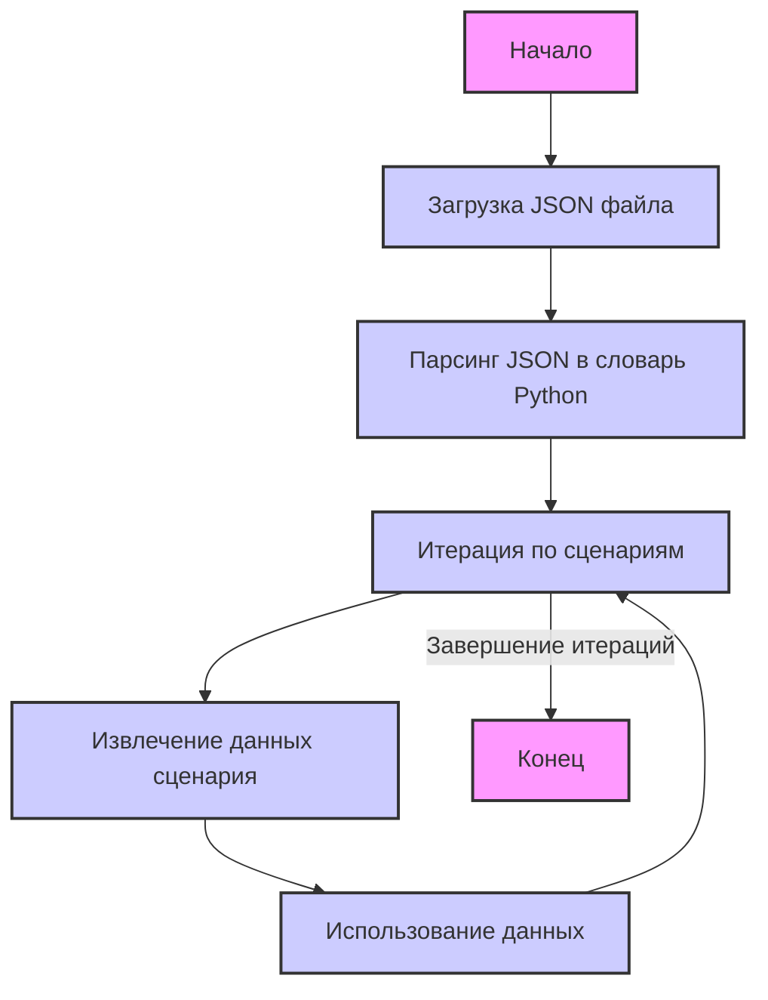

## ИНСТРУКЦИЯ:

Анализируй предоставленный код подробно и объясни его функциональность. Ответ должен включать три раздела:  

1. **<алгоритм>**: Опиши рабочий процесс в виде пошаговой блок-схемы, включая примеры для каждого логического блока, и проиллюстрируй поток данных между функциями, классами или методами.  
2. **<mermaid>**: Напиши код для диаграммы в формате `mermaid`, проанализируй и объясни все зависимости, 
    которые импортируются при создании диаграммы. 
    **ВАЖНО!** Убедитесь, что все имена переменных, используемые в диаграмме `mermaid`, 
    имеют осмысленные и описательные имена. Имена переменных вроде `A`, `B`, `C`, и т.д., не допускаются!  
    
    **Дополнительно**: Если в коде есть импорт `import header`, добавьте блок `mermaid` flowchart, объясняющий `header.py`:\
    ```mermaid\
    flowchart TD\
        Start --> Header[<code>header.py</code><br> Determine Project Root]\
    \
        Header --> import[Import Global Settings: <br><code>from src import gs</code>] \
    ```

3. **<объяснение>**: Предоставьте подробные объяснения:  
   - **Импорты**: Их назначение и взаимосвязь с другими пакетами `src.`.  
   - **Классы**: Их роль, атрибуты, методы и взаимодействие с другими компонентами проекта.  
   - **Функции**: Их аргументы, возвращаемые значения, назначение и примеры.  
   - **Переменные**: Их типы и использование.  
   - Выделите потенциальные ошибки или области для улучшения.  

Дополнительно, постройте цепочку взаимосвязей с другими частями проекта (если применимо).  

Это обеспечивает всесторонний и структурированный анализ кода.
## Формат ответа: `.md` (markdown)
**КОНЕЦ ИНСТРУКЦИИ**
### <алгоритм>
1. **Начало**: Загрузка JSON-файла, который представляет собой конфигурацию сценариев для категорий товаров поставщика Morlevi.
2. **Разбор JSON**:  JSON-объект парсится в структуру данных Python (словарь, где ключи - это названия сценариев, а значения - это их параметры).
   ```python
   {
    "scenarios": {
        "WESTERN DIGITAL internal_ssd_sata_3 120-128GB": {
        "brand": "WESTERN DIGITAL",
        "name": "internal_ssd_sata_3_128",
        "url": "...",
        "checkbox": false,
        "active": true,
        "condition":"new",
        "presta_categories": "117,118,134"
        },
       ...
   }
   ```
3. **Итерация по сценариям**:  Происходит перебор каждого сценария в словаре `scenarios`.
  - Пример итерации:
    ```python
     for scenario_name, scenario_data in scenarios.items():
        print(f"Обработка сценария: {scenario_name}")
         # scenario_name будет "WESTERN DIGITAL internal_ssd_sata_3 120-128GB"
         # scenario_data будет  {"brand": "WESTERN DIGITAL", "name": "internal_ssd_sata_3_128", ..., "presta_categories": "117,118,134"}
        ```
4. **Обработка данных сценария**: Для каждого сценария извлекаются значения:
   - `brand`: Бренд товара (например, "WESTERN DIGITAL").
   - `name`: Внутреннее имя сценария (например, "internal_ssd_sata_3_128").
   - `url`: URL, связанный со сценарием (например,  "https://www.morlevi.co.il/Cat/51?...").
   - `checkbox`: Флаг, указывающий на активность чекбокса (например, `false`).
   -  `active`: Флаг, указывающий на активность сценария (например, `true`).
   - `condition`: Состояние товара (например, "new").
    - `presta_categories`: Категории PrestaShop, связанные со сценарием(например, "117,118,134").
5. **Использование данных**:  Извлеченные данные, используются для дальнейшей обработки в рамках логики приложения. Например, эти данные могут использоваться для:
   - Создания или обновления записей в базе данных.
   - Формирования запросов к API.
   - Конфигурирования процесса сбора данных с веб-сайтов.
   - Настройки импорта товаров в PrestaShop.
6. **Завершение**: После обработки всех сценариев, процесс завершается.
   -Пример завершения:
     ```python
       print("Обработка сценариев завершена.")
     ```

### <mermaid>


**Анализ `mermaid` диаграммы:**

-   **Start**: Начало процесса.
-   **LoadJson**: Загрузка JSON-файла с диска в память.
-   **ParseJson**:  Парсинг JSON-данных в структуру данных Python (словарь).
-   **IterateScenarios**:  Цикл, который перебирает каждый сценарий из словаря `scenarios`.
-   **ExtractData**: Извлечение необходимых данных из каждого сценария (например, `brand`, `name`, `url`, `presta_categories` и т.д.).
-   **UseData**: Использование извлеченных данных для дальнейших операций (например, обновление базы данных или отправка запросов).
-   **End**: Завершение процесса обработки всех сценариев.

### <объяснение>
**Общее описание:**

Представленный JSON файл содержит конфигурацию сценариев для категорий товаров поставщика Morlevi. Каждый сценарий описывает определенную категорию товаров, предоставляя информацию о бренде, внутреннем имени, URL-адресе на сайте поставщика, активности, условии и соответствующих категориях PrestaShop. Этот файл служит для автоматизации процессов, связанных с интеграцией данных поставщика, таких как синхронизация каталогов товаров, ценообразование и т.д.

**Импорты:**

В предоставленном коде нет импортов. Это означает, что для обработки данного JSON файла достаточно стандартных средств Python, без необходимости подключать сторонние библиотеки.

**Классы:**

В коде нет классов, он представляет собой структуру данных JSON.

**Функции:**

Код не содержит функций. Обработка данных происходит путем последовательного доступа к элементам словаря и их значениям.

**Переменные:**

-   `scenarios`: (тип: словарь) Главный словарь, содержащий все сценарии.
    -   Ключи: названия сценариев (например, "WESTERN DIGITAL internal_ssd_sata_3 120-128GB").
    -   Значения: словари, представляющие параметры каждого сценария.

Внутри каждого сценария:
-   `brand`: (тип: строка) Бренд товара.
-   `name`: (тип: строка) Внутреннее имя сценария.
-    `url`: (тип: строка) URL-адрес, связанный со сценарием (ссылка на категорию на сайте поставщика или просто строка для идентификации).
-   `checkbox`: (тип: логический) Флаг, определяющий состояние чекбокса.
-   `active`: (тип: логический) Флаг, определяющий, активен ли сценарий.
-    `condition`: (тип: строка) Состояние товара (например, "new").
-   `presta_categories`: (тип: строка) Список категорий PrestaShop, связанных с данным сценарием, разделенных запятыми.

**Объяснения:**

-  **Структура JSON**: JSON файл имеет корневой словарь с ключом `scenarios`, значением которого является словарь, где ключи - это уникальные имена сценариев, а значения - это словари с параметрами сценария.
-  **Сценарии**: Каждый сценарий представляет собой конфигурацию для определенной категории товара, что позволяет гибко управлять импортом и синхронизацией данных.
-  **Использование**:
   -   `brand`, `name` используются для идентификации и категоризации товаров.
    -   `url` используется для доступа к данным о товарах на сайте поставщика.
    -  `checkbox` и `active` позволяют контролировать использование сценариев.
    -  `condition` указывает на состояние товара (новое, б/у и т.д.).
   -   `presta_categories` используется для связывания товаров с категориями в PrestaShop.
-  **Потенциальные улучшения**:
  - Добавление валидации данных, чтобы предотвратить ошибки, например, проверка формата URL или типа значений для `active`.
   -  Использование более структурированного формата для `presta_categories` (например, список целых чисел) вместо строки с разделенными запятыми.
    - Рассмотрение возможности использования констант или Enum для `brand`, `condition` для стандартизации данных.
  -  Внедрение обработки ошибок для случаев, когда данные в JSON файле могут быть повреждены или неполными.
  - Если файл часто используется и меняется, можно рассмотреть вариант хранения конфигурации в базе данных или другом хранилище.
**Связи с другими частями проекта:**

Данный файл, скорее всего, является частью системы, которая взаимодействует с веб-сайтом Morlevi и PrestaShop. Он может использоваться в качестве конфигурационного файла для скриптов или процессов, которые:
   - Извлекают данные с сайта Morlevi.
   -   Синхронизируют каталоги товаров.
    -   Обновляют цены и наличие.
    - Импортируют товары в PrestaShop.

В целом, файл представляет собой простой, но мощный способ конфигурации процессов интеграции, позволяющий эффективно управлять данными и связывать категории товаров поставщика с категориями магазина.