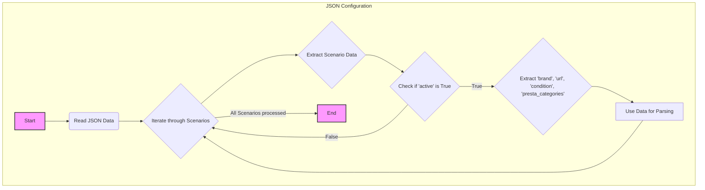

## АНАЛИЗ КОДА

### 1. <алгоритм>

Представленный код описывает структуру данных в формате JSON, представляющую собой конфигурацию для парсинга категорий источников бесперебойного питания (UPS) с сайта поставщика "Morlevi".

**Блок-схема:**

```mermaid
graph TD
    A[Начало] --> B{Чтение JSON};
    B --> C{Перебор сценариев};
    C --> D{Извлечение данных сценария};
    D --> E{Проверка значения 'active' (True/False)};
    E -- True --> F[Данные для парсинга];
    E -- False --> C;
    F --> G{Извлечение 'brand', 'url', 'condition', 'presta_categories'};
    G --> H[Использование данных для парсинга];
    H --> C;
    C -- Все сценарии обработаны --> I[Конец];
```

**Примеры для каждого блока:**

*   **A (Начало):** Начало процесса чтения и обработки JSON файла.
*   **B (Чтение JSON):** JSON объект загружается в память и преобразуется в структуру данных, доступную для дальнейшей обработки. В данном случае:

    ```json
    {
        "scenarios": {
            "ups APC": {
              "brand": "APC",
              "url": "https://www.morlevi.co.il/Cat/332?p_315=86&sort=datafloat2%2Cprice&keyword=",
              "checkbox": false,
              "active": true,
              "condition":"new",
              "presta_categories": "158,247"
             },
           "ups EATON": {
             "brand": "EATON",
              "url": "https://www.morlevi.co.il/Cat/332?p_315=59&sort=datafloat2%2Cprice&keyword=",
              "checkbox": false,
              "active": true,
              "condition":"new",
              "presta_categories": "158,247"
            }
        }
    }
    ```
*   **C (Перебор сценариев):** Цикл начинается с обработки первого ключа (например, "ups APC") в словаре "scenarios". После обработки первого сценария цикл переходит ко второму сценарию.
*   **D (Извлечение данных сценария):** Извлекаются данные для текущего сценария (например, для сценария "ups APC" извлекается словарь со значениями  `brand`, `url`, `checkbox`, `active`, `condition` и `presta_categories` ).
*   **E (Проверка значения 'active'):** Проверяется значение ключа `active` (True/False). Если `True` - сценарий будет обработан, иначе - пропускается.
*   **F (Данные для парсинга):** Если `active` равен `True`, данные извлекаются для дальнейшего использования.
*   **G (Извлечение 'brand', 'url', 'condition', 'presta_categories'):** Извлечение конкретных полей данных из каждого сценария для использования в логике парсера.
*   **H (Использование данных для парсинга):**  Данные, полученные на предыдущем шаге, используются в функции парсинга для извлечения необходимой информации.
*   **I (Конец):** Конец процесса обработки.

### 2. <mermaid>



**Объяснение:**

*   `JSON Configuration`: Обозначает общий процесс обработки JSON-конфигурации.
*   `Start`: Начало процесса.
*   `Read JSON Data`: Чтение и парсинг JSON-данных.
*  `Iterate through Scenarios`: Цикл перебора сценариев.
*   `Extract Scenario Data`: Извлечение данных конкретного сценария из JSON.
*   `Check if 'active' is True`: Проверка, является ли сценарий активным (значение `active` равно `True`).
*   `Extract 'brand', 'url', 'condition', 'presta_categories'`: Извлечение необходимых полей для парсинга.
*   `Use Data for Parsing`: Использование извлеченных данных для парсинга и последующей обработки.
*   `End`: Конец процесса.

В данной диаграмме не используются импорты, так как сам JSON не является исполняемым кодом. Он используется как данные конфигурации.

### 3. <объяснение>

**Импорты:**

*   В данном коде нет импортов, так как это JSON-файл, а не Python-скрипт. Это конфигурационный файл, описывающий данные.

**Классы:**

*   В данном коде нет классов, так как это JSON-файл, а не Python-скрипт.

**Функции:**

*   В данном коде нет функций, так как это JSON-файл, а не Python-скрипт. Однако, при использовании этих данных, функции в Python могут их обрабатывать. Например, можно создать функцию, которая принимает этот JSON в качестве аргумента и осуществляет парсинг данных, создавая структуру данных для последующей работы.

**Переменные:**

*   `scenarios`: Объект JSON, который содержит в себе сценарии для парсинга. Тип: `dict`.
*   `ups APC`, `ups EATON`: Ключи словаря `scenarios`. Каждый из этих ключей обозначает отдельный сценарий. Тип: `str`.
*   `brand`: Название бренда (например, `"APC"` или `"EATON"`). Тип: `str`.
*   `url`: URL-адрес страницы на сайте поставщика для парсинга. Тип: `str`.
*   `checkbox`: Флаг, определяющий, требуется ли использовать чекбокс для выбора категории, хотя в данном случае всегда `false`. Тип: `bool`.
*   `active`: Флаг, указывающий, активен ли сценарий. Тип: `bool`.
*   `condition`: Условие товара (`"new"`). Тип: `str`.
*  `presta_categories`: Список ID категорий для товаров в PrestaShop. Тип: `str`.

**Объяснение:**

Представленный JSON файл используется как конфигурационный файл для парсера. В данном файле, каждый сценарий парсинга для UPS представлен в виде отдельного объекта. Каждый такой сценарий включает в себя: название бренда, URL-адрес, флаг активности, условие и список id категорий в PrestaShop.

Например, сценарий `"ups APC"` указывает, что парсер должен обращаться к URL: `https://www.morlevi.co.il/Cat/332?p_315=86&sort=datafloat2%2Cprice&keyword=` для извлечения данных о товарах бренда `APC` и для сохранения их в PrestaShop в категориях с ID `158,247`.

Потенциальные ошибки и области для улучшения:

1.  **Неявное использование строки для категорий:** `presta_categories` в данный момент хранится в виде строки с id, разделёнными запятыми. Это может привести к ошибкам при парсинге и должно быть преобразовано в список целых чисел.
2.  **Отсутствие обработки ошибок:** В самом JSON файле нет валидации данных. Парсер должен проверять наличие обязательных полей, соответствие типов данных и обрабатывать ошибки, например, если `url` не является корректным URL-адресом.
3.  **Жестко закодированные URL-адреса:** URL-адреса содержат параметры запроса (например, `p_315=86`). Было бы лучше параметризовать эти параметры, если они меняются в зависимости от других условий.

**Цепочка взаимосвязей с другими частями проекта:**

Данный JSON-файл, скорее всего, используется в качестве входных данных для парсера, который, в свою очередь, является частью более крупной системы, например, системы управления продуктами. Вот возможная цепочка взаимосвязей:

1.  **JSON-файл:** Предоставляет конфигурацию для парсинга (текущий файл).
2.  **Парсер (Python-скрипт):** Читает JSON-файл, обрабатывает конфигурацию, загружает страницы с товарами с указанных URL и извлекает необходимую информацию о товарах.
3.  **Преобразователь данных:**  Преобразует полученные данные в формат, пригодный для дальнейшего использования (например, в JSON или CSV).
4.  **Система управления продуктами/База данных:** Записывает извлеченные и преобразованные данные в базу данных или CMS (например, PrestaShop).
5.  **Другие части системы:** могут использовать данные из базы данных для отображения на сайте, обработки заказов и других целей.

Таким образом, данный файл является важной частью процесса парсинга и обновления данных о товарах.