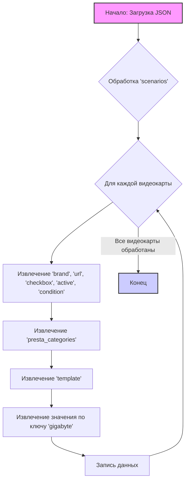

## Анализ `morlevi_categories_video.json`

### <алгоритм>
1. **Начало**: Чтение и загрузка JSON файла `morlevi_categories_video.json`.
2. **Обработка `scenarios`**:
   - Итерирование по ключам (названиям видеокарт, например, "GIGABYTE RTX 4090") в объекте `scenarios`.
   - Для каждой видеокарты (например, "GIGABYTE RTX 4090"):
     - Извлечение свойств: `brand`, `url`, `checkbox`, `active`, `condition`.
       - **Пример**:
           - `brand` = "GIGABYTE"
           - `url` = "https://www.morlevi.co.il/Cat/85?p_315=2&p_55=4408&sort=datafloat2%2Cprice&keyword="
           - `checkbox` = `false`
           - `active` = `true`
           - `condition` = "new"
     - Извлечение объекта `presta_categories`:
       - Извлечение объекта `template`:
         - Извлечение значения по ключу `gigabyte` (например, "RTX 4090").
           - **Пример**:
             - `presta_categories` = { "template": { "gigabyte": "RTX 4090" }}
             - `template` = { "gigabyte": "RTX 4090" }
             - Значение `gigabyte` = "RTX 4090"
   - Запись извлеченных данных в структурированном виде (в данном случае JSON, но может быть и другой формат)
3. **Конец**: Завершение обработки JSON файла.

### <mermaid>

### <объяснение>

**Импорты**:
В данном коде нет импортов, так как это JSON-файл, который описывает структуру данных. JSON используется для хранения и передачи данных между различными системами.
**Структура JSON**:
- Корень JSON - это объект, содержащий единственный ключ `scenarios`.
- Ключ `scenarios` - это объект, где ключами являются названия моделей видеокарт (например, "GIGABYTE RTX 4090").
- Каждая модель видеокарты представлена объектом, содержащим следующие ключи:
   - `brand`: Бренд видеокарты (например, "GIGABYTE").
   - `url`: URL-адрес, ведущий на страницу этой модели на сайте поставщика.
   - `checkbox`: Логическое значение, определяющее использование чекбокса.
   - `active`: Логическое значение, указывающее, активна ли данная модель.
   - `condition`: Строка, описывающая состояние товара (например, "new").
   - `presta_categories`: Объект, содержащий информацию о категориях PrestaShop:
      - `template`: Объект, который содержит ключ `gigabyte` и соответствующее ему значение (модель видеокарты, например "RTX 4090").
   
**Назначение**:
- Файл `morlevi_categories_video.json` служит для конфигурации процесса сбора данных о видеокартах с сайта поставщика "Morlevi".
- Он определяет, какие модели видеокарт нужно отслеживать, URL-адреса для их поиска на сайте, а также соответствие между названиями моделей и категориями в PrestaShop.
- `url` используется для поиска товаров.
- `presta_categories.template.gigabyte` используется для присвоения товара нужной категории в PrestaShop.
- `active` используется для активации или деактивации сценария парсинга для определенной видеокарты.

**Взаимосвязь с другими частями проекта**:
- Этот JSON-файл, вероятно, используется в качестве входных данных для скриптов парсинга или ETL (Extract, Transform, Load) процессов.
- Он может быть загружен и обработан программой, написанной на Python или другом языке, которая будет использовать информацию для посещения страниц сайта "Morlevi", извлечения данных о продуктах и загрузки их в базу данных или интернет-магазин PrestaShop.
- Структура данных этого файла предполагает, что каждая видеокарта имеет определенный URL для парсинга и одну категорию в PrestaShop.
- Значения `active` и `condition` используются для фильтрации и обработки товаров.

**Потенциальные ошибки и области для улучшения**:
- Отсутствует проверка валидности URL-адресов.
- Нет обработки ошибок при загрузке или синтаксическом анализе JSON.
- Жестко закодированное имя ключа "gigabyte" в `presta_categories.template`. Возможно, требуется гибкость для других брендов.
- Не указан тип ценности `presta_categories` в файле, что в будущем может вызвать ошибки.
- Отсутствует описание или комментарии в JSON-файле, которые могли бы помочь понять назначение каждого поля.
- Нет поддержки динамического добавления новых моделей видеокарт, все модели заданы статически.
- Нет версионирования файла или возможности отслеживать изменения.

**Пример**:
Сценарий для "GIGABYTE RTX 4090" указывает, что при парсинге страницы по указанному URL, нужно сопоставить товары с категорией "RTX 4090" в PrestaShop.