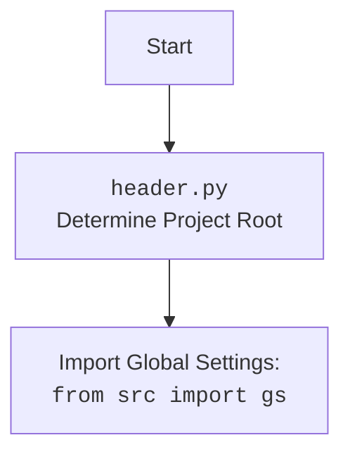

## ИНСТРУКЦИЯ:

Анализируй предоставленный код подробно и объясни его функциональность. Ответ должен включать три раздела:

1.  **<алгоритм>**: Опиши рабочий процесс в виде пошаговой блок-схемы, включая примеры для каждого логического блока, и проиллюстрируй поток данных между функциями, классами или методами.
2.  **<mermaid>**: Напиши код для диаграммы в формате `mermaid`, проанализируй и объясни все зависимости,
    которые импортируются при создании диаграммы.
    **ВАЖНО!** Убедитесь, что все имена переменных, используемые в диаграмме `mermaid`,
    имеют осмысленные и описательные имена. Имена переменных вроде `A`, `B`, `C`, и т.д., не допускаются!

    **Дополнительно**: Если в коде есть импорт `import header`, добавьте блок `mermaid` flowchart, объясняющий `header.py`:
    ```mermaid
    flowchart TD
        Start --> Header[<code>header.py</code><br> Determine Project Root]

        Header --> import[Import Global Settings: <br><code>from src import gs</code>]
    ```

3.  **<объяснение>**: Предоставьте подробные объяснения:
    *   **Импорты**: Их назначение и взаимосвязь с другими пакетами `src.`.
    *   **Классы**: Их роль, атрибуты, методы и взаимодействие с другими компонентами проекта.
    *   **Функции**: Их аргументы, возвращаемые значения, назначение и примеры.
    *   **Переменные**: Их типы и использование.
    *   Выделите потенциальные ошибки или области для улучшения.

Дополнительно, постройте цепочку взаимосвязей с другими частями проекта (если применимо).

Это обеспечивает всесторонний и структурированный анализ кода.
## Формат ответа: `.md` (markdown)
**КОНЕЦ ИНСТРУКЦИИ**

## <алгоритм>

```mermaid
graph LR
    A[Начало: Создание объекта Supplier] --> B{Проверка supplier_prefix}
    B -- Пустой префикс --> C[Ошибка: ValueError]
    B -- Префикс есть --> D[Инициализация: `__init__`]
    D --> E{Вызов `_payload()`}
    E -- `_payload()` возвращает `False` --> F[Ошибка: DefaultSettingsException]
    E -- `_payload()` возвращает `True` --> G[Конец инициализации]
    
    subgraph _payload()
        H[Начало `_payload()`] --> I[Логирование: Загрузка настроек поставщика]
        I --> J{Импорт модуля поставщика `importlib`}
        J -- Модуль найден --> K[Установка `related_modules`]
        J -- Модуль не найден --> L[Логирование ошибки: Модуль не найден]
        L --> M[Возврат `False`]
        K --> N[Формирование пути к файлу настроек]
        N --> O[Загрузка настроек из JSON файла]
        O -- Настройки загружены --> P[Установка атрибутов из настроек]
        P --> Q[Логирование: Настройки успешно загружены]
        Q --> R[Возврат `True`]
        O -- Настройки не найдены --> S[Логирование ошибки: Настройки не найдены]
        S --> T[Возврат `False`]
        O -- Ошибка загрузки --> U[Логирование ошибки]
        U --> V[Возврат `False`]
        H --> I
    end
    
    G --> W{Вызов метода `login()`}
    W --> X[Вызов метода `login()` из `related_modules`]
    X -- `login()` возвращает `True` --> Y[Вход выполнен успешно]
    X -- `login()` возвращает `False` --> Z[Вход не выполнен]
    
    Y --> AA{Вызов метода `run_scenario_files()`}
    AA --> AB{Проверка `scenario_files`}
    AB -- `scenario_files` переданы --> AC[Выполнение сценариев из переданных файлов]
    AB -- `scenario_files` не переданы --> AD[Выполнение сценариев из `self.scenario_files`]
    AC --> AE[Возврат результата выполнения сценариев]
    AD --> AE
    
    Y --> AF{Вызов метода `run_scenarios()`}
    AF --> AG[Выполнение сценариев из переданных данных]
    AG --> AH[Возврат результата выполнения сценариев]
    
    AE --> AI[Конец]
    AH --> AI
    Z --> AI

    style A fill:#f9f,stroke:#333,stroke-width:2px
    style G fill:#ccf,stroke:#333,stroke-width:2px
    style H fill:#ccf,stroke:#333,stroke-width:2px
    style R fill:#ccf,stroke:#333,stroke-width:2px
    style AI fill:#f9f,stroke:#333,stroke-width:2px
```

**Примеры:**

*   **Создание объекта Supplier:**

    ```python
    supplier = Supplier(supplier_prefix="test_supplier", supplier_id=1)
    ```

    Здесь создается объект `Supplier` с `supplier_prefix` равным "test_supplier" и `supplier_id` равным 1.

*   **Проверка supplier\_prefix:**
    *   Если `supplier_prefix` передан как пустая строка `""`, будет вызвано исключение `ValueError`.
    *   Если `supplier_prefix` передан как не пустая строка (например, `"test_supplier"`), проверка проходит успешно.
*   **Инициализация \_\_init\_\_:**
    *   После создания объекта вызывается метод `__init__`, который вызывает метод `_payload` для загрузки настроек поставщика.
    *   Если `_payload` возвращает `False`, выбрасывается исключение `DefaultSettingsException`.
*   **Метод \_payload():**
    *   Пытается импортировать модуль поставщика на основе `supplier_prefix` (например, `src.suppliers.test_supplier`).
    *   Загружает JSON файл настроек поставщика (например, `test_supplier_settings.json`).
    *   Устанавливает значения атрибутов `price_rule`, `locale`, `scenario_files`, `locators` из загруженных настроек.
*   **Вызов метода login():**
    *   Вызывает метод `login` из импортированного модуля поставщика.
*   **Вызов метода run\_scenario\_files():**

    ```python
    supplier.run_scenario_files(["scenario1.json", "scenario2.json"])
    ```

    Запускает сценарии, описанные в файлах `scenario1.json` и `scenario2.json`.

*   **Вызов метода run\_scenarios():**

    ```python
    supplier.run_scenarios([{"name": "test_scenario", "steps": []}])
    ```

    Запускает сценарий, переданный в виде словаря.

## <mermaid>

```mermaid
flowchart TD
    Start[<code>supplier.py</code><br> Supplier Class Initialization] --> ImportModules[Import Modules]
    ImportModules --> ClassDefinition[Class <code>Supplier</code> Definition]
    ClassDefinition --> ValidatePrefix[Validate Supplier Prefix]
    ValidatePrefix --> InitMethod[<code>__init__</code> Method]
    InitMethod --> LoadPayload[<code>_payload()</code> Method]
    LoadPayload --> ImportSupplierModule[Import Supplier-Specific Module]
    ImportSupplierModule --> LoadSettingsFromFile[Load Settings from JSON]
     LoadSettingsFromFile --> SetAttributes[Set Attributes]
    SetAttributes --> PayloadReturn[Return from _payload()]
    PayloadReturn --> InitComplete{Initialization Complete}
     InitComplete --> LoginMethod[<code>login()</code> Method]
     LoginMethod --> RunScenarioFilesMethod[<code>run_scenario_files()</code> Method]
     RunScenarioFilesMethod --> RunScenariosMethod[<code>run_scenarios()</code> Method]
     RunScenariosMethod --> End[End]

    subgraph ImportModules
        IM1[<code>import importlib</code>]
        IM2[<code>from typing import List, Optional, Dict, Any</code>]
        IM3[<code>from types import ModuleType, SimpleNamespace</code>]
        IM4[<code>from pydantic import BaseModel, Field, validator</code>]
        IM5[<code>import header</code>]
        IM6[<code>from src import gs</code>]
        IM7[<code>from src.utils.jjson import j_loads_ns</code>]
        IM8[<code>from src.webdriver.driver import Driver</code>]
        IM9[<code>from src.scenario import run_scenarios, run_scenario_files</code>]
        IM10[<code>from src.logger.logger import logger</code>]
        IM11[<code>from src.logger.exceptions import DefaultSettingsException</code>]

    
        IM1 --> IM2
        IM2 --> IM3
        IM3 --> IM4
        IM4 --> IM5
         IM5 --> IM6
        IM6 --> IM7
        IM7 --> IM8
        IM8 --> IM9
        IM9 --> IM10
        IM10 --> IM11
    end
    
    style Start fill:#f9f,stroke:#333,stroke-width:2px
    style End fill:#f9f,stroke:#333,stroke-width:2px

```



**Анализ зависимостей:**

1.  **`import importlib`**: Используется для динамической загрузки модулей поставщиков во время выполнения.
2.  **`from typing import List, Optional, Dict, Any`**: Используется для статической типизации, что делает код более читаемым и понятным.
3.  **`from types import ModuleType, SimpleNamespace`**: Используется для работы с типами модулей и пространством имен.
4.  **`from pydantic import BaseModel, Field, validator`**: Используется для создания модели данных `Supplier` и валидации полей.
5.  **`import header`**: Используется для определения корневой директории проекта и загрузки глобальных настроек.
6.  **`from src import gs`**: Используется для доступа к глобальным настройкам проекта.
7.  **`from src.utils.jjson import j_loads_ns`**: Используется для загрузки данных из JSON файлов в объект `SimpleNamespace`.
8.  **`from src.webdriver.driver import Driver`**: Используется для управления веб-драйвером.
9.  **`from src.scenario import run_scenarios, run_scenario_files`**: Используется для запуска сценариев.
10. **`from src.logger.logger import logger`**: Используется для логирования событий.
11. **`from src.logger.exceptions import DefaultSettingsException`**: Используется для обработки исключений.

## <объяснение>

**Импорты:**

*   **`import importlib`**: Этот модуль используется для динамической загрузки модулей. В данном случае он используется для загрузки модулей поставщиков на основе их префикса (например, `src.suppliers.test_supplier`).
*   **`from typing import List, Optional, Dict, Any`**: Модуль `typing` используется для аннотации типов данных, что улучшает читаемость и предотвращает ошибки. `List` - список, `Optional` - значение может быть `None`, `Dict` - словарь, `Any` - любой тип.
*   **`from types import ModuleType, SimpleNamespace`**: Модуль `types` предоставляет типы для модулей и пространств имен, что позволяет правильно обрабатывать импортированные модули и настройки.
*   **`from pydantic import BaseModel, Field, validator`**: `pydantic` используется для создания модели данных `Supplier` и валидации полей. `BaseModel` - базовый класс для моделей, `Field` - описывает поля модели, `validator` - используется для валидации данных.
*   **`import header`**: Этот модуль, вероятно, отвечает за определение корневой директории проекта и импорт глобальных настроек (может использоваться `src.gs`).
*   **`from src import gs`**: Импортирует глобальные настройки, которые могут включать пути к файлам, общие параметры и т. д.
*   **`from src.utils.jjson import j_loads_ns`**: `j_loads_ns` - это функция, которая загружает данные из JSON файла и возвращает их в виде объекта `SimpleNamespace`.
*   **`from src.webdriver.driver import Driver`**: Импортирует класс `Driver`, который используется для управления браузером и выполнения действий на веб-страницах.
*   **`from src.scenario import run_scenarios, run_scenario_files`**: Импортирует функции для запуска сценариев, которые могут быть описаны в файлах или в виде словарей.
*   **`from src.logger.logger import logger`**: Импортирует объект `logger`, который используется для записи событий в лог.
*   **`from src.logger.exceptions import DefaultSettingsException`**: Импортирует исключение, которое выбрасывается, если не удалось загрузить настройки поставщика.

**Классы:**

*   **`class Supplier(BaseModel)`**:
    *   **Роль**: Базовый класс для поставщиков. Он обеспечивает загрузку конфигурации, вход на сайт и выполнение сценариев.
    *   **Атрибуты**:
        *   `supplier_id`: `Optional[int]` - Идентификатор поставщика. Может быть `None`.
        *   `supplier_prefix`: `str` - Префикс поставщика (например, "amazon"). **Обязательное поле.**
        *   `locale`: `str` - Локаль поставщика (например, "en"). По умолчанию - "en".
        *   `price_rule`: `Optional[str]` - Правило расчета цен. Может быть `None`.
        *   `related_modules`: `Optional[ModuleType]` - Модуль, связанный с поставщиком. Может быть `None`.
        *   `scenario_files`: `List[str]` - Список файлов сценариев. По умолчанию - пустой список.
        *   `current_scenario`: `Dict[str, Any]` - Текущий выполняемый сценарий. По умолчанию - пустой словарь.
        *   `locators`: `Dict[str, Any]` - Локаторы элементов на веб-странице. По умолчанию - пустой словарь.
        *   `driver`: `Optional[Driver]` - Объект веб-драйвера. Может быть `None`.
    *   **Методы**:
        *   `__init__(self, **data)`: Конструктор класса. Вызывает метод `_payload` для загрузки конфигурации.
        *   `_payload(self) -> bool`: Загружает параметры поставщика, включая импорт модуля, связанного с поставщиком, загрузку настроек из JSON файла и установку атрибутов класса. Возвращает `True` в случае успеха, `False` в случае ошибки.
        *   `login(self) -> bool`: Вызывает метод `login` из импортированного модуля поставщика.
        *   `run_scenario_files(self, scenario_files: Optional[str | List[str]] = None) -> bool`: Запускает сценарии из файлов. Если `scenario_files` не указан, то использует `self.scenario_files`.
        *   `run_scenarios(self, scenarios: dict | List[dict]) -> bool`: Запускает сценарии из списка словарей.
        *   `check_supplier_prefix(cls, value: str) -> str`: Валидатор для поля `supplier_prefix`. Проверяет, что префикс не является пустой строкой.
    *   **Взаимодействие**: Класс `Supplier` является центральным элементом для управления поставщиками. Он взаимодействует с модулями поставщиков, загружает их конфигурации, вызывает их методы и запускает сценарии.
    *   **Связи**: Класс `Supplier` связан с модулями поставщиков (например, `src.suppliers.amazon`), глобальными настройками, функциями для работы с JSON и веб-драйвером.

**Функции:**

*   **`__init__(self, **data)`**: Конструктор класса. Принимает данные для инициализации атрибутов. Вызывает метод `_payload()` для загрузки настроек и вызывает исключение `DefaultSettingsException`, если загрузка настроек не удалась.
*   **`_payload(self) -> bool`**:
    *   **Аргументы**: `self` - ссылка на объект класса.
    *   **Возвращаемое значение**: `bool` - `True`, если загрузка настроек прошла успешно, иначе `False`.
    *   **Назначение**: Загружает настройки для поставщика, импортируя модуль, связанный с поставщиком (на основе `supplier_prefix`), загружая настройки из JSON-файла, и устанавливая соответствующие атрибуты объекта.
    *   **Пример**:
        1.  На основе `supplier_prefix` = `"test_supplier"` импортируется модуль `src.suppliers.test_supplier`.
        2.  Из файла `src/suppliers/test_supplier_settings.json` загружаются настройки.
        3.  Атрибутам `price_rule`, `locale`, `scenario_files`, `locators` объекта `Supplier` присваиваются значения из файла настроек.
*   **`login(self) -> bool`**:
    *   **Аргументы**: `self` - ссылка на объект класса.
    *   **Возвращаемое значение**: `bool` - `True`, если вход выполнен успешно, иначе `False`.
    *   **Назначение**: Вызывает метод `login` импортированного модуля поставщика (например, метод `login` модуля `src.suppliers.test_supplier`).
    *   **Пример**: Если `supplier_prefix` = `"test_supplier"`, вызывается `src.suppliers.test_supplier.login(self)`.
*   **`run_scenario_files(self, scenario_files: Optional[str | List[str]] = None) -> bool`**:
    *   **Аргументы**:
        *   `self` - ссылка на объект класса.
        *   `scenario_files` - `Optional[str | List[str]]` - Список файлов со сценариями или путь к одному файлу. Если не передано, то используется `self.scenario_files`.
    *   **Возвращаемое значение**: `bool` - `True`, если все сценарии выполнены успешно, иначе `False`.
    *   **Назначение**: Вызывает функцию `run_scenario_files` из модуля `src.scenario` для выполнения сценариев из файлов.
    *   **Пример**: `supplier.run_scenario_files(["scenario1.json", "scenario2.json"])` или `supplier.run_scenario_files()`.
*   **`run_scenarios(self, scenarios: dict | List[dict]) -> bool`**:
    *   **Аргументы**:
        *   `self` - ссылка на объект класса.
        *   `scenarios` - `dict | List[dict]` - Сценарий или список сценариев в виде словарей.
    *   **Возвращаемое значение**: `bool` - `True`, если все сценарии выполнены успешно, иначе `False`.
    *   **Назначение**: Вызывает функцию `run_scenarios` из модуля `src.scenario` для выполнения переданных сценариев.
    *   **Пример**: `supplier.run_scenarios([{"name": "test_scenario", "steps": []}])`.
*  **`check_supplier_prefix(cls, value: str) -> str`**:
    *   **Аргументы**:
        *   `cls` - ссылка на класс.
        *   `value` - `str` - проверяемый префикс поставщика.
    *   **Возвращаемое значение**: `str` - переданный `value`, если проверка прошла успешно.
    *   **Назначение**:  Валидирует значение `supplier_prefix`. Если строка пустая, то выбрасывается исключение `ValueError`.

**Переменные:**

*   **`supplier_id`**: `Optional[int]`: Идентификатор поставщика. Может быть `None`.
*   **`supplier_prefix`**: `str`: Префикс поставщика. **Обязательное поле.**
*   **`locale`**: `str`: Локаль поставщика. По умолчанию "en".
*   **`price_rule`**: `Optional[str]`: Правило расчета цен. Может быть `None`.
*   **`related_modules`**: `Optional[ModuleType]`: Модуль, связанный с поставщиком. Может быть `None`.
*   **`scenario_files`**: `List[str]`: Список файлов сценариев. По умолчанию пустой список.
*   **`current_scenario`**: `Dict[str, Any]`: Текущий выполняемый сценарий. По умолчанию пустой словарь.
*   **`locators`**: `Dict[str, Any]`: Локаторы элементов на веб-странице. По умолчанию пустой словарь.
*   **`driver`**: `Optional[Driver]`: Объект веб-драйвера. Может быть `None`.

**Потенциальные ошибки и области для улучшения:**

*   **Обработка ошибок**: В методе `_payload` не все ошибки обрабатываются явно. Необходимо добавить обработку различных исключений, которые могут возникнуть при импорте модуля или чтении файла настроек.
*   **Использование `object.__setattr__`**: Использование `object.__setattr__` для установки атрибутов может быть менее читаемым, чем прямое присваивание.
*   **Логирование**: Логирование может быть улучшено путем добавления большего количества контекстной информации (например, id поставщика).
*   **Валидация настроек**: Можно добавить валидацию настроек, загруженных из JSON файла.
*   **Управление драйвером**: Класс `Supplier` пока не управляет созданием и закрытием `Driver`. Это нужно добавить.
*   **Унификация путей**: Пути к файлам настроек, могут быть настроены через `gs`, для унификации путей.

**Цепочка взаимосвязей с другими частями проекта:**

1.  Класс `Supplier` зависит от модуля `header` для определения корневой директории проекта.
2.  Использует модуль `src.gs` для получения глобальных настроек.
3.  Использует модуль `src.utils.jjson` для загрузки JSON файлов.
4.  Использует модуль `src.webdriver.driver` для управления браузером.
5.  Использует модуль `src.scenario` для запуска сценариев.
6.  Использует модуль `src.logger` для логирования.
7.  Использует модули `src.suppliers.*` для специфичной логики каждого поставщика.

Данный код является базовым классом для поставщиков и служит основой для их интеграции в систему. Он отвечает за загрузку конфигурации, выполнение сценариев и взаимодействие с веб-драйвером.