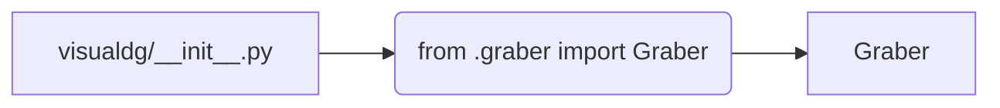

# <input code>

```python
## \file hypotez/src/suppliers/visualdg/__init__.py
# -*- coding: utf-8 -*-

#! venv/bin/python/python3.12

"""
.. module: src.suppliers.visualdg 
	:platform: Windows, Unix
	:synopsis:

"""


from .graber import Graber
```

# <algorithm>

В данном файле происходит импорт модуля `Graber` из подпапки `graber`.  Алгоритм работы сводится к одной строке - импорту.  Нет вызова функций или инициализации каких-либо объектов.  Данные не передаются или обрабатываются.  Это просто "пустой" файл инициализации, который связывает имя пакета `visualdg` с модулем `graber`.  

**Пример:**

Код просто подключает модуль `graber` к пакетам в этой области. Никаких действий с данными не выполняется.


# <mermaid>



**Описание диаграммы:**

* **A[visualdg/__init__.py]**: файл инициализации пакета `visualdg`.
* **B(from .graber import Graber)**:  строка импорта из модуля `graber`. Стрелка указывает на зависимость.
* **C[Graber]**: модуль или класс `Graber`, который импортируется. Стрелка указывает, что `visualdg/__init__.py` использует `graber`.


# <explanation>

**Импорты:**

`from .graber import Graber`:  Этот импорт подключает модуль `Graber`, находящийся в подпапке `graber` внутри текущего пакета `visualdg`.  Символ `.` указывает на то, что `graber` находится в той же директории, что и `visualdg/__init__.py`. Это позволяет другим частям кода, которые импортируют `visualdg`, использовать класс `Graber`. Это ключевой элемент, так как `Graber` предоставляет функциональность, доступную через этот импорт.  Этот импорт - единственная задача этого файла.

**Классы:**

В данном файле нет определений классов.  Импортируется лишь класс `Graber`, определение которого, скорее всего, находится в файле `hypotez/src/suppliers/visualdg/graber.py`.

**Функции:**

В файле нет функций.

**Переменные:**

``:  Это переменная, вероятно, задающая режим работы (например, `dev` для разработки, `prod` для производства). Она используется в других частях кода, и ее значение может влиять на поведение программы.

**Возможные ошибки или области для улучшений:**

* **Документация:** Документация в виде `""".. module: src.suppliers.visualdg ..."""` должна быть более полной.  Необходимо описать назначение `Graber`, его методы и атрибуты.
* **Стандарты кодирования:**  Использование `` и `#! venv/bin/python/python3.12` в начале файла, вероятно, устарело.  Использование магических чисел для версии Python  нежелательно.
* **Необязательные строки:** `` и `#! venv/bin/python/python3.12`  обычно не используются в современных Python-скриптах и могут быть удалены.
* **Взаимосвязь с другими частями проекта:**  Файл `visualdg/__init__.py` играет роль связующего звена.  Функциональность `Graber` (а, возможно, и других классов/модулей в `visualdg`) используется другими частями проекта. Понимания этих взаимосвязей можно достичь, исследовав файлы, которые импортируют этот модуль.


**Цепочка взаимосвязей:**

`hypotez/src/suppliers/visualdg/__init__.py` импортирует `hypotez/src/suppliers/visualdg/graber.py`.  Код, использующий пакет `visualdg`, будет использовать класс `Graber` для взаимодействия с внешними источниками данных или выполнения задач.  Для понимания полной цепочки взаимосвязей необходимо проанализировать файлы, которые импортируют `visualdg`, и в частности `Graber`.