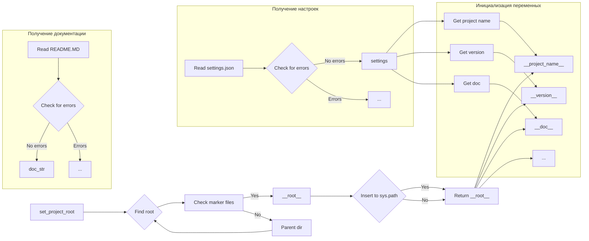

```MD
# <input code>

```python
## \file hypotez/src/suppliers/visualdg/header.py
# -*- coding: utf-8 -*-\n
#! venv/bin/python/python3.12

"""
.. module: src.suppliers.visualdg 
	:platform: Windows, Unix
	:synopsis:

"""


import sys
import json
from packaging.version import Version

from pathlib import Path
def set_project_root(marker_files=('__root__','.git')) -> Path:
    """
    Finds the root directory of the project starting from the current file's directory,
    searching upwards and stopping at the first directory containing any of the marker files.

    Args:
        marker_files (tuple): Filenames or directory names to identify the project root.
    
    Returns:
        Path: Path to the root directory if found, otherwise the directory where the script is located.
    """
    __root__:Path
    current_path:Path = Path(__file__).resolve().parent
    __root__ = current_path
    for parent in [current_path] + list(current_path.parents):
        if any((parent / marker).exists() for marker in marker_files):
            __root__ = parent
            break
    if __root__ not in sys.path:
        sys.path.insert(0, str(__root__))
    return __root__


# Get the root directory of the project
__root__ = set_project_root()
"""__root__ (Path): Path to the root directory of the project"""

from src import gs

settings:dict = None
try:
    with open(gs.path.root / 'src' /  'settings.json', 'r') as settings_file:
        settings = json.load(settings_file)
except (FileNotFoundError, json.JSONDecodeError):
    ...

doc_str:str = None
try:
    with open(gs.path.root / 'src' /  'README.MD', 'r') as settings_file:
        doc_str = settings_file.read()
except (FileNotFoundError, json.JSONDecodeError):
    ...


__project_name__ = settings.get("project_name", 'hypotez') if settings  else 'hypotez'
__version__: str = settings.get("version", '')  if settings  else ''
__doc__: str = doc_str if doc_str else ''
__details__: str = ''
__author__: str = settings.get("author", '')  if settings else ''
__copyright__: str = settings.get("copyrihgnt", '')  if settings else ''
__cofee__: str = settings.get("cofee", "Treat the developer to a cup of coffee for boosting enthusiasm in development: https://boosty.to/hypo69")  if settings else "Treat the developer to a cup of coffee for boosting enthusiasm in development: https://boosty.to/hypo69"
```

# <algorithm>

**Алгоритм работы:**

1. **`set_project_root(marker_files)`:**
   - Получает список `marker_files` (по умолчанию: `pyproject.toml`, `requirements.txt`, `.git`).
   - Начинает поиск корневой директории проекта от текущей директории файла.
   - Проверяет существование `marker_files` в родительских директориях.
   - Если найдена директория содержащая `marker_files`, то устанавливает её в качестве `__root__`.
   - Если `__root__` не в `sys.path`, то добавляет её в начало.
   - Возвращает `__root__`.
   **Пример:** Если файл находится в `hypotez/src/suppliers/visualdg`, то поиск начнется в `hypotez/src/suppliers`, потом в `hypotez/src`, `hypotez`, пока не найдет директорию содержащую один из указанных файлов.

2. **Получение настроек (`settings`):**
   - Получает путь к `settings.json` относительно `__root__`.
   - Использует `try...except` для обработки ошибок `FileNotFoundError` и `json.JSONDecodeError` при чтении файла.
   - Если файл найден и загружен корректно, то переменная `settings` заполняется данными из файла.
   **Пример:** Если `settings.json` содержит `{"project_name": "MyProject"}`, то `settings` будет содержать этот словарь.

3. **Получение документации (`doc_str`):**
   - Получает путь к `README.MD` относительно `__root__`.
   - Использует `try...except` для обработки ошибок `FileNotFoundError` и `json.JSONDecodeError` при чтении файла.
   - Если файл найден, то переменная `doc_str` заполняется содержимым файла.

4. **Инициализация переменных:**
   - Использует `settings.get()` для безопасного извлечения значений из `settings`.
   - Устанавливает значения `__project_name__`, `__version__`, `__doc__`, `__details__`, `__author__`, `__copyright__`, `__cofee__`.
   **Пример:** Если `settings.get("project_name")` возвращает `MyProject`, то `__project_name__` будет равно `MyProject`.


# <mermaid>



**Описание зависимостей:**

- `pathlib`: Для работы с путями к файлам.
- `json`: Для работы с файлами JSON.
- `packaging.version`: Для работы с версиями пакетов (в данном случае не используется).
- `sys`: Для работы с `sys.path`.
- `src.gs`: Предполагаемый модуль, содержащий вспомогательные функции для работы с путями. Необходимо проанализировать его код, чтобы понять его функциональность и зависимости.

# <explanation>

**Импорты:**

- `sys`: Предоставляет доступ к системным переменным, в частности к пути поиска модулей (`sys.path`).
- `json`: Предоставляет функции для работы с форматом JSON.
- `packaging.version`: Для работы с версиями (не используется напрямую в данном случае, но импортируется).
- `pathlib`: Для удобной работы с файловыми путями и операциями с ними.
- `src.gs`: Модуль, который, вероятно, содержит вспомогательные функции для работы с путями (например, для получения пути к корню проекта).  Этот импорт очень важен, так как показывает связь данного модуля с другими частями проекта.  Необходимо проанализировать код `gs` для понимания его функциональности.

**Классы:**

Нет классов в данном коде.

**Функции:**

- `set_project_root(marker_files)`: Находит корневую директорию проекта, начиная с текущей директории и итерацией вверх по дереву. Активирует механизм поиска по `marker_files`.  Возвращает путь к корневой директории.  Важный механизм для организации проекта и доступа к другим файлам.

**Переменные:**

- `MODE`, `__root__`, `settings`, `doc_str`: Объявляются с типом, который подсказывает их назначение. `settings` и `doc_str` представляют собой данные, загруженные из файлов, а `__root__` - найденная корневая директория.  Переменные `__project_name__`, `__version__`, `__doc__`, и т.д. -  вспомогательные переменные, содержащие информацию о проекте.  Они получены с помощью `.get()`, что позволяет избежать ошибок при отсутствии ключа в `settings`.

**Возможные ошибки и улучшения:**

- **Обработка ошибок:**  Использование `try...except` для обработки `FileNotFoundError` и `json.JSONDecodeError` — важный шаг. Однако, возможно, стоит добавить более конкретные обработки ошибок или логгирования для лучшего анализа проблем.
- **Документация `src.gs`:** Необходимо тщательно изучить код `gs` (и другие импортированные модули).  Недостаточное понимание зависимостей может привести к ошибкам.
- **Константные значения:** Постоянные строки (`'dev'`,  "Treat the developer..."),  которые не являются константами, лучше хранить в конфигурационном файле.
- **Проверка корректности `settings.json`:**  Добавление проверки корректности данных в `settings.json` (например, наличие обязательных полей).

**Цепочка взаимосвязей:**

Код в файле `header.py` играет важную роль, устанавливая корневой путь проекта и подключая необходимые модули.  Это является начальным этапом для остальных модулей, которые используют эти пути и данные для работы (например, `gs`). Далее, в `gs` может быть реализован доступ к базам данных, конфигурационным файлам или другим ресурсам.  Понимание этой цепочки взаимосвязей важно для правильной работы всего проекта.