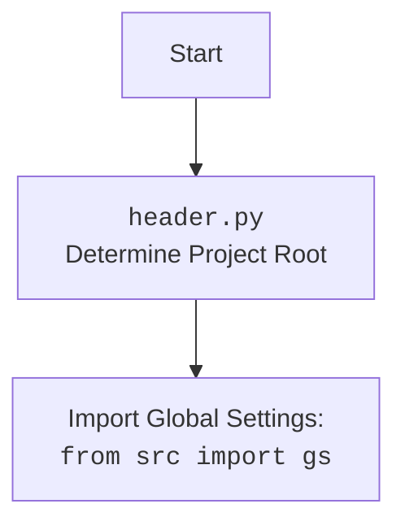

## АНАЛИЗ КОДА `hypotez/src/suppliers/visualdg/header.py`

### 1. **<алгоритм>**

**Функция `set_project_root`:**

1.  **Начало:** Получаем абсолютный путь к текущему файлу и его родительскому каталогу.
    *   Пример: Если файл расположен в `/home/user/projects/hypotez/src/suppliers/visualdg/header.py`, то начальный `current_path` будет `/home/user/projects/hypotez/src/suppliers/visualdg`.
2.  **Инициализация:** Присваиваем `__root__` начальное значение `current_path`.
    *   Пример: `__root__` = `/home/user/projects/hypotez/src/suppliers/visualdg`.
3.  **Поиск корня проекта:**
    *   Итерируемся по родительским каталогам, начиная с текущего.
        *   Пример: Проходим `/home/user/projects/hypotez/src/suppliers/visualdg`, `/home/user/projects/hypotez/src/suppliers`, `/home/user/projects/hypotez/src`, `/home/user/projects/hypotez`, `/home/user/projects`, `/home/user`, `/home`.
    *   Для каждого каталога проверяем, существует ли в нем хотя бы один из маркерных файлов (например, `__root__`, `.git`).
        *   Пример: Проверяем наличие `__root__` или `.git` в каждом из вышеперечисленных каталогов.
    *   Если маркерный файл найден, обновляем `__root__` до текущего каталога и прекращаем поиск.
        *   Пример: Если файл `.git` найден в `/home/user/projects/hypotez`, то `__root__` = `/home/user/projects/hypotez`, и цикл останавливается.
4.  **Добавление в `sys.path`:** Если найденный корень проекта еще не находится в списке путей поиска модулей `sys.path`, то добавляем его в начало.
    *   Пример: Если `/home/user/projects/hypotez` нет в `sys.path`, то мы добавляем его в начало.
5.  **Возврат:** Возвращаем путь к корню проекта `__root__`.
    *   Пример: Возвращаем `/home/user/projects/hypotez`.

**Основной код:**

1.  **Вызов `set_project_root`:** Вызываем функцию `set_project_root`, чтобы определить корень проекта и присваиваем результат переменной `__root__`.
2.  **Импорт `gs`:** Выполняем импорт глобальных настроек из `src.gs`.
3.  **Чтение `settings.json`:** Пытаемся загрузить настройки из файла `settings.json` в переменную `settings`, обрабатываем исключения `FileNotFoundError` и `json.JSONDecodeError`.
4.  **Чтение `README.MD`:** Пытаемся загрузить содержимое файла `README.MD` в переменную `doc_str`, обрабатываем исключения `FileNotFoundError` и `json.JSONDecodeError`.
5.  **Инициализация глобальных переменных:** Извлекаем значения из `settings`, используя значения по умолчанию, если файл `settings.json` не найден или какое-либо из полей отсутствует.
6.  **Присвоение значений:** Присваиваем переменным `__project_name__`, `__version__`, `__doc__`, `__details__`, `__author__`, `__copyright__` и `__cofee__` соответствующие значения.

### 2. **<mermaid>**

```mermaid
flowchart TD
    Start(Начало) --> FindRoot[<code>set_project_root()</code><br>Определение корня проекта];
    FindRoot --> InitRoot[Инициализация:<br> <code>__root__</code> = текущий каталог];
    InitRoot --> LoopParents[Цикл по родительским каталогам];
    LoopParents -- Найти маркер? --> CheckMarker{Существует маркерный файл?};
    CheckMarker -- Да --> SetRoot[<code>__root__</code> = родительский каталог];
    SetRoot --> BreakLoop[Выход из цикла];
    CheckMarker -- Нет --> LoopParents;
    BreakLoop --> AddPath[Добавить <code>__root__</code> в <code>sys.path</code> (если необходимо)];
    AddPath --> ReturnRoot[Возврат <code>__root__</code>];    
    ReturnRoot --> AssignRoot[<code>__root__ = set_project_root()</code>];
    AssignRoot --> ImportGS[Импорт: <br> <code>from src import gs</code>];
    ImportGS --> LoadSettings[Загрузка:<br><code>settings.json</code>];
    LoadSettings -- Успех --> LoadReadme[Загрузка:<br><code>README.MD</code>];
    LoadSettings -- Ошибка --> LoadReadme;
    LoadReadme -- Успех --> InitGlobalVars[Инициализация глобальных переменных];
    LoadReadme -- Ошибка --> InitGlobalVars;    
    InitGlobalVars --> End(Конец);
```



**Анализ зависимостей:**

*   `sys`: Модуль для работы с системными переменными, используется для добавления пути проекта в `sys.path`.
*   `json`: Модуль для работы с JSON, используется для чтения файла `settings.json`.
*    `packaging.version`: Модуль для работы с версиями, не используется в коде, однако присутствует в импорте.
*   `pathlib`: Модуль для работы с путями, используется для представления путей к файлам и каталогам.
*   `src.gs`:  Используется для получения доступа к глобальным переменным, определенным в `src/gs.py`, в частности `gs.path.root`.

### 3. **<объяснение>**

**Импорты:**

*   `import sys`: Модуль `sys` используется для манипуляции с окружением Python, включая пути поиска модулей. В данном случае он используется для динамического добавления корня проекта в `sys.path`, чтобы можно было импортировать модули из `src`.
*   `import json`: Модуль `json` используется для работы с данными в формате JSON, в частности, для загрузки настроек из файла `settings.json`.
*   `from packaging.version import Version`: Модуль `packaging.version` предназначен для работы с версиями, но в данном коде не используется, что может быть удалено.
*   `from pathlib import Path`: Модуль `pathlib` предоставляет удобный объектно-ориентированный способ работы с путями к файлам и директориям.

**Функция `set_project_root`:**

*   **Аргументы**:
    *   `marker_files`:  Кортеж (tuple) строк, представляющих имена файлов или каталогов, которые используются для идентификации корня проекта (по умолчанию `('__root__', '.git')`).
*   **Возвращаемое значение**: `Path` - объект, представляющий путь к корню проекта.
*   **Назначение**: Функция динамически определяет корень проекта, просматривая родительские каталоги текущего файла до тех пор, пока не найдет каталог, содержащий хотя бы один из маркеров. Это позволяет скрипту быть запущенным из любого места внутри проекта.
*   **Примеры**:
    *   Если скрипт запущен из `/home/user/projects/hypotez/src/suppliers/visualdg/header.py`, и в каталоге `/home/user/projects/hypotez` есть `.git` или `__root__`, функция вернет `/home/user/projects/hypotez`.
    *   Если маркерные файлы не найдены, функция вернет `/home/user/projects/hypotez/src/suppliers/visualdg`.

**Переменные:**

*   `__root__`:  `Path` -  Путь к корню проекта, определяется функцией `set_project_root`.
*   `settings`:  `dict` - Словарь, содержащий настройки проекта, загруженные из `settings.json`. Может быть `None`, если файл не найден или не может быть разобран.
*   `doc_str`:  `str` - Строка, содержащая содержимое файла `README.MD`. Может быть `None`, если файл не найден или не может быть прочитан.
*   `__project_name__`: `str` - Имя проекта, загруженное из файла настроек или установлено значение `hypotez`.
*   `__version__`: `str` - Версия проекта, загруженная из файла настроек или пустая строка.
*   `__doc__`:  `str` - Содержимое файла `README.MD`, используется в качестве документации проекта.
*  `__details__`: `str` - Зарезервированная строка для деталей проекта, пустая по умолчанию.
*   `__author__`: `str` - Имя автора проекта, загруженное из файла настроек или пустая строка.
*   `__copyright__`: `str` - Информация об авторских правах, загруженная из файла настроек или пустая строка.
*   `__cofee__`: `str` - Сообщение о возможности угостить разработчика кофе, с ссылкой на boosty.

**Взаимосвязи с другими частями проекта:**

*   Зависимость от `src.gs`: Модуль `header.py` импортирует `src.gs`, чтобы получить доступ к глобальным настройкам, в частности `gs.path.root` используется для определения абсолютного пути к файлам `settings.json` и `README.MD`.
*   `settings.json`: Содержит настройки проекта, такие как имя, версия, автор и т.д.
*   `README.MD`: Содержит документацию проекта.

**Потенциальные ошибки и области для улучшения:**

*   **Обработка исключений:** В коде используются пустые блоки `except:` что затрудняет отладку. Следует логировать или обрабатывать исключения более корректно.
*   **Дублирование кода:** Код загрузки `settings.json` и `README.MD` почти идентичен, можно вынести это в отдельную функцию для улучшения читаемости и уменьшения дублирования.
*   **Неиспользуемый импорт:** Импорт `from packaging.version import Version` не используется в коде и может быть удален.
*  **`__details__`**: Переменная `__details__` инициализирована пустой строкой и не используется, можно уточнить ее назначение.
*  **Опечатка в `settings.get("copyrihgnt", '')`**: Возможно, опечатка в ключе `copyrihgnt`, следует исправить на `copyright`.