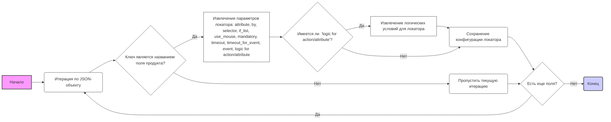
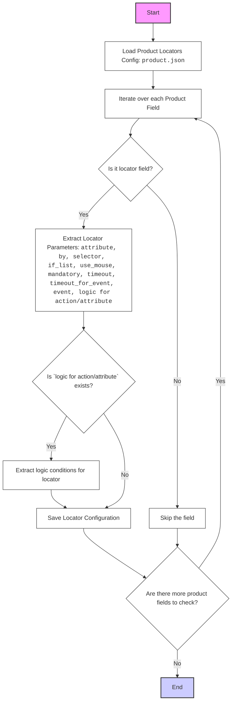

## ИНСТРУКЦИЯ:

Анализируй предоставленный код подробно и объясни его функциональность. Ответ должен включать три раздела:

1.  **<алгоритм>**: Опиши рабочий процесс в виде пошаговой блок-схемы, включая примеры для каждого логического блока, и проиллюстрируй поток данных между функциями, классами или методами.
2.  **<mermaid>**: Напиши код для диаграммы в формате `mermaid`, проанализируй и объясни все зависимости,
    которые импортируются при создании диаграммы.
    **ВАЖНО!** Убедитесь, что все имена переменных, используемые в диаграмме `mermaid`,
    имеют осмысленные и описательные имена. Имена переменных вроде `A`, `B`, `C`, и т.д., не допускаются!

    **Дополнительно**: Если в коде есть импорт `import header`, добавьте блок `mermaid` flowchart, объясняющий `header.py`:
    ```mermaid
    flowchart TD
        Start --> Header[<code>header.py</code><br> Determine Project Root]

        Header --> import[Import Global Settings: <br><code>from src import gs</code>]
    ```

3.  **<объяснение>**: Предоставьте подробные объяснения:
    -   **Импорты**: Их назначение и взаимосвязь с другими пакетами `src.`.
    -   **Классы**: Их роль, атрибуты, методы и взаимодействие с другими компонентами проекта.
    -   **Функции**: Их аргументы, возвращаемые значения, назначение и примеры.
    -   **Переменные**: Их типы и использование.
    -   Выделите потенциальные ошибки или области для улучшения.

Дополнительно, постройте цепочку взаимосвязей с другими частями проекта (если применимо).

Это обеспечивает всесторонний и структурированный анализ кода.
## Формат ответа: `.md` (markdown)
**КОНЕЦ ИНСТРУКЦИИ**

### <алгоритм>

Этот JSON-файл представляет собой конфигурацию для локаторов элементов веб-страницы, относящихся к продукту. Он определяет, как идентифицировать различные поля и элементы на странице продукта для последующего извлечения данных или взаимодействия с ними.

**Блок-схема:**



**Примеры:**

1.  **`id`**:

    *   `attribute`: `null` (атрибут не используется для поиска).
    *   `by`: `null` (метод поиска не указан).
    *   `selector`: `null` (селектор не указан).
    *   `if_list`: "first" (брать первый элемент, если их несколько).
    *   `use_mouse`: `false` (мышь не используется для взаимодействия).
    *   `mandatory`: `true` (элемент обязателен для поиска).
    *   `timeout`: `0` (таймаут не установлен).
    *   `timeout_for_event`: `"presence_of_element_located"` (ожидать появления элемента).
    *   `event`: `null` (событие не выполняется после нахождения элемента).

2.  **`price`**:
    *   `attribute`: `null`
    *    `by`: `null`
    *    `selector`: `null`
    *    `if_list`: `"first"`
    *    `use_mouse`: `false`
    *    `mandatory`: `true`
    *    `timeout`: `0`
    *   `timeout_for_event`: `"presence_of_element_located"`
    *   `event`: `null`

3.  **`affiliate_short_link`**:

    *   `logic for attribue`: `[null, null]` (логика атрибутов не используется)
    *   `attribute`: `[null, "value"]` (либо атрибут не нужен, либо значение извлекается)
    *   `by`: `["XPATH", "XPATH"]` (поиск по XPATH)
    *   `selector`: `["//li[contains(@id,'amzn-ss-text-link')]", "//textarea[contains(@id,'amzn-ss-text-shortlink-textarea')]"]` (селекторы для разных этапов извлечения)
    *   `if_list`: `"first"`
    *   `use_mouse`: `[false, false]`
    *    `timeout`: `0`
    *   `timeout_for_event`: `"presence_of_element_located"`
    *   `event`: `["wait(click(),2,after)", null]` (сначала кликнуть, потом подождать 2с)
    *   `logic for action`: `[null, null]` (логика действия не используется)

4.  **`Screenshot`**:
     *   `attribute`: `null`
    *   `by`: `"XPATH"`
    *   `selector`: `"//img[@id='landingImage']|//img[@class='a-dynamic-image']"`
    *   `if_list`: `"first"`
    *   `use_mouse`: `false`
    *   `mandatory`: `true`
    *    `timeout`: `0`
    *   `timeout_for_event`: `"presence_of_element_located"`
    *  `event`: `"screenshot()"`
    *  `logic for action`: `null`

**Поток данных:**

1.  JSON-файл загружается как объект.
2.  Программа итерируется по ключам (названиям полей продукта).
3.  Для каждого ключа извлекаются параметры локатора.
4.  Параметры локатора используются для поиска элемента на веб-странице.
5.  Если элемент найден, с ним выполняется действие (например, извлечение текста, клик).
6.  Данные, полученные от найденного элемента, сохраняются.

### <mermaid>



**Анализ зависимостей:**

*   **`product.json`**: Этот файл является основным источником данных для диаграммы. Он содержит конфигурацию локаторов элементов веб-страницы. Диаграмма показывает, как эта конфигурация загружается и анализируется.

### <объяснение>

**Импорты:**

В данном коде нет явных импортов Python. Это JSON файл конфигурации. Он используется другими частями программы.

**Классы:**

Классы в коде отсутствуют. Код представляет собой структуру данных в формате JSON, используемую для определения локаторов веб-элементов.

**Функции:**

Функций в коде нет.

**Переменные:**

*   JSON-объект содержит пары ключ-значение, где:
    *   Ключи (например, `id`, `price`, `name`) представляют собой названия полей продукта.
    *   Значения представляют собой параметры локатора для соответствующего поля.
    *   Значения бывают различных типов:
        *   `null`: означает, что значение отсутствует.
        *   `string`: селекторы, атрибуты, значения, действия.
        *   `integer`: таймауты.
        *    `boolean`: флаги (использовать мышь, элемент обязательный и тд)
        *   `array`: логические действия и атрибуты

**Подробное объяснение параметров локатора:**

*   `attribute`: Атрибут HTML-элемента, значение которого нужно получить (например, "innerText", "value", "innerHTML"). Если `null`, то либо нужно значение самого элемента, либо атрибут не требуется.
*   `by`: Метод поиска элемента на странице (например, "XPATH", "CSS_SELECTOR", "ID", "VALUE"). Если `null`, то либо это значение не требуется, либо это подразумевается по-умолчанию.
*   `selector`: Строка селектора, которая используется для поиска элемента. Может быть `null` если поиск элемента не требуется, например `id_supplier`  поиск ведется по значению, а не по локатору.
*   `if_list`: Указывает, как обрабатывать список элементов, если их несколько. `"first"` - брать первый элемент из списка, `"all"` - обрабатывать все элементы списка
*   `use_mouse`:  Булево значение, указывающее, нужно ли использовать мышь для взаимодействия с элементом (например, клик).
*    `mandatory`: Булево значение, указывающее, является ли элемент обязательным для поиска.
*   `timeout`: Время ожидания (в секундах) перед выполнением операции. `0` - ожидания нет
*   `timeout_for_event`: Событие, при котором заканчивается ожидание, например `"presence_of_element_located"` (ожидать появления элемента на странице).
*   `event`: Событие, которое должно произойти после нахождения элемента, например `screenshot()` - сделать скриншот или `wait(click(),2,after)` - подождать 2 секунды после клика
*    `logic for action`: Логика для действия с элементами (например, AND, OR, XOR).
*   `logic for attribue`: Логика для извлечения атрибутов элементов.
*   `locator_description`: Строка с описанием локатора, нужна для отладки и понимания (например `specification`  "Технические характеристики. ").

**Примеры использования:**

1.  Для извлечения названия продукта (`name`):
    *   Ищется элемент на странице.
    *   Извлекается `innerText` атрибут.
2.  Для получения цены (`Price tax excluded`):
    *   Ищется элемент на странице по `XPATH`.
    *   Извлекается `innerText` атрибут.
3. Для извлечения ссылки на миниатюру партнерской ссылки(`affiliate_short_link`):
    *   Ищется элемент на странице по `XPATH` по первому селектору
    *    Выполняется действие `wait(click(),2,after)`
    *   Ищется элемент на странице по `XPATH` по второму селектору
    *  Извлекается значение `value`

**Потенциальные ошибки и области для улучшения:**

*   **Отсутствие обработки ошибок:**  В коде не предусмотрена обработка ошибок (например, если элемент не найден).
*   **Жестко закодированные селекторы:** Селекторы, основанные на конкретной структуре HTML, могут стать неработоспособными при изменении сайта.
*   **Отсутствие комментариев:** Код не содержит комментариев, что затрудняет его понимание.

**Связи с другими частями проекта:**

Этот JSON-файл используется другими частями проекта, которые занимаются парсингом веб-страниц. Эти части используют данные из этого JSON, чтобы находить элементы и извлекать необходимые данные, таким образом этот файл является важной частью проекта.

**Заключение:**

Этот JSON-файл играет важную роль в системе, предоставляя гибкий и настраиваемый способ определения локаторов веб-элементов.