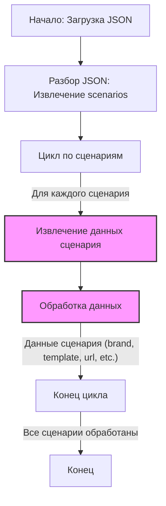

## Анализ кода `visualdg_categories_desktops_lenovo_workstation_p.json`

### 1. <алгоритм>

Этот JSON-файл содержит сценарии для различных моделей настольных компьютеров Lenovo Workstation P. Каждый сценарий представляет собой конфигурацию с конкретным процессором (I3, I5, I7, I9, AMD) и содержит метаданные, необходимые для обработки в системе VisualDG.

**Пошаговая блок-схема:**

1.  **Начало**: Загрузка JSON-файла.
    *   _Пример_: Файл `visualdg_categories_desktops_lenovo_workstation_p.json` читается.
2.  **Разбор структуры**: Файл интерпретируется как JSON-объект. Он содержит ключ `"scenarios"`, значением которого является другой JSON-объект, представляющий собой набор сценариев.
    *   _Пример_: `json_data["scenarios"]` извлекает словарь сценариев.
3.  **Итерация по сценариям**: Проход по ключам (названиям моделей) объекта `scenarios`.
    *   _Пример_: `for scenario_name, scenario_data in json_data["scenarios"].items():`.
4.  **Обработка сценария**: Для каждого сценария извлекаются его параметры.
    *   _Пример_: Извлечение `scenario_data["brand"]`, `scenario_data["template"]`, `scenario_data["url"]`, `scenario_data["checkbox"]`, `scenario_data["active"]`,`scenario_data["condition"]` и `scenario_data["presta_categories"]`.
5.  **Использование параметров**: Параметры могут быть использованы для разных целей, например:
    *   `brand` (строка): Название бренда. _Пример: "LENOVO"_
    *   `template` (строка): Шаблон для продукта. _Пример: "WORKSTATION P"_
    *   `url` (строка): URL продукта или строка-разделитель. _Пример: "https://www.visualdg.co.il/172346-WorkStation-P-Series/253274"_
    *   `checkbox` (булево): Состояние чекбокса (обычно `false`). _Пример: `false`_
    *   `active` (булево): Активность сценария (обычно `true`). _Пример: `true`_
     *   `condition` (строка): Состояние продукта. _Пример: "new"_
    *   `presta_categories` (строка): Список категорий PrestaShop через запятую. _Пример: "91,89,231,235"_
6.  **Завершение**: Обработка всех сценариев завершается.

### 2. <mermaid>


**Объяснение:**

*   **Start:** Начало процесса обработки JSON-файла.
*   **ParseJSON:** Этап, на котором JSON-файл разбирается, и извлекается основной объект `scenarios`, содержащий все сценарии.
*   **LoopScenarios:**  Начинается цикл, который проходит по всем сценариям, определённым в объекте `scenarios`.
*   **ExtractScenarioData:** На этом этапе извлекаются данные каждого сценария, такие как `brand`, `template`, `url`, `checkbox`, `active`,`condition` и `presta_categories`.
*   **ProcessScenarioData:** Здесь происходит обработка извлечённых данных, в зависимости от дальнейшего использования.
*   **EndLoop:** Конец цикла обработки текущего сценария.
*   **End:** Конец обработки всех сценариев.

### 3. <объяснение>

**Общая структура:**

Файл `visualdg_categories_desktops_lenovo_workstation_p.json` является конфигурационным файлом в формате JSON, который определяет различные сценарии для настольных компьютеров Lenovo Workstation P. Каждый сценарий представляет собой конкретную модель с уникальными параметрами.

**Объекты JSON:**

-   `scenarios`: Это корневой объект, содержащий все сценарии в виде пар ключ-значение, где ключом является название модели (например, "DESKTOP LENOVO WORKSTATION P I3"), а значением - объект с параметрами сценария.

**Параметры каждого сценария:**

*   `brand` (строка): Указывает производителя, в данном случае "LENOVO".
*   `template` (строка):  Определяет шаблон продукта, в данном случае "WORKSTATION P".
*   `url` (строка):  Представляет собой URL-адрес продукта на веб-сайте (для некоторых позиций указан как строка разделитель)
*   `checkbox` (булево): Флаг для чекбокса, в данном случае всегда `false`, вероятно, для какой-то внутренней логики.
*    `active` (булево): Флаг активности сценария, в данном случае всегда `true`, что означает, что сценарий активен.
*   `condition` (строка): Состояние продукта, в данном случае всегда `"new"`.
*   `presta_categories` (строка): Представляет собой строку с идентификаторами категорий PrestaShop, разделенными запятыми.

**Использование:**

Этот файл используется как источник данных для системы VisualDG, вероятно, для каталогизации товаров, управления ценами, или интеграции с PrestaShop.
Система может:
* Итерироваться по сценариям.
* Извлекать метаданные (бренд, шаблон, URL) для формирования описания товаров.
* Использовать `presta_categories` для назначения товаров определенным категориям в PrestaShop.
* Учитывать флаг `active` для определения, какие сценарии следует обрабатывать.

**Потенциальные улучшения:**

*   **Консистентность URL**: Некоторые URL являются заглушками (строками разделителями). Стоит либо установить их реальными, либо использовать другой способ идентификации таких категорий.
*   **Описание**: Возможно добавление более подробного описания сценариев.
*   **Обработка ошибок**: Добавить проверку на корректность форматов `url`, `presta_categories`, для избежания ошибок при парсинге данных.
*  **Использование Enums**: Вместо строк `"new"` для условия, можно использовать ENUMS, для контроля за возможными значениями.

**Взаимосвязь с другими частями проекта:**

Этот файл, вероятно, используется в комбинации с другими JSON-файлами, которые определяют другие модели товаров. Логика обработки этих файлов может быть общей для разных поставщиков и категорий товаров. Данные из этого файла используются в системе VisualDG, которая отвечает за управление каталогом и интеграцию с PrestaShop.

**Пример использования:**

Предположим, что есть функция, которая принимает JSON-файл и импортирует данные в VisualDG:

```python
import json

def import_scenarios(filepath):
    with open(filepath, 'r') as f:
        data = json.load(f)

    for scenario_name, scenario_data in data["scenarios"].items():
        brand = scenario_data["brand"]
        template = scenario_data["template"]
        url = scenario_data["url"]
        checkbox = scenario_data["checkbox"]
        active = scenario_data["active"]
        condition = scenario_data["condition"]
        presta_categories = scenario_data["presta_categories"]

        print(f"Обрабатывается сценарий: {scenario_name}")
        print(f"  Бренд: {brand}")
        print(f"  Шаблон: {template}")
        print(f"  URL: {url}")
        print(f"  Чекбокс: {checkbox}")
        print(f"  Активен: {active}")
        print(f"  Состояние: {condition}")
        print(f"  Категории PrestaShop: {presta_categories}")
        # Далее код для сохранения/использования этих данных в VisualDG
```

Этот пример демонстрирует, как можно загрузить и обработать данные из данного JSON-файла.