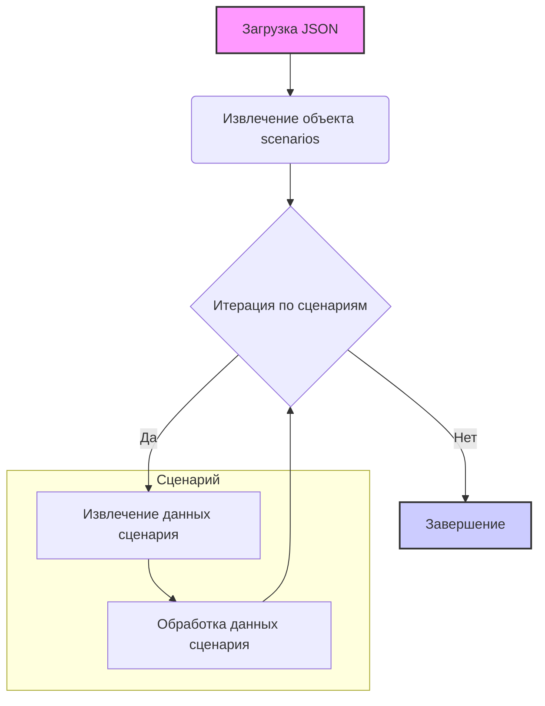

## <алгоритм>

Представленный код представляет собой JSON-объект, описывающий сценарии для различных моделей ноутбуков ASUS. Каждый сценарий характеризуется набором атрибутов, таких как бренд, URL, активность, состояние и категории PrestaShop. Алгоритм обработки данного JSON-файла можно представить в виде следующей пошаговой блок-схемы:

1.  **Начало**: Загрузка JSON-файла.
2.  **Чтение объекта `scenarios`**: Извлечение объекта `scenarios`, который содержит все сценарии.
    *   Пример: `scenarios = data["scenarios"]`
3.  **Итерация по сценариям**: Перебор ключей (названий сценариев) в объекте `scenarios`.
    *   Пример: `for scenario_name, scenario_data in scenarios.items():`
4.  **Извлечение данных сценария**: Для каждого сценария извлечение его атрибутов.
    *   Пример: `brand = scenario_data["brand"]`
    *   Пример: `url = scenario_data["url"]`
    *   Пример: `checkbox = scenario_data["checkbox"]`
    *   Пример: `active = scenario_data["active"]`
    *   Пример: `condition = scenario_data["condition"]`
    *   Пример: `presta_categories = scenario_data["presta_categories"]`
5.  **Обработка данных сценария**: Данные каждого сценария могут быть использованы для разных целей:
    *   Пример: Вывод данных в консоль.
    *   Пример: Сохранение данных в базу данных.
    *   Пример: Использование данных для настройки процесса обработки продуктов.
6.  **Конец итерации**: Повтор шагов 3-5 для каждого сценария.
7.  **Завершение**: Конец обработки JSON-файла.

## <mermaid>



**Описание:**

*   `A[Загрузка JSON]`: Начальный шаг, представляющий загрузку JSON-данных из файла.
*   `B(Извлечение объекта scenarios)`:  Из JSON-данных извлекается объект, содержащий все сценарии (ноутбуки).
*   `C{Итерация по сценариям}`: Цикл, который проходит по всем сценариям в объекте `scenarios`.
    *   Стрелка `Да` указывает на выполнение цикла для каждого сценария.
    *   Стрелка `Нет`  указывает на завершение цикла после обработки всех сценариев.
*   `D[Извлечение данных сценария]`: Извлекаются данные конкретного сценария (например, бренд, URL, и т.д.).
*   `E[Обработка данных сценария]`:  Данные текущего сценария обрабатываются.
*   `F[Завершение]`: Конечная точка, указывающая на завершение обработки JSON-файла.

**Зависимости:**

*   Диаграмма не зависит от импортированных модулей Python, так как она описывает структуру JSON-файла и логику его обработки, а не Python-код. JSON - это формат хранения данных.
*   Диаграмма не зависит от других частей проекта, поскольку представляет собой описание внутренней структуры данных.

## <объяснение>

**Импорты:**

*   В представленном коде нет импортов, так как это JSON-файл, а не Python-код. JSON - это формат хранения данных.

**Классы:**

*   В данном JSON-файле нет классов. Это файл конфигурации, а не объектно-ориентированный код.

**Функции:**

*   В данном JSON-файле нет функций. Он используется для хранения данных, а не для описания логики.

**Переменные:**

*   `scenarios`: Объект JSON, содержащий все сценарии. Представляет собой словарь (ключ - название сценария, значение - словарь с данными сценария).
*   Каждый сценарий (например, `"ASUS 11.6 I3"`) представляет собой ключ в словаре `scenarios`.
*   Каждый сценарий содержит следующие переменные:
    *   `brand`: Бренд ноутбука (строка, например, `"ASUS"`).
    *   `url`: URL-адрес, связанный с ноутбуком (строка).
    *   `checkbox`:  Флаг (логическое значение `true` или `false`).
    *   `active`: Флаг, указывающий на активность сценария (логическое значение `true` или `false`).
    *   `condition`: Состояние ноутбука (строка, например, `"new"`).
    *   `presta_categories`: Строка, содержащая список ID категорий PrestaShop, к которым относится товар,  разделенных запятыми.

**Объяснение:**

Этот JSON-файл предназначен для хранения конфигурации различных сценариев для ноутбуков ASUS. Каждый сценарий описывает конкретную модель ноутбука и содержит информацию о его бренде, URL, активности, состоянии и соответствующих категориях PrestaShop.

**Пример сценария:**

```json
"ASUS 11.6 I3": {
      "brand": "ASUS",
      "url": "--------------------------------ASUS 11.6 I3 ----------------------------",
      "checkbox": false,
      "active": true,
      "condition":"new","presta_categories": "2,3,4,989,309,358,48"
    }
```

Этот сценарий описывает ноутбук ASUS 11.6 с процессором I3. Он помечен как неактивный (`"checkbox": false`), активный для обработки (`"active": true`), имеет новое состояние (`"condition":"new"`) и связан со следующими категориями PrestaShop: 2, 3, 4, 989, 309, 358 и 48.

**Потенциальные ошибки и улучшения:**

*   **Непоследовательные URL**: Некоторые URL-адреса (например,  `"--------------------------------ASUS 11.6 I3 ----------------------------"`) не являются валидными. Это может привести к проблемам при использовании данных. Желательно чтобы все поля `url` содержали валидные ссылки.
*   **Тип данных `presta_categories`**: `presta_categories` хранится как строка, а не как массив чисел. Это может потребовать дополнительной обработки при использовании этих данных. Было бы лучше хранить это как `[2,3,4,989,309,358,48]`.
*   **Отсутствие описания**: Нет описаний для сценариев, которые могли бы помочь лучше понять их назначение.
*   **Возможность дублирования**:  Могут быть дубликаты данных, такие как одинаковые категории для разных моделей. Стоит проверить и нормализовать эти данные.

**Взаимосвязи с другими частями проекта:**

Этот JSON-файл вероятно используется в модуле `visualdg` для настройки процесса обработки данных о ноутбуках ASUS.  Данные из этого файла могут использоваться для:

*   Определение списка товаров для импорта.
*   Назначение товаров нужным категориям PrestaShop.
*   Фильтрация товаров по определенным критериям (например,  по состоянию).

Этот файл служит источником данных для других частей проекта, а не  активной частью кода, поэтому, с точки зрения кода, он не имеет зависимостей.