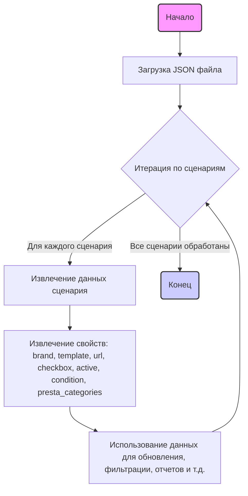

## ИНСТРУКЦИЯ:

Анализируй предоставленный код подробно и объясни его функциональность. Ответ должен включать три раздела:

1.  **<алгоритм>**: Опиши рабочий процесс в виде пошаговой блок-схемы, включая примеры для каждого логического блока, и проиллюстрируй поток данных между функциями, классами или методами.
2.  **<mermaid>**: Напиши код для диаграммы в формате `mermaid`, проанализируй и объясни все зависимости,
    которые импортируются при создании диаграммы.
    **ВАЖНО!** Убедитесь, что все имена переменных, используемые в диаграмме `mermaid`,
    имеют осмысленные и описательные имена. Имена переменных вроде `A`, `B`, `C`, и т.д., не допускаются!

    **Дополнительно**: Если в коде есть импорт `import header`, добавьте блок `mermaid` flowchart, объясняющий `header.py`:
    ```mermaid
    flowchart TD
        Start --> Header[<code>header.py</code><br> Determine Project Root]

        Header --> import[Import Global Settings: <br><code>from src import gs</code>]
    ```

3.  **<объяснение>**: Предоставьте подробные объяснения:
    -   **Импорты**: Их назначение и взаимосвязь с другими пакетами `src.`.
    -   **Классы**: Их роль, атрибуты, методы и взаимодействие с другими компонентами проекта.
    -   **Функции**: Их аргументы, возвращаемые значения, назначение и примеры.
    -   **Переменные**: Их типы и использование.
    -   Выделите потенциальные ошибки или области для улучшения.

Дополнительно, постройте цепочку взаимосвязей с другими частями проекта (если применимо).

Это обеспечивает всесторонний и структурированный анализ кода.
## Формат ответа: `.md` (markdown)
**КОНЕЦ ИНСТРУКЦИИ**

## <алгоритм>

Код представляет собой JSON-объект, который содержит информацию о различных сценариях для ноутбуков Lenovo ThinkBook. Каждый сценарий (ключ в объекте "scenarios") представляет собой конкретную модель ноутбука с различными характеристиками.

1.  **Начало**: JSON-объект загружается.
    
    ```json
    {
        "scenarios": {
            "LENOVO THINKBOOK 13.4 - 13.3 I3": { ... },
            "LENOVO THINKBOOK 13.4 - 13.3 I5": { ... },
            ...
        }
    }
    ```

2.  **Итерация по сценариям**: Проход по каждому ключу (названию модели) в объекте `scenarios`.
    
    *Пример: "LENOVO THINKBOOK 13.4 - 13.3 I3"*
    
3.  **Доступ к данным сценария**: Для каждого сценария извлекается его объект, содержащий информацию о ноутбуке.

    *Пример: Для сценария "LENOVO THINKBOOK 13.4 - 13.3 I3":*
    
     ```json
         {
              "brand": "LENOVO",
              "template": "THINKBOOK",
              "url": "-----------------THINKBOOK 13.4 - 13.3 I3-------------r ",
              "checkbox": false,
              "active": true,
              "condition":"new","presta_categories": "3,53,306,9,4,370"
          }
      ```
    

4.  **Извлечение свойств**: Каждое свойство объекта сценария, такое как `brand`, `template`, `url`, `checkbox`, `active`, `condition` и `presta_categories`, извлекается для дальнейшей обработки.

   *Пример:*
   * `brand` = "LENOVO"
   * `template` = "THINKBOOK"
   * `url` = "-----------------THINKBOOK 13.4 - 13.3 I3-------------r "
   * `checkbox` = false
   * `active` = true
   * `condition` = "new"
   * `presta_categories` = "3,53,306,9,4,370"

5.  **Использование данных**: Извлеченные данные могут использоваться для различных целей, например:
    -   Обновление информации о товарах на веб-сайте.
    -   Фильтрация и поиск товаров.
    -   Создание отчетов.
    -   Интеграция с другими системами.
    
    
6.  **Конец**: Процесс завершается после обработки всех сценариев.

## <mermaid>


**Объяснение зависимостей:**
Диаграмма `mermaid` показывает поток обработки данных в JSON файле. Зависимостей от внешних библиотек нет, так как код представляет собой структуру данных, а не исполняемый код.  `Start` и `End`  обозначают начало и конец процесса. `LoadJson` представляет собой начальный этап - загрузку данных JSON. `IterateScenarios` - это условный блок, который инициирует итерацию по каждому сценарию.  `ExtractScenarioData` извлекает данные из каждого сценария. `ExtractProperties` извлекает свойства для каждого сценария, а `UseData` символизирует процесс использования полученных данных.

## <объяснение>

**Импорты:**
В предоставленном коде нет импортов, так как это чистый JSON, а не исполняемый код Python.

**Классы:**
В данном коде отсутствуют классы, так как он представляет собой структуру данных в формате JSON.

**Функции:**
В предоставленном коде нет функций, так как это JSON-файл. Обработка данных JSON будет осуществляться функциями на языке программирования, например, Python или JavaScript.

**Переменные:**

*   `scenarios`:  JSON-объект, содержащий словарь, ключами которого являются названия моделей ноутбуков Lenovo ThinkBook (например, "LENOVO THINKBOOK 13.4 - 13.3 I3"), а значениями - словари с информацией об этих моделях.

Внутри каждого объекта сценария есть следующие переменные:

*   `brand` (string): Бренд ноутбука, всегда "LENOVO".
*   `template` (string): Шаблон, всегда "THINKBOOK".
*   `url` (string): URL-адрес страницы продукта или текстовая строка-заполнитель.
*   `checkbox` (boolean): Логическое значение, всегда `false`.
*   `active` (boolean): Логическое значение, всегда `true`.
*   `condition` (string): Состояние товара, всегда "new".
*   `presta_categories` (string): Строка с идентификаторами категорий PrestaShop через запятую.

**Объяснение:**

Этот JSON-файл представляет собой конфигурацию для обработки сценариев ноутбуков Lenovo ThinkBook. Он содержит структурированную информацию, которую можно использовать для автоматизации различных процессов, таких как:

1.  **Сбор данных о продуктах**:
    *   Информация о каждой модели (например, 13.4 - 13.3 I3) и их характеристиках, таких как `brand` и `template`.
    *   URL-адреса страниц продуктов, если они доступны (не все `url` содержат ссылки, некоторые представляют собой строку заполнитель).
    *   Список категорий `presta_categories`, к которым относится каждый ноутбук в PrestaShop.

2.  **Автоматизация обновления каталога**:
    *   Данные могут быть использованы для обновления информации о товарах на веб-сайте или в других системах.
    *   Можно автоматизировать назначение правильных категорий для продуктов.

3.  **Настройка параметров обработки**:
    *   Поля `checkbox` и `active` позволяют управлять активностью и участием сценариев в обработке. Хотя сейчас все `checkbox` выставлены в `false` и `active` в `true`, они могут быть настроены динамически в зависимости от внешних факторов.

4.  **Интеграция с PrestaShop**:
    *   `presta_categories` позволяют интегрироваться с системой управления контентом PrestaShop, что упрощает процесс управления каталогом.
**Потенциальные ошибки и области для улучшения:**

1.  **Строки-заполнители в `url`:** Не все значения `url` являются действительными URL-адресами. Некоторые из них являются строками-заполнителями (например, `-----------------THINKBOOK 13.4 - 13.3 I3-------------r `). Это может привести к ошибкам, если система будет ожидать корректный URL.

    *   **Улучшение**:
        -   Проверить, что все значения `url` корректны.
        -   Если не все `url` известны, можно использовать отдельное поле, чтобы отличать корректный `url` от заполнителя.
2.  **Жестко заданные значения**: Поля `checkbox` и `active` всегда установлены в `false` и `true` соответственно.

    *   **Улучшение**:
        -   Если в будущем потребуется гибкость в управлении этими полями, они могут быть изменены динамически.
3.  **Дублирование информации**: Все модели имеют одинаковые `brand` и `template`.
    *   **Улучшение**:
        -   Эти значения могут быть вынесены на уровень выше, чтобы избежать дублирования.

**Взаимосвязи с другими частями проекта**:
 Этот файл служит источником данных для системы обработки каталога товаров VisualDG. Он может быть использован модулем загрузки каталога для обновления информации в базе данных, синхронизации с PrestaShop и управления товарами.  Файл  `visualdg_categories_laptops_lenovo_thinkbook.json` может использоваться как входящий источник данных для функций, классов и модулей, которые отвечают за логику работы с данными по ноутбукам Lenovo ThinkBook.