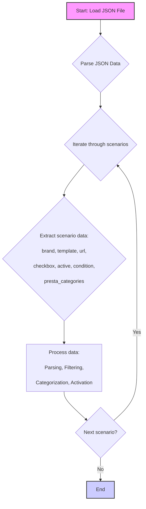

## Анализ JSON файла: `visualdg_categories_laptops_lenovo_v_essentials.json`

### 1. <алгоритм>

Этот JSON файл представляет собой набор сценариев для ноутбуков Lenovo серии V ESSENTIALS. Каждый сценарий описывает конкретную модель ноутбука с различными характеристиками (размер экрана, процессор) и содержит информацию, необходимую для его обработки в системе (вероятно, для парсинга и публикации товаров).

**Пошаговая блок-схема:**

1. **Начало:** Загрузка JSON файла.
   * _Пример:_ `{"scenarios": {...}}`
2. **Разбор структуры:** JSON файл содержит объект `scenarios`, который является словарем. Ключи словаря – это названия моделей ноутбуков (например, "LENOVO V ESSENTIALS 13.4 - 13.3 I3").
    * _Пример:_
       ```
       {
         "LENOVO V ESSENTIALS 13.4 - 13.3 I3": { ... },
         "LENOVO V ESSENTIALS 13.4 - 13.3 I5": { ... },
         ...
       }
       ```
3. **Итерация по сценариям:** Для каждого ключа (модели ноутбука) выполняется следующая обработка.
    * _Пример:_ Для ключа `"LENOVO V ESSENTIALS 13.4 - 13.3 I3"`:
4. **Извлечение данных:** Извлекаются значения атрибутов для текущей модели:
    * `brand` (строка, бренд) - _Пример_: `"LENOVO"`
    * `template` (строка, шаблон) - _Пример_: `"V ESSENTIALS"`
    * `url` (строка, URL товара) - _Пример_: `"https://www.visualdg.co.il/169443-%D7%A0%D7%99%D7%99%D7%93%D7%99-V-Essential-/253273/253294"`
    * `checkbox` (логическое значение) - _Пример_: `false`
    * `active` (логическое значение) - _Пример_: `true`
    * `condition` (строка) - _Пример_: `"new"`
    * `presta_categories` (строка, список идентификаторов категорий) - _Пример_: `"3,53,306,9,5,371"`
5. **Обработка данных:**  Данные могут использоваться для следующих целей:
    *  **Парсинг:** Извлечение информации с веб-страницы по `url`
    *  **Фильтрация:** Отбор товаров по бренду, шаблону, состоянию (`condition`)
    *  **Категоризация:** Назначение товара в категории интернет-магазина  `presta_categories`
    *  **Активация/деактивация:**  Управление видимостью товара (`active`)
6. **Конец итерации:** Переход к следующему сценарию, если есть.
7. **Конец:**  Все сценарии обработаны.

### 2. <mermaid>



**Объяснение `mermaid` диаграммы:**

*   **`A[Start: Load JSON File]`**: Начало процесса. Указывает на начальную операцию загрузки JSON файла.
*   **`B{Parse JSON Data}`**: Разбор JSON. Представляет собой действие разбора JSON файла в структуру данных, с которой можно работать программно.
*  **`C{Iterate through scenarios}`**: Итерация. Обозначает цикл, в котором происходит перебор каждого сценария, представленного в JSON файле.
*   **`D{Extract scenario data: ...}`**: Извлечение данных. Представляет собой блок, где извлекаются данные конкретного сценария, такие как: `brand`, `template`, `url`, `checkbox`, `active`, `condition` и `presta_categories`.
*  **`E[Process data: ... ]`**: Обработка данных. Описывает шаги по дальнейшей обработке извлеченных данных. К ним относится парсинг (извлечение информации из веб-страницы), фильтрация (отбор по заданным критериям), категоризация (определение категорий), а также активация или деактивация товара.
*   **`F{Next scenario?}`**: Условие. Является проверкой, есть ли еще не обработанные сценарии.
*   **`F -- Yes --> C`**: Если есть еще сценарии, происходит возврат к итерации `C`.
*   **`F -- No --> G[End]`**: Если нет больше сценариев, то процесс заканчивается.

### 3. <объяснение>

**Структура файла:**

Файл представляет собой JSON-объект со следующим форматом:
   - Главный ключ `"scenarios"`: Значение - это словарь, где ключи - названия моделей ноутбуков, а значения - объекты с информацией о модели.
   - Каждый объект модели содержит следующие ключи:
      - `"brand"`: Бренд ноутбука (строка), всегда "LENOVO".
      - `"template"`: Шаблон товара (строка), всегда "V ESSENTIALS".
      - `"url"`: URL страницы товара (строка). Может содержать URL или строку-заглушку ("-------------", "----------------...------------").
      - `"checkbox"`:  Флаг для чекбокса (логическое значение), всегда `false`.
      - `"active"`: Флаг активности (логическое значение), всегда `true`.
      - `"condition"`: Состояние товара (строка), всегда "new".
      - `"presta_categories"`: Строка, содержащая идентификаторы категорий, разделенные запятыми.

**Назначение переменных:**

*   `scenarios`: Объект верхнего уровня, содержит все сценарии.
*   `brand`: Бренд ноутбука, всегда "LENOVO".
*   `template`: Шаблон ноутбука, всегда "V ESSENTIALS".
*   `url`: URL страницы товара.
*   `checkbox`: Булево значение для чекбокса.
*   `active`:  Булево значение, определяющее активность сценария.
*   `condition`: Состояние товара, всегда "new".
*   `presta_categories`: Строка с идентификаторами категорий PrestaShop, разделенными запятыми.

**Использование данных:**

Этот файл используется для автоматизации обработки товаров Lenovo V ESSENTIALS в системе. Например:

1.  **Парсинг:** С помощью `url` можно получить дополнительную информацию о товаре с веб-страницы (если URL не является заглушкой).
2.  **Фильтрация:** По `brand` и `template` можно отфильтровать нужные товары.
3.  **Категоризация:** Значение `presta_categories` позволяет отнести товар к правильным категориям в интернет-магазине PrestaShop.
4.  **Управление:** Параметр `active` позволяет включить или отключить товары.

**Потенциальные ошибки и области для улучшения:**

*   **Заглушки URL**: Некоторые значения `url` являются заглушками ("-------------"), что может привести к ошибкам при парсинге. Необходимо обрабатывать такие ситуации и использовать `url` только если он корректный.
*   **Жёстко закодированные значения**: Значения `brand`, `template`, `condition`, `checkbox` и `active` всегда одинаковы.  Возможно, стоит пересмотреть структуру данных, если эти параметры когда-нибудь изменятся.  Можно вынести эти значения на верхний уровень, если они общие для всех сценариев.
*   **Строка категорий**: `presta_categories` - это строка, а не массив чисел.  Для удобства обработки ее лучше сразу преобразовывать в список целых чисел.
*   **Отсутствие проверок**: Нет валидации данных, нет проверок, есть ли все ключи, какие типы данных.  Нужны проверки перед использованием.

**Взаимосвязь с другими частями проекта:**

*   Этот файл является частью системы, отвечающей за интеграцию с поставщиком `visualdg` (судя по имени файла и `url`).
*   Данные используются для парсинга веб-страниц,  создания или обновления карточек товаров в интернет-магазине.
*   Значение  `presta_categories` указывает на связь с системой управления PrestaShop.

**В итоге:**
Этот файл описывает сценарии для обработки товаров `LENOVO V ESSENTIALS` в формате JSON. Он содержит информацию, необходимую для парсинга веб-страниц, категоризации, активации/деактивации и интеграции в систему интернет-магазина. Необходимо улучшить обработку `url` и `presta_categories` и добавить валидацию данных.