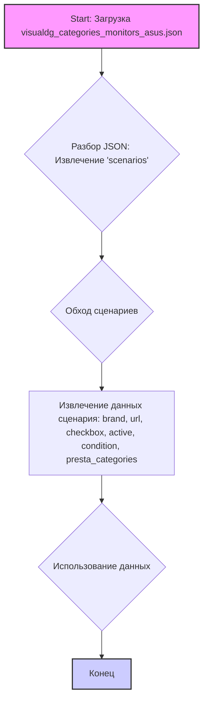

## АНАЛИЗ JSON ФАЙЛА

### <алгоритм>

1.  **Начало**: Загрузка JSON файла, который содержит структуру данных. Файл `visualdg_categories_monitors_asus.json`.
2.  **Разбор JSON**: Извлечение корневого элемента `scenarios`, который является объектом, содержащим вложенные объекты.
3.  **Обход сценариев**:
    *   Проход по ключам объекта `scenarios`, каждый ключ представляет собой название сценария (например, "ASUS 18").
    *   Для каждого сценария извлекается объект, который содержит поля:
        *   `brand` (строка): Бренд монитора (например, "ASUS").
        *   `url` (строка): URL-адрес продукта.
        *   `checkbox` (логическое значение): Статус чекбокса (в данном случае всегда `false`).
        *   `active` (логическое значение): Активен ли сценарий (в данном случае всегда `true`).
        *   `condition` (строка): Состояние продукта (в данном случае всегда "new").
        *   `presta_categories` (строка): Список категорий PrestaShop, разделенных запятыми (например, "127,241,535").
4.  **Использование данных**: Извлеченные данные могут быть использованы для:
    *   Формирования списка продуктов для веб-сайта.
    *   Фильтрации товаров по бренду, размеру или категориям.
    *   Настройки интеграции с PrestaShop.
5.  **Конец**: Завершение обхода всех сценариев.

**Пример для сценария "ASUS 22":**

1.  Ключ сценария: `"ASUS 22"`.
2.  Данные сценария:
    ```json
    {
        "brand": "ASUS",
        "url": "https://www.visualdg.co.il/169413-%D7%9E%D7%A1%D7%9B%D7%99-%D7%9E%D7%97%D7%A9%D7%91-ASUS/253020",
        "checkbox": false,
        "active": true,
        "condition": "new",
        "presta_categories": "127,128,535"
    }
    ```
3.  Извлеченные значения:
    *   `brand`: "ASUS"
    *   `url`: `"https://www.visualdg.co.il/169413-%D7%9E%D7%A1%D7%9B%D7%99-%D7%9E%D7%97%D7%A9%D7%91-ASUS/253020"`
    *   `checkbox`: `false`
    *   `active`: `true`
    *   `condition`: `"new"`
    *   `presta_categories`: `"127,128,535"`
    
### <mermaid>



**Объяснение диаграммы:**

1. **Start (A):** Начальная точка процесса, представляющая загрузку файла `visualdg_categories_monitors_asus.json`.
2.  **Разбор JSON: Извлечение 'scenarios' (B):**  Этап, на котором из загруженного JSON извлекается корневой объект `scenarios`, содержащий данные о каждом сценарии.
3. **Обход сценариев (C):**  Циклический проход по ключам объекта `scenarios`, где каждый ключ представляет собой название сценария.
4.  **Извлечение данных сценария (D):**  Для каждого сценария извлекаются данные: `brand`, `url`, `checkbox`, `active`, `condition`, и `presta_categories`.
5.  **Использование данных (E):** Извлеченные данные используются для различных целей, таких как формирование списка продуктов, фильтрация или настройка интеграции.
6.  **Конец (F):**  Конечная точка процесса, указывающая на завершение обхода и обработки всех сценариев.

### <объяснение>

**Общая структура:**

Файл `visualdg_categories_monitors_asus.json` представляет собой JSON-объект, содержащий данные для конфигурации сценариев, связанных с мониторами ASUS. Этот файл, вероятно, используется в рамках системы для автоматизации или управления продуктами на веб-сайте или в интернет-магазине.
Основной структурой является объект `scenarios`, который содержит вложенные объекты, представляющие отдельные сценарии для разных моделей мониторов ASUS. Каждый сценарий содержит набор свойств, описывающих продукт и его параметры.

**Подробное описание элементов:**

*   **`scenarios`**:
    *   **Тип**: Объект.
    *   **Назначение**: Содержит набор сценариев, каждый из которых описывает конкретную модель монитора ASUS. Ключи объекта - это названия сценариев (например, "ASUS 18", "ASUS 22" и т.д.).
    *   **Состав**: Состоит из объектов, описывающих каждый сценарий.
*   **Сценарий (например, "ASUS 18")**:
    *   **Тип**: Объект.
    *   **Назначение**: Описывает конкретный сценарий для монитора ASUS.
    *   **Состав**:
        *   `brand` (строка): Название бренда монитора (например, "ASUS").
        *   `url` (строка): URL-адрес страницы продукта на веб-сайте VisualDG.
        *   `checkbox` (логическое значение): Флаг для указания, выбран ли сценарий (всегда `false` в данном файле). Может использоваться для отметки определенных сценариев.
        *   `active` (логическое значение): Флаг для указания, активен ли сценарий (всегда `true` в данном файле).
        *   `condition` (строка): Состояние продукта (всегда "new" в данном файле).
        *   `presta_categories` (строка): Список идентификаторов категорий PrestaShop, к которым относится продукт, разделенных запятыми.

**Назначение полей:**

*   `brand`: Позволяет идентифицировать бренд продукта.
*   `url`: Позволяет получить ссылку на страницу продукта на сайте VisualDG.
*   `checkbox`: Может использоваться для управления выбором сценариев.
*   `active`: Показывает, активен ли данный сценарий.
*   `condition`: Показывает состояние продукта (например, "new").
*   `presta_categories`: Используется для интеграции с PrestaShop, указывает категории товаров, к которым должен быть отнесен данный продукт.

**Взаимосвязь с другими частями проекта:**

Этот JSON-файл, вероятно, используется как конфигурационный файл в системе, которая управляет данными продуктов, в частности, мониторов ASUS. Данные из файла могут быть использованы для:

1.  **Синхронизации данных:** Обновление каталога продуктов на веб-сайте или в PrestaShop.
2.  **Фильтрации продуктов:** Отображение продуктов на сайте с учетом бренда и размера.
3.  **Настройки интеграции:** Интеграция с системой PrestaShop для правильного назначения категорий.
4.  **Автоматизации:** Автоматизация добавления и обновления продуктов на веб-сайте или в интернет-магазине.

**Потенциальные ошибки и улучшения:**

*   **Повторяющиеся URL**: Некоторые сценарии, такие как `"ASUS 18"` и `"ASUS 19.5"`, имеют одинаковый URL. Это может быть ошибкой или намеренным дублированием. Требуется проверка и уточнение.
*   **Жестко закодированные значения**: Значения `checkbox: false` и `active: true`, `condition: "new"` всегда одинаковы. Возможно, стоит предусмотреть механизм для их изменения в будущем.
*   **Отсутствие валидации URL**: Нет проверки валидности URL. Необходимо добавить проверки.
*   **Обработка категорий**: Строка `presta_categories` может нуждаться в дополнительной обработке (разбор на список) для использования в коде.
*    **Отсутствие описания**: Нет описания для полей, что затрудняет понимание их назначения и использования.
*    **Статические значения**: Использование только `new` для `condition` может ограничить применение файла в будущем.

**Цепочка взаимосвязей с другими частями проекта:**

1.  **Загрузка файла**: Этот файл может загружаться модулем, отвечающим за загрузку данных конфигурации.
2.  **Разбор JSON**: Загруженные данные могут быть обработаны с использованием JSON-парсера, например, `json.load()`.
3.  **Использование данных**: Извлеченные данные используются в логике приложения для:
    *   Обновления базы данных товаров.
    *   Формирования каталога на веб-сайте.
    *   Интеграции с системой управления контентом (CMS).
4.  **Обновление PrestaShop:** Значение `presta_categories`  используется для правильной классификации продуктов в PrestaShop.

**Заключение:**
Файл `visualdg_categories_monitors_asus.json` представляет собой конфигурационный файл, содержащий структурированные данные о мониторах ASUS. Он служит для автоматизации и управления данными в рамках системы, связанной с продуктами. Требуется тщательная проверка данных, особенно дублирующихся URL и жестко закодированных значений.