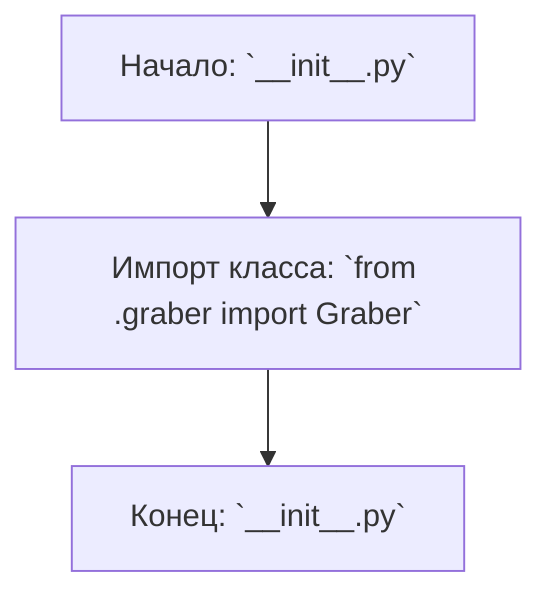

## АНАЛИЗ КОДА: `hypotez/src/suppliers/wallashop/__init__.py`

### 1. <алгоритм>

1.  **Начало**: Запускается скрипт `__init__.py` в пакете `src.suppliers.wallashop`.
2.  **Импорт**: Импортируется класс `Graber` из модуля `graber.py`, находящегося в том же пакете `src.suppliers.wallashop`.
3.  **Завершение**: Скрипт завершает работу. На данном этапе никакие действия, кроме импорта, не выполняются.
    *   **Пример**:
        *   Импорт `from .graber import Graber`: В результате этого импорта, класс `Graber` становится доступным для использования в других модулях, импортирующих пакет `src.suppliers.wallashop` или при обращении к нему из данного модуля.

### 2. <mermaid>

**Описание `mermaid` диаграммы:**

*   `Start`: Начало выполнения файла `__init__.py`.
*   `ImportGraber`: Импорт класса `Graber` из модуля `graber.py`.
*   `End`: Конец выполнения файла `__init__.py`.

### 3. <объяснение>

**Импорты:**

*   `from .graber import Graber`:
    *   `.`: Относительный импорт, указывающий, что модуль `graber` находится в том же каталоге, что и текущий файл `__init__.py`.
    *   `graber`: Имя модуля, откуда производится импорт (файл `graber.py`).
    *   `Graber`: Имя класса, импортируемого из `graber.py`.
    *   **Назначение:** Этот импорт делает класс `Graber` доступным для использования в файлах, импортирующих пакет `src.suppliers.wallashop`. В данном случае, это позволяет другим частям проекта, например, скриптам, использующим функциональность Wallashop, создавать экземпляры класса `Graber`.

**Классы:**

*   `Graber`:
    *   **Роль:** Исходя из названия и контекста, `Graber` вероятно является классом, ответственным за сбор данных (парсинг/скрепинг) с веб-сайта Wallashop.
    *   **Атрибуты и методы:** Атрибуты и методы `Graber` не определены в данном файле, так как они объявлены в `graber.py`. Тем не менее, исходя из имени класса можно предположить, что у него могут быть методы для отправки запросов, разбора HTML-кода, извлечения нужной информации и т.д.
    *   **Взаимодействие:**  `Graber` взаимодействует с внешним миром, получая информацию (например, веб-страницы) и преобразуя ее во внутреннее представление (например, структурированные данные).
**Функции:**
-   В данном файле нет функций.
**Переменные:**
- В данном файле нет переменных.

**Общее:**

*   Файл `__init__.py` в Python служит для того, чтобы обозначить каталог как пакет, то есть набор модулей. В данном случае, файл позволяет другим частям проекта импортировать класс `Graber` через простой импорт: `from src.suppliers.wallashop import Graber`.
*   **Потенциальные улучшения:**
    *   В текущем виде `__init__.py` содержит только импорт. Возможно, в будущем тут будет размещен код для инициализации пакета (например, установка глобальных параметров).
    *   В реальном проекте желательно добавить документацию, объясняющую назначение пакета `src.suppliers.wallashop` и класса `Graber`.
    *   В случае если у `Graber` есть какие-то зависимости, которые не указаны в этом файле, необходимо их добавить.

**Цепочка взаимосвязей:**

1.  Другие части проекта могут импортировать `Graber` для доступа к его функционалу, например, для парсинга данных из Wallashop.
2.  `Graber`, в свою очередь, может взаимодействовать с другими частями проекта:
    *   Может запрашивать общие настройки из `src.gs` (если это настроено в `graber.py`).
    *   Может обращаться к другим классам или модулям внутри `src.`.
3.  Сам `__init__.py` не имеет прямого взаимодействия с другими частями, но обеспечивает возможность использования класса `Graber`.