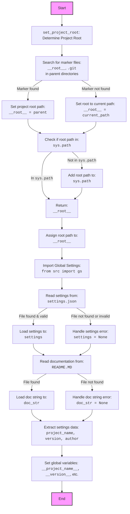

## ИНСТРУКЦИЯ:

Анализируй предоставленный код подробно и объясни его функциональность. Ответ должен включать три раздела:

1.  **<алгоритм>**: Опиши рабочий процесс в виде пошаговой блок-схемы, включая примеры для каждого логического блока, и проиллюстрируй поток данных между функциями, классами или методами.
2.  **<mermaid>**: Напиши код для диаграммы в формате `mermaid`, проанализируй и объясни все зависимости,
    которые импортируются при создании диаграммы.
    **ВАЖНО!** Убедитесь, что все имена переменных, используемые в диаграмме `mermaid`,
    имеют осмысленные и описательные имена. Имена переменных вроде `A`, `B`, `C`, и т.д., не допускаются!

    **Дополнительно**: Если в коде есть импорт `import header`, добавьте блок `mermaid` flowchart, объясняющий `header.py`:
    ```mermaid
    flowchart TD
        Start --> Header[<code>header.py</code><br> Determine Project Root]

        Header --> import[Import Global Settings: <br><code>from src import gs</code>]
    ```

3.  **<объяснение>**: Предоставьте подробные объяснения:
    *   **Импорты**: Их назначение и взаимосвязь с другими пакетами `src.`.
    *   **Классы**: Их роль, атрибуты, методы и взаимодействие с другими компонентами проекта.
    *   **Функции**: Их аргументы, возвращаемые значения, назначение и примеры.
    *   **Переменные**: Их типы и использование.
    *   Выделите потенциальные ошибки или области для улучшения.

Дополнительно, постройте цепочку взаимосвязей с другими частями проекта (если применимо).

Это обеспечивает всесторонний и структурированный анализ кода.
## Формат ответа: `.md` (markdown)
**КОНЕЦ ИНСТРУКЦИИ**

## <алгоритм>

```mermaid
graph LR
    A[Начало] --> B{Определение корня проекта: set_project_root()};
    B -- Находит маркеры (__root__, .git) --> C{Перебор родительских каталогов};
    C -- Маркер найден --> D{Установка __root__};
    C -- Маркер не найден --> E{__root__ = current_path};
    D --> F{Проверка __root__ в sys.path};
    E --> F;
    F -- Нет в sys.path --> G{Добавление __root__ в sys.path};
    F -- Есть в sys.path --> H{Возврат __root__};
    G --> H;
    H --> I{Присваивание __root__};
    I --> J{Импорт gs: from src import gs};
    J --> K{Чтение настроек из settings.json};
    K -- Файл найден --> L{Загрузка настроек};
    K -- Файл не найден --> M{Обработка исключения};
    L --> N{Чтение README.md};
    M --> N;
    N -- Файл найден --> O{Загрузка документации};
    N -- Файл не найден --> P{Обработка исключения};
    O --> Q{Извлечение данных из настроек};
    P --> Q;
    Q --> R[Конец];
     
    style A fill:#f9f,stroke:#333,stroke-width:2px
     style B fill:#ccf,stroke:#333,stroke-width:2px
    style C fill:#ccf,stroke:#333,stroke-width:2px
     style D fill:#aaf,stroke:#333,stroke-width:2px
      style E fill:#aaf,stroke:#333,stroke-width:2px
     style F fill:#aaf,stroke:#333,stroke-width:2px
      style G fill:#aaf,stroke:#333,stroke-width:2px
    style H fill:#afa,stroke:#333,stroke-width:2px
     style I fill:#afa,stroke:#333,stroke-width:2px
      style J fill:#afa,stroke:#333,stroke-width:2px
       style K fill:#afa,stroke:#333,stroke-width:2px
        style L fill:#afa,stroke:#333,stroke-width:2px
          style M fill:#afa,stroke:#333,stroke-width:2px
    style N fill:#afa,stroke:#333,stroke-width:2px
     style O fill:#afa,stroke:#333,stroke-width:2px
      style P fill:#afa,stroke:#333,stroke-width:2px
       style Q fill:#afa,stroke:#333,stroke-width:2px
        style R fill:#f9f,stroke:#333,stroke-width:2px
```

**Примеры для каждого логического блока:**
* **B**: Функция `set_project_root` вызывается для определения корневой директории проекта.
* **C**: Цикл перебирает родительские каталоги текущего файла в поисках маркеров. Пример: если файл находится в `/path/to/project/src/suppliers/wallashop/header.py`, то будут проверены `/path/to/project/src/suppliers/wallashop`, `/path/to/project/src/suppliers`, `/path/to/project/src`, `/path/to/project`, `/path/to/`.
* **D**: Если маркер, например, `__root__` найден в `/path/to/project`, то `__root__` будет установлен в `/path/to/project`.
* **E**: Если маркер не найден, то `__root__` останется равным `/path/to/project/src/suppliers/wallashop`.
* **F**: Проверяется, есть ли `/path/to/project` (или иной найденный `__root__`) в списке путей поиска модулей (`sys.path`).
* **G**: Если нет, `/path/to/project` добавляется в начало списка путей (`sys.path`).
* **H**: Возвращается путь к корневой директории `/path/to/project`.
* **I**: Переменной `__root__` присваивается найденный путь.
* **J**: Импортируются глобальные настройки из модуля `src.gs`.
* **K**: Происходит попытка открыть и прочитать файл настроек `settings.json` из папки src.
* **L**:  Если файл найден и является валидным JSON, настройки загружаются в переменную `settings`.
* **M**: Если файл не найден или не является валидным JSON, происходит обработка исключения и переменная `settings` остается `None`.
* **N**: Происходит попытка открыть и прочитать файл `README.MD` из папки src.
* **O**: Если файл найден, его содержимое загружается в переменную `doc_str`.
* **P**: Если файл не найден, происходит обработка исключения, и `doc_str` остается `None`.
* **Q**: Извлекаются значения для `__project_name__`, `__version__` и других переменных из `settings`, если они доступны. Если `settings` равен `None`, используются значения по умолчанию.
* **R**: Завершение работы кода.

## <mermaid>


**Объяснение зависимостей `mermaid` диаграммы:**

*   `Start`: Начало выполнения кода.
*   `SetProjectRoot`:  Функция `set_project_root` ищет корень проекта.
*   `FindMarkerFiles`: Поиск маркерных файлов в родительских директориях.
*   `SetRootPath`: Установка корневого пути проекта, если маркер найден.
*  `SetCurrentPath`: Установка корневого пути проекта в текущую директорию, если маркер не найден.
*   `CheckSysPath`: Проверка, добавлен ли корневой путь в список путей поиска модулей `sys.path`.
*  `AddSysPath`: Добавление корневого пути в список `sys.path`.
*   `ReturnRootPath`: Возврат корневого пути.
*   `AssignRootVariable`: Присвоение корневого пути переменной `__root__`.
*   `ImportGlobalSettings`: Импорт глобальных настроек из модуля `src.gs`.
*   `ReadSettingsFile`: Чтение данных из файла `settings.json`.
*   `LoadSettings`: Загрузка настроек в переменную `settings`.
*   `HandleSettingsError`: Обработка ошибок чтения настроек, если файл не найден.
*  `ReadReadmeFile`: Чтение данных из файла `README.MD`.
*   `LoadDocString`: Загрузка строки документации в переменную `doc_str`.
*   `HandleDocStringError`: Обработка ошибок чтения `README.MD`, если файл не найден.
*   `ExtractSettingsData`: Извлечение данных из настроек.
*   `SetGlobalVariables`: Установка глобальных переменных проекта.
*   `End`: Завершение выполнения кода.

## <объяснение>

**Импорты:**

*   `import sys`: Модуль `sys` используется для доступа к системным переменным и функциям, в частности для добавления пути к корневой директории проекта в список путей поиска модулей `sys.path`.
*   `import json`: Модуль `json` используется для работы с файлами в формате JSON, в частности для загрузки настроек из файла `settings.json`.
*   `from packaging.version import Version`: Импортируется класс `Version` из модуля `packaging.version`. Это используется для работы с версиями программного обеспечения, хотя в данном коде явно не используется. Возможно, используется где-то еще в проекте.
*   `from pathlib import Path`: Импортируется класс `Path` из модуля `pathlib`, который используется для представления путей к файлам и директориям в операционной системе.
*   `from src import gs`: Импортируется модуль `gs` из пакета `src`. Предполагается, что `gs` содержит глобальные настройки проекта, например, пути к файлам и директориям.

**Функции:**

*   `set_project_root(marker_files: tuple = ('__root__', '.git')) -> Path`:
    *   **Аргументы:**
        *   `marker_files` (tuple): кортеж строк, представляющих имена файлов или директорий, которые служат маркерами для определения корня проекта. По умолчанию это `('__root__', '.git')`.
    *   **Возвращаемое значение:**
        *   `Path`: Объект `Path`, представляющий путь к корневой директории проекта. Если маркер не найден, возвращается путь к директории, в которой расположен файл скрипта.
    *   **Назначение:**
        *   Функция определяет корневую директорию проекта путем поиска родительских директорий, пока не найдет директорию, содержащую один из файлов-маркеров.  Это позволяет запускать скрипты из любой точки проекта, не ломая импорты.
    *   **Пример:**
        Если файл скрипта расположен в `/path/to/project/src/suppliers/wallashop/header.py`, а маркер `__root__` находится в `/path/to/project`, то функция вернет объект `Path('/path/to/project')`.

**Переменные:**

*   `__root__`: Глобальная переменная типа `Path`, представляющая корневую директорию проекта. Она инициализируется с помощью функции `set_project_root()`.
*   `settings`: Глобальная переменная типа `dict`, которая хранит настройки проекта, загруженные из файла `settings.json`. Может быть `None`, если файл не найден или невалиден.
*   `doc_str`: Глобальная переменная типа `str`, которая хранит документацию проекта, загруженную из файла `README.MD`. Может быть `None`, если файл не найден.
*   `__project_name__`: Глобальная переменная типа `str`, хранящая имя проекта. Извлекается из `settings` или устанавливается в `'hypotez'` по умолчанию.
*   `__version__`: Глобальная переменная типа `str`, хранящая версию проекта. Извлекается из `settings` или устанавливается в `''` по умолчанию.
*   `__doc__`: Глобальная переменная типа `str`, хранящая документацию проекта.
*   `__details__`: Глобальная переменная типа `str`, хранящая детали проекта. В коде имеет пустое значение.
*   `__author__`: Глобальная переменная типа `str`, хранящая автора проекта. Извлекается из `settings` или устанавливается в `''` по умолчанию.
*  `__copyright__`: Глобальная переменная типа `str`, хранящая информацию об авторских правах. Извлекается из `settings` или устанавливается в `''` по умолчанию.
*  `__cofee__`: Глобальная переменная типа `str`, хранящая призыв к разработчику выпить кофе.

**Взаимосвязи с другими частями проекта:**

*   Этот файл является частью модуля `src.suppliers.wallashop`.
*   Он использует глобальные настройки из `src.gs`.
*   Он читает файлы `settings.json` и `README.MD`, которые, предположительно, находятся в каталоге `src`.
*   Определяет корневую директорию проекта, которая используется для импорта других модулей.
*  Инициализирует глобальные переменные, которые могут использоваться в других модулях проекта.

**Потенциальные ошибки и области для улучшения:**

*   **Обработка исключений:**  Обработка исключений для чтения `settings.json` и `README.MD` довольно простая (`...`). Можно добавить логирование ошибок для отладки.
*   **Типы переменных:** Некоторые переменные, такие как `__details__` и `__copyright__`, не имеют значений по умолчанию, что может привести к ошибкам, если в файле `settings.json` они отсутствуют.
*   **Жесткая зависимость от структуры проекта**: Код предполагает, что `settings.json` и `README.MD` всегда находятся в папке `src`, что делает его менее гибким.
*   **Использование `packaging.version`**:  Класс `Version` импортируется, но не используется. Либо нужно использовать этот класс для проверки версий, либо убрать лишний импорт.
*   **Зависимость от наличия файлов**: Код не обрабатывает ситуацию, когда файлы `settings.json` или `README.MD` отсутствуют. Следует добавить значения по умолчанию и, возможно, логирование.

Этот код является важной частью проекта, поскольку он устанавливает базовые настройки и пути, необходимые для работы других модулей. Его можно улучшить, добавив более надежную обработку ошибок и сделав его более гибким.