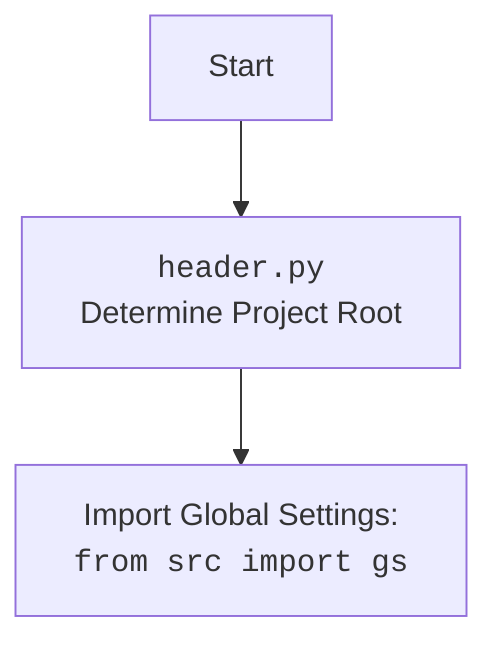

## Анализ кода `header.py`

### 1. `<алгоритм>`

**Функция `set_project_root`:**

1.  **Начало:** Функция вызывается с кортежем `marker_files` (по умолчанию `('__root__', '.git')`).
2.  **Определение текущего пути:** Получает абсолютный путь к директории, в которой находится текущий файл (`__file__`).
    *   Пример: Если файл `header.py` находится в `/home/user/hypotez/src/suppliers/wallmart`, то `current_path` будет `/home/user/hypotez/src/suppliers/wallmart`.
3.  **Инициализация `__root__`:**  Изначально устанавливает `__root__` равным `current_path`.
4.  **Цикл по родительским директориям:** Перебирает текущую директорию и все ее родительские директории.
    *   Пример: Для `current_path` = `/home/user/hypotez/src/suppliers/wallmart` цикл переберет:
        *   `/home/user/hypotez/src/suppliers/wallmart`
        *   `/home/user/hypotez/src/suppliers`
        *   `/home/user/hypotez/src`
        *   `/home/user/hypotez`
        *   `/home/user`
        *   `/home`
        *   `/`
5.  **Проверка на наличие маркерных файлов:** Для каждой родительской директории проверяет, существует ли в ней хотя бы один из `marker_files`.
    *   Пример: Если в `/home/user/hypotez` есть файл `__root__`, то условие выполнится.
6.  **Обновление `__root__` и выход из цикла:** Если маркерный файл найден, `__root__` обновляется до этой родительской директории, и цикл завершается.
7.  **Добавление `__root__` в `sys.path`:** Если `__root__` еще не в списке путей `sys.path`, он добавляется в начало списка, чтобы обеспечить доступ к другим модулям проекта.
8.  **Возврат `__root__`:** Функция возвращает путь к корневой директории проекта.

**Основной блок кода:**

1.  **Вызов `set_project_root`:** Вызывает функцию `set_project_root` для определения корневой директории и сохраняет результат в глобальной переменной `__root__`.
2.  **Импорт `gs`:** Импортирует модуль `gs` из пакета `src`.
3.  **Загрузка `settings.json`:**
    *   Пытается открыть файл `settings.json` из директории `src` в корне проекта.
    *   Если файл существует и является валидным JSON, то его содержимое загружается в словарь `settings`.
    *   Если возникает `FileNotFoundError` или `json.JSONDecodeError`, обработка исключения игнорируется.
4.  **Загрузка `README.MD`:**
    *   Пытается открыть файл `README.MD` из директории `src` в корне проекта.
    *   Если файл существует, то его содержимое загружается в строку `doc_str`.
    *   Если возникает `FileNotFoundError`, обработка исключения игнорируется.
5.  **Инициализация глобальных переменных:**
    *   Инициализирует глобальные переменные `__project_name__`, `__version__`, `__doc__`, `__details__`, `__author__`, `__copyright__`, `__cofee__` значениями из `settings` или значениями по умолчанию, если `settings` не был загружен.

### 2. `<mermaid>`

```mermaid
flowchart TD
    subgraph header.py
        Start(Начало) --> SetRoot[set_project_root()];
        SetRoot --> FindRoot[Определение корневого каталога]
        FindRoot --> CheckMarker[Проверка наличия маркерных файлов]
        CheckMarker -- Да --> UpdateRoot[Обновление __root__]
        UpdateRoot --> AddToSysPath[Добавление __root__ в sys.path]
        CheckMarker -- Нет --> NextParent[Переход к следующей родительской директории]
        NextParent --> CheckMarker
         NextParent --> AddToSysPath
        AddToSysPath --> GetSettingsPath[Получение пути к settings.json]
         AddToSysPath --> GetReadmePath[Получение пути к README.MD]
        GetSettingsPath --> LoadSettings[Загрузка settings.json]
        GetReadmePath --> LoadReadme[Загрузка README.MD]
        LoadSettings -- Успешно --> SetVars[Установка глобальных переменных из settings]
        LoadSettings -- Ошибка --> SetVarsDefault[Установка глобальных переменных по умолчанию]
        LoadReadme -- Успешно --> SetDocStr[Установка __doc__ из README.MD]
        LoadReadme -- Ошибка --> SetDocStrDefault[Установка __doc__ по умолчанию]
        SetVars --> End(Конец);
        SetVarsDefault --> End;
        SetDocStr --> End;
        SetDocStrDefault --> End;
    end

    subgraph Import
       Import_Start[Start] --> Import_gs[import from src import gs]
       Import_gs --> Import_End[End]
    end
```

**Объяснение `mermaid`:**

*   **`header.py`**:  Представляет основной блок кода из файла `header.py`.
    *   `Start`: Начало выполнения скрипта.
    *   `SetRoot`: Вызов функции `set_project_root()`.
    *   `FindRoot`: Этап поиска корневого каталога.
    *   `CheckMarker`: Проверка наличия маркерных файлов в текущей директории.
    *   `UpdateRoot`: Обновление переменной `__root__` при нахождении маркерного файла.
    *   `AddToSysPath`: Добавление корневой директории в `sys.path`.
    *    `GetSettingsPath`: Получение пути к файлу `settings.json`.
    *    `GetReadmePath`: Получение пути к файлу `README.MD`.
    *    `LoadSettings`: Загрузка содержимого `settings.json`.
    *    `LoadReadme`: Загрузка содержимого `README.MD`.
    *    `SetVars`: Установка глобальных переменных из файла `settings.json`.
    *   `SetVarsDefault`: Установка глобальных переменных по умолчанию.
    *    `SetDocStr`: Установка значения `__doc__` из файла `README.MD`.
    *   `SetDocStrDefault`: Установка значения `__doc__` по умолчанию.
    *   `End`: Конец выполнения `header.py`.
* **`Import`**: Описывает импорт `gs`
    *    `Import_Start`: Начало импорта
    *   `Import_gs`: импорт `from src import gs`
    *    `Import_End`: Конец импорта

**Импорт `header.py` (дополнительно):**



### 3. `<объяснение>`

**Импорты:**

*   `import sys`: Модуль `sys` предоставляет доступ к некоторым переменным и функциям, которые взаимодействуют с интерпретатором Python. Используется для изменения пути поиска модулей (`sys.path`).
*   `import json`: Модуль `json` используется для работы с данными в формате JSON. В данном случае для загрузки данных из файла `settings.json`.
*   `from packaging.version import Version`: Импортируется класс `Version` для работы с версиями. В данном коде не используется.
*   `from pathlib import Path`: Класс `Path` используется для работы с путями в файловой системе. Обеспечивает более удобный и кроссплатформенный способ работы с путями по сравнению со строками.
*    `from src import gs`: Импортирует модуль `gs` из пакета `src`. Вероятно, `gs` содержит глобальные настройки и пути для проекта.

**Функции:**

*   **`set_project_root(marker_files: tuple = ('__root__', '.git')) -> Path`**:
    *   **Аргументы**:
        *   `marker_files`: Кортеж (tuple) имен файлов или директорий, по которым определяется корень проекта. По умолчанию `('__root__', '.git')`.
    *   **Возвращаемое значение**:
        *   `Path`: Объект `Path` представляющий корень проекта.
    *   **Назначение**: Находит корневую директорию проекта, начиная с текущей директории и поднимаясь вверх по дереву каталогов, пока не найдет директорию, содержащую один из маркерных файлов. Это гарантирует, что скрипт может найти другие части проекта независимо от того, откуда он запущен.
    *   **Пример**: Если `header.py` находится в `src/suppliers/wallmart`, а файл `__root__` находится в корне проекта, то функция вернет путь к корню проекта.

**Переменные:**

*   `__root__: Path`: Хранит путь к корневой директории проекта. Это глобальная переменная.
*   `settings: dict`: Словарь, который хранит загруженные из `settings.json` настройки проекта. Может быть `None`, если файл не найден или не валидный JSON.
*   `doc_str: str`: Строка, которая хранит загруженный из `README.MD` текст. Может быть `None`, если файл не найден.
*   `__project_name__: str`: Название проекта, загруженное из `settings.json` или `hypotez` по умолчанию.
*   `__version__: str`: Версия проекта, загруженная из `settings.json` или пустая строка по умолчанию.
*   `__doc__: str`: Документация проекта, загруженная из `README.MD` или пустая строка по умолчанию.
*   `__details__: str`: Детали проекта (в данном коде не используются, всегда пустая строка).
*    `__author__: str`: Автор проекта, загружен из `settings.json` или пустая строка по умолчанию.
*   `__copyright__: str`: Авторское право проекта, загружено из `settings.json` или пустая строка по умолчанию.
*   `__cofee__: str`: Строка, содержащая ссылку на поддержку разработчика, загружена из `settings.json` или значение по умолчанию.

**Объяснения:**

*   **`set_project_root`**:
    *   Эта функция критически важна для определения корня проекта, что необходимо для правильной работы с относительными путями.
    *   Использование `Path` обеспечивает кроссплатформенность, так как пути будут работать как на Windows, так и на Unix.
    *   Добавление `__root__` в `sys.path` позволяет импортировать модули из других частей проекта.
*   **Загрузка `settings.json`**:
    *   Использование `try-except` позволяет обработать ошибки, связанные с отсутствием файла или невалидным JSON, что предотвращает сбои программы.
    *   Если `settings.json` не найден, используются значения по умолчанию для глобальных переменных.
*   **Загрузка `README.MD`**:
     *   Использование `try-except` позволяет обработать ошибки, связанные с отсутствием файла.
    *   Если `README.MD` не найден, используется значение по умолчанию для переменной `__doc__`.
*   **Глобальные переменные**:
    *   Переменные с префиксом `__` (например, `__project_name__`) являются конвенцией для обозначения "внутренних" переменных, но в Python это не делает их полностью приватными.
*   **Связь с другими частями проекта**:
    *   Код зависит от наличия файла `settings.json` в директории `src` для определения настроек проекта.
    *   Зависит от наличия файла `README.MD` в директории `src` для получения документации.
    *   Зависит от модуля `gs` который вероятно содержит глобальные настройки проекта.

**Потенциальные ошибки и области для улучшения:**

*   **Отсутствие проверок:**
    *   Нет явной проверки, что `settings` является словарем после загрузки. Это может привести к ошибкам, если `settings.json` имеет неправильный формат.
     *  Отсутствует проверка на тип переменных, например, перед использованием `settings.get("version", '')` не проверяется что `settings` это словарь.
*   **Обработка исключений:**
    *   Исключения `FileNotFoundError` и `json.JSONDecodeError` в блоках `try-except` обрабатываются пассивно (`...`).  Было бы лучше добавить логирование или выброс исключения с более информативным сообщением.
*   **Зависимость от `gs`**:
    *   Код не является независимым из-за `from src import gs`, он опирается на другие части проекта. В идеале, данный модуль должен быть максимально изолированным или же явно иметь описанные зависимости.
*   **Отсутствие документации**
    *  Для `set_project_root` добавить информацию о том какие директории являются корнем проекта и что за маркерные файлы используются.
*   **`__details__`**: Переменная не используется, её можно убрать.
*   **Лишние комментарии**
    *   Комментарий `"""__root__ (Path): Path to the root directory of the project"""` может быть удален, как и комментарии к остальным глобальным переменным. Описание типа переменной более уместно при написании тайп-хинтов.

**Цепочка взаимосвязей:**

1.  `header.py` устанавливает корневую директорию проекта (`__root__`).
2.  `header.py` загружает настройки из `settings.json` и `README.MD`, используя `__root__`.
3.  `header.py` инициализирует глобальные переменные, которые могут использоваться другими модулями проекта.
4.  Другие модули проекта могут импортировать `header.py` для получения доступа к `__root__` и глобальным переменным.
5.  Модуль `gs` используется для получения путей и общих настроек.

Таким образом, `header.py` является важной частью проекта, обеспечивающей правильную инициализацию и доступ к глобальным настройкам.