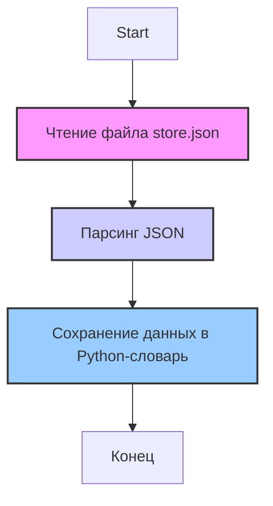

## Анализ кода: `hypotez/src/suppliers/wallmart/locators/store.json`

### <алгоритм>

1.  **Чтение JSON-файла:**
    *   Начинается с чтения содержимого файла `store.json`.
    *   Предполагается, что файл `store.json` содержит JSON-объект, представляющий локаторы веб-элементов для страницы магазина Walmart.
    *   **Пример**: Файл содержит данные вида:
    ```json
    {
      "product_list": {
        "css": ".search-result-gridview-items li"
      },
      "product_name": {
        "css": ".product-title-link"
      },
      "add_to_cart_button": {
        "xpath": "//button[contains(text(), 'Add to cart')]"
      }
    }
    ```
2.  **Преобразование в структуру данных:**
    *   Прочитанный JSON-текст преобразуется в структуру данных Python (словарь).
    *   Теперь можно обращаться к локаторам, используя ключи.
    *   **Пример:** `data["product_list"]["css"]` вернет строку `.search-result-gridview-items li`.

### <mermaid>



**Объяснение диаграммы `mermaid`:**

*   **ReadFile (Чтение файла store.json):** Представляет начальный этап, когда содержимое файла `store.json` читается как текст. Эта операция использует стандартные функции работы с файлами.
*   **ParseJSON (Парсинг JSON):** Представляет процесс, где текст, полученный из файла, преобразуется в структуру данных Python (обычно словарь или список). Это выполняется с помощью модуля `json` Python.
*   **StoreData (Сохранение данных в Python-словарь):**  Представляет этап, где распарсенные JSON-данные сохраняются в переменной, доступной для дальнейшего использования в коде. Это словарь, где ключи - имена элементов, а значения - словари с типами локаторов и их значениями.
*   **End (Конец):** Обозначает завершение процесса обработки файла `store.json`.

**Зависимости:**

*   **Нет импорта:** Код для обработки JSON-файла не подразумевает импорта каких-либо дополнительных модулей.
    Все необходимые функции для чтения JSON-файла и его парсинга, включая преобразование в структуру данных Python,
    будут находиться в самом коде или использовать стандартные Python библиотеки.

### <объяснение>

**Импорты:**

*   В данном файле нет явных импортов. Предполагается, что операции с JSON выполняются стандартными методами Python или встроенными библиотеками, такими как `json`.

**Классы:**

*   Файл `store.json` не содержит классов. Он представляет собой файл данных в формате JSON.

**Функции:**

*   В файле нет функций. Файл используется как источник данных.

**Переменные:**

*   `data`: Представляет собой словарь, полученный после парсинга JSON-файла. Этот словарь содержит локаторы веб-элементов.
    *   Тип: `dict` (словарь)
    *   Использование: Ключами этого словаря являются имена логических элементов (например, `product_list`, `product_name`). Каждое значение словаря - это словарь с ключами типа локатора (например, `css`, `xpath`) и их строковым представлением (например, `.search-result-gridview-items li`).

**Потенциальные ошибки и улучшения:**

*   **Отсутствие обработки ошибок:** Код может не содержать обработку ошибок, таких как:
    *   Файл не найден.
    *   Неверный формат JSON.
    *   Отсутствие ожидаемых ключей в JSON.
    *  Стоит добавить обработку исключений (`try-except`) для обеспечения более надежной работы программы.
*   **Дублирование локаторов:** Если в разных частях проекта используются одни и те же локаторы, их можно вынести в отдельный файл для переиспользования.
*   **Неоднозначность:** Локаторы (особенно `css` и `xpath`) могут быть хрупкими при изменении HTML-структуры сайта. Стоит продумать стратегию по созданию более надежных локаторов.
*   **Отсутствие валидации**: Стоит добавить валидацию структуры `json` на случай ее изменения в будущем.

**Взаимосвязь с другими частями проекта:**

*   **Тесты:** Этот файл, скорее всего, используется в тестах автоматизации, где локаторы извлекаются для взаимодействия с элементами веб-страницы.
*   **Драйверы браузера**: В тестах локаторы используются совместно с драйверами браузера для взаимодействия с web-элементами.
*   **Страницы (Pages):** Локаторы могут использоваться для создания объектов Page Object, предоставляя удобный интерфейс для работы с элементами веб-страницы.
*   **Настройки**: Если есть глобальные настройки, данный json может использоваться в качестве одного из источников данных.

**Пример использования в Python (псевдокод):**

```python
import json

def read_locators_from_json(file_path):
    try:
        with open(file_path, 'r') as f:
            data = json.load(f)
            return data
    except FileNotFoundError:
        print(f"Error: File not found at {file_path}")
        return None
    except json.JSONDecodeError:
        print(f"Error: Invalid JSON format in {file_path}")
        return None

# Пример использования:
file_path = 'hypotez/src/suppliers/wallmart/locators/store.json'
store_locators = read_locators_from_json(file_path)

if store_locators:
  print(store_locators["product_list"]["css"]) #Выведет '.search-result-gridview-items li'