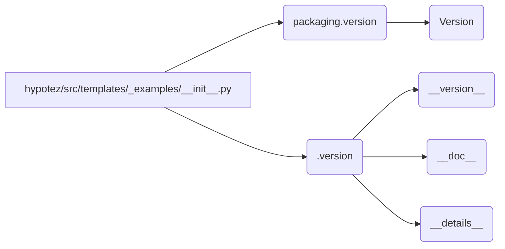

# <input code>

```python
## \file hypotez/src/templates/_examples/__init__.py
# -*- coding: utf-8 -*-

#! venv/bin/python/python3.12

"""
.. module: src.templates._examples 
	:platform: Windows, Unix
	:synopsis:

"""


"""
	:platform: Windows, Unix
	:synopsis:

"""


"""
	:platform: Windows, Unix
	:synopsis:

"""


"""
  :platform: Windows, Unix

"""
"""
  :platform: Windows, Unix
  :platform: Windows, Unix
  :synopsis:
"""
  
""" module: src.templates._examples """


from packaging.version import Version
from .version import __version__, __doc__, __details__
```

# <algorithm>

Этот код представляет собой модуль `__init__.py` в пакете `hypotez/src/templates/_examples`.  Он не содержит функций или классов, имеющих явное поведение. Основная его роль – импортировать другие модули.  Пошаговая блок-схема упрощена, поскольку нет обработки данных или вычислений:

1. **Импорты:** Модуль `__init__.py` импортирует `Version` из пакета `packaging`.
2. **Импорты:** Модуль импортирует `__version__, __doc__, __details__` из подмодуля `./version`.

Пример:  Нет обработки данных, поэтому примеров нет.  Логика заключается в импорте, а не в выполнении операций.


# <mermaid>



**Объяснение диаграммы:**

Диаграмма демонстрирует импорт модулей:

* `hypotez/src/templates/_examples/__init__.py` импортирует `Version` из `packaging.version`.
* `hypotez/src/templates/_examples/__init__.py` импортирует `__version__`, `__doc__`, и `__details__` из локального модуля `.version`.


# <explanation>

* **Импорты**:
    * `from packaging.version import Version`:  Импортирует класс `Version` из пакета `packaging`.  Это, вероятно, используется для проверки или обработки версий в других частях проекта.  `packaging` — стандартный пакет Python для управления пакетами. Импорт необходим для работы с версиями пакетов.
    * `from .version import __version__, __doc__, __details__`:  Импортирует `__version__`, `__doc__`, `__details__` из файла `.version`.  Этот импорт, скорее всего, задаёт метаданные (версия, документация, детали) для модуля `_examples`. `./version` — предполагаемый подмодуль, содержащий информацию о текущей версии и документации.

* **Классы**: Нет явных классов.

* **Функции**: Нет функций.

* **Переменные**:
    * ``:  Это переменная, вероятно, конфигурационная, определяющая режим работы (`'dev'`, `'prod'` и т.п.).  Она используется в других частях проекта для выбора конфигурации.

* **Возможные ошибки и улучшения**:
    * **Документация:** Комментарии `"""..."""`  в коде содержат некорректную документацию.  Они должны быть в формате Sphinx, чтобы быть полезными.

* **Связь с другими частями проекта**:
    * Файл `hypotez/src/templates/_examples/__init__.py` импортирует `__version__`, `__doc__`, `__details__` из файла `.version`.  Это указывает на то, что `.version` хранит метаданные, используемые для управления пакетом.  Он связан с другими частями проекта, которые, вероятно, полагаются на эти значения (например, для управления версиями, документацией или описанием).


В целом, код импортирует необходимые модули и, скорее всего, используется в качестве точки входа для других модулей в папке `_examples`.