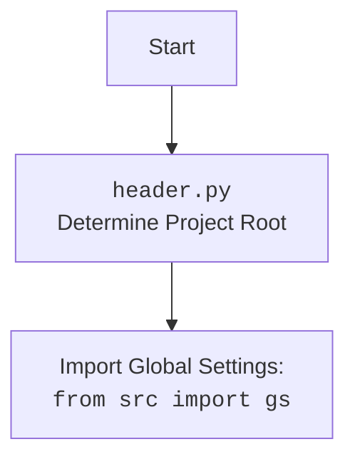

## ИНСТРУКЦИЯ:

Анализируй предоставленный код подробно и объясни его функциональность. Ответ должен включать три раздела:

1. **<алгоритм>**: Опиши рабочий процесс в виде пошаговой блок-схемы, включая примеры для каждого логического блока, и проиллюстрируй поток данных между функциями, классами или методами.
2. **<mermaid>**: Напиши код для диаграммы в формате `mermaid`, проанализируй и объясни все зависимости,
    которые импортируются при создании диаграммы.
    **ВАЖНО!** Убедитесь, что все имена переменных, используемые в диаграмме `mermaid`,
    имеют осмысленные и описательные имена. Имена переменных вроде `A`, `B`, `C`, и т.д., не допускаются!

    **Дополнительно**: Если в коде есть импорт `import header`, добавьте блок `mermaid` flowchart, объясняющий `header.py`:\
    ```mermaid\
    flowchart TD\
        Start --> Header[<code>header.py</code><br> Determine Project Root]\
    \
        Header --> import[Import Global Settings: <br><code>from src import gs</code>] \
    ```

3. **<объяснение>**: Предоставьте подробные объяснения:
   - **Импорты**: Их назначение и взаимосвязь с другими пакетами `src.`.
   - **Классы**: Их роль, атрибуты, методы и взаимодействие с другими компонентами проекта.
   - **Функции**: Их аргументы, возвращаемые значения, назначение и примеры.
   - **Переменные**: Их типы и использование.
   - Выделите потенциальные ошибки или области для улучшения.

Дополнительно, постройте цепочку взаимосвязей с другими частями проекта (если применимо).

Это обеспечивает всесторонний и структурированный анализ кода.
## Формат ответа: `.md` (markdown)
**КОНЕЦ ИНСТРУКЦИИ**

## <алгоритм>
```mermaid
flowchart TD
    Start[Начало] --> GetCurrentPath[Получить путь к текущему файлу: __file__]
    GetCurrentPath --> InitializeRootPath[Инициализировать __root__ = путь к файлу]
    InitializeRootPath --> LoopStart[Начать цикл: для каждого родительского каталога]
    LoopStart -- Есть еще родительский каталог? --> LoopCondition{Проверка: Существуют ли маркерные файлы?}
    LoopCondition -- Да --> SetNewRoot[Установить __root__ = родительский каталог]
    SetNewRoot --> BreakLoop[Прервать цикл]
    LoopCondition -- Нет --> LoopEnd[Перейти к следующему родителю]
    LoopEnd -- Есть еще родительский каталог? --> LoopStart
    LoopEnd -- Нет --> AddRootToPath[Проверить, если __root__ не в sys.path добавить его]
    AddRootToPath --> ReturnRootPath[Вернуть __root__]
    ReturnRootPath --> SetGlobalRoot[Установить глобальную переменную __root__= set_project_root()]
    SetGlobalRoot --> ImportGS[Импортировать глобальные настройки: from src import gs]
    ImportGS --> End[Конец]

    style Start fill:#f9f,stroke:#333,stroke-width:2px
    style End fill:#ccf,stroke:#333,stroke-width:2px

    classDef marker fill:#ffcc80,stroke:#333,stroke-width:1px;
    class LoopCondition, LoopEnd, SetNewRoot, BreakLoop, AddRootToPath marker
```

**Примеры:**

1.  **`GetCurrentPath`**: Если файл находится в `/path/to/project/src/templates/header.py`, то путь будет `/path/to/project/src/templates`.
2.  **`InitializeRootPath`**: Изначально `__root__` устанавливается в `/path/to/project/src/templates`.
3.  **`LoopStart`**: Начинается обход родительских каталогов: `/path/to/project/src/templates`, `/path/to/project/src`, `/path/to/project`.
4.  **`LoopCondition`**: Проверяется, есть ли в текущем родительском каталоге маркерные файлы (`__root__`, `.git`). Если `.git` найден в `/path/to/project`, то выполняется `SetNewRoot`.
5.  **`SetNewRoot`**: Значение `__root__` изменяется на `/path/to/project`.
6.  **`BreakLoop`**: Цикл обхода родительских каталогов завершается.
7.  **`AddRootToPath`**: Проверяется, если `/path/to/project` нет в `sys.path`, добавляет его.
8.  **`ReturnRootPath`**: Возвращает путь `/path/to/project`.
9.  **`SetGlobalRoot`**: Присваивает возвращенное значение переменной `__root__`.
10. **`ImportGS`**: Импортирует глобальные настройки из `src.gs`.

## <mermaid>
```mermaid
flowchart TD
    Start[<code>header.py</code><br>Determine Project Root] --> GetFilePath[Get File Path:<br><code>Path(__file__).resolve().parent</code>]
    GetFilePath --> InitRootPath[Initialize Project Root Path:<br><code>__root__ = current_path</code>]
    InitRootPath --> IterateParents[Iterate Through Parent Directories:<br><code>for parent in [current_path] + list(current_path.parents)</code>]
    IterateParents --> CheckMarkerFiles{Check for Marker Files: <br><code>if any((parent / marker).exists() for marker in marker_files)</code>}
     CheckMarkerFiles -- Yes --> SetRootPath[Set Project Root Path:<br><code>__root__ = parent</code>]
     SetRootPath --> BreakLoop[Break Loop]
     CheckMarkerFiles -- No --> ContinueLoop[Continue to Next Parent Directory]
     ContinueLoop --> IterateParents
    BreakLoop --> CheckSysPath[Check if Project Root in sys.path:<br><code>if __root__ not in sys.path</code>]
    CheckSysPath -- No --> ReturnRoot[Return Project Root:<br><code>return __root__</code>]
    CheckSysPath -- Yes --> AddToSysPath[Add Project Root to sys.path:<br><code>sys.path.insert(0, str(__root__))</code>]
    AddToSysPath --> ReturnRoot
    ReturnRoot --> SetGlobalRootVariable[Set Global Root Variable: <br><code>__root__ = set_project_root()</code>]
    SetGlobalRootVariable --> ImportGlobalSettings[Import Global Settings:<br><code>from src import gs</code>]
    ImportGlobalSettings --> End[End]
    
    classDef marker fill:#ffcc80,stroke:#333,stroke-width:1px;
    class CheckMarkerFiles, CheckSysPath marker
```



**Анализ зависимостей:**

*   `sys`: Используется для работы с системными переменными, в частности для добавления пути к проекту в `sys.path`, что позволяет импортировать модули из корневой директории проекта.
*   `json`: Не используется в представленном коде, но импортирован. Возможно, предполагается его использование в будущем.
*   `packaging.version.Version`: Не используется в представленном коде, но импортирован. Возможно, предполагается его использование в будущем.
*   `pathlib.Path`: Используется для работы с путями в файловой системе, что позволяет удобно манипулировать директориями и файлами.
*   `src.gs`: Импортируется из пакета `src`, вероятно, это модуль, содержащий глобальные настройки проекта.

## <объяснение>

**Импорты:**

*   `import sys`: Модуль `sys` предоставляет доступ к системным переменным и функциям. В данном коде он используется для добавления пути к корневой директории проекта в `sys.path`, что позволяет импортировать модули из этой директории.
*   `import json`: Модуль `json` предназначен для работы с JSON-данными, но в этом коде не используется. Это может быть импорт, оставшийся от предыдущих версий или зарезервированный для будущих функций.
*   `from packaging.version import Version`: Импортирует класс `Version` из библиотеки `packaging`, который предназначен для работы с версиями пакетов, но в этом коде не используется. Это может быть импорт, оставшийся от предыдущих версий или зарезервированный для будущих функций.
*   `from pathlib import Path`: Класс `Path` из модуля `pathlib` используется для создания объектов, представляющих пути в файловой системе. Это позволяет работать с путями в объектно-ориентированном стиле, упрощая манипуляции с файлами и директориями.
*   `from src import gs`: Импортирует модуль `gs` из пакета `src`. Это позволяет получить доступ к глобальным настройкам проекта, которые, вероятно, определены в модуле `gs`.

**Функции:**

*   `set_project_root(marker_files: tuple = ('__root__', '.git')) -> Path`:
    *   **Аргументы**:
        *   `marker_files` (tuple): Кортеж строк, представляющих имена файлов или директорий, которые служат маркерами для определения корневой директории проекта. По умолчанию (`__root__`, `.git`).
    *   **Возвращаемое значение**:
        *   `Path`: Объект `Path`, представляющий путь к корневой директории проекта. Если маркерные файлы не найдены, то возвращает путь, где находится текущий файл (`header.py`).
    *   **Назначение**:
        *   Функция определяет корневую директорию проекта, начиная с директории, в которой находится текущий файл (`header.py`), и двигаясь вверх по иерархии директорий. Поиск останавливается на первой директории, содержащей любой из маркерных файлов (`__root__` или `.git`).
        *   Если корневая директория проекта не находится в `sys.path`, она добавляется в начало `sys.path`, чтобы обеспечить корректную работу импортов модулей из проекта.
    *   **Примеры:**
        *   Если проект имеет структуру `/path/to/project/__root__`, и `header.py` находится в `/path/to/project/src/templates/header.py`, то функция вернет `/path/to/project`.
        *   Если проект имеет структуру `/path/to/project/.git`, и `header.py` находится в `/path/to/project/src/templates/header.py`, то функция вернет `/path/to/project`.

**Переменные:**

*   `__root__`:
    *   **Тип**: `pathlib.Path`.
    *   **Использование**: Глобальная переменная, представляющая путь к корневой директории проекта. Она инициализируется функцией `set_project_root()` и используется для определения базового пути проекта.

**Объяснение:**

Код в `header.py` отвечает за определение корневой директории проекта и добавление ее в `sys.path`, что позволяет импортировать модули из всего проекта. Это важный шаг для организации проекта, поскольку обеспечивает гибкость и удобство при разработке. Функция `set_project_root` является ключевым компонентом, который обходит родительские директории в поисках маркерных файлов.
Использование `pathlib.Path` упрощает работу с файловыми путями, делая код более читаемым и понятным.

**Потенциальные ошибки и области для улучшения:**

*   **Импорты, которые не используются**: Импорты `json` и `packaging.version.Version` не используются в коде. Их следует либо удалить, либо использовать.
*   **Отсутствие обработки ошибок**: Код не обрабатывает возможные исключения, которые могут возникнуть при работе с файловой системой (например, отсутствие прав доступа).

**Цепочка взаимосвязей:**

1.  `header.py` запускается первым, так как определяет корневой каталог проекта.
2.  `header.py` импортирует `src.gs`, предполагая, что этот модуль содержит глобальные настройки.
3.  Другие модули проекта, импортируя `header.py`, получают доступ к переменной `__root__`, а значит и доступ ко всем файлам проекта через корневой каталог.
4.  Все последующие модули, импортирующие `src.gs` могут использовать глобальные настройки, установленные там, таким образом, `header.py` является базовым модулем для других модулей проекта.