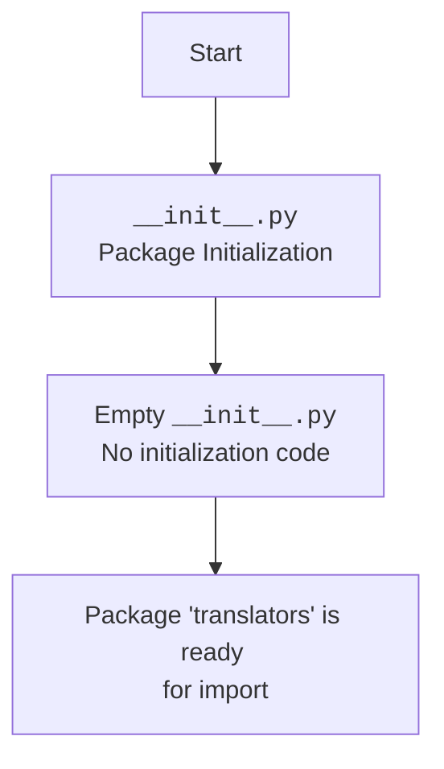

## АНАЛИЗ КОДА: `hypotez/src/translators/__init__.py`

### 1. <алгоритм>

Файл `__init__.py` в Python играет особую роль при работе с пакетами. Он сигнализирует интерпретатору Python, что текущая директория должна рассматриваться как пакет, позволяя импортировать модули и подпакеты внутри нее. В данном случае файл `hypotez/src/translators/__init__.py` является точкой входа для пакета `translators` внутри пакета `src`.

**Пошаговый алгоритм:**

1.  **Инициализация пакета:** При первом импорте пакета `translators` интерпретатор Python выполняет код, находящийся в файле `__init__.py`.
2.  **Пустой код:** В данном случае файл `__init__.py` пустой, что означает, что никаких действий при инициализации пакета не происходит.
3.  **Импорт модулей:** После инициализации пакет `translators` становится доступен для импорта модулей и подпакетов внутри него в другие части проекта.

**Пример:**

Предположим, у нас есть еще один файл `hypotez/src/translators/my_translator.py`

```python
# /src/translators/my_translator.py
def translate(text):
    return text.upper()
```

И в другом файле проекта `hypotez/src/main.py` мы хотим использовать `my_translator`.

```python
# /src/main.py
from src.translators import my_translator

my_text = "hello world"
translated_text = my_translator.translate(my_text)

print (translated_text) # Выведет "HELLO WORLD"
```

Здесь файл `__init__.py` позволяет Python понять, что `translators` - это пакет и мы можем импортировать `my_translator` оттуда.

### 2. <mermaid>



**Объяснение диаграммы:**

*   `Start`: Начало процесса.
*   `PackageInit`: Этап инициализации пакета `translators` через файл `__init__.py`.
*   `EmptyCode`:  В данном случае `__init__.py` пуст, поэтому никакой код при инициализации не выполняется.
*   `PackageReady`: Пакет `translators` теперь готов к использованию в других частях проекта.

В данном случае, поскольку код `__init__.py` пуст, нет импортов и зависимостей, поэтому диаграмма получается довольно простой.

### 3. <объяснение>

**Импорты:**

В данном коде отсутствуют какие-либо импорты, что является особенностью файла `__init__.py` который может быть пустым.

**Классы:**

Файл не содержит классов.

**Функции:**

Файл не содержит функций.

**Переменные:**

Файл не содержит переменных.

**Подробное объяснение:**

Файл `__init__.py` служит маркером для Python, показывая, что директория `translators` является пакетом. Отсутствие кода в этом файле означает, что пакет при импорте не выполняет никаких инициализирующих действий.

**Цепочка взаимосвязей:**

1.  **src:** `__init__.py` расположен в директории `src/translators` внутри пакета `src`, что означает, что данный файл является частью структуры пакета `src`
2.  **Импорт:** `src.translators` может быть импортирован из других модулей проекта, например, как показано в примере в разделе **<алгоритм>**.
3.  **Модули:** Внутри директории `translators` могут находиться другие модули, доступные для импорта через пакет `src.translators`.

**Потенциальные ошибки и области для улучшения:**

*   **Пустой файл:** На данный момент `__init__.py` пуст, что допустимо. Однако, если в будущем потребуется выполнять какую-либо инициализацию пакета при импорте, этот файл нужно будет дополнить. Например, можно инициализировать глобальные переменные или импортировать часто используемые модули внутри пакета.
*   **Неявная структура:** Сейчас структура пакета `translators` не имеет никакой функциональности. Стоит продумать архитектуру пакета, как и какие модули планируется создать.