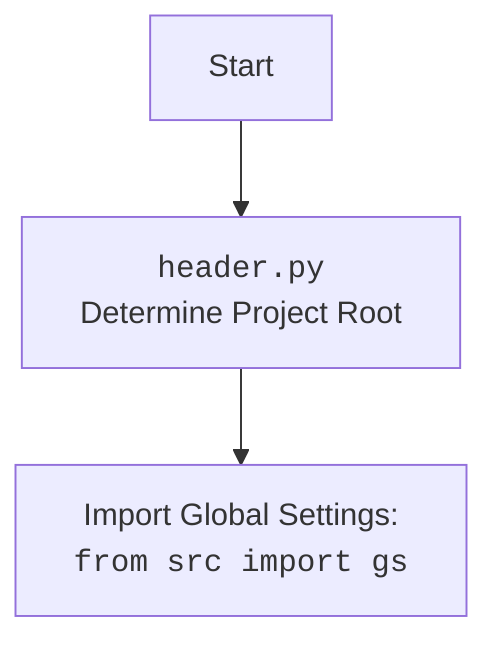

## АНАЛИЗ КОДА: `header.py`

### 1. <алгоритм>
**Функция `set_project_root`:**
1.  **Начало**: Функция принимает `marker_files` (кортеж строк) в качестве аргумента, определяющего файлы-маркеры для корневой директории проекта. Значение по умолчанию  - `("__root__", ".git")`.
    *   _Пример: `marker_files` =  `("__root__", ".git")`
2.  **Инициализация**:  Определяется текущий путь к файлу и его родительская директория (`current_path`). Переменная `__root__` инициализируется как `current_path`.
    *   _Пример_: Если путь к файлу `/home/user/hypotez/src/translators/header.py`, то `current_path` будет `/home/user/hypotez/src/translators`, `__root__` = `/home/user/hypotez/src/translators`.
3.  **Поиск корневой директории**: Происходит итерация по текущей директории и её родительским директориям. На каждой итерации проверяется, существует ли хотя бы один из файлов-маркеров в текущей директории.
    *   _Пример_: В цикле проверяются `/home/user/hypotez/src/translators`, затем `/home/user/hypotez/src`, затем `/home/user/hypotez`. Если в `/home/user/hypotez` есть файл `.git`, цикл остановится.
4.  **Обновление __root__**: Если маркер найден, переменной `__root__` присваивается родительский путь и цикл прерывается.
    *   _Пример_: Если в `/home/user/hypotez` есть файл `.git`, `__root__` = `/home/user/hypotez`.
5.  **Добавление в `sys.path`**: Проверяется, есть ли `__root__` в `sys.path`. Если нет, `__root__` добавляется в начало `sys.path`.
6.  **Возврат**: Функция возвращает значение `__root__`, которое является путем к корневой директории.
    *   _Пример_: `/home/user/hypotez`.

**Основная логика:**
1. **Вызов `set_project_root`:** Вызывается функция `set_project_root` для определения корневой директории проекта и присвоения ее переменной `__root__`.
    * _Пример_: `__root__` = `/home/user/hypotez`
2.  **Импорт `gs`**: Импортируется модуль `gs` из пакета `src`.
3.  **Загрузка `settings.json`**: Пытается прочитать файл `settings.json` из `<корневая директория>/src/settings.json`. Если файл не найден или не может быть декодирован, `settings` устанавливается в `None`.
    *   _Пример_: Если файл `/home/user/hypotez/src/settings.json`  существует и содержит валидный json, то `settings` будет словарем, содержащим данные из файла.
4.  **Загрузка `README.MD`**: Пытается прочитать файл `README.MD` из  `<корневая директория>/src/README.MD`. Если файл не найден, `doc_str` устанавливается в `None`.
     *  _Пример_: Если файл `/home/user/hypotez/src/README.MD`  существует, то `doc_str` будет строкой, содержащий контент из файла.
5.  **Инициализация глобальных переменных**: Инициализируются глобальные переменные `__project_name__`, `__version__`, `__doc__`, `__details__`, `__author__`, `__copyright__`, `__cofee__` из словаря `settings`, если он был успешно загружен, или используются значения по умолчанию.

### 2. <mermaid>

```mermaid
flowchart TD
    Start[Начало] --> FindRoot[set_project_root: Найти корневую директорию проекта]
    FindRoot -->  SetRoot[Установить переменную __root__]
    SetRoot --> ImportGS[Импорт `gs` из `src`]
    ImportGS --> TryLoadSettings[Попытка загрузки settings.json]
    TryLoadSettings -- Success --> LoadSettings[settings = json.load(settings_file)]
    TryLoadSettings -- Fail --> SettingsNone[settings = None]
    LoadSettings --> TryLoadReadme[Попытка загрузки README.MD]
    SettingsNone --> TryLoadReadme
    TryLoadReadme -- Success --> LoadReadme[doc_str = settings_file.read()]
     TryLoadReadme -- Fail --> ReadmeNone[doc_str = None]
    LoadReadme --> InitGlobalVariables[Инициализация глобальных переменных]
    ReadmeNone --> InitGlobalVariables
    InitGlobalVariables --> End[Конец]

    classDef variable fill:#f9f,stroke:#333,stroke-width:2px
    class __root__, settings, doc_str variable
```



**Объяснение `mermaid`:**

*   `flowchart TD`: Объявляет диаграмму как блок-схему с направлением сверху вниз.
*   `Start`, `FindRoot`, `SetRoot`, `ImportGS`, `TryLoadSettings`, `LoadSettings`, `SettingsNone`, `TryLoadReadme`, `LoadReadme`, `ReadmeNone`, `InitGlobalVariables`, `End`: Узлы диаграммы, представляющие шаги в логике кода.
*   Стрелки `-->`: Показывают последовательность выполнения кода.
*   `-- Success -->` и `-- Fail -->`: Показывают ветвления в логике кода, связанные с успешной или неудачной загрузкой файлов.
*   `classDef variable fill:#f9f,stroke:#333,stroke-width:2px`: Определяет стиль для переменных.
*   `class __root__, settings, doc_str variable`: Применяет стиль `variable` к переменным `__root__`, `settings`, `doc_str`.
*   Второй `mermaid` описывает зависимость `header.py` от `src` пакета, в котором расположен `gs`.

### 3. <объяснение>

**Импорты:**

*   `sys`: Модуль `sys` используется для доступа к параметрам и функциям, специфичным для интерпретатора Python. В данном случае `sys.path` используется для добавления корневой директории проекта в список путей поиска модулей. Это позволяет импортировать модули из `src` без указания относительного пути, где бы скрипт не был запущен.
*   `json`: Модуль `json` используется для работы с данными в формате JSON. В этом файле он используется для чтения файла `settings.json`, содержащего конфигурации проекта.
*   `packaging.version.Version`: Используется для управления версиями.
*   `pathlib.Path`: Модуль `pathlib` используется для удобной работы с файловыми путями.
*   `from src import gs`: Импортирует модуль `gs` (global settings) из пакета `src`. Этот модуль предположительно содержит глобальные настройки и константы проекта, включая путь к корневой директории.

**Функции:**

*   `set_project_root(marker_files=("__root__", ".git")) -> Path`:
    *   **Аргументы**: `marker_files` - кортеж строк, представляющих имена файлов или каталогов, которые являются признаками корневой директории проекта.
    *   **Возвращает**: Объект типа `Path`, представляющий путь к корневой директории проекта.
    *   **Назначение**: Находит корневую директорию проекта, просматривая вверх по иерархии каталогов от текущего файла, пока не будет найден один из файлов-маркеров. Функция также добавляет найденную корневую директорию в `sys.path`, чтобы другие модули могли ее использовать для поиска файлов и модулей.

**Переменные:**

*   `__root__` (Path): Путь к корневой директории проекта. Определяется с помощью функции `set_project_root`.
*   `settings` (dict | None): Словарь, содержащий настройки проекта, загруженные из `settings.json`. Может быть `None`, если загрузка не удалась.
*   `doc_str` (str | None): Строка, содержащая содержимое файла `README.MD`. Может быть `None`, если чтение не удалось.
*    `__project_name__` (str): Имя проекта, извлекается из `settings` или по умолчанию 'hypotez'.
*   `__version__` (str): Версия проекта, извлекается из `settings` или пустая строка.
*   `__doc__` (str): Строка документации проекта, извлекается из `README.MD` или пустая строка.
*    `__details__` (str): Детальная информация о проекте, в данном случае пустая строка.
*   `__author__` (str): Автор проекта, извлекается из `settings` или пустая строка.
*   `__copyright__` (str): Авторские права проекта, извлекается из `settings` или пустая строка.
*   `__cofee__` (str): Сообщение про кофе, извлекается из `settings` или значение по умолчанию.

**Потенциальные ошибки и области для улучшения:**

*   **Обработка ошибок загрузки**: При загрузке файлов `settings.json` и `README.MD` используется простая обработка исключений `try-except`, которая просто устанавливает значения `settings` и `doc_str` в `None`. Можно добавить логирование или более детальную обработку ошибок.
*   **Жестко заданные пути**: Пути к файлам `settings.json` и `README.MD` жестко заданы. Можно сделать их более гибкими, используя относительные пути или параметры конфигурации.
*   **Отсутствие явной обработки ошибок при чтении файлов**: Если файлы `settings.json` или `README.MD` существуют, но не могут быть прочитаны (например, из-за прав доступа), исключения не обрабатываются, и переменные `settings` и `doc_str` могут остаться неинициализированными.
*   **Использование `gs`**: Зависимость от `src.gs` может быть не очевидной и создавать зависимости в проекте, что может затруднить переиспользование кода.
*  **Отсутствует проверка на `settings`**: перед тем как использовать `settings`, в `__project_name__`, `__version__`,  `__author__`, `__copyright__`, `__cofee__`  необходимо проверить не равно ли `settings`  `None`.

**Взаимосвязь с другими частями проекта:**

*   `set_project_root` устанавливает корневой каталог, что критически важно для всех модулей, зависящих от путей в проекте.
*   Импорт `src.gs` говорит о зависимости от модуля глобальных настроек.
*   Глобальные переменные, такие как `__project_name__` и `__version__`, могут использоваться в других модулях проекта для получения информации о текущем проекте.

**Цепочка взаимосвязей:**
1.  `header.py` определяет корневую директорию проекта.
2.  `header.py` читает настройки проекта из `settings.json`.
3.  `header.py` импортирует модуль `gs` из пакета `src`.
4.  Переменные, определенные в `header.py` (например, `__root__`, `__project_name__`, `__version__`) могут использоваться другими модулями проекта.
5.  `header.py` использует `sys.path` для добавления корневого каталога, чтобы упростить импорт других модулей.

Этот файл выполняет функцию инициализации и настройки проекта, а также предоставляет глобальные переменные и функции, которые могут быть использованы в других частях проекта.