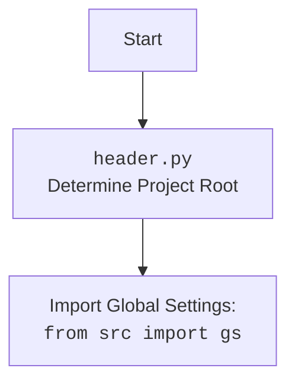

## ИНСТРУКЦИЯ:

Анализируй предоставленный код подробно и объясни его функциональность. Ответ должен включать три раздела:

1. **<алгоритм>**: Опиши рабочий процесс в виде пошаговой блок-схемы, включая примеры для каждого логического блока, и проиллюстрируй поток данных между функциями, классами или методами.
2. **<mermaid>**: Напиши код для диаграммы в формате `mermaid`, проанализируй и объясни все зависимости,
    которые импортируются при создании диаграммы.
    **ВАЖНО!** Убедитесь, что все имена переменных, используемые в диаграмме `mermaid`,
    имеют осмысленные и описательные имена. Имена переменных вроде `A`, `B`, `C`, и т.д., не допускаются!

    **Дополнительно**: Если в коде есть импорт `import header`, добавьте блок `mermaid` flowchart, объясняющий `header.py`:
    ```mermaid
    flowchart TD
        Start --> Header[<code>header.py</code><br> Determine Project Root]

        Header --> import[Import Global Settings: <br><code>from src import gs</code>]
    ```

3. **<объяснение>**: Предоставьте подробные объяснения:
   - **Импорты**: Их назначение и взаимосвязь с другими пакетами `src.`.
   - **Классы**: Их роль, атрибуты, методы и взаимодействие с другими компонентами проекта.
   - **Функции**: Их аргументы, возвращаемые значения, назначение и примеры.
   - **Переменные**: Их типы и использование.
   - Выделите потенциальные ошибки или области для улучшения.

Дополнительно, постройте цепочку взаимосвязей с другими частями проекта (если применимо).

Это обеспечивает всесторонний и структурированный анализ кода.
## Формат ответа: `.md` (markdown)
**КОНЕЦ ИНСТРУКЦИИ**
```

## <алгоритм>

**Блок-схема работы модуля `product_translator.py`:**

```mermaid
graph LR
    A[Начало] --> B{get_translations_from_presta_translations_table<br>(product_reference, i18n)};
    B --"Получение данных из БД"--> C{ProductTranslationsManager<br>select_record};
    C --> D[Возвращает список переводов];
    D --> E{insert_new_translation_to_presta_translations_table<br>(record)};
    E -- "Запись в БД"-->F{ProductTranslationsManager<br>insert_record};
    F --> G[Завершение записи];
    G --> H{translate_record<br>(record, from_locale, to_locale)};
    H -- "Перевод с помощью AI" --> I{translate<br>(record, from_locale, to_locale)};
    I --> J[Возвращает переведенную запись];
    J --> K[Завершение];

    style A fill:#f9f,stroke:#333,stroke-width:2px
    style K fill:#ccf,stroke:#333,stroke-width:2px
```

**Примеры:**

1.  **`get_translations_from_presta_translations_table`**:
    *   **Входные данные**: `product_reference = "PRODUCT123"`, `i18n = "ru-RU"`.
    *   **Процесс**: Функция создает фильтр `{'product_reference': 'PRODUCT123'}` и обращается к `ProductTranslationsManager` для извлечения переводов.
    *   **Возвращаемое значение**: Список словарей, представляющих переводы для товара `PRODUCT123`, например:
        ```python
        [
            {'product_reference': 'PRODUCT123', 'locale': 'ru-RU', 'name': 'Название продукта', ...},
            {'product_reference': 'PRODUCT123', 'locale': 'en-US', 'name': 'Product Name', ...}
        ]
        ```
2.  **`insert_new_translation_to_presta_translations_table`**:
    *   **Входные данные**: `record = {'product_reference': 'PRODUCT456', 'locale': 'fr-FR', 'name': 'Nom du produit', ...}`.
    *   **Процесс**: Функция передает словарь `record` в `ProductTranslationsManager` для записи в базу данных.
    *   **Возвращаемое значение**: Нет явного возвращаемого значения, но запись добавляется в базу данных.
3.  **`translate_record`**:
    *   **Входные данные**: `record = {'name': 'Product Name', 'description': 'A product description'}, from_locale = 'en-US', to_locale = 'ru-RU'`.
    *   **Процесс**: Функция вызывает функцию `translate` из `src.ai.openai` для перевода полей `name` и `description`.
    *   **Возвращаемое значение**: Словарь с переведенными значениями, например:
        ```python
        {'name': 'Название продукта', 'description': 'Описание продукта'}
        ```
    *   **Последующие действия**: Должна быть добавлена обработка переведенной записи (пока что в коде это `...`).

## <mermaid>

```mermaid
flowchart TD
    A[Start] --> B(ProductTranslator);
    B --> C[Import Global Settings: <br> <code>from src import gs</code>];
    B --> D[Import Logger: <br> <code>from src.logger.logger import logger</code>];
    B --> E[Import JSON Utils: <br> <code>from src.utils.jjson import j_loads_ns, j_dumps, pprint</code>];
    B --> F[Import ProductTranslationsManager: <br> <code>from src.db import ProductTranslationsManager</code>];
    B --> G[Import OpenAI Translator: <br> <code>from src.ai.openai import translate</code>];
    B --> H[Import PrestaShop Endpoint: <br> <code>from src.endpoints.PrestaShop import PrestaShop</code>];

    C --> I[Function: get_translations_from_presta_translations_table]
    I --> J[ProductTranslationsManager.select_record()]
    J --> I
    I --> K[Return translations List]
    K-->L[End]

    C --> M[Function: insert_new_translation_to_presta_translations_table]
    M --> N[ProductTranslationsManager.insert_record()]
    N--> M
    M --> O[End]

     C --> P[Function: translate_record]
    P-->Q[Call OpenAI Translate API]
    Q--> P
    P --> R[Return translated record]
    R-->S[End]


    style A fill:#f9f,stroke:#333,stroke-width:2px
    style L fill:#ccf,stroke:#333,stroke-width:2px
    style O fill:#ccf,stroke:#333,stroke-width:2px
    style S fill:#ccf,stroke:#333,stroke-width:2px
```


**Описание зависимостей:**

*   **`from src import gs`**: Импортирует глобальные настройки проекта из модуля `gs` (предположительно `src/gs.py`). Этот модуль, вероятно, содержит общие настройки, используемые во всем проекте.
*   **`from src.logger.logger import logger`**: Импортирует объект `logger` для записи логов. Этот модуль предназначен для ведения журнала событий, что помогает отслеживать работу программы и выявлять ошибки.
*   **`from src.utils.jjson import j_loads_ns, j_dumps, pprint`**: Импортирует функции для работы с JSON, включая:
    *   `j_loads_ns`: Загружает JSON данные, вероятно с обработкой пространств имен.
    *   `j_dumps`: Сериализует данные в JSON.
    *   `pprint`: Выводит JSON в удобном для чтения формате.
*   **`from src.db import ProductTranslationsManager`**: Импортирует класс `ProductTranslationsManager`, который отвечает за взаимодействие с базой данных для получения и сохранения переводов товаров.
*   **`from src.ai.openai import translate`**: Импортирует функцию `translate` из модуля `openai`, которая вызывает API OpenAI для перевода текста.
*   **`from src.endpoints.PrestaShop import PrestaShop`**: Импортирует класс `PrestaShop`, который обеспечивает взаимодействие с API PrestaShop для получения данных о товарах и обновления их.

## <объяснение>

### Импорты

*   **`from pathlib import Path`**: Предоставляет класс `Path` для работы с путями файловой системы. Этот импорт не используется в предоставленном коде, но часто используется для определения путей к файлам и папкам, что может быть нужно в дальнейшем.
*   **`from typing import List, Dict`**: Используется для аннотации типов данных, что улучшает читаемость и помогает выявлять ошибки на ранних этапах разработки.
    *   `List`: Указывает, что переменная является списком.
    *   `Dict`: Указывает, что переменная является словарем.
*   **`from src import gs`**: Импортирует глобальные настройки проекта, как описано выше.
*   **`from src.logger.logger import logger`**: Импортирует инструмент для логирования.
*   **`from src.utils.jjson import j_loads_ns, j_dumps, pprint`**: Импортирует инструменты для работы с JSON.
*   **`from src.db import ProductTranslationsManager`**: Импортирует класс для работы с базой данных переводов.
*   **`from src.ai.openai import translate`**: Импортирует функцию для перевода текста с помощью OpenAI.
*   **`from src.endpoints.PrestaShop import PrestaShop`**: Импортирует класс для взаимодействия с PrestaShop API.

### Классы

*   **`ProductTranslationsManager`**:
    *   **Роль**: Управляет доступом к базе данных, где хранятся переводы товаров.
    *   **Атрибуты**: Класс, скорее всего, содержит атрибуты для подключения к базе данных и методы для выполнения запросов.
    *   **Методы**:
        *   `select_record(**search_filter)`: Извлекает записи из базы данных по заданному фильтру.
        *   `insert_record(record)`: Вставляет новую запись в базу данных.
    *   **Взаимодействие**: Используется функциями `get_translations_from_presta_translations_table` и `insert_new_translation_to_presta_translations_table` для получения и записи данных.
*   **`PrestaShop`**:
    *   **Роль**: Обеспечивает связь с API PrestaShop.
    *   **Атрибуты**: Содержит параметры подключения к PrestaShop (например, URL, API ключ).
    *   **Методы**: Предоставляет методы для получения данных о товарах, обновления их свойств и т.д.
    *   **Взаимодействие**: Данный класс импортируется, но не используется непосредственно в приведенном коде. Вероятно используется в других частях проекта.

### Функции

*   **`get_translations_from_presta_translations_table(product_reference: str, i18n: str = None) -> list`**:
    *   **Аргументы**:
        *   `product_reference`: Уникальный идентификатор товара (строка).
        *   `i18n`: Локаль (например, 'ru-RU', 'en-US'), по умолчанию `None`.
    *   **Возвращаемое значение**: Список словарей, представляющих переводы для заданного товара.
    *   **Назначение**: Получает переводы товара из базы данных.
    *   **Пример**:
        ```python
        translations = get_translations_from_presta_translations_table("PRODUCT123", "ru-RU")
        print(translations)
        # Вывод: [{'product_reference': 'PRODUCT123', 'locale': 'ru-RU', 'name': 'Название продукта', ...}, ...]
        ```
*   **`insert_new_translation_to_presta_translations_table(record)`**:
    *   **Аргументы**: `record`: Словарь с данными для добавления в базу данных.
    *   **Возвращаемое значение**: Нет явного возвращаемого значения.
    *   **Назначение**: Записывает новый перевод товара в базу данных.
    *   **Пример**:
        ```python
        new_translation = {'product_reference': 'PRODUCT456', 'locale': 'fr-FR', 'name': 'Nom du produit', ...}
        insert_new_translation_to_presta_translations_table(new_translation)
        # Запись new_translation будет добавлена в базу данных.
        ```
*   **`translate_record(record: dict, from_locale: str, to_locale: str) -> dict`**:
    *   **Аргументы**:
        *   `record`: Словарь с текстом для перевода.
        *   `from_locale`: Локаль исходного текста (например, 'en-US').
        *   `to_locale`: Локаль, на которую нужно перевести текст (например, 'ru-RU').
    *   **Возвращаемое значение**: Словарь с переведенным текстом.
    *   **Назначение**: Переводит текст с использованием API OpenAI.
    *   **Пример**:
        ```python
        record_to_translate = {'name': 'Product Name', 'description': 'A product description'}
        translated_record = translate_record(record_to_translate, "en-US", "ru-RU")
        print(translated_record)
        # Вывод: {'name': 'Название продукта', 'description': 'Описание продукта'}
        ```

### Переменные

*   Переменные внутри функций имеют локальную область видимости и используются для хранения промежуточных данных, таких как фильтры поиска, данные для записи в базу и т.д.

### Потенциальные ошибки и области для улучшения

*   **Обработка ошибок**: В коде отсутствует явная обработка ошибок (например, при работе с базой данных или API OpenAI). Необходимо добавить блоки try-except для корректной обработки исключений.
*   **Логирование**: Необходимо добавить логирование важных событий, таких как успешные и неуспешные операции с базой данных, переводы и т.д.
*   **Обработка переведенной записи**: В функции `translate_record` есть комментарий `# Добавить обработку переведенной записи`. Необходимо реализовать эту часть, например, обновить запись в базе данных или отправить данные в PrestaShop.
*   **Гибкость локалей**: В коде не предусмотрена гибкость для автоматического определения локали, если она не задана. В закомментированном коде есть пример определения локали, но он закомментирован. Необходимо реализовать механизм автоматического определения локали.
*   **Производительность**: При большом количестве записей может потребоваться оптимизация запросов к базе данных.
*   **Безопасность**: Следует убедиться, что все API ключи и другие конфиденциальные данные хранятся безопасно и не попадают в код.
*   **Масштабируемость**: При увеличении объема данных может потребоваться рефакторинг для обеспечения масштабируемости.

### Взаимосвязи с другими частями проекта

*   **`src.gs`**: Используется для получения глобальных настроек, которые могут включать параметры подключения к базе данных, API ключи и другие настройки.
*   **`src.logger`**: Используется для записи логов, что помогает отслеживать работу модуля и выявлять ошибки.
*   **`src.utils.jjson`**: Используется для работы с JSON данными, которые могут передаваться между модулями или использоваться в API.
*   **`src.db`**: Обеспечивает доступ к базе данных, где хранятся переводы товаров.
*   **`src.ai.openai`**: Используется для перевода текста с помощью OpenAI API.
*   **`src.endpoints.PrestaShop`**: Обеспечивает связь с PrestaShop API, что позволяет получать данные о товарах и обновлять их свойства.

В целом, данный модуль является важной частью системы для управления переводами товаров. Он обеспечивает связь между словарем полей товара, базой данных переводов и переводчиком на основе OpenAI API.