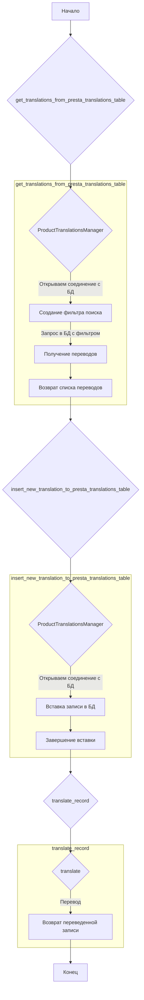
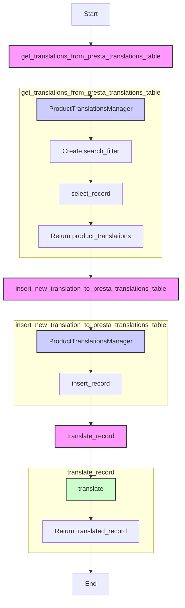

## ИНСТРУКЦИЯ:

Анализируй предоставленный код подробно и объясни его функциональность. Ответ должен включать три раздела:

1.  **<алгоритм>**: Опиши рабочий процесс в виде пошаговой блок-схемы, включая примеры для каждого логического блока, и проиллюстрируй поток данных между функциями, классами или методами.
2.  **<mermaid>**: Напиши код для диаграммы в формате `mermaid`, проанализируй и объясни все зависимости,
    которые импортируются при создании диаграммы.
    **ВАЖНО!** Убедитесь, что все имена переменных, используемые в диаграмме `mermaid`,
    имеют осмысленные и описательные имена. Имена переменных вроде `A`, `B`, `C`, и т.д., не допускаются!

    **Дополнительно**: Если в коде есть импорт `import header`, добавьте блок `mermaid` flowchart, объясняющий `header.py`:
    ```mermaid
    flowchart TD
        Start --> Header[<code>header.py</code><br> Determine Project Root]

        Header --> import[Import Global Settings: <br><code>from src import gs</code>]
    ```

3.  **<объяснение>**: Предоставьте подробные объяснения:
    -   **Импорты**: Их назначение и взаимосвязь с другими пакетами `src.`.
    -   **Классы**: Их роль, атрибуты, методы и взаимодействие с другими компонентами проекта.
    -   **Функции**: Их аргументы, возвращаемые значения, назначение и примеры.
    -   **Переменные**: Их типы и использование.
    -   Выделите потенциальные ошибки или области для улучшения.

Дополнительно, постройте цепочку взаимосвязей с другими частями проекта (если применимо).

Это обеспечивает всесторонний и структурированный анализ кода.
## Формат ответа: `.md` (markdown)
**КОНЕЦ ИНСТРУКЦИИ**

## <алгоритм>



### Пошаговое описание алгоритма:

1.  **`get_translations_from_presta_translations_table`**:
    *   **Входные данные**: `product_reference` (строка, например, 'PRODUCT123'), `credentials` (словарь с данными для подключения к базе данных), `i18n` (строка, код языка, например, 'ru-RU', опционально).
    *   **Действие**:
        *   Создается экземпляр `ProductTranslationsManager`, который устанавливает соединение с базой данных.
        *   Формируется фильтр поиска `search_filter` на основе `product_reference`.
        *   Вызывается метод `select_record` с фильтром для извлечения переводов.
    *   **Выходные данные**: `product_translations` (список словарей с переводами или пустой список, если переводов нет).
2.  **`insert_new_translation_to_presta_translations_table`**:
    *   **Входные данные**: `record` (словарь с данными для вставки, например, `{'product_reference': 'PRODUCT123', 'lang': 'ru-RU', 'field_name': 'name', 'translation': 'Новый продукт'} `), `credentials` (словарь с данными для подключения к базе данных).
    *   **Действие**:
        *   Создается экземпляр `ProductTranslationsManager`, который устанавливает соединение с базой данных.
        *   Вызывается метод `insert_record` для вставки записи в таблицу переводов.
    *   **Выходные данные**: None
3.  **`translate_record`**:
    *   **Входные данные**: `record` (словарь с данными, которые нужно перевести, например, `{'name': 'Product Name', 'description': 'Product Description'}`), `from_locale` (строка, код исходного языка, например, 'en_EN'), `to_locale` (строка, код целевого языка, например, 'ru-RU').
    *   **Действие**:
        *   Вызывается функция `translate` из модуля `src.ai`, которая выполняет перевод полей `record`.
        *   (Здесь есть TODO, подразумевающий добавление дальнейшей обработки переведенной записи).
    *   **Выходные данные**: `translated_record` (словарь с переведенными значениями).

## <mermaid>



### Анализ зависимостей `mermaid`:
*   **`Start`**: Начало процесса.
*   **`GetTranslations`**: Функция `get_translations_from_presta_translations_table`.
*   **`ProductTranslationsManager1`**: Менеджер для работы с таблицей переводов (контекстный менеджер).
*   **`CreateFilter`**: Создание фильтра для поиска.
*   **`SelectRecord`**: Метод для выборки записи из базы данных.
*   **`ReturnTranslations`**: Возвращает результат запроса (список словарей переводов).
*   **`InsertTranslation`**: Функция `insert_new_translation_to_presta_translations_table`.
*   **`ProductTranslationsManager2`**:  Менеджер для работы с таблицей переводов (контекстный менеджер).
*   **`InsertRecord`**: Метод для вставки новой записи в базу данных.
*    **`TranslateRecord`**: Функция `translate_record`.
*   **`TranslateAI`**: Функция `translate` из модуля `src.ai`, выполняет перевод.
*   **`ReturnTranslatedRecord`**: Возвращает переведенную запись.
*   **`End`**: Конец процесса.

### Зависимости импорта:
*   `pathlib.Path`: Для работы с путями в файловой системе (не используется в предоставленном коде).
*   `typing.List`, `typing.Dict`: Для аннотации типов (не используется в предоставленном коде).
*   `src.gs`: Модуль глобальных настроек.
*   `src.utils.printer.pprint`: Для "красивого" вывода данных (не используется в предоставленном коде).
*   `src.product.product_fields.product_fields.record`: Модуль для работы с полями товара (не используется напрямую в предоставленном коде).
*   `src.db.ProductTranslationsManager`: Менеджер для работы с базой данных переводов.
*   `src.ai.translate`: Функция для выполнения перевода.
*   `src.endpoints.PrestaShop.PrestaShop`: Класс для взаимодействия с PrestaShop (не используется в предоставленном коде).

## <объяснение>

### Импорты:

*   `pathlib.Path`: Предоставляет способ работы с путями файлов и каталогов. Здесь не используется, но может быть добавлен для будущих расширений.
*   `typing.List`, `typing.Dict`:  Используются для аннотации типов, что повышает читаемость кода и помогает в отладке. В предоставленном коде не используются, но их импорт подразумевает, что в дальнейшем они могут понадобиться.
*   `src.gs`: Импорт модуля глобальных настроек (`gs`). Этот модуль, скорее всего, содержит настройки, которые используются в разных частях проекта, например, параметры подключения к базе данных.
*   `src.utils.printer.pprint`: Функция для удобного вывода структур данных. Здесь не используется.
*   `src.product.product_fields.product_fields.record`: Импорт класса или модуля `record` для работы с полями продукта, хотя не используется напрямую в текущем коде, подразумевает, что он может использоваться для обработки данных о продуктах.
*   `src.db.ProductTranslationsManager`: Импорт менеджера для работы с таблицей переводов продуктов в базе данных.  Используется как контекстный менеджер для управления соединениями.
*    `src.ai.translate`: Функция для перевода текста, скорее всего, использует API внешнего сервиса или локальную модель.
*   `src.endpoints.PrestaShop.PrestaShop`:  Импортируется класс для взаимодействия с PrestaShop API, но не используется в текущем коде.

### Функции:

1.  **`get_translations_from_presta_translations_table(product_reference: str, credentials: dict, i18n: str = None) -> list`**:
    *   **Аргументы**:
        *   `product_reference` (str): Уникальный идентификатор товара.
        *   `credentials` (dict): Словарь с данными для подключения к базе данных (например, имя пользователя, пароль, хост, база данных).
        *   `i18n` (str, опционально): Код языка перевода (например, 'en_EN', 'ru-RU').
    *   **Возвращаемое значение**:
        *   `list`: Список словарей, где каждый словарь содержит перевод для конкретного поля товара.
    *   **Назначение**: Извлекает переводы для товара из таблицы переводов.
    *   **Пример**:

        ```python
        credentials = {
            'host': 'localhost',
            'user': 'user',
            'password': 'password',
            'database': 'prestashop_db'
        }
        translations = get_translations_from_presta_translations_table('PRODUCT123', credentials, 'ru-RU')
        # translations будет содержать список словарей с переводами для PRODUCT123 на русском языке.
        ```
2.  **`insert_new_translation_to_presta_translations_table(record: dict, credentials: dict)`**:
    *   **Аргументы**:
        *   `record` (dict): Словарь с данными для вставки в таблицу переводов (например, `{'product_reference': 'PRODUCT123', 'lang': 'ru-RU', 'field_name': 'name', 'translation': 'Новый продукт'}`).
        *   `credentials` (dict): Словарь с данными для подключения к базе данных.
    *   **Возвращаемое значение**: None
    *   **Назначение**: Добавляет новую запись перевода в таблицу.
    *   **Пример**:

        ```python
        new_translation = {
            'product_reference': 'PRODUCT123',
            'lang': 'ru-RU',
            'field_name': 'name',
            'translation': 'Новый продукт'
        }
        credentials = {
            'host': 'localhost',
            'user': 'user',
            'password': 'password',
            'database': 'prestashop_db'
        }
        insert_new_translation_to_presta_translations_table(new_translation, credentials)
        # новая запись будет добавлена в таблицу переводов
        ```
3.  **`translate_record(record: dict, from_locale: str, to_locale: str) -> dict`**:
    *   **Аргументы**:
        *   `record` (dict): Словарь с полями для перевода.
        *   `from_locale` (str): Код исходного языка (например, 'en_EN').
        *   `to_locale` (str): Код целевого языка (например, 'ru-RU').
    *   **Возвращаемое значение**:
        *   `dict`: Словарь с переведенными значениями.
    *   **Назначение**: Переводит поля записи с одного языка на другой.
    *   **Пример**:

        ```python
        product_data = {'name': 'Product Name', 'description': 'Product Description'}
        translated_data = translate_record(product_data, 'en_EN', 'ru-RU')
        # translated_data будет содержать перевод полей на русский язык
        ```

### Переменные:

*   `product_reference` (str): Уникальный идентификатор продукта (используется как ключ для поиска в таблице переводов).
*    `credentials` (dict): Словарь с параметрами подключения к базе данных.
*   `i18n` (str): Код языка перевода.
*   `translations_manager`: Экземпляр класса `ProductTranslationsManager` для управления доступом к таблице переводов.
*   `search_filter` (dict): Словарь для фильтрации записей при выборке из базы данных.
*   `product_translations` (list): Список словарей, содержащих переводы для товара.
*   `record` (dict): Словарь с данными для вставки в таблицу переводов.
*   `from_locale` (str): Код исходного языка.
*   `to_locale` (str): Код целевого языка.
*    `translated_record` (dict): Словарь с переведенными значениями.

### Области для улучшения и потенциальные ошибки:

1.  **Обработка ошибок:** Код не содержит обработки исключений, например, ошибок подключения к базе данных или ошибок перевода. Это может привести к падениям программы.
2.  **TODO в `translate_record`**: Не хватает обработки переведенной записи. Это может включать сохранение перевода, логирование или другие действия.
3.  **Формат `i18n`**: В комментариях указано, что нужно продумать парсер для `en_EN`, `he_HE`, `ru-RU`. Возможно стоит использовать более стандартизованный формат кодов языка или библиотеку для работы с языками и локалями.
4.  **Неиспользуемые импорты**: Некоторые импорты, такие как `Path`, `List`, `Dict`, `pprint` и `PrestaShop`, не используются в представленном коде. Их можно удалить или использовать в будущем.
5.  **Цепочка взаимосвязей:**
    *   Модуль `translate_product_fields.py` взаимодействует с:
        *   `ProductTranslationsManager` для доступа к базе данных.
        *   `src.ai.translate` для перевода.
        *   Модулем `src.gs` для получения настроек.
    *   Этот модуль является частью слоя перевода, который обеспечивает функциональность перевода полей продукта, что, в свою очередь, может быть частью более крупной системы управления продуктами для электронной коммерции.

### Дополнительные замечания:

*   Контекстный менеджер `ProductTranslationsManager` обеспечивает правильное управление соединениями с базой данных, что хорошо с точки зрения безопасности и ресурсов.
*   Код хорошо структурирован с точки зрения разделения ответственности (например, отдельная функция для перевода, отдельная для работы с БД).
*   Использование аннотаций типов делает код более понятным и поддерживаемым.

## ```mermaid
flowchart TD
    Start --> Header[<code>header.py</code><br> Determine Project Root]

    Header --> import[Import Global Settings: <br><code>from src import gs</code>]
```