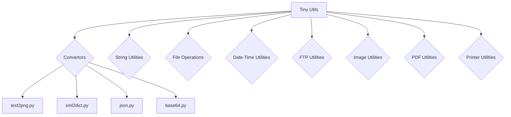

# <input code>

```
# Tiny Utils

**Tiny Utils** is a utility library providing a collection of lightweight helper functions for various common tasks. This library includes utilities for data format conversion, text and file manipulation, string operations, date-time formatting, image processing, and more. It is organized into several modules for easy access to specific functionalities.

## Table of Contents

- [Tiny Utils](#tiny-utils)
  - [Table of Contents](#table-of-contents)
  - [Installation](#installation)
  - [Modules Overview](#modules-overview)
  - [Module Descriptions](#module-descriptions)
    - [Convertors](#convertors)
      - [Files:](#files)
    - [String Utilities](#string-utilities)
    - [File Operations](#file-operations)
    - [Date-Time Utilities](#date-time-utilities)
    - [FTP Utilities](#ftp-utilities)
    - [Image Utilities](#image-utilities)
    - [PDF Utilities](#pdf-utilities)
    - [Printer Utilities](#printer-utilities)
  - [Usage Examples](#usage-examples)
    - [Convert Text to PNG Image](#convert-text-to-png-image)
    - [Convert XML to Dictionary](#convert-xml-to-dictionary)
    - [Parse and Manipulate JSON](#parse-and-manipulate-json)
  - [Contributing](#contributing)
  - [License](#license)

## Installation

To use **Tiny Utils**, clone the repository and install any necessary dependencies as specified in the `requirements.txt` file.

```bash
git clone https://github.com/hypo69/tiny-utils.git
cd tiny_utils
pip install -r requirements.txt
```

## Modules Overview

This library contains several sub-modules, each handling a specific task:

- **Convertors**: Modules for converting data formats, such as text-to-image, webp-to-png, JSON, XML, Base64 encoding, and more.
- **String Utilities**: Tools for advanced string manipulation.
- **File Operations**: Functions for file handling and manipulation.
- **Date-Time Utilities**: Tools for date and time formatting.
- **FTP Utilities**: FTP file handling functions.
- **Image Utilities**: Basic image processing functions.
- **PDF Utilities**: PDF file manipulation and conversion.
- **Printer Utilities**: Functions for sending data to a printer.

## Module Descriptions

### Convertors

The `convertors` module contains utilities for converting data between formats. These modules can handle diverse data types, from CSV to JSON and text to images.

#### Files:

- **text2png.py**: Converts text data to a PNG image file.
- **tts.py**: Converts text to speech and saves it as an audio file.
- **webp2png.py**: Converts images from WebP format to PNG format.
- **xls.py**: Handles conversions and manipulations of XLS files.
- **xml2dict.py**: Converts XML data to a Python dictionary.
- **base64.py**: Encodes or decodes data using Base64 encoding.
- **csv.py**: Provides CSV parsing and manipulation tools.
- **dict.py**: Utilities for handling Python dictionaries.
- **html.py**: Converts HTML content to various formats.
- **json.py**: Utilities for JSON parsing and manipulation.
- **md2dict.py**: Converts Markdown content to a dictionary.
- **ns.py**: Specialized namespace conversion utilities.

... (rest of the code)
```



```markdown
# <algorithm>

(No algorithm can be derived from the provided README.md file. It's a documentation, not code.)
```

```markdown
# <mermaid>


```markdown
# <explanation>

The provided code is a README.md file, not executable code. It's a documentation for a Python library called "Tiny Utils."

- **Импорты**: There are no imports in the provided code.  The README outlines the *potential* use of imports to use various modules within the `tiny_utils` library.  The code snippets in the "Usage Examples" section demonStarte how to import and use specific modules, like `text2png` or `xml2dict`, from the `tiny_utils` package.


- **Классы**: No classes are defined in the README. The documentation discusses that modules like `convertors`, `string`, `file`, etc. potentially contain classes, but no specific class definitions are shown.


- **Функции**:  The README describes various functions available within the different modules (e.g., `text2png.convert`, `xml2dict.convert`, `json.parse`).  The `Usage Examples` show how to call these functions and provide simple use-cases.


- **Переменные**:  The README details the types of data that might be used as arguments or returned by the functions (e.g., text, XML data, file paths).


- **Возможные ошибки или области для улучшений**: The README is a good start for documentation, but it lacks details about the actual implementation of the utilities.  Ideally, it should include examples for the various conversion methods, handling error cases and providing specific examples for different input types and scenarios for edge cases.


- **Взаимосвязи с другими частями проекта**: The README indicates that the library is structured in modules, implying relationships between different files (`text2png.py`, `xml2dict.py`, etc.) and the core `tiny_utils` package. The `requirements.txt` file shows that other Python packages might be dependencies.