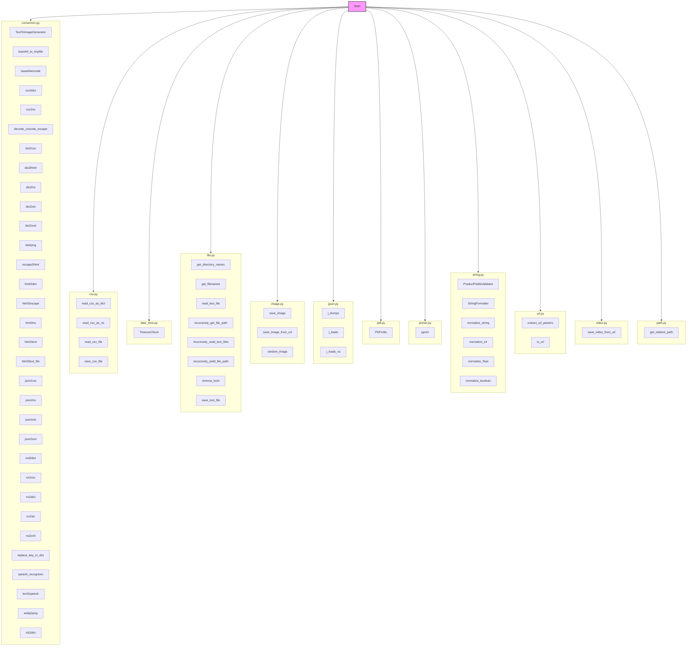

## Анализ кода `hypotez/src/utils/__init__.py`

### 1. <алгоритм>

1.  **Начало**: Загрузка модуля `__init__.py` из директории `src/utils`.
2.  **Импорт из `.convertors`**: Импортируются различные функции и класс `TextToImageGenerator` из модуля `convertors`, которые отвечают за преобразование различных форматов данных (текст, base64, csv, json, html, xml, dot, markdown, speech, webp). Например, `csv2dict` преобразует CSV в словарь, а `json2xls` преобразует JSON в XLSX.
3.  **Импорт из `.csv`**: Импортируются функции для работы с CSV файлами, такие как `read_csv_as_dict` (чтение CSV в словарь), `read_csv_as_ns` (чтение CSV в namespace), `read_csv_file` (чтение CSV файла), `save_csv_file` (сохранение CSV файла).
4.  **Импорт из `.date_time`**: Импортируется класс `TimeoutCheck` для проверки таймаутов.
5.  **Импорт из `.file`**: Импортируются функции для работы с файлами и директориями, такие как `get_directory_names` (получение имен директорий), `get_filenames` (получение имен файлов), `read_text_file` (чтение текстового файла), `recursively_get_file_path` (рекурсивное получение пути файла), `recursively_read_text_files` (рекурсивное чтение текстовых файлов), `recursively_yield_file_path` (рекурсивное получение пути файла с помощью yield), `remove_bom` (удаление BOM из файла) и `save_text_file` (сохранение текста в файл).
6.  **Импорт из `.image`**: Импортируются функции для работы с изображениями, такие как `save_image` (сохранение изображения), `save_image_from_url` (сохранение изображения из URL) и `random_image` (генерация случайного изображения).
7. **Импорт из `.jjson`**: Импортируются функции для работы с JSON, такие как `j_dumps` (сериализация в JSON), `j_loads` (десериализация из JSON) и `j_loads_ns` (десериализация JSON в namespace).
8.  **Импорт из `.pdf`**: Импортируется класс `PDFUtils` для работы с PDF файлами.
9.  **Импорт из `.printer`**: Импортируется функция `pprint` для красивого вывода данных.
10. **Импорт из `.string`**: Импортируются классы и функции для работы со строками, такие как `ProductFieldsValidator` (валидатор полей продукта), `StringFormatter` (форматирование строк), `normalize_string` (нормализация строки), `normalize_int` (нормализация в целое число), `normalize_float` (нормализация в число с плавающей точкой), `normalize_boolean` (нормализация в boolean).
11. **Импорт из `.url`**: Импортируются функции для работы с URL, такие как `extract_url_params` (извлечение параметров из URL) и `is_url` (проверка, является ли строка URL).
12. **Импорт из `.video`**: Импортируется функция `save_video_from_url` для сохранения видео из URL.
13. **Импорт из `.path`**: Импортируется функция `get_relative_path` для работы с путями.
14. **Конец**: Модуль `src.utils` готов к использованию, предоставляя импортированные утилиты для работы с данными, файлами, изображениями, строками, URL и т.д.

### 2. <mermaid>

**Объяснение зависимостей в `mermaid` диаграмме:**

*   Диаграмма показывает структуру модуля `src.utils`, где каждый подмодуль (`convertors`, `csv`, `date_time`, `file`, `image`, `jjson`, `pdf`, `printer`, `string`, `url`, `video`, `path`) представлен как подграф (subgraph).
*   Внутри каждого подграфа перечислены функции и классы, которые импортируются в `__init__.py`.
*   Стрелки указывают на импорт этих подмодулей в основной модуль `src.utils`.
*   `Start` узел представляет точку входа в модуль `src.utils`, откуда происходят импорты.
*   Стиль `style Start fill:#f9f,stroke:#333,stroke-width:2px` используется для визуального выделения `Start` узла.

### 3. <объяснение>

**Импорты:**

*   **Из `.convertors`**: Этот модуль содержит функции и класс для преобразования данных между различными форматами (например, из CSV в словарь, из JSON в Excel, кодирование/декодирование base64, преобразование HTML, работа с текстом, генерация изображений из текста, распознавание речи). Они являются основными инструментами для работы с данными в проекте.
*   **Из `.csv`**: Модуль содержит функции для чтения и записи CSV файлов. Они предоставляют удобный интерфейс для работы с табличными данными.
*   **Из `.date_time`**: Модуль содержит класс `TimeoutCheck`, который может использоваться для управления временем выполнения операций и контроля таймаутов.
*   **Из `.file`**: Этот модуль содержит функции для операций с файлами и директориями, такие как чтение, запись текстовых файлов, получение списка имен файлов и директорий. Эти функции упрощают работу с файловой системой.
*   **Из `.image`**: Модуль содержит функции для сохранения изображений из различных источников, включая URL. Включает работу со случайными изображениями.
*  **Из `.jjson`**: Модуль содержит функции для работы с JSON, включая кастомизацию функций сериализации/десериализации.
*   **Из `.pdf`**: Модуль содержит класс `PDFUtils` для работы с PDF файлами.
*   **Из `.printer`**: Модуль содержит функцию `pprint` для вывода отформатированного текста.
*   **Из `.string`**: Модуль содержит классы и функции для работы со строками, например, валидация, форматирование и нормализация. Эти утилиты полезны для обработки текстовых данных.
*   **Из `.url`**: Модуль содержит функции для работы с URL, например, извлечение параметров и проверка корректности URL.
*   **Из `.video`**: Модуль содержит функции для загрузки видео из URL.
*   **Из `.path`**: Модуль содержит функцию `get_relative_path` для работы с путями.

**Классы:**

*   **`TextToImageGenerator`**: Класс в модуле `convertors`, предназначен для генерации изображений из текста. Используется для визуализации текстовых данных.
*   **`TimeoutCheck`**: Класс в модуле `date_time`, используется для проверки таймаутов. Полезен для управления временем выполнения операций.
*   **`PDFUtils`**: Класс в модуле `pdf`, используется для работы с PDF файлами.
*   **`ProductFieldsValidator`**: Класс в модуле `string`, используется для валидации полей продукта.
*   **`StringFormatter`**: Класс в модуле `string`, используется для форматирования строк.

**Функции:**

Модуль содержит множество функций, каждая из которых выполняет определенную задачу. Например:
* `csv2dict`: Преобразует CSV данные в словарь.
* `read_csv_as_dict`: Читает CSV файл и возвращает его содержимое в виде словаря.
* `save_text_file`: Сохраняет текстовую строку в файл.
* `get_filenames`: Возвращает список имен файлов в указанной директории.
* `j_dumps`: Сериализует данные в JSON.
* `normalize_string`: Приводит строку к нормализованному виду.
* `extract_url_params`: Извлекает параметры из URL.

**Переменные:**

В данном коде нет явных глобальных переменных.

**Потенциальные ошибки и области для улучшения:**

*   **Избыточность импортов**: Импорт всех функций и классов из каждого модуля может привести к избыточному использованию памяти. Возможно, стоит пересмотреть импорты, чтобы импортировать только необходимые элементы.
*   **Отсутствие обработки ошибок**: В коде не предусмотрена явная обработка ошибок, что может привести к неожиданным сбоям. Следует добавить блоки try-except для обработки возможных исключений.
*   **Документация**: Код имеет комментарии, но желательно добавить docstring к каждой функции и классу для улучшения читаемости и понимания кода.
*  **Разделение на более мелкие модули**: Если в будущем функциональность модуля `utils` станет слишком большой, возможно, потребуется разбить его на более мелкие, чтобы улучшить организацию и облегчить сопровождение.
*   **Тестирование**: Отсутствие модульных тестов затрудняет проверку правильности работы утилит и выявление ошибок. Рекомендуется добавить тесты для каждой функции и класса.

**Взаимосвязь с другими частями проекта:**

Модуль `src.utils` является общим модулем, который используется в различных частях проекта для выполнения общих задач, таких как преобразование данных, работа с файлами, строками, URL, и т.д. Этот модуль не зависит напрямую от других модулей проекта, но другие модули могут зависеть от его функциональности.

**Пример:**

Допустим, в другом модуле проекта `src.data_processing` необходимо прочитать данные из CSV файла, нормализовать строки и сохранить результат в JSON. Тогда, модуль `src.data_processing` может использовать функции `read_csv_as_dict` из `src.utils.csv`, `normalize_string` из `src.utils.string` и `j_dumps` из `src.utils.jjson`.