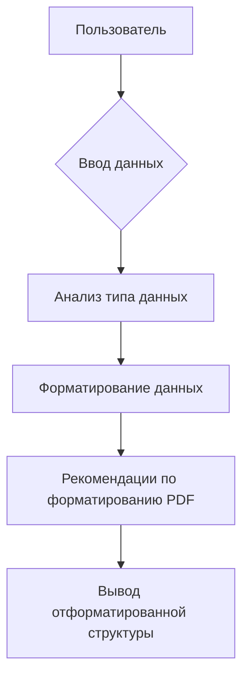

```MD
# Анализ кода

## <input code>

```python
```You are a Python code assistant. Your task is to analyze input data of various formats (JSON, CSV, XLS, Python objects) and convert them into structured content for creating PDFs.

Input data: {data}

Instructions:
1. Identify the data type (JSON, CSV, XLS, or Python object).
2. Provide a clear, structured representation of the data for creating a PDF. Include tables, headers, and hierarchical lists where applicable.
3. Suggest specific formatting details for tables and lists, such as column widths, font sizes, and styles.
4. Ensure that the output format is optimized for generating professional-looking PDFs.

Return the formatted data structure with comments explaining each section.
```
## <algorithm>

Алгоритм работы кода не представлен в виде явно определённых функций или классов. Код представляет собой инструкцию (prompt) для ассистента, описывающую задачу.  

Вместо блок-схемы можно описать последовательность действий ассистента:

1. Принимает на вход данные `{data}` в определённом формате (JSON, CSV, XLS или Python объект).
2. Определяет тип входных данных.
3. Формирует структурированное представление данных для создания PDF.  Это может включать таблицы, заголовки и иерархические списки.
4. Предлагает рекомендации по форматированию для создания профессионального PDF (например, ширина столбцов, размер шрифта).
5. Возвращает отформатированную структуру данных с комментариями.

## <mermaid>



**Объяснение диаграммы:**

* Пользователь вводит данные `{data}`.
* Ассистент анализирует тип данных.
* Ассистент форматирует данные в структурированном виде для создания PDF.
* Ассистент предлагает рекомендации по форматированию.
* Ассистент возвращает результат.

В этой диаграмме нет зависимостей от внешних библиотек или модулей, так как код представляет собой инструкцию, а не реализацию.

## <explanation>

**Импорты:**

Код не содержит импортов. Это инструкция, а не фрагмент кода для выполнения.

**Классы:**

Код не содержит определений классов.

**Функции:**

Код не содержит определений функций.  Это инструкция, задающая задачу обработке данных.

**Переменные:**

Код использует переменную `{data}` для представления входных данных.  Тип этой переменной зависит от входных данных, которые могут быть различными типами (JSON, CSV, XLS, Python объекты).

**Возможные ошибки и улучшения:**

* **Не определен способ обработки ошибок:**  Инструкция не содержит логики обработки ошибок, связанных с неправильными типами данных или невалидными форматами.
* **Не указан конкретный формат для отформатированных данных:** Необходимо уточнить формат (например, JSON, YAML), в котором должен быть возвращен отформатированный результат.
* **Отсутствие конкретного алгоритма обработки данных:**  Не определены критерии обработки данных разных типов (JSON, CSV, XLS).

**Цепочка взаимосвязей с другими частями проекта:**

Эта инструкция предназначена для использования в качестве входных данных для вспомогательного инструмента (библиотеки или инструментария), который будет выполнять фактическую работу по обработке данных и генерации PDF.  Эта библиотека или инструмент не представлен в этом фрагменте кода.  Поэтому взаимосвязи с другими частями проекта отсутствуют в этом примере.  Связь будет опосредована через этот prompt (инструкцию), который будет использоваться как входной параметр.