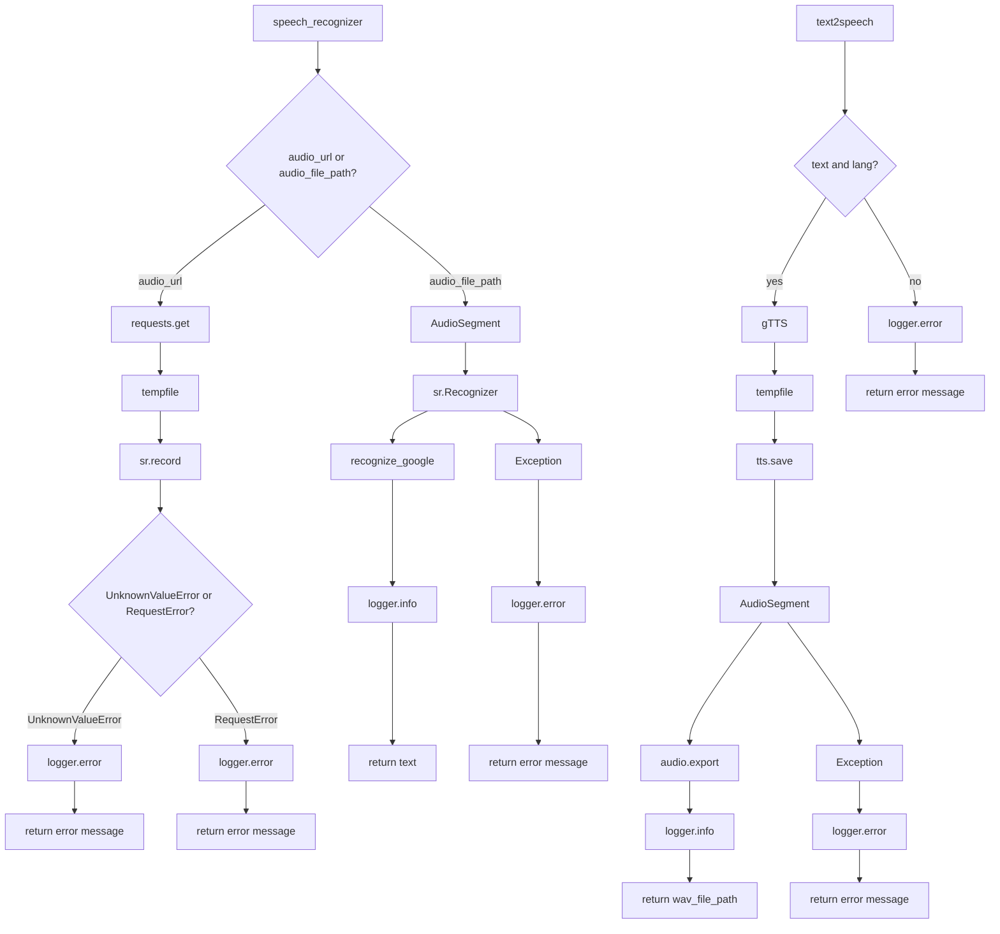

```MD
# <input code>

```python
## \file hypotez/src/utils/convertors/tts.py
# -*- coding: utf-8 -*-\

#! venv/bin/python/python3.12

"""
.. module: src.utils.convertors.tts 
	:platform: Windows, Unix
	:synopsis: speech recognition and text-to-speech conversion

"""


from pathlib import Path
import tempfile
import asyncio
import requests
import speech_recognition as sr  # Библиотека для распознавания речи
from pydub import AudioSegment  # Library for audio conversion
from gtts import gTTS  # Генерация текста в речь

from src.utils.jjson import j_loads, j_loads_ns, j_dumps
from src.logger import logger


def speech_recognizer(audio_url: str = None, audio_file_path: Path = None, language: str = 'ru-RU') -> str:
    """ Download an audio file and recognize speech in it.

    Args:
        audio_url (str, optional): URL of the audio file to be downloaded. Defaults to `None`.
        audio_file_path (Path, optional): Local path to an audio file. Defaults to `None`.
        language (str): Language code for recognition (e.g., 'ru-RU'). Defaults to 'ru-RU'.

    Returns:
        str: Recognized text from the audio or an error message.

    Example:
        .. code::

            recognized_text = speech_recognizer(audio_url='https://example.com/audio.ogg')
            print(recognized_text)  # Output: "Привет"
    """
    try:
        if audio_url:
            # Download the audio file
            response = requests.get(audio_url)
            audio_file_path = Path(tempfile.gettempdir()) / 'recognized_audio.ogg'

            with open(audio_file_path, 'wb') as f:
                f.write(response.content)

        # Convert OGG to WAV
        wav_file_path = audio_file_path.with_suffix('.wav')
        audio = AudioSegment.from_file(audio_file_path)  # Load the OGG file
        audio.export(wav_file_path, format='wav')  # Export as WAV

        # Initialize the recognizer
        recognizer = sr.Recognizer()
        with sr.AudioFile(str(wav_file_path)) as source:
            audio_data = recognizer.record(source)
            try:
                # Recognize speech using Google Speech Recognition
                text = recognizer.recognize_google(audio_data, language=language)
                logger.info(f'Recognized text: {text}')
                return text
            except sr.UnknownValueError:
                logger.error('Google Speech Recognition could not understand audio')
                return 'Sorry, I could not understand the audio.'
            except sr.RequestError as ex:
                logger.error('Could not request results from Google Speech Recognition service:', ex)
                return 'Could not request results from the speech recognition service.'
    except Exception as ex:
        logger.error('Error in speech recognizer:', ex)
        return 'Error during speech recognition.'


async def text2speech(text: str, lang: str = 'ru') -> str:
    """ Convert text to speech and save it as an audio file.

    Args:
        text (str): The text to be converted into speech.
        lang (str, optional): Language code for the speech (e.g., 'ru'). Defaults to 'ru'.

    Returns:
        str: Path to the generated audio file.

    Example:
        .. code::

            audio_path = await text2speech('Привет', lang='ru')
            print(audio_path)  # Output: "/tmp/response.mp3"
    """
    try:
        # Generate speech using gTTS
        tts = gTTS(text=text, lang=lang)
        audio_file_path = f'{tempfile.gettempdir()}/response.mp3'
        tts.save(audio_file_path)  # Save the audio file

        # Load and export audio using pydub
        audio = AudioSegment.from_file(audio_file_path, format='mp3')
        wav_file_path = audio_file_path.replace('.mp3', '.wav')
        audio.export(wav_file_path, format='wav')

        logger.info(f'TTS audio saved at: {wav_file_path}')
        return wav_file_path
    except Exception as ex:
        logger.error('Error in text2speech:', ex)
        return 'Error during text-to-speech conversion.'
```

# <algorithm>

**speech_recognizer:**

1. Принимает `audio_url` или `audio_file_path`.
2. Если `audio_url` предоставлен:
   - Скачивает аудио из `audio_url` в временный файл.
3. Преобразует загруженный аудиофайл из формата OGG в WAV.
4. Использует `speech_recognition` для распознавания речи.
5. Возвращает распознанный текст или сообщение об ошибке.


**text2speech:**

1. Принимает `text` и `lang`.
2. Использует `gTTS` для конвертации текста в аудио.
3. Сохраняет аудиофайл в временный каталог с расширением `.mp3`.
4. Использует `pydub` для конвертации `.mp3` в `.wav`.
5. Возвращает путь к сохраненному файлу `.wav`.


# <mermaid>



**Зависимости:**

* **`requests`**: Загрузка аудио с `audio_url`.
* **`speech_recognition`**: Распознавание речи.
* **`pydub`**: Конвертация аудиоформатов (OGG -> WAV, MP3 -> WAV).
* **`gtts`**: Генерация речи.
* **`pathlib`**: Работа с путями к файлам.
* **`tempfile`**: Создание временных файлов.
* **`asyncio`**: (Возможно, используется для асинхронности, но в данном коде не используется для этого).
* **`logger`**: (Из `src.logger`) - логирование ошибок и сообщений.
* **`jjson`**: (Из `src.utils.jjson`) - Возможно, для работы с JSON, но не используется в данном коде напрямую.

# <explanation>

**Импорты:**

* `from pathlib import Path`:  Используется для работы с путями к файлам в объектно-ориентированном стиле.
* `import tempfile`:  Создает временные файлы для промежуточных результатов.
* `import asyncio`:  Асинхронные операции (не используются в этом конкретном коде).
* `import requests`:  Загружает аудиофайлы по URL.
* `import speech_recognition as sr`:  Библиотека распознавания речи, реализует интерфейс для Google Cloud Speech API.
* `from pydub import AudioSegment`:  Конвертирует аудиофайлы между форматами (например, OGG в WAV).
* `from gtts import gTTS`:  Генерирует речь из текста.
* `from src.utils.jjson import j_loads, j_loads_ns, j_dumps`:  Предположительно для работы с JSON данными.
* `from src.logger import logger`:  Модуль для логирования, использует логирование для отслеживания событий и ошибок в приложении.

**Классы:**

Нет явных классов в этом коде.

**Функции:**

* **`speech_recognizer(audio_url=None, audio_file_path=None, language='ru-RU')`**:  Распознает речь из аудио.
    * Аргументы: `audio_url` (URL аудио), `audio_file_path` (локальный путь к аудио), `language` (язык).
    * Возвращаемое значение:  распознанный текст или сообщение об ошибке.
    * Пример использования: `speech_recognizer(audio_url='https://example.com/audio.ogg')`.
* **`text2speech(text, lang='ru')`**: Преобразует текст в речь.
    * Аргументы: `text` (текст для преобразования), `lang` (язык).
    * Возвращаемое значение:  путь к сохраненному аудиофайлу (в формате .wav).
    * Пример использования: `await text2speech('Привет', lang='ru')`.

**Переменные:**

* ``:  Вероятно, константа для определения режима работы (например, дебаг или продакшен).
* `audio_url`, `audio_file_path`, `language`, `text`, `lang`:  Переменные, хранящие данные, используемые в функциях.

**Возможные ошибки и улучшения:**

* **Обработка ошибок:** В обеих функциях `speech_recognizer` и `text2speech` есть `try...except` блоки, но они могут быть улучшены для более конкретных типов ошибок.
* **Управление ресурсами:** Временные файлы должны удаляться после использования.
* **Обработка кодировок:** Добавить явную обработку кодировок (например, используя `encoding='utf-8'`) для работы с файлами в разных кодировках.
* **Асинхронность:** При использовании `asyncio` в `speech_recognizer` можно сделать загрузку аудио и конвертацию  асинхронными, что ускорит работу.
* **Управление исключениями:** Обработка более подробных исключений, например, исключение, если загрузка аудио не удалась, или если проблема с форматом файла.
* **Валидация ввода:** Функции должны проверять корректность входных данных (например, валидность URL).


**Взаимосвязи с другими частями проекта:**

Функции `speech_recognizer` и `text2speech` взаимодействуют с модулями `requests`, `speech_recognition`, `pydub`, `gtts` для выполнения своих задач.  Они зависят от `logger` для логирования информации. `jjson` вероятно используется для сериализации/десериализации данных, но прямых взаимодействий в этом примере нет.