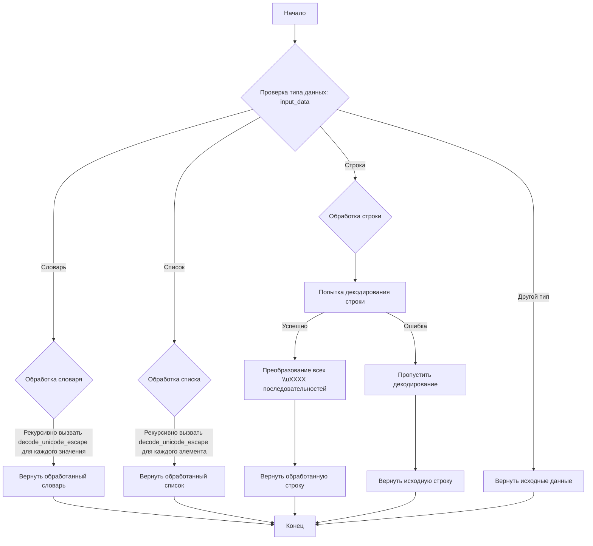
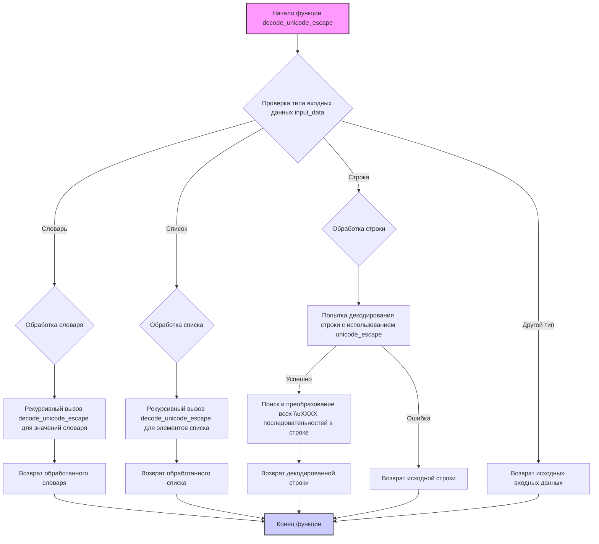

## ИНСТРУКЦИЯ:

Анализируй предоставленный код подробно и объясни его функциональность. Ответ должен включать три раздела:

1.  **<алгоритм>**: Опиши рабочий процесс в виде пошаговой блок-схемы, включая примеры для каждого логического блока, и проиллюстрируй поток данных между функциями, классами или методами.
2.  **<mermaid>**: Напиши код для диаграммы в формате `mermaid`, проанализируй и объясни все зависимости,
    которые импортируются при создании диаграммы.
    **ВАЖНО!** Убедитесь, что все имена переменных, используемые в диаграмме `mermaid`,
    имеют осмысленные и описательные имена. Имена переменных вроде `A`, `B`, `C`, и т.д., не допускаются!

    **Дополнительно**: Если в коде есть импорт `import header`, добавьте блок `mermaid` flowchart, объясняющий `header.py`:
    ```mermaid
    flowchart TD
        Start --> Header[<code>header.py</code><br> Determine Project Root]

        Header --> import[Import Global Settings: <br><code>from src import gs</code>]
    ```

3.  **<объяснение>**: Предоставьте подробные объяснения:
    *   **Импорты**: Их назначение и взаимосвязь с другими пакетами `src.`.
    *   **Классы**: Их роль, атрибуты, методы и взаимодействие с другими компонентами проекта.
    *   **Функции**: Их аргументы, возвращаемые значения, назначение и примеры.
    *   **Переменные**: Их типы и использование.
    *   Выделите потенциальные ошибки или области для улучшения.

Дополнительно, постройте цепочку взаимосвязей с другими частями проекта (если применимо).

Это обеспечивает всесторонний и структурированный анализ кода.
## Формат ответа: `.md` (markdown)
**КОНЕЦ ИНСТРУКЦИИ**
## <алгоритм>
**Блок-схема функции `decode_unicode_escape`:**


**Примеры для каждого блока:**

*   **CheckType**:
    *   **Словарь**: `{"key": "\\u0041"}`
    *   **Список**: `["\\u0041", "\\u0042"]`
    *   **Строка**: `"\\u0041\\u0042"`
    *   **Другой тип**: `123`
*   **ProcessDict**:
    *   Вход: `{"key1": "\\u0041", "key2": {"nested": "\\u0042"}}`
    *   Выход: `{"key1": "A", "key2": {"nested": "B"}}`
*   **ProcessList**:
    *   Вход: `["\\u0041", ["\\u0042", "\\u0043"]]`
    *   Выход: `["A", ["B", "C"]]`
*   **ProcessString**:
    *   Вход: `"\\u0041\\u0042"`
    *   Выход:  `"AB"`
*   **TryDecode**:
    *   Вход: `"\\u0041"`
    *   Успешно: Декодирует "\\u0041" в "A".
    *  Ошибка: Если строка не содержит корректных escape-последовательностей, выбрасывает `UnicodeDecodeError`.
*   **ConvertUnicodeEscapes**:
    *   Вход: `"\\\\u0041\\\\u0042"`
    *   Выход: `"AB"`
*    **BypassDecode**:
    *   Вход:  `"некорректная строка"`
    *   Выход:  `"некорректная строка"`

## <mermaid>

**Объяснение зависимостей `mermaid`:**

1.  **Импорт `re`**: Модуль `re` используется для работы с регулярными выражениями, в частности, для поиска и замены escape-последовательностей в строках. Это отображается в блоке `FindAndConvertUnicodeEscapes`, где `re.sub` используется для замены `\\\\uXXXX` последовательностей.

2.  **Импорт `typing.Dict`, `typing.Any`**:  Используются для аннотации типов, что позволяет указывать, что функция `decode_unicode_escape` может принимать и возвращать словари (`Dict`), списки, строки или любой другой тип (`Any`). Эти типы не влияют напрямую на структуру диаграммы, но важны для понимания типов данных в коде.

## <объяснение>

**Импорты:**

*   `import re`: Модуль `re` используется для работы с регулярными выражениями. В данном коде он используется для поиска и замены unicode escape-последовательностей (`\\uXXXX`).
*   `from typing import Dict, Any`: Модули `Dict` и `Any` из модуля `typing` используются для аннотации типов данных. `Dict` используется для указания типа словаря, а `Any` — для указания, что значение может быть любого типа. Это помогает улучшить читаемость и отлаживаемость кода. Эти импорты не зависят от пакета `src`.

**Функция `decode_unicode_escape`:**

*   **Назначение**: Функция предназначена для преобразования unicode escape-последовательностей (например, `\u0410`, `\u0411`) в читаемые символы. Функция может принимать на вход словарь, список или строку.
*   **Аргументы**:
    *   `input_data (Dict[str, Any] | list | str)`: Входные данные, которые могут быть словарем, списком или строкой.
*   **Возвращаемое значение**: Функция возвращает преобразованные данные того же типа, что и входные (словарь, список или строку).
*  **Работа функции**
    *   **Проверка типа данных:** Функция проверяет тип входных данных (`input_data`).
    *   **Обработка словаря:** Если входные данные — словарь, функция рекурсивно вызывает саму себя для каждого значения в словаре, создавая новый словарь с декодированными значениями.
    *   **Обработка списка:** Если входные данные — список, функция рекурсивно вызывает саму себя для каждого элемента списка, создавая новый список с декодированными элементами.
    *   **Обработка строки:** Если входные данные — строка:
        1.  **Первичная декодировка:** Пытается декодировать всю строку, если она содержит escape-последовательности. Если это не удается, пропускает этот шаг.
        2.  **Поиск и замена `\\uXXXX`**: Использует регулярное выражение `\\\\u[0-9a-fA-F]{4}` для поиска всех escape-последовательностей формата `\\uXXXX` и заменяет их на соответствующие символы.
    *   **Обработка других типов**: Если тип входных данных не является словарем, списком или строкой, функция возвращает исходные данные без изменений.
*   **Примеры:**
    *   **Словарь**:
        ```python
        input_dict = {"key": "\\u0041\\u0042"}
        decoded_dict = decode_unicode_escape(input_dict)
        print(decoded_dict)  # Вывод: {'key': 'AB'}
        ```
    *   **Список**:
        ```python
        input_list = ["\\u0041", "\\u0042"]
        decoded_list = decode_unicode_escape(input_list)
        print(decoded_list)  # Вывод: ['A', 'B']
        ```
    *   **Строка**:
        ```python
        input_string = "\\u0041\\u0042"
        decoded_string = decode_unicode_escape(input_string)
        print(decoded_string)  # Вывод: AB
        ```
**Переменные:**

*   `input_data`: Входные данные (словарь, список или строка), которые необходимо декодировать.
*   `decoded_string`: Временная переменная для хранения декодированной строки.
*   `unicode_escape_pattern`: Регулярное выражение для поиска escape-последовательностей.
*   `match`: Результат поиска по регулярному выражению.
*   Ключи и значения словарей, а также элементы списка в рекурсивных вызовах обрабатываются на лету.

**Потенциальные ошибки и области для улучшения:**
1.  **Обработка некорректных escape-последовательностей:** В текущей реализации, если в строке встречаются некорректные escape-последовательности (например, `\uXXXX` c не шестнадцатеричными символами) они не будут обработаны, и может возникнуть ошибка при их преобразовании.
2.  **Производительность**: Рекурсивные вызовы могут замедлить обработку больших словарей или списков. Возможно, стоит рассмотреть итеративный подход для больших объемов данных.

**Взаимосвязь с другими частями проекта:**

Эта функция, вероятно, используется в проекте для обработки данных, полученных из внешних источников, которые могут содержать unicode escape-последовательности. Например, данные из API, которые возвращают JSON с escape-последовательностями, могут быть обработаны этой функцией перед использованием в приложении.