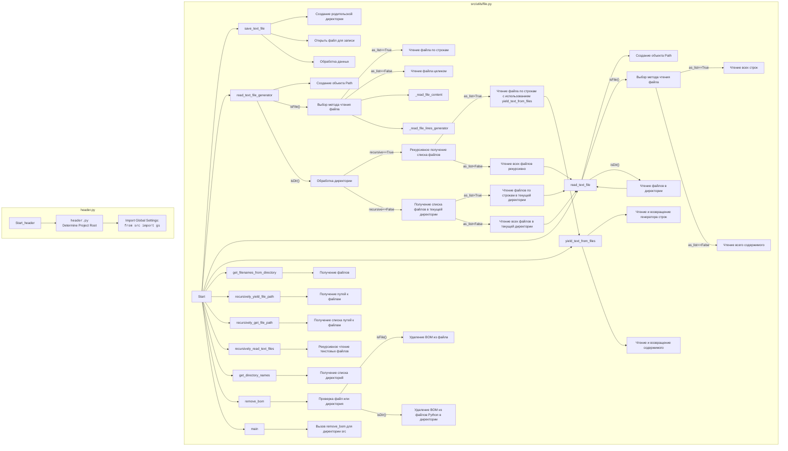

## АНАЛИЗ КОДА: `src/utils/file.py`

### 1. <алгоритм>

**Общая схема работы модуля:**
Модуль `file.py` предоставляет набор функций для работы с файлами, включая чтение, запись, поиск и модификацию. Он поддерживает обработку как отдельных файлов, так и директорий, включая рекурсивный обход. Основные операции включают чтение контента файла (как построчно, так и целиком), запись данных в файл, поиск файлов по заданным шаблонам, удаление BOM, и получение списка имен файлов/директорий. 

**Функциональное взаимодействие (пошагово):**

1.  **`save_text_file(file_path, data, mode='w')`**:
    *   Принимает путь к файлу `file_path` (строка или `Path`), данные для записи `data` (строка, список строк или словарь), и режим записи `mode` (`'w'` - запись или `'a'` - добавление).
    *   Преобразует `file_path` в объект `Path`.
    *   Создает родительскую директорию, если она не существует.
    *   Открывает файл в указанном режиме.
    *   Если `data` является списком, записывает каждую строку в файл с новой строки.
    *   Если `data` является словарем, записывает его в JSON формате.
    *   Иначе записывает `data` в файл.
    *   Возвращает `True` при успехе, `False` при ошибке, логируя ее.

    **Пример:**
    ```python
    file_path = Path('example.txt')
    data = 'Пример текста'
    save_text_file(file_path, data) # -> True
    data = ["line1", "line2"]
    save_text_file(file_path, data, mode = 'a') # -> True
    ```

2.  **`read_text_file_generator(file_path, as_list=False, extensions=None, chunk_size=8192, recursive=False, patterns=None)`**:
    *   Принимает путь к файлу или директории `file_path`, флаг `as_list` (возвращать как генератор строк или нет), `extensions` (для фильтрации файлов), размер чанка `chunk_size`, флаг `recursive` (рекурсивный обход) и `patterns` (шаблоны для фильтрации файлов).
    *   Преобразует `file_path` в объект `Path`.
    *   Если `file_path` - файл:
        *   Если `as_list` `True`, возвращает генератор строк файла с помощью `_read_file_lines_generator`.
        *   Иначе, возвращает содержимое файла как строку с помощью `_read_file_content`.
    *   Если `file_path` - директория:
        *   Если `recursive` `True`:
            *   Использует `recursively_get_file_path` для получения списка файлов.
            *   Если `as_list` `True`, возвращает генератор, который обрабатывает каждый файл, выдавая строки с помощью `yield_text_from_files`.
            *   Иначе, возвращает объединенную строку всех файлов (через `read_text_file`).
        *   Если `recursive` `False`:
            *   Получает список файлов в директории.
            *   Если `as_list` `True`, возвращает генератор, выдающий строки всех файлов.
            *   Иначе, возвращает объединенную строку всех файлов (через `read_text_file`).
    *   Возвращает `None` в случае ошибок, логируя их.

    **Пример:**
    ```python
    file_path = Path('example.txt')
    content = read_text_file_generator(file_path) # -> "Пример текста\nline1\nline2"
    for line in read_text_file_generator(file_path, as_list=True):
      print(line) # -> "Пример текста", "line1", "line2"
    dir_path = Path('.')
    all_content = read_text_file_generator(dir_path, recursive=True, patterns=["*.txt"])
    ```
3. **`read_text_file(file_path, as_list=False, extensions=None, exc_info=True)`**:
    *   Принимает путь к файлу или директории `file_path`, флаг `as_list`, `extensions` (для фильтрации) и `exc_info` (для логирования).
    *   Преобразует `file_path` в объект `Path`.
    *   Если `file_path` - файл:
        *   Открывает и читает файл.
        *   Возвращает список строк (если `as_list` `True`) или одну строку.
    *   Если `file_path` - директория:
        *   Получает список файлов.
        *   Рекурсивно вызывает `read_text_file` для каждого файла.
        *   Возвращает список списков строк или объединенную строку (если `as_list` `True`, то возвращает список строк, а иначе строку).
    *   Возвращает `None` при ошибке, логируя ее.

    **Пример:**
    ```python
    file_path = Path('example.txt')
    content = read_text_file(file_path) # -> "Пример текста\nline1\nline2"
    lines = read_text_file(file_path, as_list=True) # -> ["Пример текста\n", "line1\n", "line2"]
    ```
4.  **`yield_text_from_files(file_path, as_list=False, chunk_size=8192)`**:
    *   Принимает путь к файлу `file_path`, флаг `as_list`, и размер чанка `chunk_size`.
    *   Преобразует `file_path` в объект `Path`.
    *   Если `file_path` - файл:
        *   Если `as_list` `True`, возвращает генератор строк файла с помощью `_read_file_lines_generator`.
        *   Иначе, возвращает содержимое файла как строку с помощью `_read_file_content`.
    *   Возвращает `None` при ошибке, логируя ее.

    **Пример:**
    ```python
    file_path = Path('example.txt')
    for line in yield_text_from_files(file_path, as_list=True):
      print(line) # -> "Пример текста", "line1", "line2"
    ```

5.  **`_read_file_content(file_path, chunk_size)`**:
    *   Принимает путь к файлу `file_path` и размер чанка `chunk_size`.
    *   Открывает и читает файл по чанкам, возвращая строку.

6.  **`_read_file_lines_generator(file_path, chunk_size)`**:
    *   Принимает путь к файлу `file_path` и размер чанка `chunk_size`.
    *   Открывает и читает файл по чанкам, разделяет на строки и возвращает генератор строк.

7.  **`get_filenames_from_directory(directory, extensions='*')`**:
    *   Принимает путь к директории `directory` и расширения `extensions`.
    *   Возвращает список имен файлов в директории, отфильтрованных по расширениям.

    **Пример:**
    ```python
    dir_path = Path('.')
    files = get_filenames_from_directory(dir_path, extensions=['.txt', '.md']) # -> ["example.txt", "readme.md"]
    ```

8.  **`recursively_yield_file_path(root_dir, patterns='*')`**:
    *   Принимает путь к корневой директории `root_dir` и шаблоны `patterns`.
    *   Возвращает генератор путей ко всем файлам, соответствующим шаблонам.

    **Пример:**
    ```python
    dir_path = Path('.')
    for file in recursively_yield_file_path(dir_path, patterns=["*.txt"]):
      print(file) # -> Path("./example.txt")
    ```

9.  **`recursively_get_file_path(root_dir, patterns='*')`**:
    *   Принимает путь к корневой директории `root_dir` и шаблоны `patterns`.
    *   Возвращает список путей ко всем файлам, соответствующим шаблонам.

    **Пример:**
    ```python
     dir_path = Path('.')
     files = recursively_get_file_path(dir_path, patterns=["*.txt"]) # -> [Path("./example.txt")]
    ```

10. **`recursively_read_text_files(root_dir, patterns, as_list=False)`**:
    *   Принимает путь к корневой директории `root_dir`, шаблоны `patterns` и флаг `as_list`.
    *   Рекурсивно читает файлы, соответствующие шаблонам, и возвращает список содержимого файлов (или список строк).

    **Пример:**
    ```python
    dir_path = Path('.')
    files_content = recursively_read_text_files(dir_path, patterns=["*.txt"], as_list=True)
    ```
11. **`get_directory_names(directory)`**:
    *  Принимает путь к директории `directory`.
    *  Возвращает список имен поддиректорий в данной директории.

    **Пример:**
    ```python
    dir_path = Path('.')
    dirs = get_directory_names(dir_path) # -> ["dir1", "dir2"]
    ```

12. **`remove_bom(path)`**:
    *   Принимает путь к файлу или директории `path`.
    *   Если `path` - файл, удаляет BOM.
    *   Если `path` - директория, удаляет BOM из всех `.py` файлов.

13. **`main()`**:
    *   Точка входа для удаления BOM.
    *   Вызывает `remove_bom` для директории `../src`.

### 2. <mermaid>


**Импорты для диаграммы `mermaid`:**
1.  `os` - используется для обхода файловой системы в `recursively_read_text_files` и `remove_bom`
2. `json` - используется для сериализации/десериализации данных в `save_text_file`
3. `fnmatch` - используется для сравнения имен файлов по шаблонам в  `recursively_read_text_files`
4. `pathlib.Path` - используется для работы с путями файлов и директорий
5. `typing.List`, `typing.Optional`, `typing.Union`, `typing.Generator` - используются для аннотации типов
6. `src.logger.logger` - используется для логирования ошибок и предупреждений

### 3. <объяснение>
**Импорты:**

*   `os`: Модуль `os` предоставляет функции для взаимодействия с операционной системой, включая работу с файловой системой. В данном модуле используется для рекурсивного обхода директорий `os.walk`.
*   `json`: Модуль `json` используется для работы с JSON-данными, в частности, для сохранения словарей в файл в функции `save_text_file`.
*   `fnmatch`: Модуль `fnmatch` используется для сопоставления имен файлов с заданными шаблонами, в частности, в функции `recursively_read_text_files` для фильтрации файлов.
*   `pathlib`: Модуль `pathlib` предоставляет объектно-ориентированный способ работы с путями к файлам и директориям, что делает код более читаемым и удобным. Класс `Path` используется для создания объектов, представляющих пути, и выполнения различных операций над ними.
*   `typing`: Модуль `typing` используется для аннотации типов, что улучшает читаемость и помогает выявлять ошибки на ранних стадиях разработки. Используются `List`, `Optional`, `Union` и `Generator` для указания типов аргументов и возвращаемых значений функций.
*   `src.logger.logger`: Модуль `src.logger.logger` используется для логирования событий, ошибок и предупреждений в приложении. Позволяет отслеживать работу программы и выявлять проблемы.

**Функции:**

*   `save_text_file(file_path, data, mode='w')`: Сохраняет данные (строку, список строк или словарь) в текстовый файл.
    *   Аргументы:
        *   `file_path`: Путь к файлу (строка или объект `Path`).
        *   `data`: Данные для записи (строка, список строк или словарь).
        *   `mode`: Режим открытия файла (`'w'` для записи, `'a'` для добавления).
    *   Возвращает `True`, если запись успешна, `False` в противном случае.
    *   Пример: `save_text_file('example.txt', 'Hello world')`.
    *   **Потенциальные улучшения:** Можно добавить возможность сохранять данные в разных форматах (CSV, YAML и т.д.).
*   `read_text_file_generator(file_path, as_list=False, extensions=None, chunk_size=8192, recursive=False, patterns=None)`: Читает содержимое файла или директории и возвращает данные, как генератор строк, или строку в зависимости от флага `as_list`.
     *   Аргументы:
        *   `file_path`: Путь к файлу или директории.
        *   `as_list`: Флаг, определяющий, возвращать ли результат как генератор строк.
        *   `extensions`: Список расширений файлов для фильтрации.
        *    `chunk_size`: Размер чанка для чтения файла.
        *   `recursive`: Флаг, указывающий на рекурсивный обход директорий.
        *    `patterns`: Шаблоны для фильтрации файлов при рекурсивном поиске.
    *  Возвращает:
         -   `Generator[str, None, None]` (Генератор строк), если `as_list` равен `True` и `file_path` является файлом или директорией с `recursive=True`.
         -  `str` (Строка) Если `as_list` равен `False`
         - `None` при ошибке.
    *   **Потенциальные улучшения**: Сделать более гибким фильтр файлов, добавить поддержку разных кодировок файлов.
* `read_text_file(file_path, as_list=False, extensions=None, exc_info=True)`: Читает содержимое файла и возвращает как строку или список строк.
    *   Аргументы:
        *   `file_path`: Путь к файлу или директории.
        *   `as_list`: Флаг, определяющий, возвращать ли результат как список строк.
        *   `extensions`: Список расширений файлов для фильтрации.
        *   `exc_info`: Флаг, определяющий, логировать ли информацию об ошибке.
    *   Возвращает строку, список строк или `None` в случае ошибки.
*   `yield_text_from_files(file_path, as_list=False, chunk_size=8192)`: Читает файл и возвращает строки как генератор или всё содержимое файла как строку.
    *   Аргументы:
        *    `file_path`: Путь к файлу.
        *   `as_list`: Флаг, определяющий, возвращать ли результат как генератор строк.
        *   `chunk_size`: Размер чанка для чтения файла.
    *   Возвращает генератор строк, строку или `None` в случае ошибки.
*   `_read_file_content(file_path, chunk_size)`: Читает содержимое файла по чанкам и возвращает как строку.
    *   Аргументы:
        *   `file_path`: Путь к файлу.
        *   `chunk_size`: Размер чанка для чтения.
    *   Возвращает строку с содержимым файла.
*   `_read_file_lines_generator(file_path, chunk_size)`: Читает файл по строкам с использованием генератора.
    *   Аргументы:
        *   `file_path`: Путь к файлу.
        *   `chunk_size`: Размер чанка для чтения.
    *   Возвращает генератор, выдающий строки файла.
*   `get_filenames_from_directory(directory, extensions='*')`: Возвращает список имен файлов в директории, опционально отфильтрованных по расширению.
    *   Аргументы:
        *   `directory`: Путь к директории.
        *   `extensions`: Расширения файлов для фильтрации.
    *   Возвращает список имен файлов.
*   `recursively_yield_file_path(root_dir, patterns='*')`: Рекурсивно возвращает пути к файлам, соответствующим заданным шаблонам, в указанной директории, как генератор.
    *   Аргументы:
        *   `root_dir`: Корневая директория.
        *   `patterns`: Шаблоны для фильтрации файлов.
    *  Возвращает генератор путей к файлам.
*   `recursively_get_file_path(root_dir, patterns='*')`: Рекурсивно возвращает список путей к файлам, соответствующим заданным шаблонам, в указанной директории.
    *   Аргументы:
        *   `root_dir`: Корневая директория.
        *   `patterns`: Шаблоны для фильтрации файлов.
    *   Возвращает список путей к файлам.
*   `recursively_read_text_files(root_dir, patterns, as_list=False)`: Рекурсивно читает текстовые файлы, соответствующие шаблонам, в указанной директории.
    *   Аргументы:
        *   `root_dir`: Корневая директория.
        *   `patterns`: Шаблоны для фильтрации файлов.
        *   `as_list`: Флаг для возврата содержимого файла как списка строк.
    *   Возвращает список содержимого файлов (или список строк).
*   `get_directory_names(directory)`: Возвращает список имен директорий из указанной директории.
    *    Аргументы:
        *   `directory`: Путь к директории.
    *    Возвращает список имен директорий.
*   `remove_bom(path)`: Удаляет BOM из текстового файла или всех файлов Python в директории.
    *   Аргументы:
        *   `path`: Путь к файлу или директории.
    *  Возвращает None
*   `main()`: Точка входа для удаления BOM.
    *   Использует  `remove_bom` для удаления BOM из всех Python-файлов в директории `../src`.

**Переменные:**

*   `MODE`: Константа, определяющая режим работы, в данном случае `'dev'`.
    
**Цепочка взаимосвязей с другими частями проекта:**
*   Модуль `file.py` является частью утилит проекта.
*   Использует `src.logger.logger` для логирования.
*   Импортируется и используется в других частях проекта для работы с файлами.

**Потенциальные ошибки и области для улучшения:**
*   Обработка исключений: В некоторых функциях используется общий `except Exception`, что может затруднить отладку. Лучше использовать более специфичные исключения.
*   Улучшение производительности: Функция `read_text_file` читает файлы целиком, что может быть неэффективно для очень больших файлов. Можно использовать `_read_file_lines_generator` если  `as_list` равен `False`, чтобы не грузить большой файл целиком.
*   Кодировка: Жестко заданная кодировка `'utf-8'` может вызывать проблемы с файлами, использующими другие кодировки. Можно добавить параметр для указания кодировки.
*   Фильтрация файлов: Можно добавить более гибкие фильтры для выбора файлов в `get_filenames_from_directory`, `recursively_get_file_path`, и других функциях.
*  Тесты: необходимо написать тесты, чтобы обеспечить корректную работу всех функций.
*  Документация: Уточнить документацию к функциям, чтобы она соответствовала поведению функции, особенно функции `read_text_file_generator`, и разграничить поведение при `as_list` равен `True` или `False`

Этот подробный анализ дает полное понимание функциональности модуля `src/utils/file.py`, его зависимостей, а также областей, где можно улучшить код.