## ИНСТРУКЦИЯ:

Анализируй предоставленный код подробно и объясни его функциональность. Ответ должен включать три раздела:  

1. **<алгоритм>**: Опиши рабочий процесс в виде пошаговой блок-схемы, включая примеры для каждого логического блока, и проиллюстрируй поток данных между функциями, классами или методами.  
2. **<mermaid>**: Напиши код для диаграммы в формате `mermaid`, проанализируй и объясни все зависимости, 
    которые импортируются при создании диаграммы. 
    **ВАЖНО!** Убедитесь, что все имена переменных, используемые в диаграмме `mermaid`, 
    имеют осмысленные и описательные имена. Имена переменных вроде `A`, `B`, `C`, и т.д., не допускаются!  
    
    **Дополнительно**: Если в коде есть импорт `import header`, добавьте блок `mermaid` flowchart, объясняющий `header.py`:\
    ```mermaid
    flowchart TD
        Start --> Header[<code>header.py</code><br> Determine Project Root]
    
        Header --> import[Import Global Settings: <br><code>from src import gs</code>] 
    ```

3. **<объяснение>**: Предоставьте подробные объяснения:  
   - **Импорты**: Их назначение и взаимосвязь с другими пакетами `src.`.  
   - **Классы**: Их роль, атрибуты, методы и взаимодействие с другими компонентами проекта.  
   - **Функции**: Их аргументы, возвращаемые значения, назначение и примеры.  
   - **Переменные**: Их типы и использование.  
   - Выделите потенциальные ошибки или области для улучшения.  

Дополнительно, постройте цепочку взаимосвязей с другими частями проекта (если применимо).  

Это обеспечивает всесторонний и структурированный анализ кода.
## Формат ответа: `.md` (markdown)
**КОНЕЦ ИНСТРУКЦИИ**
## <алгоритм>
**1. `save_image_from_url(image_url, filename)`**
   - **Вход:** URL изображения (`image_url` - строка), путь к файлу для сохранения (`filename` - строка или Path).
   - **Шаг 1:** Начать асинхронную сессию `aiohttp.ClientSession`.
   - **Шаг 2:** Выполнить GET запрос к `image_url` с помощью сессии.
   - **Шаг 3:** Проверить статус ответа, если есть ошибки (4xx или 5xx), вызвать исключение `ImageError`.
   - **Шаг 4:** Прочитать данные изображения из ответа.
   - **Шаг 5:** Передать полученные данные и путь файла в функцию `save_image(image_data, filename)`.
   - **Выход:** Путь к сохраненному файлу или None (в случае ошибки).
   - **Пример:**
     ```python
     image_url = "https://example.com/image.jpg"
     filename = "images/downloaded_image.jpg"
     # save_image_from_url(image_url, filename)
     ```

**2. `save_image(image_data, file_name, format='PNG')`**
   - **Вход:** Байтовые данные изображения (`image_data` - bytes), путь к файлу для сохранения (`file_name` - строка или Path), формат сохранения (`format` - строка, по умолчанию 'PNG').
   - **Шаг 1:** Создать объект `Path` из `file_name`.
   - **Шаг 2:** Создать родительские директории для файла, если их нет.
   - **Шаг 3:** Открыть файл на запись в бинарном режиме с помощью `aiofiles`.
   - **Шаг 4:** Записать данные изображения в файл.
   - **Шаг 5:** Проверить, был ли создан файл. Если нет, вызвать `ImageError`.
   - **Шаг 6:** Открыть файл с помощью `PIL.Image.open()` и пересохранить в указанном формате.
   - **Шаг 7:** Проверить, не является ли размер файла 0 байт. Если да, вызвать `ImageError`.
   - **Выход:** Путь к сохраненному файлу (строка) или None (в случае ошибки).
   - **Пример:**
     ```python
      image_data = b"\\x89PNG\\r\\n\\x1a\\n..."
      filename = "images/saved_image.png"
      format = "JPEG"
      # save_image(image_data, filename, format)
     ```

**3. `get_image_bytes(image_path, raw=True)`**
   - **Вход:** Путь к изображению (`image_path` - Path), флаг возврата `BytesIO` объекта или `bytes` (`raw` - bool, по умолчанию True).
   - **Шаг 1:** Открыть изображение с помощью `PIL.Image.open()`.
   - **Шаг 2:** Создать объект `BytesIO`.
   - **Шаг 3:** Сохранить изображение в `BytesIO` в формате JPEG.
   - **Шаг 4:** Если `raw` True, вернуть `BytesIO` объект, иначе вернуть `bytes`.
   - **Выход:** `BytesIO` объект или `bytes` или None в случае ошибки.
   - **Пример:**
     ```python
      image_path = Path("images/image.jpg")
      raw = False
      # get_image_bytes(image_path, raw)
     ```

**4. `get_raw_image_data(file_name)`**
   - **Вход:** Путь к файлу (`file_name` - строка или Path).
   - **Шаг 1:** Создать объект `Path` из `file_name`.
   - **Шаг 2:** Проверить существование файла. Если нет, вернуть None.
   - **Шаг 3:** Прочитать байты из файла.
   - **Выход:** Байтовые данные файла или None (в случае ошибки или если файла нет).
   - **Пример:**
     ```python
      filename = "text.txt"
      # get_raw_image_data(filename)
     ```
**5. `random_image(root_path)`**
    - **Вход:** Путь к директории (`root_path` - строка или Path).
    - **Шаг 1:** Создать объект `Path` из `root_path`.
    - **Шаг 2:** Определить список расширений изображений.
    - **Шаг 3:** Найти все файлы с указанными расширениями в директории и поддиректориях.
    - **Шаг 4:** Если файлов нет, вернуть None.
    - **Шаг 5:** Выбрать случайный файл.
    - **Выход:** Путь к случайному изображению (строка) или None.
    - **Пример:**
      ```python
      root_path = "images/"
      # random_image(root_path)
      ```

**6. `add_text_watermark(image_path, watermark_text, output_path=None)`**
   - **Вход:** Путь к изображению (`image_path` - строка или Path), текст водяного знака (`watermark_text` - строка), путь для сохранения результата (`output_path` - строка или Path, по умолчанию None).
   - **Шаг 1:** Создать объекты `Path` для входного и выходного путей. Если `output_path` не задан, он равен `image_path`.
   - **Шаг 2:** Открыть изображение и конвертировать в RGBA.
   - **Шаг 3:** Создать прозрачный слой для водяного знака.
   - **Шаг 4:** Определить размер шрифта водяного знака.
   - **Шаг 5:** Загрузить шрифт arial.ttf (если доступен), иначе использовать стандартный шрифт.
   - **Шаг 6:** Рассчитать координаты для размещения текста водяного знака по центру.
   - **Шаг 7:** Нарисовать текст на прозрачном слое.
   - **Шаг 8:** Объединить изображение и водяной знак.
   - **Шаг 9:** Сохранить изображение с водяным знаком.
   - **Выход:** Путь к изображению с водяным знаком (строка) или None (в случае ошибки).
   - **Пример:**
     ```python
     image_path = "images/image.jpg"
     watermark_text = "My Watermark"
     output_path = "images/watermarked_image.jpg"
     # add_text_watermark(image_path, watermark_text, output_path)
     ```

**7. `add_image_watermark(input_image_path, watermark_image_path, output_image_path=None)`**
   - **Вход:** Путь к исходному изображению (`input_image_path` - Path), путь к изображению водяного знака (`watermark_image_path` - Path), путь для сохранения результата (`output_image_path` - Path, по умолчанию None).
   - **Шаг 1:** Открыть основное изображение.
   - **Шаг 2:** Открыть изображение водяного знака и конвертировать в RGBA.
   - **Шаг 3:** Изменить размер водяного знака (8% от ширины основного изображения).
   - **Шаг 4:** Определить позицию водяного знака (правый нижний угол с отступами).
   - **Шаг 5:** Создать прозрачный слой.
   - **Шаг 6:** Поместить основное изображение на прозрачный слой.
   - **Шаг 7:** Поместить водяной знак поверх основного изображения.
   - **Шаг 8:** Конвертировать прозрачный слой в формат основного изображения.
   - **Шаг 9:** Сохранить результирующее изображение в указанный путь (или в папку "output", если путь не задан).
   - **Выход:** Путь к изображению с водяным знаком (Path) или None (в случае ошибки).
   - **Пример:**
     ```python
     input_image_path = Path("images/image.jpg")
     watermark_image_path = Path("watermark.png")
     output_image_path = Path("output_images/watermarked_image.jpg")
     # add_image_watermark(input_image_path, watermark_image_path, output_image_path)
     ```

**8. `resize_image(image_path, size, output_path=None)`**
   - **Вход:** Путь к изображению (`image_path` - строка или Path), новый размер (`size` - кортеж (ширина, высота)), путь для сохранения результата (`output_path` - строка или Path, по умолчанию None).
   - **Шаг 1:** Создать объекты `Path` для входного и выходного путей. Если `output_path` не задан, он равен `image_path`.
   - **Шаг 2:** Открыть изображение.
   - **Шаг 3:** Изменить размер изображения.
   - **Шаг 4:** Сохранить измененное изображение.
   - **Выход:** Путь к измененному изображению (строка) или None (в случае ошибки).
    - **Пример:**
      ```python
      image_path = "images/image.jpg"
      size = (100, 100)
      output_path = "images/resized_image.jpg"
      # resize_image(image_path, size, output_path)
      ```

**9. `convert_image(image_path, format, output_path=None)`**
   - **Вход:** Путь к изображению (`image_path` - строка или Path), формат для сохранения (`format` - строка), путь для сохранения результата (`output_path` - строка или Path, по умолчанию None).
    - **Шаг 1:** Создать объекты `Path` для входного и выходного путей. Если `output_path` не задан, он равен `image_path`.
   - **Шаг 2:** Открыть изображение.
   - **Шаг 3:** Сохранить изображение в новом формате.
   - **Выход:** Путь к измененному изображению (строка) или None (в случае ошибки).
    - **Пример:**
      ```python
      image_path = "images/image.png"
      format = "JPEG"
      output_path = "images/converted_image.jpg"
      # convert_image(image_path, format, output_path)
     ```
**10. `process_images_with_watermark(folder_path, watermark_path)`**
    - **Вход:** Путь к папке с изображениями (`folder_path` - Path), путь к водяному знаку (`watermark_path` - Path).
    - **Шаг 1:** Проверить, является ли `folder_path` директорией. Если нет, вернуть None.
    - **Шаг 2:** Создать директорию "output" внутри `folder_path` (если ее нет).
    - **Шаг 3:** Перебрать все файлы в папке.
    - **Шаг 4:** Если файл - изображение, добавить к нему водяной знак и сохранить в "output".
    - **Выход:** None (функция void).
     - **Пример:**
        ```python
        folder_path = Path("images/")
        watermark_path = Path("watermark.png")
        # process_images_with_watermark(folder_path, watermark_path)
        ```
## <mermaid>


```mermaid
flowchart TD
    subgraph Image Module [src/utils/image.py]
        Start([Start]) --> SaveImageFromURL[save_image_from_url: Download image from URL]
        SaveImageFromURL --> SaveImage[save_image: Save image data to file]
        SaveImage --> GetImageBytes[get_image_bytes: Read image as bytes]
        GetImageBytes --> GetRawImageData[get_raw_image_data: Read raw binary data]
        GetRawImageData --> RandomImage[random_image: Find a random image]
        RandomImage --> AddTextWatermark[add_text_watermark: Add text watermark]
        AddTextWatermark --> AddImageWatermark[add_image_watermark: Add image watermark]
        AddImageWatermark --> ResizeImage[resize_image: Resize image]
        ResizeImage --> ConvertImage[convert_image: Convert image format]
        ConvertImage --> ProcessImagesWithWatermark[process_images_with_watermark: Process all images in folder with watermark]
        ProcessImagesWithWatermark --> End([End])
    end

    
    style Start fill:#f9f,stroke:#333,stroke-width:2px
    style End fill:#ccf,stroke:#333,stroke-width:2px
    
    
    
    classDef subfill fill:#f0f0f0;
    class ImageModule subfill;
        
    
    
    
    SaveImageFromURL -- "aiohttp, Path, asyncio, ImageError" --> SaveImage
    SaveImage -- "Path, aiofiles, Image, ImageError" --> GetImageBytes
    GetImageBytes -- "PIL.Image, BytesIO" --> GetRawImageData
    GetRawImageData -- "Path" --> RandomImage
    RandomImage -- "random, Path" --> AddTextWatermark
    AddTextWatermark -- "Path, PIL.Image, PIL.ImageDraw, PIL.ImageFont" --> AddImageWatermark
    AddImageWatermark -- "Path, PIL.Image" --> ResizeImage
    ResizeImage -- "Path, PIL.Image" --> ConvertImage
    ConvertImage -- "Path, PIL.Image" --> ProcessImagesWithWatermark
    ProcessImagesWithWatermark -- "Path, add_image_watermark" --> End
    
    
    
    
    
    
```

**Объяснение зависимостей `mermaid`:**
1.  **`Image Module [src/utils/image.py]`**:  Область, представляющая весь модуль `image.py`.
2.  **`Start([Start])`**: Начало процесса, не имеет зависимостей.
3.  **`SaveImageFromURL[save_image_from_url: Download image from URL]`**: Функция загрузки изображения по URL, использует `aiohttp`, `Path`, `asyncio` и `ImageError` для обработки ошибок.
4.  **`SaveImage[save_image: Save image data to file]`**: Функция сохранения байтов изображения в файл, использует `Path`, `aiofiles`, `PIL.Image`, и `ImageError`.
5.  **`GetImageBytes[get_image_bytes: Read image as bytes]`**: Функция для чтения изображения и преобразования в байты (JPEG), использует `PIL.Image` и `BytesIO`.
6.  **`GetRawImageData[get_raw_image_data: Read raw binary data]`**: Функция для чтения необработанных байтов файла, использует `Path`.
7.  **`RandomImage[random_image: Find a random image]`**: Функция для поиска случайного изображения в директории, использует `random` и `Path`.
8.  **`AddTextWatermark[add_text_watermark: Add text watermark]`**: Функция для добавления текстового водяного знака, использует `Path`, `PIL.Image`, `PIL.ImageDraw` и `PIL.ImageFont`.
9.  **`AddImageWatermark[add_image_watermark: Add image watermark]`**: Функция для добавления изображения в качестве водяного знака, использует `Path` и `PIL.Image`.
10. **`ResizeImage[resize_image: Resize image]`**: Функция для изменения размера изображения, использует `Path` и `PIL.Image`.
11. **`ConvertImage[convert_image: Convert image format]`**: Функция для конвертации изображения в другой формат, использует `Path` и `PIL.Image`.
12. **`ProcessImagesWithWatermark[process_images_with_watermark: Process all images in folder with watermark]`**: Функция для обработки всех изображений в папке, добавляя водяной знак, использует `Path` и вызывает `add_image_watermark`.
13. **`End([End])`**: Конец процесса.
14. **Связи**: Стрелки показывают поток данных и зависимости между функциями. Текст на стрелках означает зависимости или используемые модули и классы.

## <объяснение>
**Импорты:**
- `aiohttp`: Используется для выполнения асинхронных HTTP-запросов, в частности, для загрузки изображений по URL в функции `save_image_from_url`.
- `aiofiles`: Используется для асинхронных операций с файлами, таких как запись байтов изображения на диск в функции `save_image`.
- `asyncio`: Используется для асинхронного программирования, позволяя функциям выполняться неблокирующим образом.
- `random`: Используется для выбора случайного изображения из списка в функции `random_image`.
- `pathlib.Path`: Используется для представления путей к файлам и директориям в объектно-ориентированном виде, упрощая операции с файловой системой.
- `typing.Optional, typing.Union, typing.Tuple`: Используются для аннотации типов, чтобы указать, что функция может возвращать значение определенного типа или `None`, что переменная может принимать значения разных типов, и что кортеж содержит значения определенных типов.
- `io.BytesIO`: Используется для работы с байтовыми данными в памяти, используется в `get_image_bytes` для хранения байтов изображения.
- `PIL (Pillow).Image, PIL.ImageDraw, PIL.ImageFont`: Используются для обработки изображений (открытие, изменение размера, добавление водяных знаков, конвертация форматов), а также для рисования текста на изображениях.
- `src.logger.logger`: Используется для логирования ошибок, предупреждений и информационных сообщений в процессе обработки изображений.

**Классы:**
- `ImageError(Exception)`: Пользовательский класс исключений для обработки ошибок, связанных с изображениями, наследуется от стандартного `Exception`. Это позволяет более конкретно обрабатывать ошибки в данном модуле.

**Функции:**
- `save_image_from_url(image_url, filename)`:
  - **Аргументы:**
    - `image_url` (str): URL изображения для загрузки.
    - `filename` (Union[str, Path]): Путь к файлу, куда сохранить изображение.
  - **Возвращаемое значение:** `Optional[str]`: Путь к сохраненному файлу или `None` при ошибке.
  - **Назначение:** Асинхронно загружает изображение по URL и сохраняет его, вызывая функцию `save_image`.
  - **Пример:** `save_image_from_url("https://example.com/image.jpg", "images/test.jpg")`
- `save_image(image_data, file_name, format='PNG')`:
  - **Аргументы:**
    - `image_data` (bytes): Байтовые данные изображения.
    - `file_name` (Union[str, Path]): Путь к файлу для сохранения.
    - `format` (str, по умолчанию 'PNG'): Формат изображения.
  - **Возвращаемое значение:** `Optional[str]`: Путь к сохраненному файлу или `None` при ошибке.
  - **Назначение:** Сохраняет байты изображения в файл в указанном формате, асинхронно.
  - **Пример:** `save_image(b"...", "images/test.png", "JPEG")`
- `get_image_bytes(image_path, raw=True)`:
  - **Аргументы:**
    - `image_path` (Path): Путь к изображению.
    - `raw` (bool, по умолчанию `True`): Если `True`, возвращает объект `BytesIO`, иначе - `bytes`.
  - **Возвращаемое значение:** `Optional[Union[BytesIO, bytes]]`: Байты изображения или `None` при ошибке.
  - **Назначение:** Загружает изображение с помощью PIL и возвращает его байты в JPEG.
  - **Пример:** `get_image_bytes(Path("images/test.jpg"), False)`
- `get_raw_image_data(file_name)`:
  - **Аргументы:**
    - `file_name` (Union[str, Path]): Путь к файлу.
  - **Возвращаемое значение:** `Optional[bytes]`: Байты файла или `None` если файла не существует или произошла ошибка.
  - **Назначение:** Читает байты любого файла.
  - **Пример:** `get_raw_image_data("text.txt")`
- `random_image(root_path)`:
  - **Аргументы:**
    - `root_path` (Union[str, Path]): Путь к директории, в которой искать изображения.
  - **Возвращаемое значение:** `Optional[str]`: Путь к случайному изображению или `None`, если изображения не найдены.
  - **Назначение:** Находит случайное изображение в заданной директории.
  - **Пример:** `random_image("images")`
- `add_text_watermark(image_path, watermark_text, output_path=None)`:
  - **Аргументы:**
    - `image_path` (Union[str, Path]): Путь к изображению.
    - `watermark_text` (str): Текст водяного знака.
    - `output_path` (Optional[Union[str, Path]], по умолчанию `None`): Путь для сохранения изображения с водяным знаком.
  - **Возвращаемое значение:** `Optional[str]`: Путь к изображению с водяным знаком или `None` при ошибке.
  - **Назначение:** Добавляет текстовый водяной знак на изображение.
  - **Пример:** `add_text_watermark("images/test.jpg", "My Watermark", "images/watermarked.jpg")`
- `add_image_watermark(input_image_path, watermark_image_path, output_image_path=None)`:
  - **Аргументы:**
    - `input_image_path` (Path): Путь к исходному изображению.
    - `watermark_image_path` (Path): Путь к изображению водяного знака.
    - `output_image_path` (Optional[Path], по умолчанию `None`): Путь для сохранения изображения с водяным знаком.
  - **Возвращаемое значение:** `Optional[Path]`: Путь к изображению с водяным знаком или `None` при ошибке.
  - **Назначение:** Добавляет изображение водяного знака на изображение.
  - **Пример:** `add_image_watermark(Path("images/test.jpg"), Path("watermark.png"), Path("images/watermarked.jpg"))`
- `resize_image(image_path, size, output_path=None)`:
  - **Аргументы:**
    - `image_path` (Union[str, Path]): Путь к изображению.
    - `size` (Tuple[int, int]): Новый размер изображения (ширина, высота).
    - `output_path` (Optional[Union[str, Path]], по умолчанию `None`): Путь для сохранения измененного изображения.
  - **Возвращаемое значение:** `Optional[str]`: Путь к измененному изображению или `None` при ошибке.
  - **Назначение:** Изменяет размер изображения.
  - **Пример:** `resize_image("images/test.jpg", (100, 100), "images/resized.jpg")`
- `convert_image(image_path, format, output_path=None)`:
  - **Аргументы:**
    - `image_path` (Union[str, Path]): Путь к изображению.
    - `format` (str): Формат изображения для сохранения (например, "JPEG", "PNG").
    - `output_path` (Optional[Union[str, Path]], по умолчанию `None`): Путь для сохранения конвертированного изображения.
  - **Возвращаемое значение:** `Optional[str]`: Путь к конвертированному изображению или `None` при ошибке.
  - **Назначение:** Конвертирует изображение в другой формат.
  - **Пример:** `convert_image("images/test.png", "JPEG", "images/converted.jpg")`
- `process_images_with_watermark(folder_path, watermark_path)`:
  - **Аргументы:**
    - `folder_path` (Path): Путь к папке с изображениями.
    - `watermark_path` (Path): Путь к изображению водяного знака.
  - **Возвращаемое значение:** `None`.
  - **Назначение:** Обрабатывает все изображения в папке, добавляя водяной знак и сохраняя их в подпапку "output".
  - **Пример:** `process_images_with_watermark(Path("images"), Path("watermark.png"))`

**Переменные:**
- `image_extensions`: Список расширений файлов, которые считаются изображениями. Используется в функции `random_image`.
- `file_path`: Переменная, представляющая путь к файлу (тип `Path`).
- `image_data`: Переменная, представляющая байтовые данные изображения (тип `bytes`).
- `img`: Переменная, представляющая объект изображения (тип `PIL.Image.Image`).
- `logger`: Объект логгера, используемый для записи сообщений.

**Потенциальные ошибки и области для улучшения:**
- **Обработка ошибок:**
   - Все функции используют `try-except` для обработки ошибок, но для более детальной диагностики можно было бы обрабатывать более специфичные исключения.
- **Зависимости:**
  - Модуль сильно зависит от `PIL` (Pillow).  Необходимо убедиться, что Pillow корректно установлен и все необходимые зависимости удовлетворены.
- **Производительность:**
  - Функция `process_images_with_watermark` обрабатывает изображения последовательно. Для повышения производительности можно рассмотреть использование асинхронной обработки или многопоточности.
- **Шрифт:**
    - Функция `add_text_watermark` полагается на наличие шрифта `arial.ttf`. Было бы полезно добавить fallback механизм для выбора шрифта или разрешить пользователю указывать шрифт.
- **Расширяемость**:
  -  Модуль предоставляет базовые операции с изображениями. Можно расширить функциональность, добавив поддержку других операций, таких как обрезка, поворот, фильтры и т.д.

**Взаимосвязь с другими частями проекта:**
- Модуль `image.py` использует `src.logger.logger` для ведения логов, что указывает на связь с подсистемой логирования проекта.
- Этот модуль может использоваться другими частями проекта, например, для загрузки и обработки изображений, которые используются для генерации каких-либо отчетов, или для обработки пользовательских аватарок и т.д.

В целом, данный модуль `src/utils/image.py` является достаточно полным и предоставляет базовый функционал для работы с изображениями.