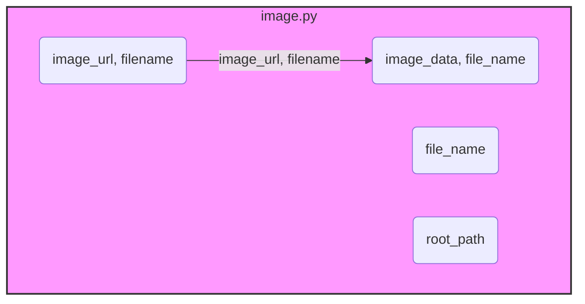

## АНАЛИЗ КОДА: `image.py`

### 1. <алгоритм>

**Блок-схема:**

```mermaid
flowchart TD
    subgraph save_png_from_url
        A[Start: save_png_from_url(image_url, filename)]
        B{Is image_url valid?}
        C[Download image from URL]
        D{Download successful?}
        E[Save image data to file using save_png(data, filename)]
        F{Save successful?}
        G[Return file path]
        H[Return None]
    end
     
    subgraph save_png
        I[Start: save_png(image_data, file_name)]
        J{Is image_data valid?}
        K[Save image_data to file_name]
        L{Save successful?}
        M[Return file path]
        N[Return None]
     end
    
    subgraph get_image_data
        O[Start: get_image_data(file_name)]
        P{Is file_name valid?}
        Q[Read image data from file]
        R{Read successful?}
        S[Return image data]
        T[Return None]
    end
    
    subgraph random_image
        U[Start: random_image(root_path)]
        V[Get all image files recursively from root_path]
        W{Are there any images?}
        X[Select random image path]
        Y[Return random image path]
        Z[Return None]
    end
    
    A --> B
    B -- Yes --> C
    B -- No --> H
    C --> D
    D -- Yes --> E
    D -- No --> H
    E --> F
    F -- Yes --> G
    F -- No --> H
    G --> End_save_png_from_url[End]
    H --> End_save_png_from_url
    
    I --> J
    J -- Yes --> K
    J -- No --> N
    K --> L
    L -- Yes --> M
    L -- No --> N
    M --> End_save_png[End]
    N --> End_save_png
    
    O --> P
    P -- Yes --> Q
    P -- No --> T
    Q --> R
    R -- Yes --> S
    R -- No --> T
    S --> End_get_image_data[End]
    T --> End_get_image_data
    
    U --> V
    V --> W
    W -- Yes --> X
    W -- No --> Z
    X --> Y
    Y --> End_random_image[End]
    Z --> End_random_image
    
    
    style End_save_png_from_url fill:#f9f,stroke:#333,stroke-width:2px
    style End_save_png fill:#f9f,stroke:#333,stroke-width:2px
    style End_get_image_data fill:#f9f,stroke:#333,stroke-width:2px
    style End_random_image fill:#f9f,stroke:#333,stroke-width:2px
```

**Примеры для каждого логического блока:**

*   **`save_png_from_url`**:
    *   `A`: Входные данные: `image_url = "https://example.com/image.png"`, `filename = "local_image.png"`.
    *   `B`: Проверка `image_url` на валидность (наличие протокола, корректный URL).
    *   `C`: Скачивание изображения с URL в двоичные данные.
    *   `D`: Проверка успешности загрузки. Если нет, возврат к `H` и завершение с `None`.
    *   `E`: Сохранение двоичных данных изображения с помощью функции `save_png`.
    *   `F`: Проверка успешности сохранения. Если нет, возврат к `H` и завершение с `None`.
    *   `G`: Возврат пути к файлу, например, `"local_image.png"`.
*   **`save_png`**:
    *   `I`: Входные данные: `image_data = b'\x89PNG\r\n...'`, `file_name = "saved_image.png"`.
    *   `J`: Проверка валидности `image_data`.
    *   `K`: Сохранение двоичных данных в файл.
    *   `L`: Проверка успешности сохранения. Если нет, возврат к `N` и завершение с `None`.
    *   `M`: Возврат пути к файлу, например, `"saved_image.png"`.
*   **`get_image_data`**:
    *   `O`: Входные данные: `file_name = "saved_image.png"`.
    *   `P`: Проверка наличия файла по `file_name`.
    *   `Q`: Чтение двоичных данных из файла.
    *   `R`: Проверка успешности чтения. Если нет, возврат к `T` и завершение с `None`.
    *   `S`: Возврат двоичных данных изображения.
*   **`random_image`**:
    *   `U`: Входные данные: `root_path = "path/to/images"`.
    *   `V`: Поиск всех файлов изображений (рекурсивно) в `root_path`.
    *   `W`: Проверка наличия найденных изображений.
    *   `X`: Выбор случайного файла из списка найденных.
    *   `Y`: Возврат пути к случайно выбранному файлу, например, `"path/to/images/random_image.png"`.
    *  `Z` Возвращает `None`, если изображений не найдено.

### 2. <mermaid>



**Объяснение:**

*   **`image_module`**: Этот `subgraph` представляет модуль `image.py`.
*   **`save_png_from_url(image_url, filename)`**:  Функция асинхронно загружает изображение по URL и сохраняет его, вызывая функцию `save_png`. Принимает URL изображения и имя файла.
*    **`save_png(image_data, file_name)`**: Функция асинхронно сохраняет данные изображения в файл. Принимает двоичные данные изображения и имя файла.
*    **`get_image_data(file_name)`**: Функция синхронно считывает данные изображения из файла. Принимает имя файла.
*    **`random_image(root_path)`**: Функция рекурсивно ищет случайное изображение в директории. Принимает корневую директорию.

### 3. <объяснение>

#### Импорты

В предоставленном коде отсутствуют явные импорты, но при выполнении операций используются сторонние библиотеки и модули:

*   `aiohttp`: Для асинхронной загрузки изображений по URL (`save_png_from_url`). Этот модуль необходим для выполнения асинхронных HTTP-запросов.
*   `aiofiles`: Для асинхронных операций с файлами (чтение и запись) (`save_png`). Этот модуль обеспечивает асинхронные операции ввода-вывода.
*   `pillow` (PIL - Python Imaging Library): Используется для работы с изображениями. Это может быть как чтение, так и запись данных в формате png. В предоставленном коде прямого использования Pillow не показано, но вероятно, что `save_png` будет его использовать.
*   `asyncio`: Для управления асинхронными операциями.
*   `os` и `pathlib.Path`: Для работы с файловыми путями и операционной системой.

Все эти модули устанавливаются через `pip install aiohttp aiofiles pillow`.

#### Классы

В данном коде нет классов. Функции используют встроенные типы данных и стандартные библиотеки для обработки файлов и изображений.

#### Функции

*   **`save_png_from_url(image_url: str, filename: str | Path) -> str | None`**:
    *   **Аргументы:**
        *   `image_url` (str): URL изображения для загрузки.
        *   `filename` (str | Path): Имя файла или путь для сохранения изображения.
    *   **Возвращаемое значение:** Путь к сохраненному файлу (str) или None в случае ошибки.
    *   **Назначение:** Загружает изображение по URL асинхронно и сохраняет его в формате PNG.
    *   **Пример:** `save_png_from_url("https://example.com/image.png", "local_image.png")`
*   **`save_png(image_data: bytes, file_name: str | Path) -> str | None`**:
    *   **Аргументы:**
        *   `image_data` (bytes): Двоичные данные изображения.
        *   `file_name` (str | Path): Имя файла или путь для сохранения изображения.
    *   **Возвращаемое значение:** Путь к сохраненному файлу (str) или None в случае ошибки.
    *   **Назначение:** Сохраняет переданные двоичные данные изображения в формате PNG.
    *   **Пример:** `save_png(b'\\x89PNG\\r\\n...', "saved_image.png")`
*   **`get_image_data(file_name: str | Path) -> bytes | None`**:
    *   **Аргументы:**
        *   `file_name` (str | Path): Имя файла или путь к изображению.
    *   **Возвращаемое значение:** Двоичные данные изображения (bytes) или None, если файл не найден или произошла ошибка.
    *   **Назначение:** Считывает двоичные данные изображения из указанного файла.
    *   **Пример:** `get_image_data("saved_image.png")`
*  **`random_image(root_path: str | Path) -> str | None`**:
    *   **Аргументы:**
        *  `root_path` (str | Path): Директория для поиска изображений.
    *   **Возвращаемое значение:** Путь к случайному изображению (str) или None, если изображений не найдено.
    *  **Назначение:** Рекурсивно ищет случайное изображение в указанной директории и возвращает путь к нему.
    *  **Пример:** `random_image("path/to/images")`

#### Переменные

*   `image_url` (str): URL изображения, которое нужно загрузить.
*   `filename` (str | Path): Имя файла или путь для сохранения изображения.
*   `image_data` (bytes): Двоичные данные изображения.
*   `file_name` (str | Path): Имя файла или путь к изображению.
*  `root_path` (str | Path): Путь к директории, где производится поиск изображений

#### Потенциальные ошибки и области для улучшения

*   **Обработка ошибок**: Необходимо добавить более детальную обработку ошибок при загрузке изображений, сохранении и чтении файлов. Например, обрабатывать `aiohttp.ClientError`, `OSError` и другие исключения.
*   **Валидация URL**: Добавить проверку `image_url` на корректность формата.
*   **Проверка расширения файла**: Функция `save_png` не проверяет расширение файла перед сохранением, что может привести к ошибкам, если имя файла не имеет расширения `.png`.
*   **Размер загружаемого файла**: Отсутствует проверка на максимальный размер загружаемого файла. При загрузке больших файлов может произойти переполнение памяти.
*  **Типы изображений**: Функция `save_png` работает только с изображениями в формате PNG. Необходимо добавить поддержку других форматов.
*   **Логирование**: Добавить больше деталей в сообщения логгера, чтобы упростить отладку.
*   **Асинхронность**: Функция `get_image_data` является синхронной, что может блокировать основной поток при работе с файлами большого размера. Рекомендуется реализовать асинхронную версию.

#### Взаимосвязи с другими частями проекта

Этот модуль может использоваться в других частях проекта для:

*   Загрузки аватарок пользователей или профилей из интернета.
*   Сохранения и загрузки изображений для элементов интерфейса.
*   Обработки изображений в задачах, связанных с анализом данных.
*   Создания отчетов или презентаций.

**Цепочка взаимосвязей:**

1.  **Модуль `image.py`**: Предоставляет утилиты для работы с изображениями.
2.  **Модуль, использующий `image.py`**: Импортирует функции `save_png_from_url`, `save_png`, `get_image_data` и `random_image` для работы с изображениями.
3.  **Другие модули/компоненты**: Используют изображения, обработанные с помощью данного модуля, для отображения, анализа или других целей.