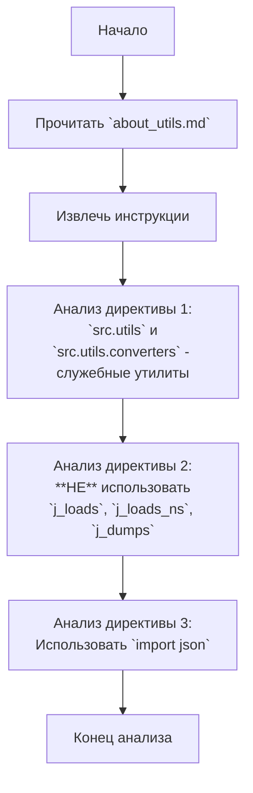

## АНАЛИЗ КОДА: `src/utils/instructions/about_utils.md`

### <алгоритм>

1.  **Начало:** Анализ начинается с текстового файла `about_utils.md`, который содержит инструкции по использованию модулей `src.utils` и `src.utils.converters`.
2.  **Чтение инструкций:** Файл считывается, и извлекаются основные директивы.
3.  **Анализ директив:**
    *   **Директива 1:** Указывает, что модули `src.utils` и `src.utils.converters` являются служебными утилитами проекта и спроектированы так, чтобы минимизировать использование внутренних утилит.
        *   *Пример:* Это означает, что они не должны зависеть от других модулей проекта, если это не является абсолютно необходимым.
    *   **Директива 2:** Указывает, что в этих модулях **не используются** функции `j_loads`, `j_loads_ns` и `j_dumps`.
        *   *Пример:* Это требование означает, что модули `src.utils` и `src.utils.converters` не должны использовать специализированные функции сериализации и десериализации JSON, разработанные внутри проекта.
    *   **Директива 3:** Указывает, что нужно использовать стандартную библиотеку `import json`.
        *   *Пример:* Это означает, что для работы с JSON-данными в этих модулях необходимо использовать стандартные функции `json.loads` и `json.dumps` вместо собственных.
4.  **Конец:** Завершение анализа инструкций.

### <mermaid>

**Анализ зависимостей Mermaid:**

*   Диаграмма `mermaid` показывает последовательность действий при анализе текстового файла `about_utils.md`.
*   `Start`: Начало процесса.
*   `ReadFile`: Шаг чтения файла `about_utils.md`.
*   `ExtractInstructions`: Извлечение инструкций из прочитанного файла.
*   `Directive1`, `Directive2`, `Directive3`: Последовательный анализ каждой директивы из файла.
*   `End`: Завершение анализа инструкций.
*   Нет никаких импортов или зависимостей от внешних модулей в представленном коде `mermaid`.

### <объяснение>

**Описание файла:**

Файл `about_utils.md` содержит инструкции для разработчиков, работающих с модулями `src.utils` и `src.utils.converters`. Эти инструкции касаются ограничений и правил использования этих утилит.

**Импорты:**

Файл не содержит импортов. Это текстовый файл с инструкциями, а не Python-код. Однако инструкция явно указывает на использование стандартной библиотеки `json` (`import json`) в модулях, которые эти инструкции описывают.
*   `import json`:  Это стандартная библиотека Python для работы с JSON-данными, используется для сериализации и десериализации JSON-объектов. Её использование предписано вместо собственных функций `j_loads`, `j_loads_ns` и `j_dumps` внутри модулей `src.utils` и `src.utils.converters`.

**Классы:**

Файл не описывает классы, поскольку это файл инструкций.

**Функции:**

Файл не описывает функции, поскольку это файл инструкций.

**Переменные:**

Файл не использует переменных, поскольку это файл инструкций.

**Цепочка взаимосвязей:**

Этот файл `about_utils.md` предоставляет инструкции для других частей проекта, а именно для модулей `src.utils` и `src.utils.converters`. Он устанавливает правила и ограничения для разработчиков, чтобы обеспечить единообразие и предотвратить использование внутренних утилит, которые могут быть изменены или удалены в будущем.

**Потенциальные ошибки и области для улучшения:**

1.  **Недостаточная детализация инструкций**: Инструкции могут быть более подробными, например, можно указать, для каких конкретно целей предназначены модули `src.utils` и `src.utils.converters`.
2.  **Отсутствие примеров использования**: Файл не содержит примеров использования `json` в контексте `src.utils` и `src.utils.converters`. Добавление примеров улучшит понимание инструкций.
3.  **Возможные исключения из правил**: Не указано, есть ли какие-либо случаи, когда можно отклониться от этих правил. Желательно определить, есть ли исключения и как их обрабатывать.

**Дополнительно:**
* Файл `about_utils.md` выступает в роли документации для разработчиков и устанавливает конвенции кодирования в рамках модулей `src.utils` и `src.utils.converters`, гарантируя их независимость от внутренних функций проекта. Это повышает переносимость и возможность повторного использования этих утилит.