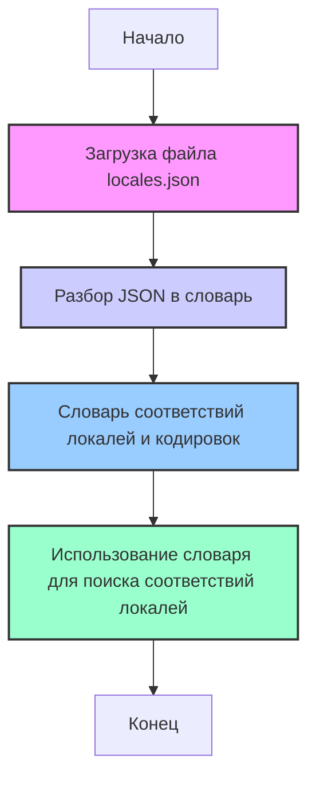

## ИНСТРУКЦИЯ:

Анализируй предоставленный код подробно и объясни его функциональность. Ответ должен включать три раздела:

1.  **<алгоритм>**: Опиши рабочий процесс в виде пошаговой блок-схемы, включая примеры для каждого логического блока, и проиллюстрируй поток данных между функциями, классами или методами.
2.  **<mermaid>**: Напиши код для диаграммы в формате `mermaid`, проанализируй и объясни все зависимости,
    которые импортируются при создании диаграммы.
    **ВАЖНО!** Убедитесь, что все имена переменных, используемые в диаграмме `mermaid`,
    имеют осмысленные и описательные имена. Имена переменных вроде `A`, `B`, `C`, и т.д., не допускаются!

    **Дополнительно**: Если в коде есть импорт `import header`, добавьте блок `mermaid` flowchart, объясняющий `header.py`:\
    ```mermaid
    flowchart TD
        Start --> Header[<code>header.py</code><br> Determine Project Root]

        Header --> import[Import Global Settings: <br><code>from src import gs</code>]
    ```

3.  **<объяснение>**: Предоставьте подробные объяснения:
    *   **Импорты**: Их назначение и взаимосвязь с другими пакетами `src.`.
    *   **Классы**: Их роль, атрибуты, методы и взаимодействие с другими компонентами проекта.
    *   **Функции**: Их аргументы, возвращаемые значения, назначение и примеры.
    *   **Переменные**: Их типы и использование.
    *   Выделите потенциальные ошибки или области для улучшения.

Дополнительно, постройте цепочку взаимосвязей с другими частями проекта (если применимо).

Это обеспечивает всесторонний и структурированный анализ кода.
## Формат ответа: `.md` (markdown)
**КОНЕЦ ИНСТРУКЦИИ**

## <алгоритм>

Представленный код представляет собой JSON-файл, который содержит словарь (mapping). Ключи словаря являются строками, представляющими собой различные варианты наименований локалей (например, "en", "en_US", "russian"), а значения - это строки, представляющие собой стандартизированные наименования локалей и кодировки (например, "en-US.ISO8859-1", "ru-RU.UTF-8").

**Блок-схема:**

1.  **Начало:** Загрузка JSON-файла `locales.json`.
    *   **Пример:** Приложение читает содержимое файла `hypotez/src/utils/iso/locales.json`.
2.  **Разбор JSON:** JSON-файл преобразуется в словарь.
    *   **Пример:** Получается словарь Python, где ключи - это строки с названиями локалей (например, "en_US"), а значения - строки, представляющие локаль и кодировку (например, "en-US.ISO8859-1").
3.  **Использование словаря:** Этот словарь может быть использован для поиска соответствия между различными вариантами наименований локалей и их стандартизированными представлениями.
    *   **Пример:** Функция, принимающая строку "english_us", может использовать словарь для получения значения "en-US.ISO8859-1".
4.  **Конец:** Словарь доступен для дальнейшего использования в проекте.

**Поток данных:**

*   **Вход:** `locales.json` (файл)
*   **Процесс:** Разбор JSON в словарь (словарь)
*   **Выход:** Словарь (данные в памяти)

## <mermaid>


**Анализ зависимостей:**

В данном коде нет импортов или зависимостей, так как это простой JSON-файл, представляющий собой статичный словарь. Он не взаимодействует ни с какими внешними модулями или другими частями проекта, кроме тех, которые будут его использовать.

## <объяснение>

**Импорты:**

В данном файле нет импортов, так как это файл данных (JSON), а не исполняемый код. Он не зависит от других пакетов.

**Классы:**

В данном файле нет классов, так как это файл данных (JSON), а не исполняемый код.

**Функции:**

В данном файле нет функций, так как это файл данных (JSON), а не исполняемый код.

**Переменные:**

Файл содержит одну переменную: словарь (mapping), который не имеет имени в контексте данного файла, но является структурой данных.

*   **Тип:** Словарь (dict)
*   **Использование:**  Этот словарь используется для преобразования не стандартизированных имен локалей (ключи) в стандартизированные имена локалей с указанием кодировки (значения).

    *   **Пример ключей:**
        *   `"en"`
        *   `"en_gb"`
        *   `"english_us"`
        *   `"ru"`
        *   `"russian"`
        *   `"zh_cn"`
        *    `"chinese-s"`
    *   **Пример значений:**
        *   `"en-US.ISO8859-1"`
        *   `"en_GB.ISO8859-1"`
        *   `"en-US.ISO8859-1"`
        *   `"ru-RU.UTF-8"`
        *   `"ru-RU.KOI8-R"`
        *   `"zh_CN.gb2312"`
        *   `"zh_CN.eucCN"`

**Объяснение:**

Этот файл `locales.json` представляет собой статический словарь, используемый для стандартизации различных вариантов представления наименований локалей в рамках проекта. Ключами являются различными вариациями написания наименования локали, например, `en`, `en_US`, `english_us`, а значениями - унифицированный формат имени локали и кодировки, например, `en-US.ISO8859-1`. 
Это позволяет обеспечить согласованность при работе с разными наименованиями локалей.

**Потенциальные ошибки или области для улучшения:**

1.  **Поддержание актуальности:**
    *   Словарь необходимо регулярно обновлять, чтобы поддерживать соответствие с новыми локалями и кодировками.
2.  **Дублирование:**
    *   Присутствует дублирование значений для разных ключей, например `"en_US"` и `"english_us"` приводят к одному значению `"en-US.ISO8859-1"`. Это может быть нормальным, но требует внимания при расширении словаря.

**Цепочка взаимосвязей:**

Этот файл является частью `hypotez` проекта, и будет использоваться в модулях для обработки локализации. Например, может использоваться в функциях, которые:
1.  Принимают на вход локаль пользователя и преобразуют ее к унифицированной форме для дальнейшей обработки.
2.  Определяют кодировку для отображения текста в соответствии с локалью пользователя.

**Примеры использования:**

1.  Приложение получает от пользователя строку "english_uk". Оно ищет этот ключ в словаре и получает значение "en_GB.ISO8859-1". Далее, приложение может использовать это значение для выбора нужного языкового пакета и кодировки.
2.  Другая функция получает "russian". Словарь возвращает "ru-RU.KOI8-R", которая будет использована для обработки текста на русском языке.

В целом, данный файл `locales.json` является важным элементом для управления локализацией в проекте `hypotez` и обеспечивает согласованное преобразование и использование данных о локалях.