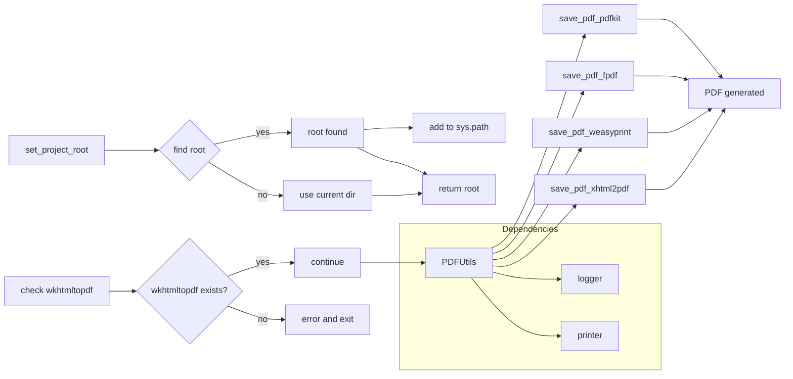

# <input code>

```python
## \file hypotez/src/utils/pdf.py
# -*- coding: utf-8 -*-\

#! venv/bin/python/python3.12

"""
.. module: src.utils.pdf 
    :platform: Windows, Unix
    :synopsis: Модуль для преобразования HTML-контента или файлов в PDF

Модуль для преобразования HTML-контента или файлов в PDF с использованием различных библиотек.
Дополнительная информация:
- https://chatgpt.com/share/672266a3-0048-800d-a97b-c38f647d496b
- https://stackoverflow.com/questions/73599970/how-to-solve-wkhtmltopdf-reported-an-error-exit-with-code-1-due-to-network-err
- https://habr.com/ru/companies/bothub/articles/853490/
"""

import sys
import os
import json

from pathlib import Path
import pdfkit
from reportlab.pdfgen import canvas
from fpdf import FPDF
from weasyprint import HTML
from xhtml2pdf import pisa
from src.logger import logger
from src.utils.printer import pprint

def set_project_root(marker_files=('__root__','.git')) -> Path:
    """
    Finds the root directory of the project starting from the current file's directory,
    searching upwards and stopping at the first directory containing any of the marker files.

    Args:
        marker_files (tuple): Filenames or directory names to identify the project root.
    
    Returns:
        Path: Path to the root directory if found, otherwise the directory where the script is located.
    """
    __root__:Path
    current_path:Path = Path(__file__).resolve().parent
    __root__ = current_path
    for parent in [current_path] + list(current_path.parents):
        if any((parent / marker).exists() for marker in marker_files):
            __root__ = parent
            break
    if __root__ not in sys.path:
        sys.path.insert(0, str(__root__))
    return __root__


# Get the root directory of the project
__root__ = set_project_root()
"""__root__ (Path): Path to the root directory of the project"""


wkhtmltopdf_exe = __root__ / 'bin' / 'wkhtmltopdf' / 'files' / 'bin' / 'wkhtmltopdf.exe'

if not wkhtmltopdf_exe.exists():
    logger.error("Не найден wkhtmltopdf.exe по указанному пути.")
    raise FileNotFoundError("wkhtmltopdf.exe отсутствует")


class PDFUtils:
    """
    Класс для работы с PDF-файлами, предоставляющий методы для сохранения HTML-контента в PDF с использованием различных библиотек.
    """
    # ... (rest of the code)
```

# <algorithm>

**Алгоритм работы модуля `pdf.py`:**

1. **Определение корневой директории проекта (`set_project_root`):**
    - Начинается поиск корня проекта от текущего файла.
    - Проверяет наличие файлов/папок (`pyproject.toml`, `requirements.txt`, `.git`) в родительских директориях.
    - Если найден, сохраняет путь к корневой директории.
    - Добавляет корневую директорию в `sys.path`.
    - Возвращает путь к корню проекта.

2. **Проверка наличия `wkhtmltopdf.exe`:**
    - Получает путь к `wkhtmltopdf.exe` на основе найденной корневой директории.
    - Проверяет существование файла.
    - Если файл не найден, выводит ошибку и прерывает выполнение.

3. **Класс `PDFUtils`:**
    - Представляет набор статических методов для работы с PDF.
    - **`save_pdf_pdfkit`:** Преобразует HTML-контент или файл в PDF с использованием `pdfkit`.
      - Принимает данные и имя файла.
      - Использует `pdfkit.from_string` или `pdfkit.from_file`.
      - Возвращает `True` при успехе, `False` при ошибке.
    - **`save_pdf_fpdf`:** Преобразует строку в PDF с использованием `fpdf`.
        - Принимает текст и имя файла.
        - Загружает шрифты из `fonts.json`
        - Устанавливает шрифты.
        - Добавляет текст на страницу.
        - Возвращает `True` при успехе, `False` при ошибке.
    - **`save_pdf_weasyprint`:** Преобразует HTML-контент или файл в PDF с использованием `WeasyPrint`.
      - Принимает данные и имя файла.
      - Использует `HTML.write_pdf`.
      - Возвращает `True` при успехе, `False` при ошибке.
    - **`save_pdf_xhtml2pdf`:** Преобразует HTML-контент или файл в PDF с использованием `xhtml2pdf`.
       - Принимает данные и имя файла.
       - Использует `pisa.CreatePDF`.
       - Возвращает `True` при успехе, `False` при ошибке.

**Пример:**

Ввод: HTML-код, путь к файлу "output.pdf".
Результат: Создание файла "output.pdf" с содержанием HTML-кода в формате PDF.

# <mermaid>



**Описание зависимости диаграммы:**

* **`set_project_root`**: ищет корневую директорию проекта.
* **`logger` и `printer`**: библиотеки для логирования и вывода информации, соответственно.
* **`pdfkit`, `fpdf`, `weasyprint`, `xhtml2pdf`**: библиотеки для генерации PDF из различных источников.
* **`Path`**: модуль для работы с путями.
* **`json`**: модуль для работы с JSON файлами.


# <explanation>

**Импорты:**

- `sys`, `os`, `json`: стандартные библиотеки Python для работы со средой выполнения, файловой системой и JSON-данными.
- `pathlib`: современный, удобный способ работы с путями к файлам и каталогам.
- `pdfkit`, `reportlab.pdfgen`, `fpdf`, `weasyprint`, `xhtml2pdf`: библиотеки для генерации PDF файлов из HTML (или текста).
- `src.logger`, `src.utils.printer`: модули из собственного проекта, скорее всего, для логирования и вывода сообщений в консоль.

**Классы:**

- **`PDFUtils`**: класс, предоставляющий статические методы для генерации PDF.
    - `save_pdf_pdfkit`, `save_pdf_fpdf`, `save_pdf_weasyprint`, `save_pdf_xhtml2pdf`: методы для генерации PDF с разными библиотеками.


**Функции:**

- **`set_project_root`**: находит корневую директорию проекта, начиная с текущего файла и идя вверх по дереву каталогов.
  - Возвращает `Path` к корню проекта.


**Переменные:**

- `__root__`: переменная, содержащая путь к корню проекта.
- `wkhtmltopdf_exe`: переменная, хранящая путь к исполняемому файлу wkhtmltopdf.


**Возможные ошибки и улучшения:**

- **Управление ошибками:**  Хотя код использует `try...except` блоки, обработка ошибок могла бы быть более детальной и специфичной (например, отдельные блоки `except` для разных типов ошибок).  
- **Документация:** Документация, примененная к классам и функциям, является хорошим началом, но ее можно было бы расширить с дополнительными примерами, особенно для различных случаев использования и обработки исключений.
- **Проверка входных данных:** Проверки корректности входных данных (например, валидация путей к файлам) сделали бы код более надежным.
- **Явное указание кодировки:** При чтении файла `fonts.json` и HTML-файла стоит явно указывать кодировку `encoding='utf-8'`.
- **Обработка ошибок при чтении JSON:** Обработка возможных ошибок при чтении JSON файла (`fonts.json`).
- **Улучшение кода `save_pdf_fpdf`:**  Использование `with open(...)` для файлов, а также более подробное документирование пути к шрифтам.


**Цепочка взаимосвязей:**

Модуль `pdf.py` зависит от `logger` и `printer` из других частей проекта (`src.logger`, `src.utils.printer`),  от библиотек `pdfkit`, `fpdf`, `weasyprint`, `xhtml2pdf` и `pathlib`.