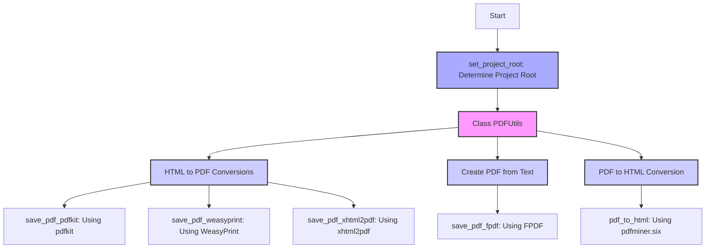

## ИНСТРУКЦИЯ:

Анализируй предоставленный код подробно и объясни его функциональность. Ответ должен включать три раздела:  

1. **<алгоритм>**: Опиши рабочий процесс в виде пошаговой блок-схемы, включая примеры для каждого логического блока, и проиллюстрируй поток данных между функциями, классами или методами.  
2. **<mermaid>**: Напиши код для диаграммы в формате `mermaid`, проанализируй и объясни все зависимости, 
    которые импортируются при создании диаграммы. 
    **ВАЖНО!** Убедитесь, что все имена переменных, используемые в диаграмме `mermaid`, 
    имеют осмысленные и описательные имена. Имена переменных вроде `A`, `B`, `C`, и т.д., не допускаются!  
    
    **Дополнительно**: Если в коде есть импорт `import header`, добавьте блок `mermaid` flowchart, объясняющий `header.py`:\
    ```mermaid\
    flowchart TD\
        Start --> Header[<code>header.py</code><br> Determine Project Root]\
    
        Header --> import[Import Global Settings: <br><code>from src import gs</code>] \
    ```

3. **<объяснение>**: Предоставьте подробные объяснения:  
   - **Импорты**: Их назначение и взаимосвязь с другими пакетами `src.`.  
   - **Классы**: Их роль, атрибуты, методы и взаимодействие с другими компонентами проекта.  
   - **Функции**: Их аргументы, возвращаемые значения, назначение и примеры.  
   - **Переменные**: Их типы и использование.  
   - Выделите потенциальные ошибки или области для улучшения.  

Дополнительно, постройте цепочку взаимосвязей с другими частями проекта (если применимо).  

Это обеспечивает всесторонний и структурированный анализ кода.
## Формат ответа: `.md` (markdown)
**КОНЕЦ ИНСТРУКЦИИ**
```
## <алгоритм>

### Общий рабочий процесс:
1. **Определение корневой директории проекта**:
    - Функция `set_project_root` ищет маркерные файлы, чтобы определить корень проекта.
    - Пример: Проверяет наличие `pyproject.toml`, `requirements.txt` или `.git`.
2. **Работа с PDF через класс `PDFUtils`**:
    - Класс содержит статические методы для различных операций с PDF.
    - Пример: Вызов `PDFUtils.save_pdf_pdfkit(...)` для конвертации HTML в PDF.
3. **Конвертация HTML в PDF (разные способы)**:
   - **`save_pdf_pdfkit`**: Использует `pdfkit` для преобразования HTML-содержимого или HTML-файла в PDF.
     - Пример: HTML-строка или путь к HTML-файлу -> PDF-файл.
   - **`save_pdf_weasyprint`**: Использует `WeasyPrint` для преобразования HTML в PDF с сохранением стилей.
     - Пример: HTML-строка или путь к HTML-файлу -> PDF-файл.
   - **`save_pdf_xhtml2pdf`**: Использует `xhtml2pdf` для преобразования HTML в PDF.
     - Пример: HTML-строка или путь к HTML-файлу -> PDF-файл.
4. **Создание PDF из текста (`save_pdf_fpdf`)**:
   - Использует `FPDF` для создания PDF-документа из текста, поддерживает кастомные шрифты.
   - Пример: Текст + путь к файлу шрифта -> PDF-файл.
5. **Конвертация PDF в HTML (`pdf_to_html`)**:
   - Использует `pdfminer.six` для извлечения текста из PDF и создания HTML-файла.
   - Пример: Путь к PDF-файлу -> HTML-файл.

### Поток данных:
- **Входные данные**:
  - HTML-строки или пути к HTML-файлам, PDF-файлы, текстовые данные.
  - Пути к выходным файлам PDF/HTML, пути к шрифтам.
- **Обработка**:
  - Выбор метода конвертации (PDFKit, WeasyPrint, xhtml2pdf, FPDF).
  - Использование соответствующей библиотеки для конвертации.
  - Извлечение текста из PDF.
- **Выходные данные**:
  - PDF-файлы, HTML-файлы.
- **Поток между функциями/классами**:
  -  `set_project_root` -> `PDFUtils`: Корневой путь проекта используется при инициализации путей к файлам.
  -  `PDFUtils` ->  методы: Вызов нужного метода конвертации, такого как `save_pdf_pdfkit`, `save_pdf_fpdf`, `pdf_to_html`, и т.д.

## <mermaid>

### mermaid анализ зависимостей:
*   **Start**: Начало процесса.
*   **FindRoot**: Вызов `set_project_root`, для определения корневой директории проекта.
*   **PDFUtilsClass**: Класс `PDFUtils`, который управляет всем процессом преобразования и создания PDF.
*   **ConvertHTMLtoPDF**: Блок, представляющий различные методы преобразования HTML в PDF.
*   **CreatePDFfromText**: Блок, представляющий метод создания PDF из текста.
*    **ConvertPDFtoHTML**: Блок, представляющий метод преобразования PDF в HTML.
*   **PDFKitMethod**: Метод `save_pdf_pdfkit` внутри `PDFUtils`, использующий библиотеку `pdfkit`.
*   **WeasyPrintMethod**: Метод `save_pdf_weasyprint` внутри `PDFUtils`, использующий библиотеку `WeasyPrint`.
*   **Xhtml2PdfMethod**: Метод `save_pdf_xhtml2pdf` внутри `PDFUtils`, использующий библиотеку `xhtml2pdf`.
*    **FPDFMethod**: Метод `save_pdf_fpdf` внутри `PDFUtils`, использующий библиотеку `FPDF`.
*   **PdfMinerMethod**: Метод `pdf_to_html` внутри `PDFUtils`, использующий библиотеку `pdfminer.six`.

## <объяснение>

### Импорты:
- `pdfkit`: Используется для преобразования HTML в PDF. Требует установки `wkhtmltopdf`.
- `FPDF`: Используется для создания PDF файлов из текста, поддерживает добавление кастомных шрифтов.
- `WeasyPrint`: Используется для более точного преобразования HTML в PDF, особенно со стилями CSS.
- `xhtml2pdf`: Альтернатива для преобразования HTML в PDF.
- `pdfminer.six`: Используется для извлечения текста из PDF файлов.
- `pathlib`: Используется для работы с путями к файлам и директориям.
- `json`: Используется для работы с файлами в формате JSON, в частности для загрузки конфигурации шрифтов.
- `src.logger.logger`: Пользовательский логгер для записи сообщений в процессе работы модуля. Зависит от конфигурации логирования проекта.
- `src.utils.printer`: Пользовательский модуль для вывода информации, используется для печати отладочных сообщений.

### Классы:
- `PDFUtils`:
  - **Роль**: Класс-контейнер для статических методов, предоставляющих функциональность для работы с PDF.
  - **Атрибуты**: Нет экземпляра-специфичных атрибутов (статический класс).
  - **Методы**:
     - `save_pdf_pdfkit(html, output_path)`: Конвертирует HTML (строку или путь к файлу) в PDF, использует `pdfkit`.
     - `save_pdf_fpdf(text, output_path, font_path=None)`: Создаёт PDF из текста, использует `FPDF`, поддерживает кастомные шрифты.
     - `save_pdf_weasyprint(html, output_path)`: Конвертирует HTML в PDF, используя `WeasyPrint`.
     - `save_pdf_xhtml2pdf(html, output_path)`: Конвертирует HTML в PDF, используя `xhtml2pdf`.
     - `pdf_to_html(pdf_path, html_path)`: Извлекает текст из PDF и сохраняет в HTML, использует `pdfminer.six`.
  - **Взаимодействие**:
    -  методы вызываются напрямую через `PDFUtils.method_name(args)`.
    -  использует различные библиотеки (зависимости).

### Функции:
- `set_project_root()`:
  - **Аргументы**: нет.
  - **Возвращаемое значение**: нет, но устанавливает глобальную переменную с корнем проекта.
  - **Назначение**: Определяет корневую директорию проекта на основе наличия маркерных файлов (`pyproject.toml`, `requirements.txt`, `.git`).
  - **Пример**:  При первом импорте модуля ищет маркерные файлы.
### Переменные:
- `wkhtmltopdf_exe`: Путь к исполняемому файлу `wkhtmltopdf`. Это внешняя зависимость `pdfkit`
- `fonts_json_path`: Путь к файлу конфигурации шрифтов.
- `project_root`: Глобальная переменная, устанавливаемая функцией `set_project_root`, хранит корень проекта.

### Потенциальные ошибки и области для улучшения:
1.  **Зависимость от `wkhtmltopdf`**: `pdfkit` зависит от внешней программы, которую нужно устанавливать отдельно.
    - **Улучшение**: Добавить автоматическую проверку наличия и вывод более информативного сообщения об ошибке.
2.  **Конфигурация шрифтов**: Путь к файлу `fonts.json` жестко прописан.
   - **Улучшение**: Использовать переменные окружения или настройки конфигурации.
3. **Обработка ошибок**: Методы не всегда явно обрабатывают исключения.
   - **Улучшение**: Добавить `try-except` блоки с логированием ошибок и возвратом `False` в случае неудачи.
4.  **Не все функции имеют одинаковую логику**: Некоторые возвращают `True/False` в случае успеха/неудачи, другие нет.
    - **Улучшение**: Привести все методы к одному соглашению о возвращаемых значениях.
5. **Отсутствие проверок ввода**: Нет проверок, например, на существование файлов, переданных в методы.
    - **Улучшение**: Добавить проверку входных путей к файлам.
6.  **Логирование**: Более подробное логирование, а также обработка исключений, поможет в отладке.

### Взаимосвязи с другими частями проекта:
-  `src.logger.logger`: Логгер используется для отслеживания событий, что позволяет понять ход выполнения программы, выявлять проблемы.
-  `src.utils.printer`: Печатает сообщения, которые могут быть полезны при отладке.
-  `set_project_root`: Позволяет этому модулю работать с путями относительно корня проекта, а не относительно текущего файла.

Этот модуль является частью утилит проекта, предоставляя функциональность для работы с PDF, которая может быть использована в разных частях проекта, где требуется преобразование HTML в PDF или наоборот.