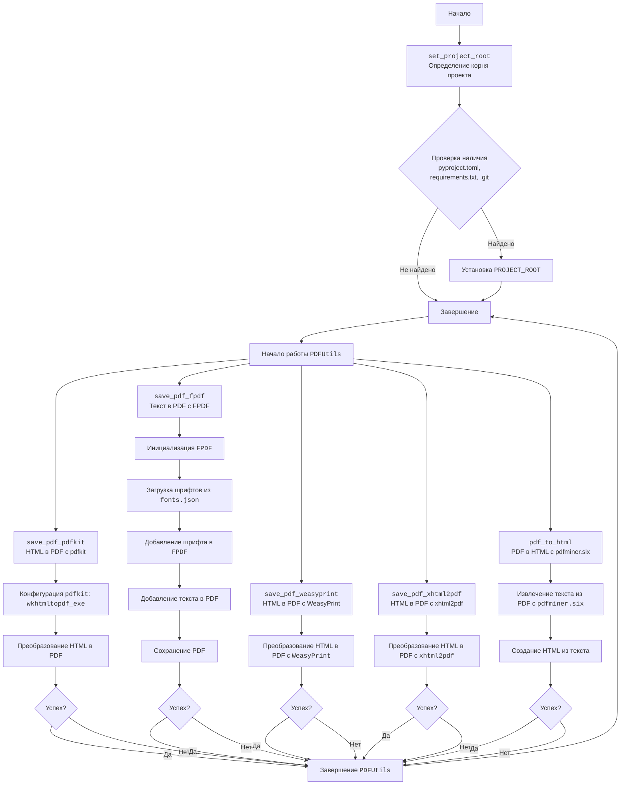
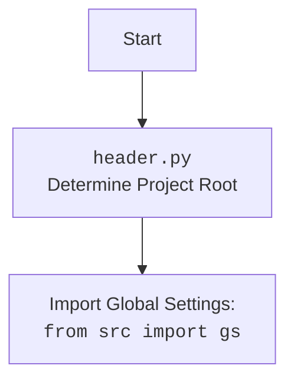

# Анализ кода модуля для работы с PDF-файлами

## <алгоритм>

1. **`set_project_root`**:
   - **Начало**: Функция начинает работу.
   - **Поиск маркерных файлов**: Проверяется наличие файлов `pyproject.toml`, `requirements.txt` или `.git` в текущей директории и её родительских директориях.
   - **Пример**:
     - Если текущая директория `/home/user/project/src/utils`, а файл `pyproject.toml` находится в `/home/user/project`, то корневой директорией будет `/home/user/project`.
   - **Установка корневой директории**: Если один из маркерных файлов найден, устанавливается глобальная переменная `PROJECT_ROOT` на путь найденной директории.
   - **Завершение**: Функция завершает работу.
2.  **Класс `PDFUtils`**:
    - **Инициализация**: Класс содержит статические методы. Инициализация экземпляра класса не требуется.
    - **`save_pdf_pdfkit(html, output_file)`**:
        - **Начало**: Метод начинает работу.
        - **Конфигурация `pdfkit`**: Настраивается путь к исполняемому файлу `wkhtmltopdf`.
        - **Пример**: `wkhtmltopdf_exe` может быть `/usr/local/bin/wkhtmltopdf`.
        - **Преобразование**: `pdfkit` преобразует HTML в PDF.
        - **Возврат**: Возвращает `True` в случае успеха или `False` в случае ошибки.
        - **Завершение**: Метод завершает работу.
    - **`save_pdf_fpdf(text, output_file)`**:
        - **Начало**: Метод начинает работу.
        - **Инициализация `FPDF`**: Создается экземпляр класса `FPDF`.
        - **Загрузка шрифтов**: Загружается файл `fonts.json` из директории `assets/fonts`.
        - **Пример**: `fonts.json` может содержать описание пользовательского шрифта.
        - **Добавление шрифта**: Добавляется шрифт из конфигурационного файла в `FPDF`.
        - **Добавление текста**: Текст добавляется в PDF-документ.
        - **Сохранение**: PDF сохраняется в файл.
        - **Возврат**: Возвращает `True` в случае успеха или `False` в случае ошибки.
        - **Завершение**: Метод завершает работу.
    - **`save_pdf_weasyprint(html, output_file)`**:
        - **Начало**: Метод начинает работу.
        - **Преобразование**: `WeasyPrint` преобразует HTML в PDF.
        - **Возврат**: Возвращает `True` в случае успеха или `False` в случае ошибки.
        - **Завершение**: Метод завершает работу.
    - **`save_pdf_xhtml2pdf(html, output_file)`**:
        - **Начало**: Метод начинает работу.
        - **Преобразование**: `xhtml2pdf` преобразует HTML в PDF.
        - **Возврат**: Возвращает `True` в случае успеха или `False` в случае ошибки.
        - **Завершение**: Метод завершает работу.
    - **`pdf_to_html(pdf_file, html_file)`**:
        - **Начало**: Метод начинает работу.
        - **Извлечение текста**: `pdfminer.six` извлекает текст из PDF.
        - **Создание HTML**: Создается HTML-файл из извлеченного текста.
        - **Возврат**: Возвращает `True` в случае успеха или `False` в случае ошибки.
        - **Завершение**: Метод завершает работу.
3. **Пример использования:**
    - **Преобразование HTML в PDF:**
      - Создается HTML-контент в виде строки.
      - Вызывается метод `PDFUtils.save_pdf_pdfkit` для преобразования в PDF.
      - Результат выводится в консоль.
    - **Конвертация PDF в HTML:**
      - Указываются пути к PDF- и HTML-файлам.
      - Вызывается метод `PDFUtils.pdf_to_html` для конвертации.
      - Результат выводится в консоль.

## <mermaid>

## <объяснение>

**Импорты:**

- `pdfkit`: Используется для преобразования HTML-контента или файлов в PDF. Это основная библиотека для преобразования HTML в PDF в данном модуле.
- `FPDF`: Используется для создания PDF-файлов из текста. Поддерживает добавление шрифтов из файла `fonts.json`.
- `WeasyPrint`: Используется для преобразования HTML в PDF, обеспечивая более точное отображение стилей.
- `xhtml2pdf`: Альтернативная библиотека для преобразования HTML в PDF.
- `pdfminer.six`: Используется для извлечения текста из PDF-файлов, что позволяет конвертировать PDF в HTML.
- `pathlib`: Используется для работы с путями к файлам, обеспечивая более кроссплатформенный подход.
- `json`: Используется для загрузки данных из файла `fonts.json`, содержащего информацию о шрифтах для `FPDF`.
- `src.logger.logger`: Пользовательский логгер, используемый для записи сообщений в процессе работы модуля. Этот логгер является частью проекта `src`.
- `src.utils.printer`: Пользовательский модуль для вывода информации, также является частью проекта `src`.

**Класс `PDFUtils`:**

- **Роль**: Класс `PDFUtils` предоставляет статические методы для работы с PDF-файлами. Поскольку методы статические, экземпляры класса не создаются.
- **Атрибуты**: Нет атрибутов, так как класс используется для организации статических методов.
- **Методы**:
  - `save_pdf_pdfkit(html, output_file)`:
      - **Аргументы**:
        - `html`: HTML-контент (строка) или путь к HTML-файлу.
        - `output_file`: Путь к выходному PDF-файлу.
      - **Возвращаемое значение**: `True` при успешном преобразовании, `False` в случае ошибки.
      - **Назначение**: Использует `pdfkit` для создания PDF из HTML.
  - `save_pdf_fpdf(text, output_file)`:
      - **Аргументы**:
        - `text`: Текст для добавления в PDF.
        - `output_file`: Путь к выходному PDF-файлу.
      - **Возвращаемое значение**: `True` при успешном создании, `False` в случае ошибки.
      - **Назначение**: Создает PDF-файл из текста, используя `FPDF`. Загружает и использует шрифты из файла `fonts.json`.
  - `save_pdf_weasyprint(html, output_file)`:
      - **Аргументы**:
        - `html`: HTML-контент (строка) или путь к HTML-файлу.
        - `output_file`: Путь к выходному PDF-файлу.
      - **Возвращаемое значение**: `True` при успешном преобразовании, `False` в случае ошибки.
      - **Назначение**: Использует `WeasyPrint` для создания PDF из HTML.
  - `save_pdf_xhtml2pdf(html, output_file)`:
      - **Аргументы**:
        - `html`: HTML-контент (строка) или путь к HTML-файлу.
        - `output_file`: Путь к выходному PDF-файлу.
      - **Возвращаемое значение**: `True` при успешном преобразовании, `False` в случае ошибки.
      - **Назначение**: Использует `xhtml2pdf` для создания PDF из HTML.
  - `pdf_to_html(pdf_file, html_file)`:
      - **Аргументы**:
        - `pdf_file`: Путь к входному PDF-файлу.
        - `html_file`: Путь к выходному HTML-файлу.
      - **Возвращаемое значение**: `True` при успешной конвертации, `False` в случае ошибки.
      - **Назначение**: Конвертирует PDF в HTML, извлекая текст с помощью `pdfminer.six`.
- **Взаимодействие**: Методы класса `PDFUtils` взаимодействуют с внешними библиотеками для выполнения операций с PDF-файлами.

**Функции:**

- `set_project_root()`:
  - **Аргументы**: Нет аргументов.
  - **Возвращаемое значение**: Нет.
  - **Назначение**: Определяет корневую директорию проекта на основе наличия маркерных файлов, таких как `pyproject.toml`, `requirements.txt` или `.git`. Устанавливает глобальную переменную `PROJECT_ROOT`.

**Переменные:**

- `PROJECT_ROOT`: Строковая переменная, представляющая корневую директорию проекта, устанавливается функцией `set_project_root`.
- `wkhtmltopdf_exe`: Строковая переменная, представляющая путь к исполняемому файлу `wkhtmltopdf`.

**Потенциальные ошибки и области для улучшения:**

1. **Обработка ошибок**: В методах класса `PDFUtils` не хватает полноценной обработки исключений. Рекомендуется добавить блоки `try-except` для более надежной обработки ошибок, связанных с внешними библиотеками.
2. **Конфигурация**: Путь к `wkhtmltopdf_exe` может быть не задан или задан неправильно. Можно сделать конфигурацию более гибкой и вынести её в файл настроек.
3. **`fonts.json`**: Проверка наличия и корректности файла `fonts.json` отсутствует. Следует добавить проверку, чтобы предотвратить ошибки при использовании `FPDF`.
4. **Логирование**: Необходимо добавить логирование ошибок и важных событий, используя `src.logger.logger`. Это поможет отлаживать и контролировать работу модуля.
5. **Зависимости**: Описание установки `wkhtmltopdf` отсутствует, хотя это обязательное условие для работы `pdfkit`.

**Взаимосвязи с другими частями проекта:**

- **`src.logger.logger`**: Используется для логирования работы модуля. Модуль зависит от этого компонента для записи сообщений о процессах и ошибках.
- **`src.utils.printer`**: Используется для вывода информации на экран, что упрощает взаимодействие с пользователем.
- **Глобальная переменная `PROJECT_ROOT`**: используется для определения путей к ресурсам проекта, обеспечивая гибкость в разных частях проекта.

Этот модуль предоставляет широкий спектр инструментов для работы с PDF-файлами, включая преобразование HTML в PDF, создание PDF из текста и конвертацию PDF в HTML. Тем не менее, он требует доработок в плане обработки ошибок, конфигурации и логирования.