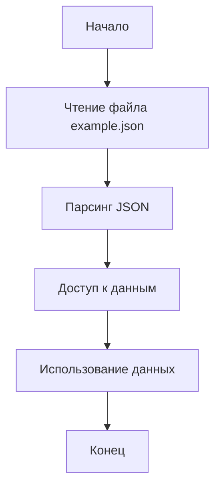

## АНАЛИЗ JSON ФАЙЛА

### 1. <алгоритм>

Файл `example.json` представляет собой структуру данных в формате JSON, предназначенную для хранения мультиязычных сообщений. Алгоритм обработки этого файла сводится к следующим шагам:

1.  **Чтение файла:** Программа (например, на Python) считывает содержимое файла `example.json` как строку.

    ```python
    import json

    with open('example.json', 'r', encoding='utf-8') as file:
      json_string = file.read()
    ```

2.  **Парсинг JSON:** Полученная строка преобразуется в объект Python (обычно словарь) с помощью функции `json.loads()`.

    ```python
    data = json.loads(json_string)
    ```

    Пример структуры данных после парсинга:

    ```python
    {
      "keys": {
        "key_hello": {
          "messages": [
            {"en": "Hello, World!"},
            {"ru": "Привет, Мир!"}
          ]
        },
        "key_goodbye": {
          "messages": [
            {"en": "Have a nice day!"},
            {"ru": "Всего хорошего!"}
          ]
        }
      }
    }
    ```

3.  **Доступ к данным:**  Программа может получить доступ к отдельным частям данных, например, сообщениям для ключа `"key_hello"` на русском языке.

    ```python
    ru_hello_message = data["keys"]["key_hello"]["messages"][1]["ru"]
    print(ru_hello_message)  # Выведет: "Привет, Мир!"
    ```

4.  **Использование данных:** Полученные данные могут быть использованы для локализации интерфейса, вывода сообщений пользователю и других целей.

### 2. <mermaid>



**Разбор диаграммы:**

*   **Start**: Начало процесса обработки файла `example.json`.
*   **ReadFile**: Этап чтения содержимого файла `example.json`.  Данные читаются как текстовая строка.
*   **ParseJSON**: Этап парсинга JSON-строки, полученной на предыдущем этапе. Результатом является объект Python (словарь).
*   **AccessData**: Этап доступа к конкретным данным из полученного словаря, например, сообщениям для определенного ключа и языка.
*   **UseData**: Этап использования полученных данных для различных целей, например, вывод сообщений пользователю.
*   **End**: Завершение процесса.

### 3. <объяснение>

**Импорты:**

В данном случае нет импортов. Однако, если бы обработка файла JSON проводилась на Python, потребовался бы импорт модуля `json`:

```python
import json
```

**Роль:** Модуль `json` предоставляет методы для работы с данными в формате JSON, а именно для парсинга JSON-строки в объект Python (`json.loads()`) и для преобразования объекта Python в JSON-строку (`json.dumps()`).

**Классы:**

В данном примере классов нет.

**Функции:**

В данном примере функций нет. Однако при обработке файла JSON в Python часто используется функция `json.loads()`.

*   `json.loads(json_string)`: принимает на вход строку в формате JSON и возвращает объект Python (словарь или список), соответствующий структуре JSON.

**Переменные:**

В самом файле `example.json` используются следующие переменные:

*   `keys`: Словарь, где ключами являются идентификаторы сообщений (например, `key_hello`, `key_goodbye`).
*   `key_hello`, `key_goodbye`:  Ключи, которые идентифицируют наборы мультиязычных сообщений.
*   `messages`:  Список, содержащий объекты с переводами сообщения на разные языки.
*   `en`, `ru`: Ключи, определяющие язык (английский и русский соответственно).
*   `"Hello, World!"`, `"Привет, Мир!"`, `"Have a nice day!"`, `"Всего хорошего!"`:  Строковые значения, представляющие собой переводы сообщений.

**Цепочка взаимосвязей:**

Этот JSON файл, вероятно, является частью системы локализации (i18n). Он может использоваться в сочетании с кодом, написанным на Python, JavaScript или другом языке, для отображения сообщений на выбранном пользователем языке. Предположим, что в приложении есть компонент (например, класс `MessageManager`), который загружает этот файл, извлекает необходимые сообщения и использует их в интерфейсе. Тогда:

1.  Файл `example.json` будет являться источником данных для `MessageManager`.
2.  `MessageManager` будет использовать методы `json.loads()` для парсинга файла.
3.  `MessageManager` будет предоставлять интерфейс для получения сообщений на нужном языке.
4.  UI компоненты будут вызывать методы `MessageManager` для отображения локализованного текста.

**Потенциальные ошибки и области для улучшения:**

*   **Отсутствие проверки типов:** Структура файла должна соответствовать ожиданиям парсера. Несоответствие приведет к ошибкам.
*   **Отсутствие обработки ошибок при чтении файла:**  Необходимо предусмотреть обработку ошибок (например, FileNotFound) при чтении файла `example.json`.
*   **Сложная вложенность:** Слишком глубокая вложенность JSON может затруднить доступ к отдельным данным.
*   **Отсутствие поддержки других языков:** В текущей версии файла поддерживаются только два языка (английский и русский). Если необходимо добавить поддержку новых языков, структуру необходимо будет расширить.
*   **Отсутствие валидации:** Не предусмотрена валидация файла JSON. Например, можно было бы добавить схему JSON Schema для валидации структуры и типов данных.

В целом, файл `example.json` представляет собой достаточно простой, но потенциально полезный способ хранения мультиязычных сообщений для приложений. Его использование требует понимания структуры JSON и умения доступа к данным с помощью подходящих инструментов и библиотек.