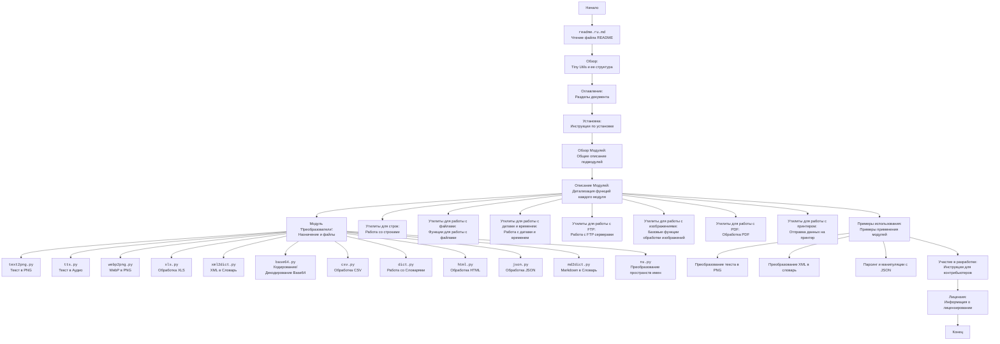

## <алгоритм>

1.  **Начало**: Пользователь читает файл `readme.ru.md`.
2.  **Ознакомление с оглавлением**: Пользователь просматривает разделы документа:
    *   `Tiny Utils`
    *   `Оглавление`
    *   `Установка`
    *   `Обзор модулей`
    *   `Описание модулей`
    *   `Примеры использования`
    *   `Участие в разработке`
    *   `Лицензия`
3.  **Изучение установки**: Пользователь знакомится с инструкцией по установке библиотеки `Tiny Utils` с использованием `git clone` и `pip install`.
    *   Пример: `git clone https://github.com/hypo69/tiny-utils.git`
    *   Пример: `cd tiny_utils`
    *   Пример: `pip install -r requirements.txt`
4.  **Обзор модулей**: Пользователь знакомится с общим описанием модулей библиотеки:
    *   `Преобразователи`
    *   `Утилиты для строк`
    *   `Утилиты для работы с файлами`
    *   `Утилиты для работы с датами и временем`
    *   `Утилиты для работы с FTP`
    *   `Утилиты для работы с изображениями`
    *   `Утилиты для работы с PDF`
    *   `Утилиты для работы с принтером`
5.  **Описание модулей**: Пользователь углубляется в детали модулей, изучая их назначение и конкретные файлы:
    *   **Преобразователи**:  Например, `text2png.py` для преобразования текста в PNG.
        *   Пример: `text2png.py` - (текст) --> (PNG изображение).
        *   Пример: `xml2dict.py` - (XML) --> (словарь Python).
    *   **Файлы**:
        *   Пример `text2png.py`: Преобразует текст в PNG-изображение.
        *   Пример `tts.py`: Преобразует текст в аудиофайл.
        *   Пример `webp2png.py`: Преобразует WebP-изображение в PNG.
        *   Пример `xls.py`: Обрабатывает XLS-файлы.
        *   Пример `xml2dict.py`: Преобразует XML в словарь.
        *   Пример `base64.py`: Кодирует/декодирует Base64.
        *   Пример `csv.py`: Парсит и обрабатывает CSV.
        *   Пример `dict.py`: Работает со словарями Python.
        *   Пример `html.py`: Преобразует HTML-контент.
        *   Пример `json.py`: Парсит и обрабатывает JSON.
        *   Пример `md2dict.py`: Преобразует Markdown в словарь.
        *   Пример `ns.py`: Преобразует пространства имен.
6.  **Примеры использования**: Пользователь знакомится с примерами использования библиотеки:
    *   Преобразование текста в изображение PNG.
    *   Преобразование XML в словарь.
    *   Парсинг и манипуляции с JSON.
7.  **Участие в разработке**: Пользователь узнает о возможности внести вклад в разработку.
8.  **Лицензия**: Пользователь знакомится с лицензией проекта.
9.  **Конец**: Завершение чтения файла `readme.ru.md`.

## <mermaid>

## <объяснение>

**Импорты:**

*   Файл `readme.ru.md` не содержит импортов. Это файл документации, а не программный код. Он описывает структуру, возможности и использование библиотеки `Tiny Utils`, но не импортирует никаких модулей или пакетов.
*   В описании есть упоминание файла `requirements.txt`, который содержит список необходимых зависимостей для работы с библиотекой. Эти зависимости устанавливаются через `pip install -r requirements.txt`.

**Классы:**

*   В файле `readme.ru.md` нет определения классов. Он предназначен для описания функциональности библиотеки, а не для реализации ее классов. Упоминание модулей, таких как `convertors`, указывает на наличие классов в соответствующих файлах, но сам `readme.ru.md` их не описывает.

**Функции:**

*   Файл `readme.ru.md` описывает назначение функций, но не содержит их реализацию. Он дает обзор функций, которые находятся в других файлах библиотеки.
*   Например, упоминается функция в `text2png.py`, которая преобразует текст в изображение PNG. В самом `readme.ru.md` нет кода этой функции, но описано ее назначение.

**Переменные:**

*   В файле `readme.ru.md` нет переменных, используемых в коде. Он содержит текст, который описывает модули, функции и другие аспекты библиотеки.
*   Упоминаются только названия файлов (например, `text2png.py`, `requirements.txt`), которые можно рассматривать как текстовые константы, но не переменные в классическом понимании.

**Потенциальные ошибки или области для улучшения:**

*   **Недостаток подробностей**: `readme.ru.md` предоставляет общий обзор библиотеки, но не содержит подробного описания каждой функции, класса или параметра. Для полноценной документации, возможно, потребуются дополнительные файлы (например, документация в формате Sphinx).
*   **Отсутствие примеров кода**: В разделе "Примеры использования" приведены только описания, а не код. Добавление примеров кода сделало бы документацию более практичной.
*   **Внешние ссылки**: В начале файла есть HTML-таблица с ссылками на другие части проекта. Эти ссылки могут устареть, если структура репозитория изменится.

**Взаимосвязи с другими частями проекта:**

*   `readme.ru.md` является частью документации и, следовательно, связана со всеми модулями и файлами библиотеки `Tiny Utils`, так как описывает их назначение и структуру.
*   Файл связан с файлом `requirements.txt`, так как упоминает его необходимость для установки зависимостей.
*   Файл связан с файлами в каталоге `src`, так как он описывает их назначение. Например, модули `convertors`, `string_utils`, `file_utils` и т.д., и их подфайлы, такие как `text2png.py`, `xml2dict.py`.
*   В начале есть ссылки на другие `README.md` файлы, такие как `[Root ↑]` и `src`.
*   Связан с репозиторием GitHub, так как в нем находится ссылка на репозиторий: `https://github.com/hypo69/tiny-utils.git`.

В целом, `readme.ru.md` предоставляет общую картину о библиотеке `Tiny Utils`. Для более глубокого понимания потребуются исходные коды модулей и дополнительные файлы документации.