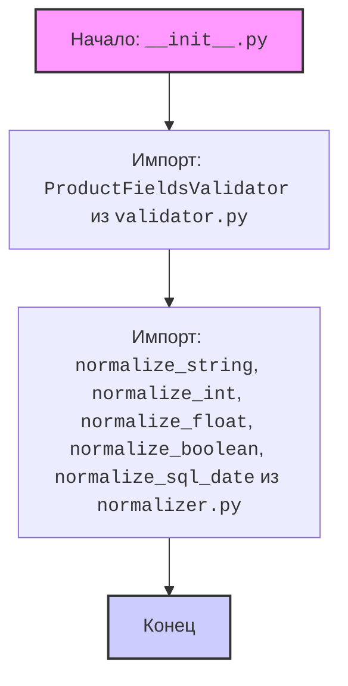

## АНАЛИЗ КОДА: `hypotez/src/utils/string/__init__.py`

### 1. <алгоритм>

**Назначение:** Данный файл (`__init__.py`) служит точкой входа для модуля `src.utils.string`. Он импортирует классы и функции из других модулей в том же пакете (`validator.py` и `normalizer.py`), чтобы сделать их доступными при импорте модуля `src.utils.string`.

**Блок-схема:**

```
flowchart TD
    A[Начало] --> B{Импорт ProductFieldsValidator из validator.py};
    B --> C{Импорт normalize_string, normalize_int, normalize_float, normalize_boolean, normalize_sql_date из normalizer.py};
    C --> D[Конец];
```

**Примеры:**

* **`ProductFieldsValidator`**:  Класс, вероятно, предназначен для валидации полей продукта (например, проверка формата, типа данных). Примеры использования:
    ```python
    from src.utils.string import ProductFieldsValidator
    validator = ProductFieldsValidator()
    is_valid = validator.validate_field("price", 10.99) # Предполагается метод validate_field
    ```
* **`normalize_string`**: Функция, которая преобразует строку к стандартному формату (например, обрезает пробелы, приводит к нижнему регистру).
    ```python
    from src.utils.string import normalize_string
    normalized_string = normalize_string("   Test String  ")
    # normalized_string может быть "test string"
    ```
* **`normalize_int`**: Функция, преобразующая значение в целое число.
    ```python
    from src.utils.string import normalize_int
    normalized_int = normalize_int("123")
    # normalized_int может быть 123
    ```
* **`normalize_float`**: Функция, преобразующая значение в число с плавающей точкой.
    ```python
    from src.utils.string import normalize_float
    normalized_float = normalize_float("3.14")
    # normalized_float может быть 3.14
    ```
* **`normalize_boolean`**: Функция, преобразующая значение в булев тип.
   ```python
   from src.utils.string import normalize_boolean
   normalized_bool = normalize_boolean("True")
    # normalized_bool может быть True
    ```
* **`normalize_sql_date`**: Функция, преобразующая строку в формат SQL date.
    ```python
    from src.utils.string import normalize_sql_date
    normalized_sql_date = normalize_sql_date("2023-10-26")
    # normalized_sql_date может быть "2023-10-26"
   ```

### 2. <mermaid>



**Объяснение диаграммы `mermaid`:**

*   Диаграмма типа `flowchart TD` показывает последовательность операций.
*   `Start` - начало выполнения скрипта `__init__.py`
*   `ImportValidator` - импортирует `ProductFieldsValidator` класс из модуля `validator.py`
*   `ImportNormalizer` - импортирует функции `normalize_string`, `normalize_int`, `normalize_float`, `normalize_boolean`, и `normalize_sql_date` из модуля `normalizer.py`
*   `End` - завершение работы скрипта `__init__.py`.
*   Стили `fill` и `stroke` используются для визуализации узлов.

### 3. <объяснение>

**Импорты:**

*   `from .validator import ProductFieldsValidator`: Импортирует класс `ProductFieldsValidator` из модуля `validator.py`, находящегося в том же пакете (`src.utils.string`). Этот класс, скорее всего, отвечает за проверку (валидацию) полей продукта на соответствие заданным правилам.  Связь с другими пакетами - данный класс может принимать параметры из `src.gs` для получения правил валидации.

*   `from .normalizer import ...`: Импортирует ряд функций из модуля `normalizer.py` также находящегося в том же пакете. Эти функции предназначены для преобразования данных к нужному формату:
    *   `normalize_string`: нормализует строковые значения.
    *   `normalize_int`: нормализует целочисленные значения.
    *   `normalize_float`: нормализует значения с плавающей точкой.
    *   `normalize_boolean`: нормализует булевы значения.
    *   `normalize_sql_date`: нормализует дату в формат, подходящий для SQL.
   Эти функции могут использовать настройки из `src.gs`.

**Классы:**

*   `ProductFieldsValidator`: Класс, который будет использоваться для валидации данных. Вероятно, он содержит методы для проверки типов данных, форматов и других ограничений. Методы не видны в `__init__.py`, но логично предположить их существование.

**Функции:**
*  `normalize_string`, `normalize_int`, `normalize_float`, `normalize_boolean`, `normalize_sql_date`: функции-утилиты для обработки данных.

**Переменные:**

В данном файле явных переменных не объявляется, он служит точкой доступа к классам и функциям.

**Потенциальные ошибки и улучшения:**

*   **Отсутствие документации:** В `__init__.py` нет комментариев, объясняющих назначение модуля и импортированных сущностей. Стоит добавить Docstring к модулю и к каждому импорту (классу, функции).

*   **Обработка исключений:** Функции нормализации, вероятно, должны обрабатывать исключения (например, `ValueError` при некорректном формате).  И хорошо было бы добавить логирование подобных ситуаций.

*   **Расширяемость:** Класс `ProductFieldsValidator` можно сделать более гибким, используя настройки или дополнительные параметры для определения правил валидации.

**Взаимосвязи с другими частями проекта:**

*   Модуль `src.utils.string` является частью утилит, предназначенных для общей обработки данных в проекте.
*   Он, вероятно, будет использоваться в других модулях проекта для обработки и валидации данных, которые могут поступать из различных источников (например, из базы данных, API или конфигурационных файлов).
*   `src.gs` - global settings - должен быть доступен для настройки поведения валидатора и функций нормализации, но напрямую в файле `__init__.py` не используется.