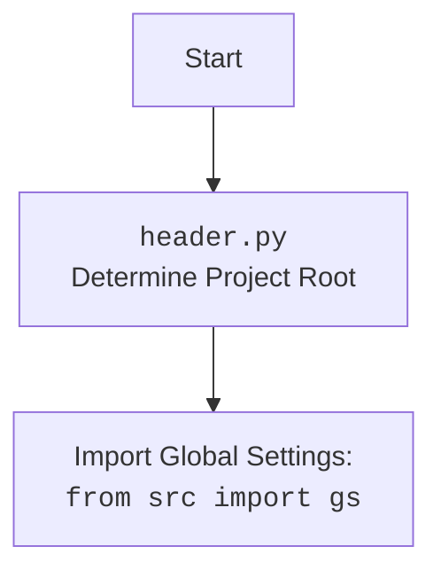

## АНАЛИЗ КОДА `hypotez/src/utils/string/header.py`

### 1. <алгоритм>

1.  **Начало**:
    *   Импортируются необходимые модули: `sys`, `json`, `Version` из `packaging.version`, `Path` из `pathlib`.
2.  **`set_project_root(marker_files)`**:
    *   Функция принимает `marker_files` (кортеж имен файлов или каталогов) в качестве аргумента.
    *   Определяется текущий каталог, где находится файл `header.py`.
        *   **Пример:** `Path(__file__).resolve().parent` возвращает `/path/to/hypotez/src/utils/string`
    *   Инициализируется переменная `__root__` как текущий каталог.
    *   Цикл `for parent in [current_path] + list(current_path.parents)`:
        *   Перебираются все родительские каталоги, начиная с текущего.
        *   На каждом шаге проверяется, существует ли хоть один из `marker_files` в текущем родительском каталоге.
            *   **Пример:**  Проверяется наличие файлов `__root__` или `.git` в каждом родительском каталоге.
        *   Если любой из `marker_files` найден, то `__root__` устанавливается как текущий родительский каталог, и цикл прерывается.
            *   **Пример**: Если файл `.git` найден в `/path/to/hypotez/`, то `__root__` станет `/path/to/hypotez/`.
    *   Если `__root__` не находится в `sys.path`, то он добавляется в начало `sys.path`. Это позволяет использовать абсолютные импорты относительно корневой директории проекта.
    *   Возвращает `__root__` (объект `Path`).
3.  **`__root__ = set_project_root()`**:
    *   Вызывается функция `set_project_root()` для определения корневой директории проекта и сохраняет результат в переменную `__root__`.
4.  **Импорт `src.gs`**:
    *   Импортируется модуль `gs` из пакета `src`. Предполагается, что этот модуль содержит глобальные настройки проекта, включая путь к корневой директории.
5.  **Загрузка `settings.json`**:
    *   Инициализируется переменная `settings` как `None`.
    *   Чтение файла `settings.json` из директории `src` в корневом каталоге.
    *   При успешном чтении, содержимое файла (словарь) присваивается `settings`.
    *   Если возникает ошибка `FileNotFoundError` или `json.JSONDecodeError`, переменная `settings` остается `None`.
6.  **Загрузка `README.MD`**:
    *   Инициализируется переменная `doc_str` как `None`.
    *   Чтение файла `README.MD` из директории `src` в корневом каталоге.
    *   При успешном чтении, содержимое файла (строка) присваивается `doc_str`.
    *   Если возникает ошибка `FileNotFoundError` или `json.JSONDecodeError`, переменная `doc_str` остается `None`.
7.  **Инициализация глобальных переменных**:
    *   Инициализация глобальных переменных проекта, такие как `__project_name__`, `__version__`, `__doc__`, `__details__`, `__author__`, `__copyright__`, и `__cofee__`, значения которых берутся из словаря `settings` если он загружен, в противном случае используются значения по умолчанию.

### 2. <mermaid>

```mermaid
flowchart TD
    Start --> FindRoot[Найти корневую директорию проекта <br><code>set_project_root(marker_files)</code>]
    FindRoot --> CheckRootExists[Проверить, существует ли <br>корневая директория]
    CheckRootExists -- Да --> ImportGlobalSettings[Импорт глобальных <br>настроек: <br><code>from src import gs</code>]
    CheckRootExists -- Нет --> SetDefaultRoot[Установить корневую <br>директорию по умолчанию]
    SetDefaultRoot --> ImportGlobalSettings
    ImportGlobalSettings --> LoadSettings[Загрузить settings.json]
     LoadSettings -- success --> LoadReadme[Загрузить README.md]
      LoadSettings -- fail --> LoadReadme
    LoadReadme -- success --> SetProjectVariables[Установить глобальные переменные <br>(project_name, version, и т.д.) из settings и README]
       LoadReadme -- fail --> SetProjectVariables
    SetProjectVariables --> End
    
    
  subgraph  Find Root Directory
     FindRoot --> CurrentPath[Определить текущий путь <br><code>Path(__file__).resolve().parent</code>]
        CurrentPath --> InitRoot[Инициализировать переменную <br><code>__root__</code> текущим путем]
        InitRoot --> ParentLoop[Цикл перебора родительских <br>каталогов]
        ParentLoop --> CheckMarker[Проверка наличия маркеров <br>в текущем родительском каталоге]
        CheckMarker -- "Маркер найден" --> UpdateRoot[Обновить <code>__root__</code>]
        UpdateRoot --> BreakLoop[Прервать цикл]
        CheckMarker -- "Маркер не найден" --> ParentLoop
         BreakLoop --> PathInSys[Проверить <code>__root__</code> в <code>sys.path</code>]
          ParentLoop -- "Нет больше родительских каталогов" --> PathInSys
            PathInSys -- "<code>__root__</code> not in <code>sys.path</code>" --> AddRootPath[Добавить <code>__root__</code> в <code>sys.path</code>]
        PathInSys -- "<code>__root__</code> in <code>sys.path</code>" --> ReturnRoot[Возврат <code>__root__</code>]
        AddRootPath --> ReturnRoot
  end
  subgraph Load Settings and Readme
    LoadSettings --> ReadSettingsFile[Открыть и прочитать<br><code>settings.json</code>]
      ReadSettingsFile -- success --> ParseSettingsFile[Загрузить <code>settings</code><br>из файла <code>settings.json</code>]
         ReadSettingsFile -- fail --> SkipLoadSettings[Пропустить<br> загрузку <code>settings</code>]
           ParseSettingsFile --> LoadReadme
          SkipLoadSettings --> LoadReadme
    LoadReadme --> ReadReadmeFile[Открыть и прочитать<br><code>README.md</code>]
    ReadReadmeFile -- success --> ParseReadmeFile[Загрузить  <code>doc_str</code><br>из файла <code>README.md</code>]
        ReadReadmeFile -- fail --> SkipLoadReadme[Пропустить<br> загрузку <code>doc_str</code>]
         ParseReadmeFile --> SetProjectVariables
        SkipLoadReadme --> SetProjectVariables
  end
```



### 3. <объяснение>

#### Импорты:

*   **`sys`**: Предоставляет доступ к некоторым переменным и функциям, взаимодействующим с интерпретатором Python. Используется для добавления пути к корневому каталогу в `sys.path`, что позволяет корректно импортировать модули внутри проекта, вне зависимости от того, откуда запускается скрипт.
*   **`json`**: Используется для работы с файлами в формате JSON. В данном случае, используется для загрузки настроек из `settings.json`.
*   **`Version` из `packaging.version`**: Используется для представления и сравнения версий. В данном коде не используется.
*   **`Path` из `pathlib`**: Предоставляет более удобный способ работы с путями в файловой системе, чем использование строк. Используется для определения и манипуляции путями к файлам и каталогам.
*    **`src.gs`**: импортирует глобальные настройки проекта. Этот модуль предоставляя доступ к переменным и функциям, общим для всего проекта.

#### Функции:

*   **`set_project_root(marker_files)`**:
    *   **Аргументы**:
        *   `marker_files`: кортеж строк, представляющих имена файлов или каталогов, которые обозначают корень проекта. По умолчанию (`__root__`, `.git`).
    *   **Возвращает**:
        *   Объект `Path`, указывающий на корневой каталог проекта. Если маркеры не найдены, возвращает каталог, где находится файл `header.py`.
    *   **Назначение**: Функция рекурсивно поднимается по родительским каталогам, пока не найдет один из `marker_files`, тем самым определяя корень проекта. Это позволяет запускать скрипты из любой точки проекта.
    *   **Примеры**:
        *   `set_project_root(marker_files=('config.ini', 'data'))` - поиск файлов 'config.ini' или папки 'data' в родительских директориях.
        *   `set_project_root()` - использование маркерных файлов по умолчанию `('__root__', '.git')`.

#### Переменные:

*   **`__root__` (Path)**: Содержит путь к корневой директории проекта, полученный с помощью `set_project_root()`.
*   **`settings` (dict)**: Содержит словарь с настройками проекта, загруженный из `settings.json`, или `None` в случае ошибки.
*   **`doc_str` (str)**: Содержит строку с содержимым файла `README.MD`, или `None` в случае ошибки.
*   **`__project_name__` (str)**: Название проекта, загруженное из настроек (или `hypotez` по умолчанию).
*   **`__version__` (str)**: Версия проекта, загруженная из настроек (или пустая строка по умолчанию).
*   **`__doc__` (str)**: Содержит описание проекта из `README.MD` (или пустая строка по умолчанию).
*   **`__details__` (str)**: Дополнительные сведения (в данном коде - пустая строка).
*   **`__author__` (str)**: Автор проекта (из настроек).
*   **`__copyright__` (str)**: Авторские права (из настроек).
*   **`__cofee__` (str)**: Сообщение с предложением "угостить разработчика кофе" (из настроек).

#### Потенциальные ошибки и области для улучшения:

*   **Обработка ошибок при загрузке файлов:** Сейчас при ошибке загрузки `settings.json` или `README.MD` просто выставляется `None`. Можно улучшить обработку ошибок, добавив логирование или вывод предупреждений.
*   **Жестко заданные пути:** Пути к `settings.json` и `README.MD` жестко заданы в коде, что может быть неудобно при изменении структуры проекта. Возможно, стоит перенести эти настройки в `gs`.
*   **Отсутствие обработки исключений в `settings.get`:** Если в файле `settings.json` отсутствуют какие-то ключи, то `settings.get` вернет `None`, и могут возникнуть дополнительные сложности. Необходимо добавить явную проверку на `None`.
*   **Отсутствие валидации настроек:** Необходимо добавить валидацию настроек после их загрузки, что гарантирует наличие необходимых значений.

#### Взаимосвязи с другими частями проекта:

*   **`src.gs`**: Модуль `header.py` зависит от `src.gs`, так как использует `gs.path.root`. Это означает, что при изменении `gs` нужно также проверять `header.py`.
*   **`settings.json`**: Зависит от наличия файла `settings.json` и его корректного содержимого.
*   **`README.MD`**: Зависит от наличия файла `README.MD`.

В целом, `header.py` является важным модулем проекта, определяющим корневую директорию и загружающим общие настройки. Он является точкой входа для других модулей, которые используют эти настройки.