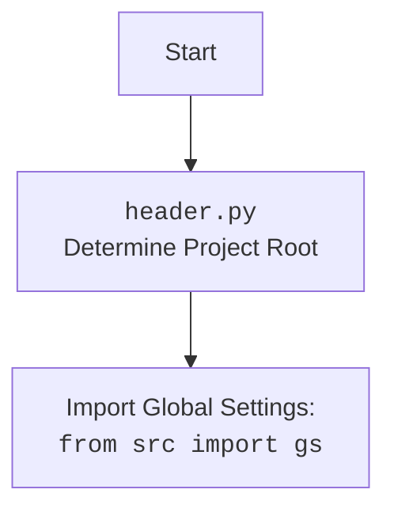

## ИНСТРУКЦИЯ:

Анализируй предоставленный код подробно и объясни его функциональность. Ответ должен включать три раздела:

1. **<алгоритм>**: Опиши рабочий процесс в виде пошаговой блок-схемы, включая примеры для каждого логического блока, и проиллюстрируй поток данных между функциями, классами или методами.
2. **<mermaid>**: Напиши код для диаграммы в формате `mermaid`, проанализируй и объясни все зависимости,
    которые импортируются при создании диаграммы.
    **ВАЖНО!** Убедитесь, что все имена переменных, используемые в диаграмме `mermaid`,
    имеют осмысленные и описательные имена. Имена переменных вроде `A`, `B`, `C`, и т.д., не допускаются!

    **Дополнительно**: Если в коде есть импорт `import header`, добавьте блок `mermaid` flowchart, объясняющий `header.py`:
    ```mermaid
    flowchart TD
        Start --> Header[<code>header.py</code><br> Determine Project Root]

        Header --> import[Import Global Settings: <br><code>from src import gs</code>]
    ```

3. **<объяснение>**: Предоставьте подробные объяснения:
   - **Импорты**: Их назначение и взаимосвязь с другими пакетами `src.`.
   - **Классы**: Их роль, атрибуты, методы и взаимодействие с другими компонентами проекта.
   - **Функции**: Их аргументы, возвращаемые значения, назначение и примеры.
   - **Переменные**: Их типы и использование.
   - Выделите потенциальные ошибки или области для улучшения.

Дополнительно, постройте цепочку взаимосвязей с другими частями проекта (если применимо).

Это обеспечивает всесторонний и структурированный анализ кода.
## Формат ответа: `.md` (markdown)
**КОНЕЦ ИНСТРУКЦИИ**

## <алгоритм>

### Общий алгоритм работы модуля WebDriver

1.  **Инициализация `Driver`:**
    *   Создается экземпляр класса `Driver` с указанием конкретного драйвера (например, `Chrome`).
        *   Пример: `chrome_driver = Driver(Chrome)`
2.  **Навигация по URL:**
    *   Вызывается метод `get_url` для перехода по указанному URL.
    *   Метод устанавливает свойства `previous_url`, `referrer` и `page_lang`.
        *   Пример: `chrome_driver.get_url("https://www.example.com")`
3.  **Извлечение домена:**
    *   Вызывается метод `extract_domain` для извлечения домена из URL.
        *   Пример: `chrome_driver.extract_domain("https://www.example.com/path/to/page")`
4.  **Работа с Cookies:**
    *   Вызывается метод `_save_cookies_localy` для сохранения cookies в файл.
        *   Пример: `chrome_driver._save_cookies_localy()`
5.  **Обновление страницы:**
    *   Вызывается метод `page_refresh` для обновления текущей страницы.
        *   Пример: `chrome_driver.page_refresh()`
6.  **Прокрутка страницы:**
    *   Вызывается метод `scroll` для прокрутки страницы в указанном направлении.
        *   Пример: `chrome_driver.scroll(scrolls=3, direction='forward', frame_size=1000, delay=1)`
7.  **Определение языка страницы:**
    *   Свойство `locale` пытается определить язык текущей страницы.
        *   Пример: `page_language = chrome_driver.locale`
8.  **Создание драйвера с User-Agent:**
    *   Создается новый экземпляр `Driver` с кастомным `user-agent`.
        *   Пример: `custom_chrome_driver = Driver(Chrome, user_agent=user_agent)`
9.  **Поиск элемента:**
    *   Вызывается метод `find_element` для поиска элемента на странице по заданному селектору.
        *   Пример: `element = chrome_driver.find_element(By.CSS_SELECTOR, 'h1')`
10. **Получение текущего URL:**
    *   Свойство `current_url` возвращает текущий URL.
        *   Пример: `current_url = chrome_driver.current_url`
11. **Фокусировка окна:**
    *   Вызывается метод `window_focus` для фокусировки окна браузера.
        *   Пример: `chrome_driver.window_focus()`
12. **`ExecuteLocator`:**
    *   Экземпляр `ExecuteLocator` получает `WebDriver` в конструкторе
    *   Метод `execute_locator` обрабатывает словарь с локатором.
        *   Определяет тип действия (например, поиск, отправка сообщения, клик).
    *   Метод `get_webelement_by_locator` находит элемент(ы) на странице.
    *   Метод `get_attribute_by_locator` извлекает значения атрибутов.
    *   Метод `send_message` отправляет текст в поле ввода.
    *   Метод `evaluate_locator` обрабатывает атрибуты, содержащие специальные значения.
    *   Все операции обернуты в блоки `try-except` для обработки исключений.

### Поток данных

*   **`Driver(Chrome)`:** Создание объекта драйвера Chrome.
    *   Передает конфигурацию в конструктор.
*   **`get_url(url)`:** Навигация по URL.
    *   Ввод: URL (строка).
    *   Вывод: `True` или `False`.
*   **`extract_domain(url)`:** Извлечение домена из URL.
    *   Ввод: URL (строка).
    *   Вывод: домен (строка).
*   **`_save_cookies_localy()`:** Сохранение cookies.
    *   Вывод: `True` или `False`.
*   **`page_refresh()`:** Обновление страницы.
    *   Вывод: `True` или `False`.
*   **`scroll(...)`:** Прокрутка страницы.
    *   Ввод: Параметры прокрутки.
    *   Вывод: `True` или `False`.
*   **`locale`:** Получение языка страницы.
    *   Вывод: Язык (строка).
*   **`find_element(by, selector)`:** Поиск элемента.
    *   Ввод: `By` селектор, селектор (строка).
    *   Вывод: `WebElement` или `None`.
*   **`current_url`:** Получение текущего URL.
    *   Вывод: URL (строка).
*   **`window_focus()`:** Фокусировка окна.
    *   Вывод: `None`.
*   **`ExecuteLocator(driver)`:** Создание объекта класса, передается драйвер для взаимодействия с WebDriver.
    *   Ввод: WebDriver
    *   Вывод: экземпляр `ExecuteLocator`
*  **`execute_locator(locator, message, typing_speed, continue_on_error)`:** Выполняет действие, указанное в локаторе.
    *   Ввод: локатор (словарь), сообщение (строка), скорость печати (float), флаг продолжения при ошибке (bool)
    *   Вывод: Результат выполнения действия.
*   **`get_webelement_by_locator(locator, message)`:** Находит элемент(ы) на странице.
     *  Ввод: локатор (словарь), сообщение (строка).
     *  Вывод: WebElement или List[WebElement] или False.
*  **`get_attribute_by_locator(locator, message)`:** Получает атрибут элемента(ов)
    * Ввод: локатор (словарь), сообщение (строка).
    *  Вывод: Значение атрибута (str) или список атрибутов (list) или False
* **`send_message(locator, message, typing_speed, continue_on_error)`:** Отправляет сообщение в элемент.
    *   Ввод: локатор (словарь), сообщение (строка), скорость печати (float), флаг продолжения при ошибке (bool)
    *   Вывод: `True` или `False`.
*  **`evaluate_locator(attribute)`:** Обрабатывает атрибуты.
     *   Ввод: Атрибут (str, list, dict)
     *  Вывод:  Обработанный атрибут (str)

## <mermaid>

```mermaid
flowchart TD
    Start[Start] --> DriverCreation[Создание Driver: `Driver(Chrome, user_agent)`]
    DriverCreation --> Navigation[Навигация по URL: `get_url(url)`]
    Navigation --> DomainExtraction[Извлечение домена: `extract_domain(url)`]
    DomainExtraction --> CookiesSave[Сохранение cookies: `_save_cookies_localy()`]
    CookiesSave --> PageRefresh[Обновление страницы: `page_refresh()`]
    PageRefresh --> Scrolling[Прокрутка страницы: `scroll(...)`]
    Scrolling --> PageLanguage[Получение языка страницы: `locale`]
    PageLanguage --> CustomDriverCreation[Создание Driver с user-agent]
    CustomDriverCreation --> FindElement[Поиск элемента: `find_element(by, selector)`]
    FindElement --> GetCurrentUrl[Получение текущего URL: `current_url`]
    GetCurrentUrl --> WindowFocus[Фокус окна: `window_focus()`]

    WindowFocus --> ExecutorCreation[Создание ExecuteLocator: `ExecuteLocator(driver)`]
    ExecutorCreation --> ExecuteLocatorMethod[Вызов execute_locator(locator, message, typing_speed, continue_on_error)]
    ExecuteLocatorMethod --> GetWebElement[Поиск веб элемента `get_webelement_by_locator(locator, message)`]
    ExecuteLocatorMethod --> GetAttribute[Получение атрибута `get_attribute_by_locator(locator, message)`]
     ExecuteLocatorMethod --> SendMessage[Отправка сообщения `send_message(locator, message, typing_speed, continue_on_error)`]
    ExecuteLocatorMethod --> EvaluateLocator[Обработка атрибута `evaluate_locator(attribute)`]
    
    GetWebElement --> End[End]
    GetAttribute --> End
    SendMessage --> End
    EvaluateLocator --> End
```

**Анализ зависимостей `mermaid`:**

Диаграмма показывает поток выполнения основных функций и методов, используемых в коде.
*   `DriverCreation`: Инициализация объекта `Driver` с указанием драйвера `Chrome`. Может включать параметр `user_agent`.
*   `Navigation`: Метод `get_url` для навигации к указанному URL.
*   `DomainExtraction`: Извлечение домена из URL с помощью `extract_domain`.
*   `CookiesSave`: Сохранение cookies в локальный файл с помощью `_save_cookies_localy`.
*   `PageRefresh`: Обновление текущей страницы с помощью `page_refresh`.
*   `Scrolling`: Прокрутка страницы с помощью `scroll`.
*   `PageLanguage`: Определение языка страницы с помощью `locale`.
*   `CustomDriverCreation`: Создание нового объекта `Driver` с кастомным `user_agent`.
*    `FindElement`: Поиск элемента по селектору с помощью `find_element(by, selector)`.
*    `GetCurrentUrl`: Получение текущего URL с помощью `current_url`.
*    `WindowFocus`: Фокусировка окна с помощью `window_focus`.
*    `ExecutorCreation`: Создание экземпляра класса `ExecuteLocator` и передача `driver`.
*    `ExecuteLocatorMethod`: Вызов метода `execute_locator`
*   `GetWebElement`: Метод `get_webelement_by_locator` для поиска элемента.
*   `GetAttribute`: Метод `get_attribute_by_locator` для получения атрибута.
*   `SendMessage`: Метод `send_message` для отправки сообщения.
*    `EvaluateLocator`:  Метод `evaluate_locator` для обработки атрибута.
*   `End`: Конец выполнения программы.



## <объяснение>

### Импорты

*   `from src.webdriver.driver import Driver, Chrome`:
    *   Импортирует классы `Driver` и `Chrome` из модуля `src.webdriver.driver`.
    *   `Driver` – основной класс для управления браузером, `Chrome` – класс для инициализации драйвера Chrome.
*   `from selenium.webdriver.common.by import By`:
    *   Импортирует класс `By` из `selenium.webdriver.common.by`.
    *   Используется для определения типа селектора (например, CSS, XPATH).
*  `from selenium import webdriver`
    * Импортирует модуль `webdriver` из `selenium`.
    *  Используется для управления браузером.
*   `from selenium.webdriver.common.keys import Keys`:
    *    Импортирует класс `Keys` из `selenium.webdriver.common.keys`.
    *    Используется для эмуляции нажатия клавиш.
*   `from selenium.webdriver.remote.webelement import WebElement`
    *   Импортирует класс `WebElement` из `selenium.webdriver.remote.webelement`.
    *  Представляет HTML элемент на веб странице.
*   `from selenium.webdriver.support.ui import WebDriverWait`
    *  Импортирует класс `WebDriverWait` из `selenium.webdriver.support.ui`.
    *  Используется для ожидания загрузки элементов.
*   `from selenium.webdriver.support import expected_conditions as EC`
    * Импортирует модуль `expected_conditions` из `selenium.webdriver.support`.
    *  Используется для описания ожиданий загрузки элементов.
*   `from selenium.webdriver.common.action_chains import ActionChains`
    *  Импортирует класс `ActionChains` из `selenium.webdriver.common.action_chains`.
    *  Используется для выполнения сложных действий над элементами, таких как клики, перетаскивания и т.д..
*   `from selenium.common.exceptions import NoSuchElementException, TimeoutException`
    *    Импортирует исключения из `selenium.common.exceptions`.
    *   Используется для обработки ошибок при поиске элементов.
*   `from src import gs`
    *    Импортирует глобальные настройки из пакета `src`.
    *    Используется для доступа к параметрам конфигурации.
*   `from src.utils.printer import pprint, j_loads, j_loads_ns, j_dumps, save_png`
    *    Импортирует функции для печати, работы с JSON и сохранения PNG из `src.utils.printer`.
*   `from src.logger.logger import logger`
    *   Импортирует логгер из `src.logger.logger`.
    *   Используется для логирования событий и ошибок.
*  `from src.logger.exceptions import DefaultSettingsException, WebDriverException, ExecuteLocatorException`
    *  Импортирует кастомные исключения из `src.logger.exceptions`.
    *   Используется для обработки ошибок.
* `from types import SimpleNamespace`
    * Импортируется `SimpleNamespace` для удобства работы с атрибутами объектов.

### Классы

*   **`DriverMeta`:**
    *   Метакласс, который создает класс `Driver`.
    *   Метод `__call__` создает класс `Driver`, который наследуется от переданного класса WebDriver (например, `Chrome`) и `DriverBase`.
    *   Инициализирует JavaScript методы и функционал `ExecuteLocator`.
*   **`DriverBase`:**
    *   Базовый класс для `Driver`.
    *   Содержит общие методы для управления браузером (скроллинг, навигация, cookies и т.д.).
    *   Атрибуты:
        *   `previous_url`: URL предыдущей страницы.
        *   `referrer`: Реферер URL.
        *   `page_lang`: Язык страницы.
    *   Методы:
        *   `scroll()`: Прокручивает страницу.
        *   `locale`: Получает язык страницы.
        *   `get_url()`: Открывает URL.
        *   `extract_domain()`: Извлекает домен из URL.
        *   `_save_cookies_localy()`: Сохраняет cookies.
        *   `page_refresh()`: Обновляет страницу.
        *   `window_focus()`: Фокусирует окно браузера.
        *  `wait()`: Ожидает заданное время.
*   **`Driver`:**
    *   Динамически созданный класс, наследуется от `DriverBase` и конкретного драйвера (например, `Chrome`).
    *   Используется для управления браузером.
*   **`ExecuteLocator`:**
    *  Класс для выполнения действий на веб элементах.
    *  Атрибуты:
         * `driver`: экземпляр WebDriver для взаимодействия с браузером.
         * `actions`: `ActionChains` для управления действиями.
         * `by_mapping`: Словарь, связывающий строковое представление локатора с `By`.
    *  Методы:
         * `__init__(driver)`: Инициализирует `ExecuteLocator` с драйвером и цепочкой действий.
         * `execute_locator(locator, message, typing_speed, continue_on_error)`: Обрабатывает локатор и выполняет необходимые действия.
         * `get_webelement_by_locator(locator, message)`: Находит веб элемент(ы).
         * `get_attribute_by_locator(locator, message)`: Получает атрибуты элемента.
         * `_get_element_attribute(element, attribute)`: Получает атрибут элемента.
         * `send_message(locator, message, typing_speed, continue_on_error)`: Отправляет сообщение в элемент.
         * `evaluate_locator(attribute)`: Обрабатывает атрибуты.
         * `_evaluate(attribute)`: Обрабатывает атрибуты.
         * `get_locator_keys()`: Возвращает список ключей локаторов.

### Функции

*   **`main()`:**
    *   Основная функция для демонстрации использования классов `Driver` и `Chrome`.
    *   Создает экземпляр драйвера, выполняет различные действия на веб-странице.
    *   Примеры:
        *   Навигация по URL.
        *   Извлечение домена.
        *   Сохранение cookies.
        *   Обновление страницы.
        *   Прокрутка страницы.
        *   Получение языка страницы.
        *   Создание драйвера с кастомным `user-agent`.
        *   Поиск элемента по CSS селектору.
        *   Получение текущего URL.
        *   Фокусировка окна.

### Переменные

*   `chrome_driver`: Экземпляр класса `Driver` с драйвером Chrome.
*   `domain`: Строка, содержащая домен из URL.
*   `success`: Булево значение, показывающее успех выполнения операции.
*   `page_language`: Строка, содержащая язык страницы.
*   `user_agent`: Словарь с кастомным `user-agent`.
*   `custom_chrome_driver`: Экземпляр класса `Driver` с кастомным `user-agent`.
*   `element`: Экземпляр класса `WebElement` (или `None`, если элемент не найден).
*    `current_url`: Строка, содержащая текущий URL.
*   `locator`: Словарь, содержащий параметры локатора.
*   `message`: Строка, содержащая сообщение, которое нужно отправить.
*   `typing_speed`: Скорость печати текста.
*   `continue_on_error`: Флаг продолжения при ошибке.
*   `attribute`: Строка или список, содержащая атрибут элемента.

### Потенциальные ошибки и области для улучшения

*   **Обработка исключений:** В коде есть блоки `try-except` для обработки исключений, но, возможно, потребуется более детальная обработка конкретных типов исключений.
*   **Конфигурация:** Путь к файлу настроек и ресурсам должен быть корректно настроен в `gs`.
*  **Логирование:** В коде используется логгер, но можно добавить больше информации в логи.
* **Улучшение читаемости:**  Сложная логика `evaluate_locator` может быть упрощена и структурирована.
* **Асинхронность:** Для повышения производительности можно использовать асинхронные операции.

### Взаимосвязь с другими частями проекта

*   `src.webdriver.driver`: Этот модуль является частью пакета `src.webdriver` и используется для управления браузером.
*   `src.utils.printer`: Используется для вывода информации и работы с JSON.
*   `src.logger`: Используется для логирования событий.
*   `src.gs`: Используется для доступа к глобальным настройкам проекта.

Таким образом, `driver.py` и `executor.py` взаимодействуют для автоматизации действий в браузере, используя `selenium` и другие внутренние модули. `driver.py` отвечает за управление браузером, а `executor.py` выполняет действия над веб-элементами.