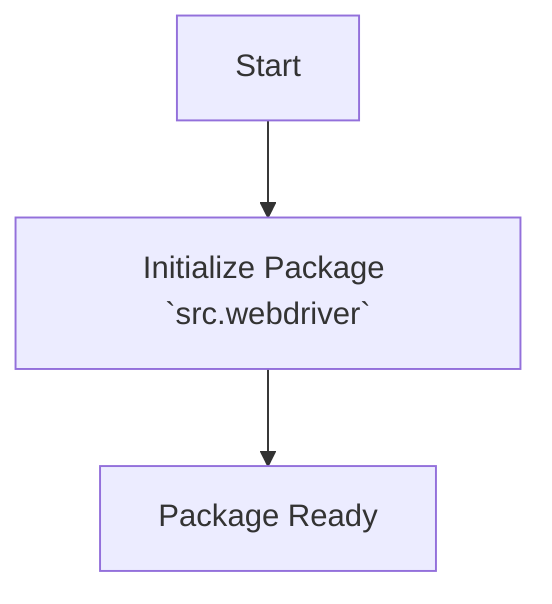
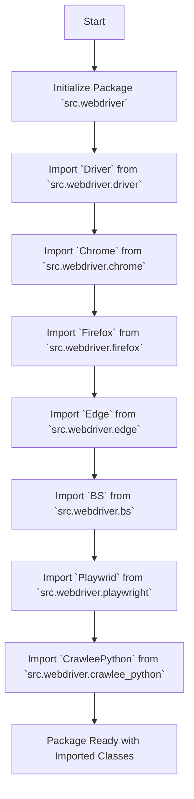

## АНАЛИЗ КОДА `hypotez/src/webdriver/__init__.py`

### 1. <алгоритм>

Данный файл `__init__.py` в директории `src/webdriver` по сути является пустым файлом, который используется для того, чтобы интерпретатор Python рассматривал директорию `webdriver` как пакет.  Изначально, в нем присутствовали закомментированные строки импортов, но в текущей версии они неактивны.

**Блок-схема (в текущем виде, файл пустой):**

```
Start --> Init[Initialize Package `src.webdriver` ]
Init --> End[Package Ready]
```

Если бы импорты были раскомментированы, то логика была бы следующей:
```
Start --> Init[Initialize Package `src.webdriver`]
Init --> ImportDriver[Import `Driver` from `src.webdriver.driver`]
ImportDriver --> ImportChrome[Import `Chrome` from `src.webdriver.chrome`]
ImportChrome --> ImportFirefox[Import `Firefox` from `src.webdriver.firefox`]
ImportFirefox --> ImportEdge[Import `Edge` from `src.webdriver.edge`]
ImportEdge --> ImportBS[Import `BS` from `src.webdriver.bs`]
ImportBS --> ImportPlaywright[Import `Playwrid` from `src.webdriver.playwright`]
ImportPlaywright --> ImportCrawleePython[Import `CrawleePython` from `src.webdriver.crawlee_python`]
ImportCrawleePython --> End[Package Ready with Imported Classes]
```

**Пример:**
* **Start**: Начало выполнения скрипта.
* **Init**: Создание пакета `src.webdriver` (в текущем виде пустого).
* **ImportDriver**:  Импорт класса `Driver`. В этом случае, если закоментированная строка импорта будет раскомментирована, то при обращении к пакету будет доступен класс `Driver`.

### 2. <mermaid>


**Объяснение диаграммы:**

*   **`Start`**: Обозначает начало процесса, когда Python интерпретатор начинает обрабатывать пакет `src.webdriver`.
*   **`Init`**: Обозначает инициализацию пакета. В текущем состоянии этот шаг заключается в том, что директория `webdriver` будет восприниматься как пакет Python (из-за наличия файла `__init__.py`).
*   **`End`**: Обозначает завершение процесса инициализации пакета.

Если бы импорты были раскомментированы, то диаграмма была бы следующей:



**Объяснение диаграммы (с импортами):**

*   **`Start`**: Обозначает начало процесса, когда Python интерпретатор начинает обрабатывать пакет `src.webdriver`.
*   **`Init`**: Обозначает инициализацию пакета, которая делает директорию `webdriver` пакетом Python.
*   **`ImportDriver`**: Импортирует класс `Driver` из модуля `driver.py` в пакете `src.webdriver`.
*   **`ImportChrome`**: Импортирует класс `Chrome` из модуля `chrome.py` в пакете `src.webdriver`.
*   **`ImportFirefox`**: Импортирует класс `Firefox` из модуля `firefox.py` в пакете `src.webdriver`.
*   **`ImportEdge`**: Импортирует класс `Edge` из модуля `edge.py` в пакете `src.webdriver`.
*   **`ImportBS`**: Импортирует класс `BS` из модуля `bs.py` в пакете `src.webdriver`.
*   **`ImportPlaywright`**: Импортирует класс `Playwrid` из модуля `playwright.py` в пакете `src.webdriver`.
*   **`ImportCrawleePython`**: Импортирует класс `CrawleePython` из модуля `crawlee_python.py` в пакете `src.webdriver`.
*   **`End`**: Обозначает завершение процесса инициализации пакета и импорта классов.

### 3. <объяснение>

**Импорты:**

В текущем виде файла, нет импортов. Закомментированные импорты указывают на потенциальную структуру пакета `webdriver`:

*   `from .driver import Driver`:  Импорт класса `Driver` из модуля `driver.py` внутри пакета `webdriver`. Этот класс, вероятно, представляет собой базовый класс для управления веб-драйверами.
*   `from .chrome import Chrome`: Импорт класса `Chrome` из модуля `chrome.py`, который, вероятно, содержит реализацию веб-драйвера для браузера Chrome.
*   `from .firefox import Firefox`:  Импорт класса `Firefox` из модуля `firefox.py`, который, вероятно, содержит реализацию веб-драйвера для браузера Firefox.
*   `from .edge import Edge`: Импорт класса `Edge` из модуля `edge.py`, который, вероятно, содержит реализацию веб-драйвера для браузера Edge.
*   `from .bs import BS`: Импорт класса `BS` из модуля `bs.py`, возможно, связанный с Beautiful Soup для парсинга HTML-страниц.
*   `from .playwright import Playwrid`: Импорт класса `Playwrid` из модуля `playwright.py`, вероятно, для управления браузерами через Playwright.
*    `from .crawlee_python import CrawleePython`: Импорт класса `CrawleePython` из модуля `crawlee_python.py`, возможно, связанного с веб-скрапингом с использованием библиотеки Crawlee.

**Классы:**
В текущем виде файла, нет классов. Закомментированные импорты предполагают наличие классов, таких как:
*   **`Driver`**: Базовый класс для управления веб-драйверами. Может содержать общую логику и интерфейс для взаимодействия с разными браузерами.
*   **`Chrome`**, **`Firefox`**, **`Edge`**: Классы, которые расширяют базовый класс `Driver` и предоставляют специфическую реализацию для каждого браузера. Эти классы вероятно будут отвечать за запуск браузера, выполнение навигации, взаимодействие с веб-элементами и закрытие браузера.
*   **`BS`**: Класс для обработки веб-страниц.  Возможно, это класс-обертка над Beautiful Soup.
*   **`Playwrid`**: Класс для управления браузерами с помощью Playwright.
*   **`CrawleePython`**: Класс для веб-скрапинга с помощью Crawlee.

**Функции:**
В текущем виде файла, нет функций.

**Переменные:**
В текущем виде файла, нет переменных.

**Потенциальные ошибки или области для улучшения:**

*   Файл  `__init__.py` в текущем виде является пустым,  поэтому при использовании пакета `webdriver` из других частей проекта,  импорт классов из других модулей внутри пакета не будет возможен. Необходимо раскомментировать импорты для того, чтобы пакет заработал корректно.
*   Комментарии в начале файла `module:: src.webdriver` и т.п. могут быть перенесены в документацию Sphinx при необходимости.

**Взаимосвязи с другими частями проекта:**

*   Пакет `webdriver`, скорее всего, используется для взаимодействия с веб-браузерами в рамках тестов или автоматизации веб-приложений.  Другие части проекта, зависящие от сбора данных или тестирования UI,  будут импортировать этот пакет для управления браузерами.

**Заключение:**

Файл `__init__.py` в каталоге `webdriver` в текущем виде является лишь маркером того, что папка `webdriver` является пакетом Python. Закомментированные строки импорта указывают на возможное наполнение этого пакета классами, обеспечивающими взаимодействие с различными браузерами и инструментами для парсинга веб-страниц.  Для того, чтобы пакет `webdriver` был полностью функционален,  необходимо раскомментировать импорты и реализовать соответствующие модули (`driver.py`, `chrome.py`, `firefox.py` и т.д.).