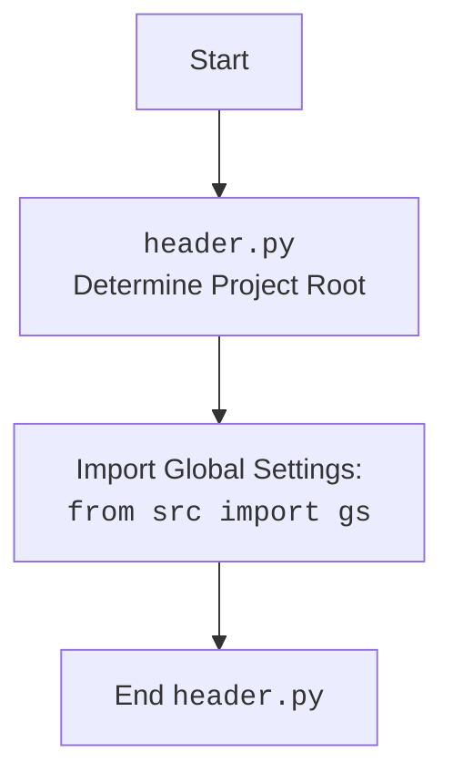

## АНАЛИЗ КОДА

### 1. <алгоритм>

**Общая схема работы `ExecuteLocator`:**

```mermaid
flowchart TD
    Start(Начало) --> Init[Инициализация: <br>Создание экземпляра `ExecuteLocator`];
    Init --> ExecuteLocatorMethod[Вызов `execute_locator()`];
    ExecuteLocatorMethod --> SelectAction{Выбор действия на основе `locator`};

    SelectAction -- "get" --> GetWebElement[Вызов `get_webelement_by_locator()`];
    GetWebElement --> ByLocator{Определение метода поиска элемента};
    ByLocator --> FindElement{Поиск элемента(ов) с помощью Selenium};
    FindElement --> CheckElement{Проверка наличия элемента};
    CheckElement -- "Элемент(ы) найден(ы)" --> ReturnElement(Возврат WebElement или List[WebElement]);
    CheckElement -- "Элемент(ы) не найден(ы)" --> ReturnFalse(Возврат False);

    SelectAction -- "send_message" --> SendMessage[Вызов `send_message()`];
        SendMessage --> FindElementSendMessage{Поиск элемента для отправки сообщения};
        FindElementSendMessage --> SendKeys{Отправка сообщения с помощью `send_keys()`};
        SendKeys --> ReturnTrueSendMessage(Возврат True);

    SelectAction -- "attribute" --> GetAttribute[Вызов `get_attribute_by_locator()`];
     GetAttribute --> GetElementForAttribute[Вызов `get_webelement_by_locator()`];
      GetElementForAttribute --> GetElementAttribute{Получение атрибута(ов) элемента(ов)};
      GetElementAttribute --> ReturnAttribute(Возврат значения атрибута(ов));

    SelectAction -- "click()" --> ClickElement[Вызов `click()`];
      ClickElement --> FindElementClick{Поиск элемента для клика};
      FindElementClick --> PerformClick{Выполнение клика};
       PerformClick --> CheckNav{Проверка перехода на новую страницу};
        CheckNav -- "Переход" --> ReturnTrueClick(Возврат True);
        CheckNav -- "Нет перехода" --> ReturnTrueClick;


    SelectAction -- "evaluate" --> Evaluate[Вызов `evaluate_locator()`];
     Evaluate --> EvaluateAttr{Оценка атрибута};
     EvaluateAttr --> ReturnEvaluated(Возврат оцененного значения);


    SelectAction -- "скриншот" --> ElementScreenshot[Вызов `get_webelement_as_screenshot()`];
      ElementScreenshot --> FindElementForScreen{Поиск элемента для скриншота};
      FindElementForScreen --> MakeScreenshot{Снятие скриншота};
      MakeScreenshot --> ReturnScreen(Возврат скриншота);

    ReturnElement --> End(Конец);
    ReturnFalse --> End;
    ReturnTrueSendMessage --> End;
     ReturnAttribute --> End;
     ReturnEvaluated --> End;
    ReturnScreen --> End;
    ReturnTrueClick --> End;
```
Пример работы с `execute_locator` и `get_webelement_by_locator`:

```python
# 1. Инициализация класса с драйвером Chrome
driver = webdriver.Chrome()
executor = ExecuteLocator(driver)

# 2. Создание словаря-локатора для поиска элемента по XPath
locator_data = {
    "by": "xpath",
    "selector": "//input[@id='search']",
    "timeout": 5,
}

# 3. Вызов метода `execute_locator` для получения элемента
search_element = executor.execute_locator(locator_data)
# 4. Проверка, что элемент найден, и ввод текста
if search_element:
    search_element.send_keys("test")
    # 5. Для отладки возвращаем элемент
    print (f"Элемент найден. Объект: {search_element}")


# 6. Другой вызов `execute_locator` для получения атрибута
attribute_locator = {
    "by": "xpath",
    "selector": "//a[@class='product-link']",
    "attribute": "href",
    "if_list":"first",
    "timeout": 5,
}
# 7. Вызов `get_attribute_by_locator` для получения ссылки
link = executor.execute_locator(attribute_locator)
if link:
     print(f"Ссылка: {link}")

# 8. Закрытие браузера
driver.quit()
```

### 2. <mermaid>

```mermaid
flowchart TD
    Start --> ExecuteLocatorInit[<code>ExecuteLocator</code><br> Init with WebDriver];
    ExecuteLocatorInit --> ActionChainsInit[Initialize <code>ActionChains</code>];
    ActionChainsInit --> ExecuteLocatorMethod[Call <code>execute_locator(locator, message, typing_speed, continue_on_error)</code>];

    ExecuteLocatorMethod --> LocatorTypeCheck{Check <code>locator</code> type};

    LocatorTypeCheck -- "get" --> GetWebElementMethod[Call <code>get_webelement_by_locator(locator, message)</code>];
    GetWebElementMethod --> GetByMethod{Determine <code>By</code> method};
    GetByMethod --> FindElement(<code>driver.find_element(By, selector)</code> or <code>driver.find_elements(By, selector)</code>);
    FindElement --> ElementFoundCheck{Check if element(s) found};
    ElementFoundCheck -- "Yes" --> ReturnWebElement(Return WebElement or List[WebElement]);
    ElementFoundCheck -- "No" --> ReturnFalse(Return False);


    LocatorTypeCheck -- "attribute" --> GetAttributeMethod[Call <code>get_attribute_by_locator(locator, message)</code>];
    GetAttributeMethod --> GetWebElementForAttribute[Call <code>get_webelement_by_locator(locator, message)</code>];
    GetWebElementForAttribute --> GetElementAttribute{Get Attribute(s)};
    GetElementAttribute --> ReturnAttribute(Return Attribute value(s));

    LocatorTypeCheck -- "send_message" --> SendMessageMethod[Call <code>send_message(locator, message, typing_speed, continue_on_error)</code>];
    SendMessageMethod --> FindElementSendMessage(Call <code>get_webelement_by_locator(locator, message)</code>);
    FindElementSendMessage --> SendKeys(<code>element.send_keys(message)</code>);
    SendKeys --> ReturnTrueSendMessage(Return True);

    LocatorTypeCheck -- "click()" --> ClickMethod[Call <code>click(locator)</code>];
    ClickMethod --> FindElementForClick(Call <code>get_webelement_by_locator(locator, message)</code>);
    FindElementForClick --> PerformClick(<code>element.click()</code>);
    PerformClick --> CheckNavigation{Check for navigation};
    CheckNavigation -- "Yes" --> ReturnTrueClick(Return True);
    CheckNavigation -- "No" --> ReturnTrueClick;

   LocatorTypeCheck -- "evaluate" --> EvaluateMethod[Call <code>evaluate_locator(attribute)</code>];
   EvaluateMethod --> EvaluateAttribute{Evaluate Attribute};
   EvaluateAttribute --> ReturnEvaluated(Return Evaluated Value);

   LocatorTypeCheck -- "скриншот" --> TakeScreenshotMethod[Call <code>get_webelement_as_screenshot(locator)</code>];
   TakeScreenshotMethod --> FindElementForScreenshot(Call <code>get_webelement_by_locator(locator, message)</code>);
   FindElementForScreenshot --> MakeScreenshot(Take Screenshot);
    MakeScreenshot --> ReturnScreenshot(Return Screenshot);


    ReturnWebElement --> End(End);
    ReturnFalse --> End;
    ReturnAttribute --> End;
    ReturnTrueSendMessage --> End;
    ReturnTrueClick --> End;
    ReturnEvaluated --> End;
    ReturnScreenshot --> End;

```

**Зависимости, импортированные для создания диаграммы:**
Диаграмма не требует импорта внешних библиотек, так как она создана в формате `mermaid` и является визуальным представлением структуры кода.

**mermaid flowchart для `header.py` (если применимо):**


### 3. <объяснение>

**Импорты:**

-   `selenium.webdriver`: Основной модуль для управления браузером.
    -   `webdriver`: Используется для создания экземпляров драйверов браузеров (например, Chrome, Firefox).
    -   `Keys`: Класс для представления специальных клавиш, таких как Enter, Tab, Shift.
    -   `By`: Класс для определения типа локатора (например, By.XPATH, By.ID, By.CSS_SELECTOR).
    -   `WebElement`: Класс, представляющий HTML элемент на веб-странице.
    -   `WebDriverWait`: Класс для ожидания определенных условий (например, появления элемента).
    -   `expected_conditions as EC`: Модуль, содержащий предустановленные условия ожидания.
    -   `ActionChains`: Класс для выполнения сложных действий, таких как клик и перетаскивание.
    -   `NoSuchElementException`: Исключение, возникающее, если элемент не найден.
    -   `TimeoutException`: Исключение, возникающее, если время ожидания истекло.

-   `src`: Внутренний модуль, содержащий компоненты проекта.
    -   `gs`: Модуль с глобальными настройками.
    -   `src.utils.printer`: Модуль для вывода данных на экран и работы с JSON.
        -   `pprint`, `j_loads`, `j_loads_ns`, `j_dumps`, `save_png` - функции форматированного вывода, загрузки и сохранения json и png.

    -    `src.logger.logger`: Модуль для ведения журнала.
        -   `logger`: Экземпляр логгера.

    -   `src.logger.exceptions`: Модуль, содержащий кастомные исключения проекта.
        -   `DefaultSettingsException`, `WebDriverException`, `ExecuteLocatorException`: Классы кастомных исключений.
**Класс `ExecuteLocator`:**

-   **`__init__(self, driver, *args, **kwargs)`**:
    -   Инициализирует объект `ExecuteLocator` с экземпляром `WebDriver` и создает `ActionChains`.
    -   `driver`: экземпляр вебдрайвера.
    -   `*args`, `**kwargs` - список дополнительных аргументов.

-   **`execute_locator(self, locator: dict, message: str = None, typing_speed: float = 0, continue_on_error: bool = True)`**:
    -   Основной метод для выполнения действий, определяемых словарем `locator`.
    -   `locator`: словарь с параметрами действия (тип поиска, селектор и т.д.).
    -   `message`: сообщение, которое нужно отправить (если действие - отправка сообщения).
    -   `typing_speed`: скорость печати сообщения (если действие - отправка сообщения).
    -   `continue_on_error`: флаг, указывающий, нужно ли продолжать выполнение при ошибке.
    -   Возвращает `WebElement`, `List[WebElement]`, `str`, `dict`, `bool` или `None`.

-   **`get_webelement_by_locator(self, locator: dict | SimpleNamespace, message: str = None) -> WebElement | List[WebElement] | bool`**:
    -   Метод для получения одного или нескольких элементов на странице по заданному локатору.
    -   `locator`: словарь или `SimpleNamespace` с параметрами локатора.
    -   `message`: сообщение для логгирования.
    -   Возвращает `WebElement` (если найден один элемент), `List[WebElement]` (если найдено несколько) или `False` (если ничего не найдено).

-   **`get_attribute_by_locator(self, locator: dict | SimpleNamespace, message: str = None) -> str | list | dict | bool`**:
    -   Метод для получения значения атрибута элемента по заданному локатору.
     -   `locator`: словарь или `SimpleNamespace` с параметрами локатора.
    -   `message`: сообщение для логгирования.
    -   Возвращает значение атрибута (строку, список или словарь), либо `False` в случае ошибки.

-   **`_get_element_attribute(self, element: WebElement, attribute: str) -> str | None`**:
    -   Вспомогательный метод для получения атрибута элемента.
    -   `element`: экземпляр `WebElement`.
    -   `attribute`: имя атрибута.
    -   Возвращает значение атрибута или `None`, если атрибут не найден.

-   **`send_message(self, locator: dict | SimpleNamespace, message: str, typing_speed: float, continue_on_error:bool) -> bool`**:
    -   Метод для отправки сообщения в поле ввода.
    -   `locator`: словарь или `SimpleNamespace` с параметрами локатора.
    -   `message`: сообщение для отправки.
    -   `typing_speed`: скорость печати.
    -   `continue_on_error`: флаг для обработки ошибок.
    -   Возвращает `True` в случае успеха.

-  **`evaluate_locator(self, attribute: str | list | dict) -> str`**:
    -   Метод для оценки атрибута локатора.
    -   `attribute`: значение атрибута (строка, список или словарь).
    -   Возвращает оцененную строку.

-  **`_evaluate(self, attribute: str) -> str | None`**:
    -   Вспомогательный метод для оценки одного атрибута.
    -   `attribute`: значение атрибута (строка).
    -   Возвращает оцененную строку или `None`

-   **`get_locator_keys() -> list`**:
    -   Статический метод для получения списка доступных ключей локаторов.
    -   Возвращает список строк с ключами локаторов.

**Переменные:**

-   `driver`: Экземпляр `WebDriver`, используемый для управления браузером.
-   `actions`: Экземпляр `ActionChains` для выполнения действий с веб-элементами.
-   `by_mapping`: Словарь для преобразования строкового представления локатора в объект `By`.

**Примеры локтаров**
Приведены примеры JSON, описывающие структуру словаря локаторов.
- `product_links`:  Локатор для поиска ссылок на товары.
- `pagination`: Локатор для работы с пагинацией.
- `description`: Локатор для получения описания товара.

**Ключи клавиш:**
Приведен список значений клавиш, которые можно использовать для отправки в поле ввода.

**Общее описание:**

-  Модуль `executor.py` предоставляет функциональность для работы с веб-элементами на страницах, используя Selenium.
-  Основной класс `ExecuteLocator` инкапсулирует методы для поиска, взаимодействия и извлечения данных из элементов.
-  Обработка ошибок осуществляется с помощью `try-except` блоков, позволяя продолжать выполнение скрипта даже при возникновении исключений.
-  Поддерживается гибкая настройка параметров через `locator`.

**Потенциальные ошибки и области для улучшения:**

1.  **Жестко закодированные проверки:**  Проверки на наличие атрибутов в `_evaluate` можно сделать более гибкими.
2. **Унификация типов:** Возвращаемые типы из `get_attribute_by_locator` можно сделать более предсказуемыми.
3.  **Логика `_evaluate`**:  Может быть усложнена для поддержки большего количества случаев.
4.  **Расширение возможностей логгирования**: Добавить более подробную информацию в логи для облегчения отладки.

**Взаимосвязи с другими частями проекта:**

-   Использует глобальные настройки из `src.gs`.
-   Использует логгер из `src.logger.logger` для ведения журнала событий и ошибок.
-   Использует кастомные исключения из `src.logger.exceptions` для обработки ошибок.
-   `driver.py` предоставляет экземпляры драйвера для `ExecuteLocator`.

Этот модуль является ключевым компонентом для автоматизации действий на веб-страницах и обеспечивает интерфейс для взаимодействия с элементами через локаторы, что делает код более читабельным и поддерживаемым.