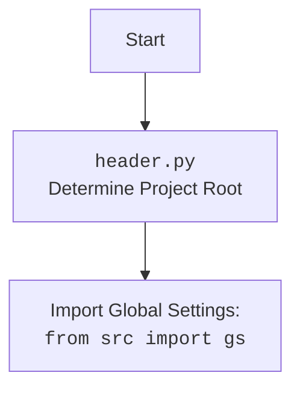

## ИНСТРУКЦИЯ:

Анализируй предоставленный код подробно и объясни его функциональность. Ответ должен включать три раздела:

1. **<алгоритм>**: Опиши рабочий процесс в виде пошаговой блок-схемы, включая примеры для каждого логического блока, и проиллюстрируй поток данных между функциями, классами или методами.
2. **<mermaid>**: Напиши код для диаграммы в формате `mermaid`, проанализируй и объясни все зависимости,
    которые импортируются при создании диаграммы.
    **ВАЖНО!** Убедитесь, что все имена переменных, используемые в диаграмме `mermaid`,
    имеют осмысленные и описательные имена. Имена переменных вроде `A`, `B`, `C`, и т.д., не допускаются!

    **Дополнительно**: Если в коде есть импорт `import header`, добавьте блок `mermaid` flowchart, объясняющий `header.py`:
    ```mermaid
    flowchart TD
        Start --> Header[<code>header.py</code><br> Determine Project Root]

        Header --> import[Import Global Settings: <br><code>from src import gs</code>]
    ```

3. **<объяснение>**: Предоставьте подробные объяснения:
   - **Импорты**: Их назначение и взаимосвязь с другими пакетами `src.`.
   - **Классы**: Их роль, атрибуты, методы и взаимодействие с другими компонентами проекта.
   - **Функции**: Их аргументы, возвращаемые значения, назначение и примеры.
   - **Переменные**: Их типы и использование.
   - Выделите потенциальные ошибки или области для улучшения.

Дополнительно, постройте цепочку взаимосвязей с другими частями проекта (если применимо).

Это обеспечивает всесторонний и структурированный анализ кода.
## Формат ответа: `.md` (markdown)
**КОНЕЦ ИНСТРУКЦИИ**

## <алгоритм>

### Общая схема работы класса `ExecuteLocator`:
1.  **Инициализация**
    -   При создании объекта `ExecuteLocator` передается экземпляр `WebDriver` и создается объект `ActionChains`.
    ```python
    driver = webdriver.Chrome()
    executor = ExecuteLocator(driver)
    ```
    *   **`driver`**: Экземпляр веб-драйвера, управляющий браузером.
    *   **`actions`**: Экземпляр класса `ActionChains`, позволяющий выполнять сложные действия, такие как перетаскивание или наведение мыши.
2.  **Выполнение локатора (`execute_locator`)**
    -   Метод принимает словарь `locator`, содержащий инструкции по поиску элемента и действию над ним, а также параметры `message`, `typing_speed`, `continue_on_error`.
    ```python
    locator = {"by": "xpath", "selector": "//input[@id='search']", "event": "send_keys('test')"}
    executor.execute_locator(locator, message="test", typing_speed=0.1)
    ```
    -   Метод обрабатывает различные типы действий (например, `send_keys`, `click`).
    -   Определяет, как обрабатывать список элементов (например, брать первый).
    -   Управляет ошибками, если элемент не найден (в зависимости от `continue_on_error`).
    -   Использует `get_webelement_by_locator` для получения элементов.
    -   Применяет действия к найденным элементам.
3.  **Получение веб-элементов (`get_webelement_by_locator`)**
    -   Принимает словарь `locator` и параметр `message`.
    -   Определяет метод поиска элемента (например, xpath, css).
    -   Использует `WebDriverWait` для ожидания, пока элемент станет видимым или доступным.
    -   Возвращает один элемент, список элементов или `False`, если элемент не найден.
    ```python
    locator = {"by": "css selector", "selector": "button.submit-button"}
    element = executor.get_webelement_by_locator(locator)
    ```
4.  **Получение атрибутов элемента (`get_attribute_by_locator`)**
    -   Принимает словарь `locator` и параметр `message`.
    -   Получает элемент(ы) с помощью `get_webelement_by_locator`.
    -   Извлекает атрибут(ы) из найденного(ых) элемента(ов).
    -   Возвращает значение атрибута (строку, список, словарь или `False`).
    ```python
    locator = {"by": "id", "selector": "my-element", "attribute": "class"}
    element_class = executor.get_attribute_by_locator(locator)
    ```
5.  **Отправка сообщений (`send_message`)**
    -   Принимает словарь `locator`, сообщение `message`, скорость печати `typing_speed`, `continue_on_error`.
    -   Получает элемент с помощью `get_webelement_by_locator`.
    -   Выполняет ввод текста в элемент, имитируя ручной ввод (с заданной скоростью печати).
     ```python
     locator = {"by": "id", "selector": "input-field"}
     executor.send_message(locator, "hello", typing_speed=0.2)
     ```
6.  **Оценка локатора (`evaluate_locator`)**
    -   Принимает атрибут (строку, список или словарь).
    -   Если атрибут - строка, возвращает ее.
    -   Если атрибут - список, проходит по каждому элементу, возвращает собранную строку.
    -   Если атрибут - словарь, проходит по каждому ключу, возвращает собранную строку.
    ```python
        external_message = "example"
        locator_attribute = "%EXTERNAL_MESSAGE%"
        evaluated_value = executor.evaluate_locator(locator_attribute) # evaluated_value будет "example"
    ```
7.  **Получение ключей локатора (`get_locator_keys`)**
    -   Возвращает список ключей, используемых в локаторах (`['attribute', 'by', 'selector', 'selector 2', 'if_list', 'use_mouse', 'mandatory', 'timeout', 'timeout_for_event', 'event']`).

## <mermaid>
```mermaid
flowchart TD
    Start[Start] --> Init[Initialize ExecuteLocator]
    Init --> ExecuteLocatorMethod[execute_locator(locator, message, typing_speed, continue_on_error)]
    ExecuteLocatorMethod -- Uses --> GetWebElementByLocator[get_webelement_by_locator(locator, message)]
    GetWebElementByLocator -- Returns WebElement/List or False --> ExecuteLocatorMethod
    ExecuteLocatorMethod -- Handles Actions --> SendMessage[send_message(locator, message, typing_speed, continue_on_error)]
    ExecuteLocatorMethod -- Handles Actions --> GetAttributeByLocator[get_attribute_by_locator(locator, message)]
    GetAttributeByLocator -- Uses --> GetWebElementByLocator
    GetAttributeByLocator -- Uses --> GetElementAttribute[_get_element_attribute(element, attribute)]
    GetElementAttribute -- Returns Attribute --> GetAttributeByLocator
    SendMessage -- Uses --> GetWebElementByLocator
    ExecuteLocatorMethod -- Evaluates Attributes --> EvaluateLocator[evaluate_locator(attribute)]
    EvaluateLocator -- Uses --> Evaluate[_evaluate(attribute)]
    Evaluate -- Returns String --> EvaluateLocator
    ExecuteLocatorMethod -- Returns Result --> End[End]
    
   
    classDef  method fill:#f9f,stroke:#333,stroke-width:2px
    class Init,ExecuteLocatorMethod,GetWebElementByLocator,SendMessage,GetAttributeByLocator,GetElementAttribute,EvaluateLocator,Evaluate method
```
### Объяснение зависимостей `mermaid`:

1.  **`Start`**: Начало процесса.
2.  **`Init`**: Инициализация класса `ExecuteLocator`, при которой устанавливается `WebDriver` и `ActionChains`.
3.  **`ExecuteLocatorMethod`**: Основной метод `execute_locator`, который принимает словарь локатора, сообщение, скорость набора текста и флаг продолжения при ошибке.
4.  **`GetWebElementByLocator`**: Метод `get_webelement_by_locator`, который ищет веб-элементы на странице по заданным локаторам. Зависим от `WebDriver` для поиска элементов.
5.  **`SendMessage`**: Метод `send_message`, который отправляет текст в веб-элемент.
6.  **`GetAttributeByLocator`**: Метод `get_attribute_by_locator`, который получает значение атрибута веб-элемента. Зависим от `GetWebElementByLocator` для получения элемента и `GetElementAttribute` для получения значения.
7.   **`GetElementAttribute`**: Метод `_get_element_attribute`, который получает значение атрибута у веб элемента.
8.  **`EvaluateLocator`**: Метод `evaluate_locator`, который обрабатывает атрибуты, в том числе переменные, в атрибутах локатора.
9.  **`Evaluate`**: Метод `_evaluate`, который непосредственно оценивает единичный атрибут.
10. **`End`**: Конец процесса.

### `header.py` flowchart:


## <объяснение>

### Импорты:
-   **`selenium.webdriver`**: Основной модуль Selenium для управления браузером.
    -   `webdriver`: Содержит классы для управления различными браузерами (Chrome, Firefox и т.д.).
    -   `common.keys.Keys`: Предоставляет константы для специальных клавиш (Enter, Shift и т.д.).
    -   `common.by.By`: Используется для определения метода поиска элементов (ID, XPATH, CSS selector и т.д.).
    -   `remote.webelement.WebElement`: Представляет найденный HTML элемент на странице.
    -   `support.ui.WebDriverWait`: Используется для ожидания, пока элемент станет видимым или доступным.
    -   `support.expected_conditions as EC`: Набор предустановленных ожидаемых условий для `WebDriverWait`.
    -   `common.action_chains.ActionChains`: Позволяет выполнять сложные действия, такие как перетаскивание.
    -   `common.exceptions.NoSuchElementException`, `TimeoutException`: Исключения, возникающие, если элемент не найден или истекло время ожидания.

-   **`src.gs`**: Глобальные настройки проекта. Взаимодействие происходит через импорт `from src import gs`.
-   **`src.utils.printer`**: Модуль для печати сообщений и работы с JSON.
    -   `pprint`: Функция для красивого вывода данных.
    -   `j_loads`, `j_loads_ns`: Загрузка JSON данных.
    -   `j_dumps`: Сериализация JSON данных.
    -   `save_png`: Сохранение PNG изображений (используется для скриншотов).

-   **`src.logger.logger`**: Модуль для логирования.
    -   `logger`: Экземпляр логгера для записи событий.
-   **`src.logger.exceptions`**: Кастомные исключения.
    -   `DefaultSettingsException`, `WebDriverException`, `ExecuteLocatorException`: Исключения, специфичные для работы WebDriver и этого модуля.

### Классы:
-   **`ExecuteLocator`**:
    -   **Роль**: Класс для выполнения действий над веб-элементами на основе предоставленных локаторов.
    -   **Атрибуты**:
        -   `driver` (selenium.webdriver): Экземпляр WebDriver для взаимодействия с браузером.
        -   `actions` (selenium.webdriver.common.action_chains.ActionChains): Позволяет выполнять сложные действия.
        -   `by_mapping` (dict): Словарь соответствий текстовых методов поиска элемента объектам `selenium.webdriver.common.by.By`.
    -   **Методы**:
        -   `__init__(self, driver, *args, **kwargs)`: Конструктор класса, инициализирует драйвер и `ActionChains`.
        -   `execute_locator(self, locator: dict, message: str = None, typing_speed: float = 0, continue_on_error: bool = True) -> Union[str, list, dict, WebElement, bool]`: Выполняет действие над элементом на основе словаря локатора. Возвращает результат выполнения (строку, список, словарь, элемент или False).
        -   `get_webelement_by_locator(self, locator: dict | SimpleNamespace, message: str = None) -> WebElement | List[WebElement] | bool`: Находит один или несколько веб-элементов по локатору. Возвращает элемент, список элементов или `False`.
        -   `get_attribute_by_locator(self, locator: dict | SimpleNamespace, message: str = None) -> str | list | dict | bool`: Получает атрибут(ы) элемента(ов). Возвращает строку, список, словарь или `False`.
        -   `_get_element_attribute(self, element: WebElement, attribute: str) -> str | None`: Получает значение конкретного атрибута элемента.
        -    `send_message(self, locator: dict | SimpleNamespace, message: str, typing_speed: float, continue_on_error:bool) -> bool`: Отправляет сообщение в текстовое поле.
        -   `evaluate_locator(self, attribute: str | list | dict) -> str`: Вычисляет значение атрибута локатора, обрабатывая возможные переменные.
        -   `_evaluate(self, attribute: str) -> str | None`: Вычисляет значение отдельного атрибута, обрабатывая возможные переменные.
        -   `get_locator_keys() -> list`: Возвращает список ключей, которые используются в локаторах.

### Функции:
-   В данном файле, функции являются методами класса `ExecuteLocator`.

### Переменные:
-   **`locator`**: Словарь, содержащий данные для поиска элемента и выполнения действий над ним. Может включать ключи `attribute`, `by`, `selector`, `selector 2`, `if_list`, `use_mouse`, `mandatory`, `timeout`, `timeout_for_event`, `event`.
-   **`message`**: Строка, которая отправляется в текстовое поле.
-   **`typing_speed`**: Скорость печати (в секундах за символ).
-    **`continue_on_error`**: Флаг, указывающий, продолжать ли выполнение при ошибке.
-   **`element`**: Экземпляр класса `selenium.webdriver.remote.webelement.WebElement`.
-   **`attribute`**: Строка, представляющая имя атрибута элемента.

### Потенциальные ошибки и области для улучшения:
1. **Обработка ошибок**: В текущей реализации могут быть случаи, когда обработка ошибок не является достаточно гранулярной. Необходимо добавить более детальную обработку различных исключений и ошибок.
2. **Сложность метода `execute_locator`**: Метод `execute_locator` выполняет множество операций, что может сделать его сложным для отладки и поддержки. Возможно, стоит разбить этот метод на несколько более мелких.
3. **Улучшение `evaluate_locator`**: Можно сделать обработку атрибутов более гибкой, например, добавив поддержку выражений Python.

### Цепочка взаимосвязей:
1.  `execute_locator` использует `get_webelement_by_locator` для поиска элементов.
2.  `get_webelement_by_locator` использует `WebDriverWait` для ожидания элементов.
3.  `get_attribute_by_locator` использует `get_webelement_by_locator` и `_get_element_attribute` для получения атрибутов.
4. `send_message` использует `get_webelement_by_locator` для поиска текстового поля.
5.  `evaluate_locator` использует `_evaluate` для оценки атрибутов.
6.  `ExecuteLocator` использует `ActionChains` для выполнения действий над элементами.
7.  Модуль `src.utils.printer` используется для печати сообщений и сохранения скриншотов.
8.  Модуль `src.logger.logger` используется для логирования ошибок и событий.
9.  Модуль `src.logger.exceptions` предоставляет кастомные исключения.

Таким образом, `execute_locator.py` является важным компонентом для автоматизации веб-тестов, обеспечивая удобный интерфейс для выполнения действий с элементами на странице.